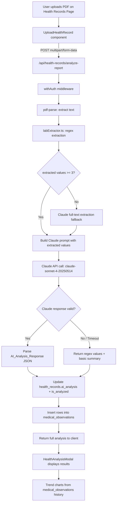

# Design Document: AI Health Report Analysis

## Overview

This feature adds AI-powered lab report interpretation to the existing health records module. When a user uploads a lab report PDF, the system:

1. Extracts text from the PDF using `pdf-parse` (already a dependency)
2. Runs regex-based lab value extraction via a new `labExtractor.ts` module
3. Falls back to Claude AI extraction when regex finds < 3 values
4. Sends extracted values to Claude (`claude-sonnet-4-20250514`, max_tokens: 3000) with a structured health educator prompt
5. Stores the AI analysis in the existing `health_records.ai_analysis` JSONB column and lab values in `medical_observations`
6. Displays results in a new `HealthAnalysisModal` with expandable health area accordions, status badges, trend charts, and actionable recommendations

The feature builds entirely on existing infrastructure: the `health_records` and `medical_observations` tables (with RLS already enabled), the `withAuth` middleware pattern, the Anthropic SDK, recharts, and the dashboard sidebar (which already has a Health Records entry).

### Key Design Decisions

- **Regex-first extraction with Claude fallback**: Regex is fast and free. Claude fallback handles complex/non-standard lab report formats. The threshold of < 3 extracted values triggers fallback.
- **No new database tables**: All data fits into existing `health_records.ai_analysis` JSONB and `medical_observations` rows.
- **New API route at `/api/health-records/analyze-report`**: Separate from the existing `/api/health-records/analyze` to avoid breaking the current basic analysis flow. The new route adds Claude AI analysis.
- **Structured JSON response from Claude**: The prompt enforces a strict JSON schema so parsing is deterministic.
- **Graceful degradation**: If Claude fails, the user still gets regex-extracted lab values with a basic summary.

## Architecture



### Data Flow

1. **Upload**: Client sends PDF + metadata via `FormData` to `/api/health-records/analyze-report`
2. **Auth**: `withAuth` validates the session and provides `userId` and `supabase` client
3. **PDF Text Extraction**: `pdf-parse` extracts raw text from the PDF buffer
4. **Lab Value Extraction**: `labExtractor.extractLabValues(text)` runs regex patterns against the text, returning `ExtractedLabValue[]`
5. **Fallback Check**: If `extractedValues.length < 3`, the full PDF text is sent to Claude with instructions to extract lab values directly
6. **AI Analysis**: Extracted values (+ optional user_age, user_gender) are sent to Claude with the health report prompt. Claude returns structured JSON.
7. **Persistence**: The API updates `health_records.ai_analysis` JSONB column and inserts `medical_observations` rows
8. **Display**: The client receives the full analysis and opens `HealthAnalysisModal`
9. **Trends**: The modal queries `medical_observations` for historical data and renders recharts mini line charts

## Components and Interfaces

### New Files

| File | Purpose |
|------|---------|
| `src/lib/health/healthReportPrompt.ts` | Exports the Claude system prompt for health report analysis |
| `src/lib/health/labExtractor.ts` | Regex-based lab value extraction engine with Indian reference ranges |
| `src/app/api/health-records/analyze-report/route.ts` | New API route for AI-powered health report analysis |
| `src/components/health/HealthAnalysisModal.tsx` | Modal displaying AI analysis with accordions, badges, trends |

### Modified Files

| File | Change |
|------|--------|
| `src/app/(dashboard)/health-records/page.tsx` | Add Health Score Summary widget, wire up HealthAnalysisModal, auto-open after analysis |
| `src/components/health/UploadHealthRecord.tsx` | Update to call new `/api/health-records/analyze-report` endpoint |
| `src/components/layout/Sidebar.tsx` | Add badge count for records needing attention |

### TypeScript Interfaces

```typescript
// src/lib/health/labExtractor.ts

export interface ExtractedLabValue {
  test_name: string;
  value: string;
  numeric_value: number | null;
  unit: string;
  reference_range: string;
  reference_min: number | null;
  reference_max: number | null;
  status: 'normal' | 'borderline' | 'high' | 'low' | 'critical';
  section: 'sugar_metabolism' | 'cholesterol_heart' | 'liver' | 'kidney' |
           'thyroid' | 'blood_count' | 'vitamins' | 'inflammation';
}

export interface LabExtractionResult {
  values: ExtractedLabValue[];
  extractionMethod: 'regex' | 'claude_fallback';
}
```

```typescript
// src/lib/health/healthReportPrompt.ts

export interface HealthAreaMarker {
  name: string;
  value: string;
  unit: string;
  status: 'normal' | 'borderline' | 'out_of_range' | 'urgent_review';
  explanation: string;
  actions: string[];
}

export interface HealthArea {
  area_name: string;
  area_status: 'normal' | 'borderline' | 'out_of_range' | 'urgent_review';
  markers: HealthAreaMarker[];
}

export interface AIAnalysisResponse {
  overall_summary: string;
  health_areas: HealthArea[];
  what_is_good: string[];
  focus_next: string[];
  doctor_follow_up: string[];
  disclaimer: string;
}
```

```typescript
// Trend data types used in HealthAnalysisModal

export interface TrendDataPoint {
  date: string;
  value: number;
}

export interface ParameterTrend {
  parameter_name: string;
  label: string;
  data: TrendDataPoint[];
  trend_label: 'Improving' | 'Stable' | 'Worsening';
  current_value: number;
  unit: string;
  reference_min: number;
  reference_max: number;
}
```

### Component: `healthReportPrompt.ts`

Exports a function `buildHealthReportPrompt(labValues: ExtractedLabValue[], context?: { user_age?: number; user_gender?: string }): string` that returns the full system prompt string.

The prompt instructs Claude to:
- Act as an AI Health Report Educator and Wellness Coach
- Never diagnose disease, prescribe medicine, replace a doctor, or create fear
- Use supportive, motivating language
- Classify markers into: normal/in-range, borderline, out-of-range, urgent review needed
- Group markers into health areas: sugar_metabolism, cholesterol_heart, liver, kidney, thyroid, blood_count, vitamins, inflammation
- Factor in age and gender when provided
- Return a JSON object matching `AIAnalysisResponse`

### Component: `labExtractor.ts`

Exports `extractLabValues(text: string): ExtractedLabValue[]`

- Contains `REFERENCE_RANGES` map with standard Indian population ranges for ~30 parameters (extending the existing patterns in the current analyze route)
- Contains `LAB_PATTERNS` array with regex patterns for each parameter (supporting Indian lab report formats: "Test Name : Value Unit" and "Test Name Value Reference Range")
- Contains `classifyValue(value: number, min: number, max: number): status` function
- Extracts report-provided reference ranges when present alongside values (regex: `(\d+\.?\d*)\s*[-–]\s*(\d+\.?\d*)`)
- Populates `section` field based on parameter-to-health-area mapping

### Component: `analyze-report/route.ts`

POST handler wrapped with `withAuth` and `withErrorHandler`:

1. Parse `FormData`: `file` (PDF), `health_record_id`, optional `user_age`, `user_gender`
2. Validate: file exists, is PDF, size <= 10MB
3. Verify `health_record_id` belongs to `userId`
4. Extract text via `pdf-parse`
5. Run `extractLabValues(text)`
6. If `values.length < 3`: call Claude with full text for extraction
7. Call Claude with extracted values + prompt for analysis
8. Parse Claude JSON response
9. Update `health_records` row: set `ai_analysis` JSONB, `is_analyzed = true`
10. Insert `medical_observations` rows
11. Return `{ success: true, data: { analysis: AIAnalysisResponse, labValues: ExtractedLabValue[] } }`

On Claude failure: return `{ success: true, data: { analysis: null, labValues, basicSummary: "..." } }`

### Component: `HealthAnalysisModal.tsx`

Props: `{ record: HealthRecord; analysis: AIAnalysisResponse; onClose: () => void }`

Sections:
1. **Header**: Record title, date, hospital, close button
2. **Overall Status Card**: `overall_summary` text with urgency-based color
3. **Health Score Summary**: Traffic-light counts (green/yellow/red) from markers
4. **Health Area Accordions**: Each area is expandable, shows area name, marker count, area status badge. Expanded view shows each marker with value, status badge (green/yellow/red), explanation, actions
5. **What's Going Well**: List from `what_is_good`
6. **Focus Areas**: List from `focus_next`
7. **Doctor Follow-up**: List from `doctor_follow_up`
8. **Trends Section**: For parameters with >= 2 historical observations, render recharts `LineChart` (mini, ~150px height). Show trend label (Improving/Stable/Worsening)
9. **Disclaimer**: `disclaimer` text at bottom

### Component: Health Records Page Enhancements

- **Health Score Summary widget**: At top of page, shows green/yellow/red counts from the most recent analyzed record's `ai_analysis`
- **Record cards**: Add analysis status badge (Analyzed ✓ / Pending), show mini stats (green/yellow/red counts) when available
- **Auto-open modal**: After successful upload + analysis, automatically open `HealthAnalysisModal`
- **Click to view**: Clicking an analyzed record opens `HealthAnalysisModal` with cached `ai_analysis` data

### Sidebar Badge

In `Sidebar.tsx`, query `health_records` for records where `ai_analysis` contains out-of-range or critical markers. Display badge count on the Health Records nav item.

## Data Models

### Existing Tables (No Schema Changes)

#### `health_records`

| Column | Type | Notes |
|--------|------|-------|
| id | UUID | PK |
| user_id | UUID | FK to auth.users |
| family_member_id | UUID | FK to family_members, nullable |
| record_type | TEXT | lab_report, prescription, etc. |
| title | TEXT | User-provided title |
| document_url | TEXT | Signed URL to stored PDF |
| document_path | TEXT | Storage path |
| report_date | DATE | Date of the report |
| hospital_name | TEXT | nullable |
| doctor_name | TEXT | nullable |
| notes | TEXT | nullable |
| **ai_analysis** | **JSONB** | **Stores full AIAnalysisResponse + stats** |
| **is_analyzed** | **BOOLEAN** | **Set to true after AI analysis completes** |
| created_at | TIMESTAMPTZ | |
| updated_at | TIMESTAMPTZ | |

The `ai_analysis` JSONB column stores:
```json
{
  "overall_summary": "...",
  "health_areas": [...],
  "what_is_good": [...],
  "focus_next": [...],
  "doctor_follow_up": [...],
  "disclaimer": "...",
  "stats": {
    "total": 15,
    "normal": 10,
    "borderline": 3,
    "out_of_range": 1,
    "critical": 1
  },
  "extraction_method": "regex"
}
```

#### `medical_observations`

| Column | Type | Notes |
|--------|------|-------|
| id | UUID | PK |
| health_record_id | UUID | FK to health_records (CASCADE) |
| user_id | UUID | FK to auth.users |
| parameter_name | TEXT | e.g. "hba1c", "ldl" |
| parameter_value | TEXT | String representation of value |
| unit | TEXT | e.g. "mg/dL", "%" |
| normal_range | TEXT | e.g. "70 - 99 mg/dL" |
| status | TEXT | normal, borderline, high, low, critical |
| observation_date | DATE | Date of the observation |
| created_at | TIMESTAMPTZ | |

### Recommended Index Addition

```sql
-- Optimize trend queries (parameter + date ordering)
CREATE INDEX IF NOT EXISTS idx_observations_user_param_date 
  ON medical_observations(user_id, parameter_name, observation_date DESC);
```

This index supports the trend query pattern: `SELECT * FROM medical_observations WHERE user_id = $1 AND parameter_name = $2 ORDER BY observation_date DESC`.

### Existing RLS Policies (Already Applied)

- `health_records`: `FOR ALL USING (auth.uid() = user_id)` — users can only access their own records
- `medical_observations`: `FOR ALL USING (auth.uid() = user_id)` — users can only access their own observations

### Claude API Configuration

| Parameter | Value |
|-----------|-------|
| Model | `claude-sonnet-4-20250514` |
| max_tokens | `3000` |
| Temperature | `0` (deterministic for structured output) |
| System prompt | From `healthReportPrompt.ts` |


## Correctness Properties

*A property is a characteristic or behavior that should hold true across all valid executions of a system — essentially, a formal statement about what the system should do. Properties serve as the bridge between human-readable specifications and machine-verifiable correctness guarantees.*

### Property 1: Age/gender context inclusion in prompt

*For any* combination of user_age (positive integer) and user_gender (string), when `buildHealthReportPrompt` is called with these context values, the resulting prompt string should contain instructions referencing both the provided age and gender for reference range interpretation.

**Validates: Requirements 1.7**

### Property 2: All supported tests have patterns and reference ranges

*For any* test key in the supported lab tests list, the `REFERENCE_RANGES` map should contain an entry with valid `normal` range bounds (min < max), a non-empty `unit`, and a non-empty `label`, AND the `LAB_PATTERNS` array should contain at least one regex pattern for that key.

**Validates: Requirements 2.2, 2.3**

### Property 3: Value classification correctness

*For any* numeric value and reference range (min, max where min < max), `classifyValue` should return:
- `'normal'` when min ≤ value ≤ max
- `'low'` when value < min
- `'high'` or `'critical'` when value > max
- `'borderline'` when value is within a defined borderline zone

And the result should always be one of the five valid status strings.

**Validates: Requirements 2.4**

### Property 4: Report-provided reference range extraction

*For any* text string containing a numeric value followed by a reference range pattern (e.g., "X.X - Y.Y"), the extractor should populate `reference_min` and `reference_max` with the parsed numeric bounds, and `reference_min` should be less than or equal to `reference_max`.

**Validates: Requirements 2.5**

### Property 5: Section field mapping completeness

*For any* ExtractedLabValue returned by `extractLabValues`, the `section` field should be one of the eight valid health area groupings: `sugar_metabolism`, `cholesterol_heart`, `liver`, `kidney`, `thyroid`, `blood_count`, `vitamins`, `inflammation`.

**Validates: Requirements 2.6**

### Property 6: Lab extraction round-trip

*For any* valid PDF text containing lab values, extracting values via `extractLabValues`, formatting the extracted values back into a structured text representation, then extracting again should produce an equivalent set of `ExtractedLabValue` objects (same test_name, numeric_value, and status for each entry).

**Validates: Requirements 2.7**

### Property 7: Claude fallback threshold

*For any* extraction result where the number of `ExtractedLabValue` objects is less than 3, the analysis pipeline should invoke the Claude fallback extraction path. Conversely, when 3 or more values are extracted, the Claude fallback should not be invoked.

**Validates: Requirements 3.4**

### Property 8: AI analysis response parsing

*For any* valid JSON string conforming to the `AIAnalysisResponse` schema (containing `overall_summary`, `health_areas`, `what_is_good`, `focus_next`, `doctor_follow_up`, `disclaimer`), parsing should produce an object where all required fields are present and `health_areas` is an array of valid `HealthArea` objects.

**Validates: Requirements 3.6**

### Property 9: Observation persistence count

*For any* set of N `ExtractedLabValue` objects passed to the persistence layer, exactly N rows should be inserted into the `medical_observations` table, each with the correct `health_record_id`, `parameter_name`, `parameter_value`, `unit`, and `status`.

**Validates: Requirements 3.8**

### Property 10: Health area accordion rendering

*For any* `AIAnalysisResponse` with K health areas, the `HealthAnalysisModal` should render K accordion sections, each displaying the area name, marker count matching the number of markers in that area, and an area status badge. When expanded, each marker should display its value, status badge, explanation, and actions.

**Validates: Requirements 4.2, 4.3**

### Property 11: Status badge color mapping

*For any* marker status value, the badge color should map as follows: `normal`/`in-range` → green, `borderline`/`needs_attention` → yellow, `out_of_range`/`urgent_review` → red. No other colors should be produced.

**Validates: Requirements 4.4**

### Property 12: Health score summary accuracy

*For any* set of analyzed health records, the Health Score Summary widget should display counts where: green count = number of markers with `normal` status, yellow count = number of markers with `borderline` status, red count = number of markers with `out_of_range` or `urgent_review` or `critical` status, and green + yellow + red = total marker count.

**Validates: Requirements 5.2**

### Property 13: Record card required fields

*For any* health record object with non-null fields, the rendered card should contain the record type icon, title text, formatted date, hospital name (when present), family member name (when present), and analysis status indicator.

**Validates: Requirements 5.3**

### Property 14: Trend chart rendering threshold

*For any* parameter name and user, if the `medical_observations` table contains N >= 2 observations for that parameter, a mini line chart should be rendered. If N < 2, no chart should be rendered for that parameter.

**Validates: Requirements 6.2**

### Property 15: Trend label computation

*For any* sequence of 2 or more chronologically ordered (value, date) pairs and a reference range (min, max), the trend label should be:
- `'Improving'` when the most recent values are closer to the normal range than earlier values
- `'Worsening'` when the most recent values are farther from the normal range than earlier values
- `'Stable'` when the distance from normal range has not significantly changed

**Validates: Requirements 6.3**

### Property 16: Sidebar badge count accuracy

*For any* set of health records belonging to a user, the sidebar badge count should equal the number of records whose `ai_analysis` contains at least one marker with `out_of_range`, `urgent_review`, or `critical` status.

**Validates: Requirements 7.2**

### Property 17: Health record ownership verification

*For any* `health_record_id` that does not belong to the authenticated `user_id`, the API should reject the request with an appropriate error status and not modify any database records.

**Validates: Requirements 8.5**

## Error Handling

### API Route Error Handling

| Error Condition | HTTP Status | Error Code | User Message |
|----------------|-------------|------------|--------------|
| No auth session | 401 | `UNAUTHORIZED` | "Unauthorized" |
| No file in request | 400 | `NO_FILE_PROVIDED` | "No file provided. Please select a PDF file to analyze." |
| File not PDF | 400 | `INVALID_FILE_TYPE` | "Only PDF files are supported." |
| File > 10MB | 400 | `FILE_TOO_LARGE` | "File size exceeds 10MB limit." |
| health_record_id not owned by user | 403 | `FORBIDDEN` | "You do not have access to this health record." |
| PDF text extraction fails | 500 | `PDF_EXTRACTION_FAILED` | "Could not read the PDF. Please ensure it is not a scanned image." |
| Claude API timeout (30s) | 200 | N/A | Returns regex-extracted values with basic summary (graceful degradation) |
| Claude API error | 200 | N/A | Returns regex-extracted values with basic summary (graceful degradation) |
| Claude returns invalid JSON | 200 | N/A | Returns regex-extracted values with basic summary (graceful degradation) |
| Database insert/update fails | 500 | `DATABASE_ERROR` | "Failed to save analysis. Please try again." |
| No lab values extracted (regex + Claude) | 200 | N/A | Returns empty analysis with message "No lab values could be extracted from this document." |

### Graceful Degradation Strategy

The API follows a tiered degradation approach:
1. **Full success**: Regex extraction + Claude analysis → full `AIAnalysisResponse`
2. **Claude fallback extraction**: Regex finds < 3 values → Claude extracts values → Claude analyzes → full response
3. **Claude analysis failure**: Regex extraction succeeds but Claude fails → return regex values with basic summary (counts of normal/warning/critical)
4. **Complete extraction failure**: Neither regex nor Claude can extract values → return empty analysis with informational message

The client (`HealthAnalysisModal`) handles all tiers by checking for the presence of `analysis` vs `basicSummary` in the response.

## Testing Strategy

### Property-Based Testing

Library: **fast-check** (JavaScript/TypeScript property-based testing library)

Each property test runs a minimum of **100 iterations** with randomly generated inputs.

Property tests to implement:

1. **Lab extractor classification** (Properties 3, 5): Generate random numeric values and reference ranges, verify classification logic and section mapping
2. **Lab extraction round-trip** (Property 6): Generate structured lab text, extract, format, re-extract, compare
3. **Reference range extraction** (Property 4): Generate text with embedded reference range patterns, verify min/max extraction
4. **Supported tests coverage** (Property 2): Iterate all test keys, verify patterns and ranges exist
5. **Prompt builder** (Property 1): Generate random age/gender combinations, verify prompt content
6. **Fallback threshold** (Property 7): Generate extraction results of varying lengths, verify fallback decision
7. **AI response parsing** (Property 8): Generate valid AIAnalysisResponse JSON, verify parsing
8. **Status badge mapping** (Property 11): Generate all status values, verify color mapping
9. **Health score summary** (Property 12): Generate marker arrays with random statuses, verify counts
10. **Trend computation** (Property 15): Generate value sequences with known trends, verify labels
11. **Ownership verification** (Property 17): Generate mismatched user/record ID pairs, verify rejection

Tag format for each test: `Feature: ai-health-report-analysis, Property {N}: {title}`

### Unit Tests

Unit tests complement property tests for specific examples and edge cases:

- **Prompt content checks** (Req 1.1–1.6): Verify specific strings exist in the prompt output
- **Known lab report extraction**: Test with a sample Indian lab report text, verify specific values extracted
- **Claude fallback trigger**: Test with text containing exactly 0, 1, 2, 3 values
- **Invalid file handling**: Test with non-PDF buffer, oversized file
- **Empty PDF text**: Test extraction with empty string
- **Modal rendering**: Test HealthAnalysisModal renders all sections with sample data
- **Sidebar badge**: Test badge appears/disappears based on record data
- **Trend chart threshold**: Test with 0, 1, 2, 3 observations

### Integration Tests

- Full upload → extraction → Claude analysis → DB persistence → response flow (mocked Claude)
- Ownership verification with mismatched user IDs
- Medical observations insertion count matches extracted values
- Trend query returns correctly ordered historical data
