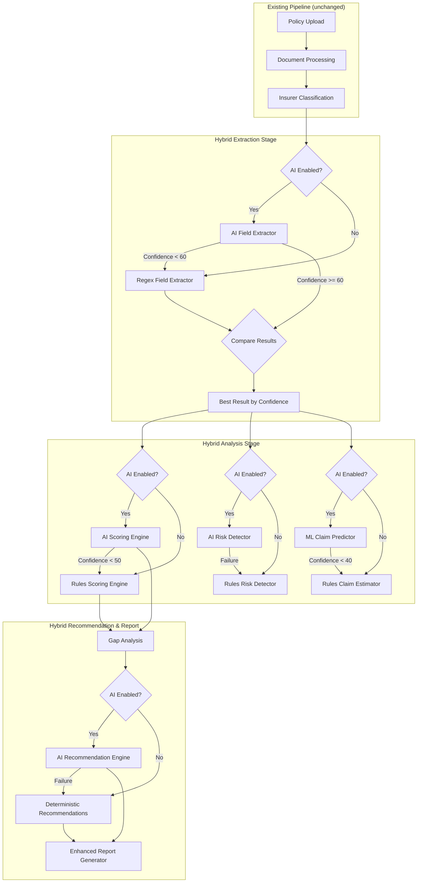

# Design Document: AI Insurance Policy Analyzer System

## Overview

This design augments the existing deterministic insurance analysis pipeline with AI/ML capabilities at four key stages: field extraction, policy scoring, claim probability prediction, and risk detection. A new AI recommendation engine and enhanced report generation complete the system. The architecture follows a hybrid pattern where each AI service wraps the existing deterministic service, falling back transparently when AI confidence is low or the service is unavailable.

The core design principle is **interface preservation**: every AI service produces output conforming to the existing TypeScript interfaces (`ExtractedFields`, `PolicyScore`, `ClaimProbability`, `RiskAnalysis`, `PolicyReport`), ensuring zero changes to downstream consumers (API route, UI components, gap analysis).

### Key Design Decisions

1. **Adapter pattern over replacement**: Each AI service implements the same interface as its deterministic counterpart. The pipeline orchestrator selects between them based on confidence thresholds and availability.
2. **LLM with structured output**: All AI services use a single LLM client with JSON schema-constrained output to guarantee type-safe responses that map directly to existing interfaces.
3. **Per-stage fallback**: Each pipeline stage independently decides AI vs. deterministic. A failure in AI scoring does not affect AI extraction.
4. **New `ai-services` module**: All AI service implementations live in a new `src/features/insurance/ai-services/` directory, keeping the existing deterministic services untouched.

## Architecture

### High-Level Architecture



### Module Structure

```
src/features/insurance/
├── ai-services/                          # NEW MODULE
│   ├── index.ts
│   ├── config/
│   │   └── ai-config.service.ts          # Centralized AI configuration
│   ├── llm/
│   │   └── llm-client.service.ts         # Shared LLM API client
│   ├── services/
│   │   ├── ai-field-extractor.service.ts
│   │   ├── ai-scoring.service.ts
│   │   ├── ai-risk-detector.service.ts
│   │   ├── ml-claim-predictor.service.ts
│   │   └── ai-recommendation.service.ts
│   └── types/
│       └── index.ts                      # AI-specific types
├── insurance-pipeline/
│   ├── services/
│   │   └── pipeline-orchestrator.service.ts  # MODIFIED: hybrid stage execution
│   └── types/
│       └── index.ts                          # MODIFIED: add AI metadata to StageStatus
├── recommendations/
│   └── services/
│       └── report-generator.service.ts       # MODIFIED: method indicators, confidence display
└── shared-core/                              # UNCHANGED
```


## Components and Interfaces

### 1. AI Configuration Service (`ai-config.service.ts`)

Centralized configuration read from environment variables. All AI services depend on this.

```typescript
interface AIConfig {
  enabled: boolean;                    // Master toggle (derived from API key presence)
  apiKey: string | null;               // LLM API key (e.g., OPENAI_API_KEY)
  model: string;                       // Model name (default: 'gpt-4o-mini')
  temperature: number;                 // LLM temperature (default: 0.1)
  maxTokens: number;                   // Max response tokens (default: 4096)
  timeoutMs: number;                   // Per-call timeout (default: 30000)
  thresholds: {
    fieldExtraction: number;           // Min confidence for AI extraction (default: 60)
    scoring: number;                   // Min confidence for AI scoring (default: 50)
    claimPrediction: number;           // Min confidence for ML prediction (default: 40)
  };
}
```

**Environment Variables:**
- `AI_LLM_API_KEY` — LLM provider API key. If absent, AI is disabled globally.
- `AI_LLM_MODEL` — Model identifier (default: `gpt-4o-mini`)
- `AI_LLM_TEMPERATURE` — Temperature (default: `0.1`)
- `AI_LLM_MAX_TOKENS` — Max tokens (default: `4096`)
- `AI_TIMEOUT_MS` — Timeout per AI call in ms (default: `30000`)
- `AI_THRESHOLD_EXTRACTION` — Field extraction confidence threshold (default: `60`)
- `AI_THRESHOLD_SCORING` — Scoring confidence threshold (default: `50`)
- `AI_THRESHOLD_CLAIM` — Claim prediction confidence threshold (default: `40`)
- `AI_ENABLED` — Explicit override to disable AI (`false` disables even if key is set)

### 2. LLM Client Service (`llm-client.service.ts`)

Thin wrapper around the LLM API with timeout, retry, and structured output support.

```typescript
interface LLMRequest {
  systemPrompt: string;
  userPrompt: string;
  jsonSchema?: Record<string, unknown>;  // For structured output
  temperature?: number;
  maxTokens?: number;
}

interface LLMResponse<T = unknown> {
  data: T;
  usage: { promptTokens: number; completionTokens: number; totalTokens: number };
  model: string;
  latencyMs: number;
}

class LLMClientService {
  async complete<T>(request: LLMRequest): Promise<LLMResponse<T>>;
}
```

- Uses `AbortController` with configurable timeout (default 30s)
- Parses JSON response and validates against provided schema
- Logs model, token count, and latency for every call (Requirement 7.4)
- Throws typed `AIServiceError` on failure

### 3. AI Field Extractor Service (`ai-field-extractor.service.ts`)

```typescript
class AIFieldExtractorService {
  async extract(text: string, sections: PolicySections): Promise<ExtractedFields>;
}
```

- Sends full document text + sections to LLM with a system prompt instructing structured extraction
- LLM returns JSON matching `ExtractedFields` schema (minus `extractionConfidence`)
- Service validates numeric ranges (Requirement 1.6):
  - `sumInsured`: 50,000–5,00,00,000
  - `premiumAmount`: 1,000–50,00,000
  - `coPaymentPercentage`: 0–50
  - `waitingPeriods`: 0–1460 days
  - `networkHospitalCount`: 0–50,000
- Out-of-range values are set to `null`
- Confidence score is calculated from the number of non-null fields extracted (same algorithm as existing `calculateConfidence`)
- Fields the LLM cannot extract are returned as `null` (Requirement 1.4)

### 4. AI Scoring Engine (`ai-scoring.service.ts`)

```typescript
class AIScoringService {
  async calculateScore(
    fields: ExtractedFields,
    documentText: string
  ): Promise<PolicyScore & { confidence: number; explanations: Record<string, string> }>;
}
```

- Sends `ExtractedFields` + full document text to LLM
- LLM returns `totalScore`, `grade`, `breakdown` (matching `ScoreBreakdown`), plus natural language explanations per category (Requirement 2.3)
- Returns confidence score (Requirement 2.4)
- Output conforms to `PolicyScore` interface (Requirement 2.2)

### 5. AI Risk Detector (`ai-risk-detector.service.ts`)

```typescript
class AIRiskDetectorService {
  async detectRisks(
    fields: ExtractedFields,
    documentText: string
  ): Promise<RiskAnalysis & { confidence: number }>;
}
```

- Sends `ExtractedFields` + full document text to LLM
- LLM returns array of `Risk` objects with severity classification (Requirement 4.3)
- Each risk includes title, description, impact, affectedClause, recommendation (Requirement 4.4)
- Detects all existing risk types plus additional AI-identified risks (Requirement 4.5)
- Output conforms to `RiskAnalysis` interface (Requirement 4.2)

### 6. ML Claim Predictor (`ml-claim-predictor.service.ts`)

```typescript
class MLClaimPredictorService {
  async estimateProbability(
    fields: ExtractedFields,
    riskAnalysis: RiskAnalysis,
    csrData: CSRData
  ): Promise<ClaimProbability & { confidence: number }>;
}
```

- Uses LLM to reason about claim probability based on policy features, insurer reputation, risk factors, and industry patterns (Requirement 3.6)
- Returns at least 3 contributing factors with impact and weightage (Requirement 3.3)
- Output conforms to `ClaimProbability` interface (Requirement 3.2)

### 7. AI Recommendation Engine (`ai-recommendation.service.ts`)

```typescript
interface AIRecommendation {
  title: string;
  explanation: string;
  expectedBenefit: string;
  priority: 'high' | 'medium' | 'low';
}

class AIRecommendationService {
  async generateRecommendations(
    fields: ExtractedFields,
    riskAnalysis: RiskAnalysis,
    policyScore: PolicyScore,
    claimProbability: ClaimProbability,
    coverageGapAnalysis: CoverageGapAnalysis
  ): Promise<AIRecommendation[]>;
}
```

- Generates 3–10 prioritized recommendations (Requirement 5.4)
- Each recommendation includes title, explanation, expected benefit, priority (Requirement 5.3)
- Priority based on combined risk, score, and gap analysis (Requirement 5.2)

### 8. Modified Pipeline Orchestrator

The existing `PipelineOrchestratorService` is modified to support hybrid execution:

```typescript
// New fields on StageStatus
interface StageStatus {
  stage: string;
  status: 'success' | 'failed' | 'skipped';
  error?: string;
  errorCode?: string;
  duration?: number;
  method?: 'ai' | 'deterministic';       // NEW: which method was used
  confidence?: number;                     // NEW: AI confidence score
  fallbackReason?: string;                 // NEW: why fallback occurred
}

// New fields on PipelineMetadata
interface PipelineMetadata {
  totalDuration: number;
  startTime: Date;
  endTime: Date;
  version: string;
  aiUsage?: {                              // NEW: AI usage summary
    totalTokens: number;
    totalLatencyMs: number;
    stagesUsingAI: string[];
  };
}
```

**Hybrid execution logic per stage:**
1. Check if AI is enabled via `AIConfigService`
2. If enabled, call AI service with timeout
3. If AI returns confidence below threshold, fall back to deterministic
4. If AI call fails/times out, fall back to deterministic and log reason
5. For extraction: run both AI and deterministic, use higher confidence result (Requirement 1.8)
6. Record method, confidence, and fallback reason in `StageStatus`

### 9. Modified Report Generator

The `ReportGeneratorService` is extended to:
- Accept an `analysisMethodMap` parameter indicating AI vs. deterministic per section (Requirement 8.1)
- Display confidence scores alongside AI-generated sections (Requirement 8.2)
- Use AI recommendations when available, falling back to deterministic (Requirement 8.3)
- Maintain existing `PolicyReport` interface (Requirement 8.4)

```typescript
interface AnalysisMethodMap {
  fieldExtraction: { method: 'ai' | 'deterministic'; confidence?: number };
  scoring: { method: 'ai' | 'deterministic'; confidence?: number };
  riskDetection: { method: 'ai' | 'deterministic'; confidence?: number };
  claimProbability: { method: 'ai' | 'deterministic'; confidence?: number };
  recommendations: { method: 'ai' | 'deterministic'; confidence?: number };
}
```


## Data Models

### AI-Specific Types (`ai-services/types/index.ts`)

```typescript
/** AI service error with typed failure reasons */
export class AIServiceError extends Error {
  constructor(
    message: string,
    public readonly service: string,
    public readonly reason: 'timeout' | 'api_error' | 'parse_error' | 'low_confidence' | 'disabled',
    public readonly originalError?: unknown
  ) {
    super(message);
    this.name = 'AIServiceError';
  }
}

/** Result wrapper for AI service calls with confidence */
export interface AIServiceResult<T> {
  data: T;
  confidence: number;
  method: 'ai';
  usage: { promptTokens: number; completionTokens: number; totalTokens: number };
  latencyMs: number;
  model: string;
}

/** Result wrapper for deterministic service calls */
export interface DeterministicServiceResult<T> {
  data: T;
  confidence: number;
  method: 'deterministic';
}

/** Union type for hybrid results */
export type HybridResult<T> = AIServiceResult<T> | DeterministicServiceResult<T>;

/** AI recommendation structure */
export interface AIRecommendation {
  title: string;
  explanation: string;
  expectedBenefit: string;
  priority: 'high' | 'medium' | 'low';
}

/** Scoring explanation per category */
export interface ScoringExplanations {
  coverageStrength: string;
  claimFriendliness: string;
  absenceOfHiddenClauses: string;
  networkHospitalCoverage: string;
  premiumFairness: string;
  restorationBenefits: string;
  waitingPeriodFairness: string;
}

/** Analysis method tracking for report generation */
export interface AnalysisMethodMap {
  fieldExtraction: { method: 'ai' | 'deterministic'; confidence?: number };
  scoring: { method: 'ai' | 'deterministic'; confidence?: number };
  riskDetection: { method: 'ai' | 'deterministic'; confidence?: number };
  claimProbability: { method: 'ai' | 'deterministic'; confidence?: number };
  recommendations: { method: 'ai' | 'deterministic'; confidence?: number };
}
```

### Extended Pipeline Types

The existing `StageStatus` and `PipelineMetadata` interfaces are extended with optional AI-related fields (backward compatible):

- `StageStatus.method?: 'ai' | 'deterministic'`
- `StageStatus.confidence?: number`
- `StageStatus.fallbackReason?: string`
- `PipelineMetadata.aiUsage?: { totalTokens, totalLatencyMs, stagesUsingAI }`

### Existing Interfaces (Unchanged)

The following interfaces remain unchanged to preserve backward compatibility:
- `ExtractedFields` — AI extractor outputs the same shape
- `PolicyScore` / `ScoreBreakdown` / `ScoreCategory` — AI scorer outputs the same shape
- `ClaimProbability` / `ProbabilityFactor` — ML predictor outputs the same shape
- `RiskAnalysis` / `Risk` — AI risk detector outputs the same shape
- `PolicyReport` / `HumanReadableReport` — Report structure unchanged
- `PipelineResult` / `PipelineData` — Pipeline output unchanged

### Numeric Validation Ranges (Requirement 1.6)

| Field | Min | Max |
|-------|-----|-----|
| sumInsured | 50,000 | 5,00,00,000 |
| premiumAmount | 1,000 | 50,00,000 |
| coPaymentPercentage | 0 | 50 |
| waitingPeriods (days) | 0 | 1,460 |
| networkHospitalCount | 0 | 50,000 |


## Correctness Properties

*A property is a characteristic or behavior that should hold true across all valid executions of a system — essentially, a formal statement about what the system should do. Properties serve as the bridge between human-readable specifications and machine-verifiable correctness guarantees.*

### Property 1: AI service output interface conformance

*For any* AI service (field extractor, scoring engine, risk detector, claim predictor), and any valid input, the output must contain all required fields of the corresponding deterministic interface (`ExtractedFields`, `PolicyScore`, `RiskAnalysis`, `ClaimProbability`) with correct types. Specifically: `ExtractedFields` must have all 26 defined keys, `PolicyScore` must have `totalScore`, `grade`, and all 7 `breakdown` categories, `RiskAnalysis` must have `risks` array, `overallRiskLevel`, and `riskScore`, and `ClaimProbability` must have `probability`, `confidence`, and `factors` array.

**Validates: Requirements 1.1, 1.5, 2.2, 3.2, 4.2, 6.5, 8.4**

### Property 2: Confidence scores are bounded

*For any* AI service result (field extraction, scoring, risk detection, claim prediction), the returned confidence score must be an integer in the range [0, 100].

**Validates: Requirements 1.2, 2.4, 3.1**

### Property 3: Threshold-based fallback selection

*For any* AI service result with a confidence score below the configured threshold (extraction: 60, scoring: 50, claim prediction: 40), the pipeline orchestrator must select the deterministic service result for that stage. Conversely, for any AI result with confidence at or above the threshold, the AI result must be used (unless the deterministic result has higher confidence for extraction).

**Validates: Requirements 1.3, 2.5, 3.4, 7.3**

### Property 4: Numeric field range validation

*For any* numeric value extracted by the AI field extractor, the validation function must set values outside plausible ranges to `null` and preserve values within range. Specifically: `sumInsured` outside [50000, 50000000] → null, `premiumAmount` outside [1000, 5000000] → null, `coPaymentPercentage` outside [0, 50] → null, waiting period fields outside [0, 1460] → null, `networkHospitalCount` outside [0, 50000] → null.

**Validates: Requirements 1.6**

### Property 5: Higher confidence extraction wins

*For any* pair of extraction results (one from AI, one from deterministic), the pipeline orchestrator must select the result with the higher `extractionConfidence` value. If confidence values are equal, either result is acceptable.

**Validates: Requirements 1.8**

### Property 6: Risk output completeness

*For any* risk detected by the AI risk detector, the risk object must have a non-empty `title`, non-empty `description`, non-empty `impact`, non-null `affectedClause`, non-empty `recommendation`, and a `severity` value that is one of `'Low'`, `'Medium'`, `'High'`, or `'Critical'`.

**Validates: Requirements 4.3, 4.4**

### Property 7: Scoring explanations completeness

*For any* AI scoring result, there must be exactly 7 natural language explanations (one per scoring category: coverageStrength, claimFriendliness, absenceOfHiddenClauses, networkHospitalCoverage, premiumFairness, restorationBenefits, waitingPeriodFairness), and each explanation must be a non-empty string.

**Validates: Requirements 2.3**

### Property 8: Claim prediction minimum contributing factors

*For any* ML claim prediction result, the `factors` array must contain at least 3 elements, and each factor must have a non-empty `factor` name, an `impact` value of `'positive'`, `'negative'`, or `'neutral'`, and a numeric `weightage`.

**Validates: Requirements 3.3**

### Property 9: Recommendation output bounds and completeness

*For any* AI recommendation engine output, the number of recommendations must be between 3 and 10 inclusive. Each recommendation must have a non-empty `title`, non-empty `explanation`, non-empty `expectedBenefit`, and a `priority` value of `'high'`, `'medium'`, or `'low'`.

**Validates: Requirements 5.1, 5.3, 5.4**

### Property 10: Recommendation priority ordering

*For any* AI recommendation engine output, the recommendations list must be sorted by priority descending: all `'high'` priority recommendations appear before `'medium'`, and all `'medium'` appear before `'low'`.

**Validates: Requirements 5.2**

### Property 11: Pipeline stage method recording

*For any* completed pipeline result, every stage in the `stages` array must have a `method` field set to either `'ai'` or `'deterministic'`. For any stage where the method is `'deterministic'` and AI was enabled and attempted, the `fallbackReason` field must be a non-empty string.

**Validates: Requirements 6.2, 6.3**

### Property 12: AI-disabled deterministic mode

*For any* pipeline execution where AI is disabled (no API key or explicit disable), all stages must report `method: 'deterministic'` and no AI API calls must be made. The pipeline must complete successfully without errors.

**Validates: Requirements 6.6, 7.2**

### Property 13: Sequential stage execution order

*For any* completed pipeline result, the stages array must be ordered such that each stage's position matches the defined pipeline order: upload → processing → classification → extraction → analysis → gap_analysis → report_generation. No stage may appear before a stage that precedes it in the pipeline definition.

**Validates: Requirements 6.1**

### Property 14: Report method indicators with confidence

*For any* generated report, the analysis method map must contain entries for all 5 sections (fieldExtraction, scoring, riskDetection, claimProbability, recommendations). For any section where `method` is `'ai'`, the `confidence` field must be present and in [0, 100]. When AI recommendations are available, the report's `suggestedImprovements` must contain the AI-generated recommendation titles.

**Validates: Requirements 8.1, 8.2, 8.3**


## Error Handling

### LLM API Errors

| Error Type | Handling | Fallback |
|------------|----------|----------|
| Timeout (>30s) | Abort via `AbortController`, log timeout with stage name | Use deterministic service |
| API key invalid/missing | Detect at startup, disable AI globally | Use deterministic pipeline |
| Rate limit (429) | Log warning, do not retry | Use deterministic service |
| Server error (5xx) | Log error with response body | Use deterministic service |
| Network error | Log error | Use deterministic service |
| Model unavailable | Log warning | Use deterministic service |

### Response Parsing Errors

| Error Type | Handling | Fallback |
|------------|----------|----------|
| Invalid JSON response | Log raw response, throw `AIServiceError('parse_error')` | Use deterministic service |
| Missing required fields | Log which fields are missing | Use deterministic service |
| Type mismatch | Log expected vs actual types | Use deterministic service |
| Confidence below threshold | Log confidence value and threshold | Use deterministic service |

### Pipeline-Level Error Handling

- Each AI service call is wrapped in a try-catch within the pipeline orchestrator
- Errors never propagate to the API route — the pipeline always produces a result
- The `StageStatus` records the error, fallback reason, and which method was ultimately used
- If all AI services fail, the pipeline degrades gracefully to fully deterministic mode
- The 60-second pipeline timeout is enforced at the orchestrator level using `Promise.race` with a global timer

### Error Logging Format

All AI errors are logged with a consistent structure:
```typescript
{
  service: 'ai-field-extractor' | 'ai-scoring' | 'ai-risk-detector' | 'ml-claim-predictor' | 'ai-recommendations',
  error: string,
  reason: 'timeout' | 'api_error' | 'parse_error' | 'low_confidence' | 'disabled',
  latencyMs: number,
  model: string | null,
  fallbackUsed: true
}
```

## Testing Strategy

### Testing Framework

- **Unit & Integration Tests**: Vitest (already used in the project)
- **Property-Based Tests**: `fast-check` library with Vitest integration
- Install: `npm install --save-dev fast-check`

### Unit Tests

Unit tests cover specific examples, edge cases, and error conditions:

1. **AI Config Service**: Verify env var parsing, defaults, missing key behavior
2. **LLM Client**: Mock HTTP responses — success, timeout, 429, 500, invalid JSON
3. **AI Field Extractor**: Mock LLM client, verify output shape, numeric validation edge cases (boundary values)
4. **AI Scoring Engine**: Mock LLM client, verify score ranges, grade mapping
5. **AI Risk Detector**: Mock LLM client, verify risk severity classification
6. **ML Claim Predictor**: Mock LLM client, verify factor count, probability bounds
7. **AI Recommendation Engine**: Mock LLM client, verify count bounds, priority ordering
8. **Pipeline Orchestrator (hybrid)**: Mock AI services with various confidence levels, verify fallback logic
9. **Report Generator (enhanced)**: Verify method indicators, confidence display

### Property-Based Tests

Each correctness property is implemented as a single property-based test using `fast-check`. Tests run a minimum of 100 iterations.

Each test is tagged with a comment referencing the design property:
```
// Feature: ai-insurance-policy-analyzer-system, Property {N}: {property_text}
```

**Property test plan:**

| Property | Test Description | Generator Strategy |
|----------|-----------------|-------------------|
| 1 | Interface conformance | Generate random AI service outputs, verify all required fields present with correct types |
| 2 | Confidence bounds | Generate random integers, pass through confidence calculation, verify [0, 100] |
| 3 | Threshold fallback | Generate random (confidence, threshold) pairs, verify selection logic |
| 4 | Numeric validation | Generate random numbers (including out-of-range), verify validation sets out-of-range to null |
| 5 | Higher confidence wins | Generate random pairs of (confidenceA, confidenceB), verify max is selected |
| 6 | Risk completeness | Generate random Risk objects, verify all fields non-empty and severity valid |
| 7 | Scoring explanations | Generate random scoring results with explanations, verify 7 non-empty strings |
| 8 | Minimum factors | Generate random ClaimProbability results, verify factors.length >= 3 with valid fields |
| 9 | Recommendation bounds | Generate random recommendation arrays, verify count in [3, 10] and fields present |
| 10 | Priority ordering | Generate random recommendation arrays, verify sorted by priority descending |
| 11 | Method recording | Generate random pipeline results, verify method field on all stages |
| 12 | Deterministic mode | Generate random pipeline configs with AI disabled, verify all stages deterministic |
| 13 | Stage ordering | Generate random stage arrays, verify pipeline order is preserved |
| 14 | Report indicators | Generate random reports with method maps, verify all 5 sections present with confidence for AI sections |

### Test Organization

```
src/features/insurance/ai-services/
├── __tests__/
│   ├── ai-config.service.test.ts
│   ├── llm-client.service.test.ts
│   ├── ai-field-extractor.service.test.ts
│   ├── ai-scoring.service.test.ts
│   ├── ai-risk-detector.service.test.ts
│   ├── ml-claim-predictor.service.test.ts
│   ├── ai-recommendation.service.test.ts
│   └── properties/
│       ├── interface-conformance.property.test.ts
│       ├── confidence-bounds.property.test.ts
│       ├── threshold-fallback.property.test.ts
│       ├── numeric-validation.property.test.ts
│       ├── extraction-selection.property.test.ts
│       ├── risk-completeness.property.test.ts
│       ├── scoring-explanations.property.test.ts
│       ├── claim-factors.property.test.ts
│       ├── recommendation-bounds.property.test.ts
│       ├── recommendation-ordering.property.test.ts
│       ├── stage-method-recording.property.test.ts
│       ├── deterministic-mode.property.test.ts
│       ├── stage-ordering.property.test.ts
│       └── report-indicators.property.test.ts
src/features/insurance/insurance-pipeline/
├── tests/
│   └── pipeline-orchestrator-hybrid.test.ts
src/features/insurance/recommendations/
├── tests/
│   └── report-generator-enhanced.test.ts
```
