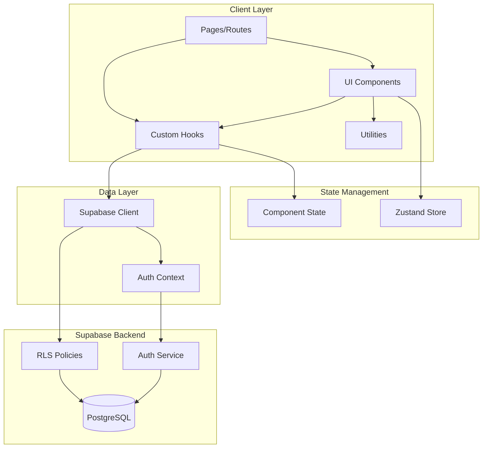
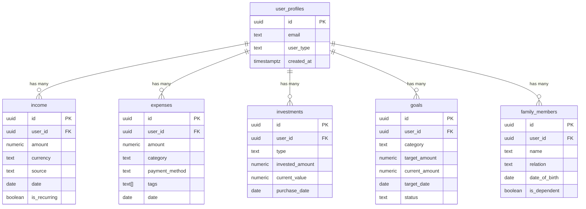
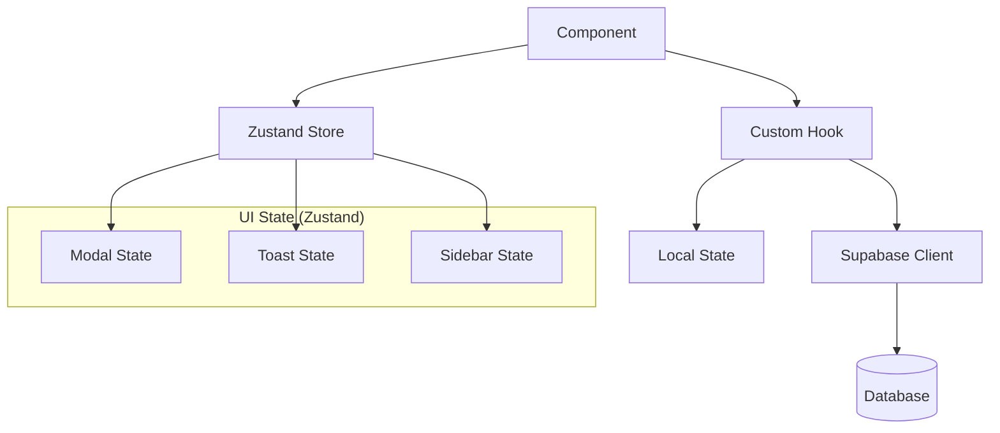
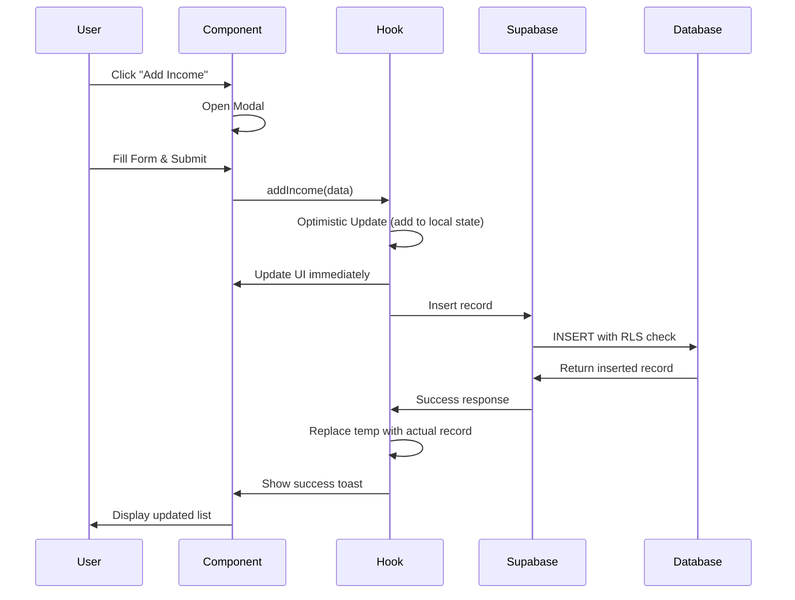

# Design Document: Dashboard Core Features

## Overview

This design document specifies the technical architecture and implementation details for the FamLedgerAI Phase 1 dashboard core features. The system provides comprehensive financial management capabilities for NRI and Indian Citizen users, including income tracking, expense management, investment portfolio monitoring, financial goal tracking, and family member management.

The dashboard is built using Next.js 15 with the App Router, React 19, TypeScript, Tailwind CSS, and Supabase for backend services. The architecture emphasizes data security through Row Level Security (RLS), real-time updates, responsive design, and accessibility compliance.

### Key Design Principles

- **Security First**: All data access controlled through Supabase RLS policies ensuring user data isolation
- **Performance**: Optimistic updates, pagination, lazy loading, and efficient data fetching patterns
- **Accessibility**: WCAG-compliant components with keyboard navigation and screen reader support
- **Responsive**: Mobile-first design with adaptive layouts for all screen sizes
- **User Experience**: Immediate feedback through toast notifications, loading states, and empty states
- **Maintainability**: Modular component architecture with reusable hooks and utilities

### Technology Stack

- **Framework**: Next.js 15 (App Router)
- **UI Library**: React 19
- **Language**: TypeScript
- **Styling**: Tailwind CSS with custom theme
- **Backend**: Supabase (PostgreSQL + Auth + RLS)
- **State Management**: React hooks + Zustand (for global UI state)
- **Charts**: Recharts (lazy loaded)
- **Icons**: Lucide React
- **Forms**: React Hook Form + Zod validation


## Architecture

### System Architecture Diagram



### Application Structure

```
src/
├── app/
│   ├── (dashboard)/              # Dashboard layout group
│   │   ├── layout.tsx            # Dashboard shell with sidebar
│   │   ├── overview/             # Dashboard overview page
│   │   ├── income/               # Income management page
│   │   ├── expenses/             # Expense management page
│   │   ├── investments/          # Investment portfolio page
│   │   ├── goals/                # Financial goals page
│   │   └── family/               # Family members page
│   ├── (auth)/                   # Auth layout group (existing)
│   └── globals.css
├── components/
│   ├── layout/
│   │   ├── Sidebar.tsx           # Desktop sidebar navigation
│   │   ├── BottomNav.tsx         # Mobile bottom navigation
│   │   ├── TopNav.tsx            # Top navigation bar
│   │   └── DashboardShell.tsx    # Main layout wrapper
│   ├── ui/
│   │   ├── SummaryCard.tsx       # Metric display card
│   │   ├── Modal.tsx             # Modal dialog system
│   │   ├── Toast.tsx             # Toast notification
│   │   ├── EmptyState.tsx        # Empty state component
│   │   ├── SkeletonLoader.tsx    # Loading skeleton
│   │   ├── Button.tsx            # Button component
│   │   ├── Input.tsx             # Input field
│   │   ├── Select.tsx            # Select dropdown
│   │   └── Badge.tsx             # Badge component
│   ├── income/
│   │   ├── IncomeTable.tsx       # Income list table
│   │   ├── IncomeForm.tsx        # Add/edit income form
│   │   └── IncomeSummary.tsx     # Income summary cards
│   ├── expenses/
│   │   ├── ExpenseTable.tsx      # Expense list table
│   │   ├── ExpenseForm.tsx       # Add/edit expense form
│   │   ├── ExpenseSummary.tsx    # Expense summary cards
│   │   └── CategoryChart.tsx     # Category breakdown chart
│   ├── investments/
│   │   ├── InvestmentTable.tsx   # Investment list table
│   │   ├── InvestmentForm.tsx    # Add/edit investment form
│   │   ├── InvestmentSummary.tsx # Investment summary cards
│   │   └── PortfolioChart.tsx    # Portfolio distribution chart
│   ├── goals/
│   │   ├── GoalCard.tsx          # Goal display card
│   │   ├── GoalForm.tsx          # Add/edit goal form
│   │   └── GoalSummary.tsx       # Goals summary cards
│   └── family/
│       ├── FamilyCard.tsx        # Family member card
│       └── FamilyForm.tsx        # Add/edit family member form
├── hooks/
│   ├── useIncome.ts              # Income data operations
│   ├── useExpenses.ts            # Expense data operations
│   ├── useInvestments.ts         # Investment data operations
│   ├── useGoals.ts               # Goal data operations
│   ├── useFamily.ts              # Family member operations
│   └── useToast.ts               # Toast notification hook
├── lib/
│   ├── supabase/
│   │   ├── client.ts             # Supabase client (existing)
│   │   └── server.ts             # Supabase server (existing)
│   ├── utils/
│   │   ├── currency.ts           # Currency formatting
│   │   ├── date.ts               # Date formatting
│   │   └── validation.ts         # Form validation schemas
│   └── store/
│       └── ui-store.ts           # Zustand store for UI state
└── types/
    └── database.ts               # TypeScript types for database
```

### Component Hierarchy

```mermaid
graph TD
    DashboardLayout[Dashboard Layout]
    DashboardLayout --> Sidebar
    DashboardLayout --> TopNav
    DashboardLayout --> BottomNav
    DashboardLayout --> PageContent[Page Content]
    
    PageContent --> OverviewPage
    PageContent --> IncomePage
    PageContent --> ExpensesPage
    PageContent --> InvestmentsPage
    PageContent --> GoalsPage
    PageContent --> FamilyPage
    
    OverviewPage --> SummaryCards
    OverviewPage --> RecentTransactions
    OverviewPage --> GoalsSnapshot
    OverviewPage --> IncomeVsExpenseChart
    
    IncomePage --> IncomeSummary
    IncomePage --> IncomeTable
    IncomePage --> IncomeForm
    
    ExpensesPage --> ExpenseSummary
    ExpensesPage --> CategoryChart
    ExpensesPage --> ExpenseTable
    ExpensesPage --> ExpenseForm
    
    InvestmentsPage --> InvestmentSummary
    InvestmentsPage --> PortfolioChart
    InvestmentsPage --> InvestmentTable
    InvestmentsPage --> InvestmentForm
    
    GoalsPage --> GoalSummary
    GoalsPage --> GoalCard
    GoalsPage --> GoalForm
    
    FamilyPage --> FamilyCard
    FamilyPage --> FamilyForm
```




## Components and Interfaces

### Layout Components

#### DashboardShell
Main layout wrapper that provides the dashboard structure with sidebar and top navigation.

```typescript
interface DashboardShellProps {
  children: React.ReactNode;
}

// Renders:
// - Sidebar (desktop) or BottomNav (mobile)
// - TopNav
// - Main content area with children
```

#### Sidebar
Fixed sidebar navigation for desktop viewports (≥768px).

```typescript
interface SidebarProps {
  className?: string;
}

interface NavSection {
  title: string;
  items: NavItem[];
}

interface NavItem {
  label: string;
  href: string;
  icon: LucideIcon;
  badge?: string | number;
}

// Navigation sections:
// - Overview
// - Money: Income, Expenses, Investments
// - Planning: Goals, Family
// - Tools (future)
```

#### BottomNav
Bottom navigation bar for mobile viewports (<768px).

```typescript
interface BottomNavProps {
  className?: string;
}

// Shows 5 primary navigation items with icons
```

#### TopNav
Top navigation bar with page title and quick actions.

```typescript
interface TopNavProps {
  title: string;
  actions?: React.ReactNode;
}
```

### UI Components

#### SummaryCard
Reusable card component for displaying key metrics.

```typescript
interface SummaryCardProps {
  title: string;
  value: string | number;
  icon: LucideIcon;
  iconColor?: string;
  trend?: {
    value: number;
    isPositive: boolean;
  };
  loading?: boolean;
}
```

#### Modal
Modal dialog system for forms and confirmations.

```typescript
interface ModalProps {
  isOpen: boolean;
  onClose: () => void;
  title: string;
  children: React.ReactNode;
  size?: 'sm' | 'md' | 'lg';
  showCloseButton?: boolean;
}

interface ConfirmDialogProps {
  isOpen: boolean;
  onClose: () => void;
  onConfirm: () => void;
  title: string;
  message: string;
  confirmText?: string;
  cancelText?: string;
  variant?: 'danger' | 'warning' | 'info';
}
```

#### Toast
Toast notification component.

```typescript
interface ToastProps {
  id: string;
  type: 'success' | 'error' | 'info' | 'warning';
  message: string;
  duration?: number;
  onDismiss: (id: string) => void;
}

interface ToastContainerProps {
  toasts: ToastProps[];
}
```

#### EmptyState
Empty state component with call-to-action.

```typescript
interface EmptyStateProps {
  icon: LucideIcon;
  title: string;
  description: string;
  actionLabel?: string;
  onAction?: () => void;
}
```

#### SkeletonLoader
Loading skeleton for various content types.

```typescript
interface SkeletonLoaderProps {
  variant: 'card' | 'table' | 'chart' | 'text';
  count?: number;
  className?: string;
}
```

### Feature Components

#### Income Components

```typescript
// IncomeTable
interface IncomeTableProps {
  data: Income[];
  loading: boolean;
  onEdit: (income: Income) => void;
  onDelete: (id: string) => void;
}

// IncomeForm
interface IncomeFormProps {
  income?: Income;
  onSubmit: (data: IncomeFormData) => Promise<void>;
  onCancel: () => void;
}

interface IncomeFormData {
  amount: number;
  currency: string;
  source: string;
  description?: string;
  date: string;
  is_recurring: boolean;
  recurring_frequency?: 'daily' | 'weekly' | 'monthly' | 'yearly';
}

// IncomeSummary
interface IncomeSummaryProps {
  thisMonth: number;
  lastMonth: number;
  recurringTotal: number;
  loading: boolean;
}
```

#### Expense Components

```typescript
// ExpenseTable
interface ExpenseTableProps {
  data: Expense[];
  loading: boolean;
  onEdit: (expense: Expense) => void;
  onDelete: (id: string) => void;
}

// ExpenseForm
interface ExpenseFormProps {
  expense?: Expense;
  onSubmit: (data: ExpenseFormData) => Promise<void>;
  onCancel: () => void;
}

interface ExpenseFormData {
  amount: number;
  currency: string;
  category: ExpenseCategory;
  description?: string;
  payment_method: PaymentMethod;
  tags?: string[];
  date: string;
}

type ExpenseCategory = 
  | 'food' | 'transport' | 'utilities' | 'healthcare' 
  | 'education' | 'entertainment' | 'shopping' | 'rent' 
  | 'insurance' | 'other';

type PaymentMethod = 
  | 'cash' | 'credit_card' | 'debit_card' 
  | 'upi' | 'net_banking' | 'wallet';

// ExpenseSummary
interface ExpenseSummaryProps {
  thisMonth: number;
  biggestCategory: { name: string; amount: number };
  dailyAverage: number;
  loading: boolean;
}

// CategoryChart
interface CategoryChartProps {
  data: CategoryBreakdown[];
  loading: boolean;
}

interface CategoryBreakdown {
  category: ExpenseCategory;
  amount: number;
  percentage: number;
}
```

#### Investment Components

```typescript
// InvestmentTable
interface InvestmentTableProps {
  data: Investment[];
  loading: boolean;
  onEdit: (investment: Investment) => void;
  onDelete: (id: string) => void;
}

// InvestmentForm
interface InvestmentFormProps {
  investment?: Investment;
  onSubmit: (data: InvestmentFormData) => Promise<void>;
  onCancel: () => void;
}

interface InvestmentFormData {
  type: InvestmentType;
  name: string;
  invested_amount: number;
  current_value: number;
  units?: number;
  purchase_date: string;
  currency: string;
  notes?: string;
}

type InvestmentType = 
  | 'mutual_funds' | 'stocks' | 'ppf' | 'epf' | 'nps' 
  | 'fd' | 'real_estate' | 'gold' | 'nre_account' | 'nro_account';

// InvestmentSummary
interface InvestmentSummaryProps {
  totalInvested: number;
  currentValue: number;
  totalReturns: number;
  returnPercentage: number;
  loading: boolean;
}

// PortfolioChart
interface PortfolioChartProps {
  data: PortfolioBreakdown[];
  loading: boolean;
}

interface PortfolioBreakdown {
  type: InvestmentType;
  amount: number;
  percentage: number;
}
```

#### Goal Components

```typescript
// GoalCard
interface GoalCardProps {
  goal: Goal;
  onEdit: (goal: Goal) => void;
  onDelete: (id: string) => void;
  onAddSavings: (id: string) => void;
}

// GoalForm
interface GoalFormProps {
  goal?: Goal;
  onSubmit: (data: GoalFormData) => Promise<void>;
  onCancel: () => void;
}

interface GoalFormData {
  category: GoalCategory;
  title: string;
  description?: string;
  target_amount: number;
  current_amount: number;
  target_date: string;
  priority: 'high' | 'medium' | 'low';
  currency: string;
}

type GoalCategory = 
  | 'emergency_fund' | 'retirement' | 'home' | 'education' 
  | 'return_india' | 'vacation' | 'wedding' | 'vehicle' 
  | 'business' | 'other';

// GoalSummary
interface GoalSummaryProps {
  activeGoalsCount: number;
  totalTarget: number;
  totalSaved: number;
  loading: boolean;
}
```

#### Family Components

```typescript
// FamilyCard
interface FamilyCardProps {
  member: FamilyMember;
  onEdit: (member: FamilyMember) => void;
  onDelete: (id: string) => void;
}

// FamilyForm
interface FamilyFormProps {
  member?: FamilyMember;
  onSubmit: (data: FamilyFormData) => Promise<void>;
  onCancel: () => void;
}

interface FamilyFormData {
  name: string;
  relation: Relation;
  date_of_birth: string;
  is_dependent: boolean;
}

type Relation = 
  | 'self' | 'spouse' | 'child' | 'parent' 
  | 'sibling' | 'grandparent' | 'other';
```


## Data Models

### Database Schema

#### Income Table

```sql
CREATE TABLE income (
  id UUID PRIMARY KEY DEFAULT gen_random_uuid(),
  user_id UUID NOT NULL REFERENCES user_profiles(id) ON DELETE CASCADE,
  amount NUMERIC(15, 2) NOT NULL CHECK (amount >= 0),
  currency VARCHAR(3) NOT NULL DEFAULT 'INR',
  source TEXT NOT NULL,
  description TEXT,
  date DATE NOT NULL,
  is_recurring BOOLEAN NOT NULL DEFAULT false,
  recurring_frequency TEXT CHECK (recurring_frequency IN ('daily', 'weekly', 'monthly', 'yearly')),
  created_at TIMESTAMPTZ NOT NULL DEFAULT NOW(),
  updated_at TIMESTAMPTZ NOT NULL DEFAULT NOW()
);

CREATE INDEX idx_income_user_date ON income(user_id, date DESC);
CREATE INDEX idx_income_user_recurring ON income(user_id, is_recurring);

-- RLS Policies
ALTER TABLE income ENABLE ROW LEVEL SECURITY;

CREATE POLICY "Users can view own income"
  ON income FOR SELECT
  USING (auth.uid() = user_id);

CREATE POLICY "Users can insert own income"
  ON income FOR INSERT
  WITH CHECK (auth.uid() = user_id);

CREATE POLICY "Users can update own income"
  ON income FOR UPDATE
  USING (auth.uid() = user_id)
  WITH CHECK (auth.uid() = user_id);

CREATE POLICY "Users can delete own income"
  ON income FOR DELETE
  USING (auth.uid() = user_id);
```

#### Expenses Table

```sql
CREATE TABLE expenses (
  id UUID PRIMARY KEY DEFAULT gen_random_uuid(),
  user_id UUID NOT NULL REFERENCES user_profiles(id) ON DELETE CASCADE,
  amount NUMERIC(15, 2) NOT NULL CHECK (amount >= 0),
  currency VARCHAR(3) NOT NULL DEFAULT 'INR',
  category TEXT NOT NULL CHECK (category IN (
    'food', 'transport', 'utilities', 'healthcare', 'education',
    'entertainment', 'shopping', 'rent', 'insurance', 'other'
  )),
  description TEXT,
  payment_method TEXT NOT NULL CHECK (payment_method IN (
    'cash', 'credit_card', 'debit_card', 'upi', 'net_banking', 'wallet'
  )),
  tags TEXT[] DEFAULT '{}',
  date DATE NOT NULL,
  created_at TIMESTAMPTZ NOT NULL DEFAULT NOW(),
  updated_at TIMESTAMPTZ NOT NULL DEFAULT NOW()
);

CREATE INDEX idx_expenses_user_date ON expenses(user_id, date DESC);
CREATE INDEX idx_expenses_user_category ON expenses(user_id, category);
CREATE INDEX idx_expenses_user_date_category ON expenses(user_id, date DESC, category);

-- RLS Policies
ALTER TABLE expenses ENABLE ROW LEVEL SECURITY;

CREATE POLICY "Users can view own expenses"
  ON expenses FOR SELECT
  USING (auth.uid() = user_id);

CREATE POLICY "Users can insert own expenses"
  ON expenses FOR INSERT
  WITH CHECK (auth.uid() = user_id);

CREATE POLICY "Users can update own expenses"
  ON expenses FOR UPDATE
  USING (auth.uid() = user_id)
  WITH CHECK (auth.uid() = user_id);

CREATE POLICY "Users can delete own expenses"
  ON expenses FOR DELETE
  USING (auth.uid() = user_id);
```

#### Investments Table

```sql
CREATE TABLE investments (
  id UUID PRIMARY KEY DEFAULT gen_random_uuid(),
  user_id UUID NOT NULL REFERENCES user_profiles(id) ON DELETE CASCADE,
  type TEXT NOT NULL CHECK (type IN (
    'mutual_funds', 'stocks', 'ppf', 'epf', 'nps', 'fd',
    'real_estate', 'gold', 'nre_account', 'nro_account'
  )),
  name TEXT NOT NULL,
  invested_amount NUMERIC(15, 2) NOT NULL CHECK (invested_amount >= 0),
  current_value NUMERIC(15, 2) NOT NULL CHECK (current_value >= 0),
  units NUMERIC(15, 4),
  purchase_date DATE NOT NULL,
  currency VARCHAR(3) NOT NULL DEFAULT 'INR',
  notes TEXT,
  created_at TIMESTAMPTZ NOT NULL DEFAULT NOW(),
  updated_at TIMESTAMPTZ NOT NULL DEFAULT NOW()
);

CREATE INDEX idx_investments_user_type ON investments(user_id, type);
CREATE INDEX idx_investments_user_date ON investments(user_id, purchase_date DESC);

-- RLS Policies
ALTER TABLE investments ENABLE ROW LEVEL SECURITY;

CREATE POLICY "Users can view own investments"
  ON investments FOR SELECT
  USING (auth.uid() = user_id);

CREATE POLICY "Users can insert own investments"
  ON investments FOR INSERT
  WITH CHECK (auth.uid() = user_id);

CREATE POLICY "Users can update own investments"
  ON investments FOR UPDATE
  USING (auth.uid() = user_id)
  WITH CHECK (auth.uid() = user_id);

CREATE POLICY "Users can delete own investments"
  ON investments FOR DELETE
  USING (auth.uid() = user_id);
```

#### Goals Table

```sql
CREATE TABLE goals (
  id UUID PRIMARY KEY DEFAULT gen_random_uuid(),
  user_id UUID NOT NULL REFERENCES user_profiles(id) ON DELETE CASCADE,
  category TEXT NOT NULL CHECK (category IN (
    'emergency_fund', 'retirement', 'home', 'education', 'return_india',
    'vacation', 'wedding', 'vehicle', 'business', 'other'
  )),
  title TEXT NOT NULL,
  description TEXT,
  target_amount NUMERIC(15, 2) NOT NULL CHECK (target_amount > 0),
  current_amount NUMERIC(15, 2) NOT NULL DEFAULT 0 CHECK (current_amount >= 0),
  target_date DATE NOT NULL,
  priority TEXT NOT NULL CHECK (priority IN ('high', 'medium', 'low')),
  currency VARCHAR(3) NOT NULL DEFAULT 'INR',
  status TEXT NOT NULL DEFAULT 'active' CHECK (status IN ('active', 'completed', 'paused')),
  created_at TIMESTAMPTZ NOT NULL DEFAULT NOW(),
  updated_at TIMESTAMPTZ NOT NULL DEFAULT NOW()
);

CREATE INDEX idx_goals_user_status ON goals(user_id, status);
CREATE INDEX idx_goals_user_priority ON goals(user_id, priority);

-- RLS Policies
ALTER TABLE goals ENABLE ROW LEVEL SECURITY;

CREATE POLICY "Users can view own goals"
  ON goals FOR SELECT
  USING (auth.uid() = user_id);

CREATE POLICY "Users can insert own goals"
  ON goals FOR INSERT
  WITH CHECK (auth.uid() = user_id);

CREATE POLICY "Users can update own goals"
  ON goals FOR UPDATE
  USING (auth.uid() = user_id)
  WITH CHECK (auth.uid() = user_id);

CREATE POLICY "Users can delete own goals"
  ON goals FOR DELETE
  USING (auth.uid() = user_id);
```

#### Family Members Table

```sql
CREATE TABLE family_members (
  id UUID PRIMARY KEY DEFAULT gen_random_uuid(),
  user_id UUID NOT NULL REFERENCES user_profiles(id) ON DELETE CASCADE,
  name TEXT NOT NULL,
  relation TEXT NOT NULL CHECK (relation IN (
    'self', 'spouse', 'child', 'parent', 'sibling', 'grandparent', 'other'
  )),
  date_of_birth DATE NOT NULL,
  is_dependent BOOLEAN NOT NULL DEFAULT false,
  created_at TIMESTAMPTZ NOT NULL DEFAULT NOW(),
  updated_at TIMESTAMPTZ NOT NULL DEFAULT NOW()
);

CREATE INDEX idx_family_members_user ON family_members(user_id);

-- RLS Policies
ALTER TABLE family_members ENABLE ROW LEVEL SECURITY;

CREATE POLICY "Users can view own family members"
  ON family_members FOR SELECT
  USING (auth.uid() = user_id);

CREATE POLICY "Users can insert own family members"
  ON family_members FOR INSERT
  WITH CHECK (auth.uid() = user_id);

CREATE POLICY "Users can update own family members"
  ON family_members FOR UPDATE
  USING (auth.uid() = user_id)
  WITH CHECK (auth.uid() = user_id);

CREATE POLICY "Users can delete own family members"
  ON family_members FOR DELETE
  USING (auth.uid() = user_id);
```

### TypeScript Types

```typescript
// Database types
export interface Income {
  id: string;
  user_id: string;
  amount: number;
  currency: string;
  source: string;
  description?: string;
  date: string;
  is_recurring: boolean;
  recurring_frequency?: 'daily' | 'weekly' | 'monthly' | 'yearly';
  created_at: string;
  updated_at: string;
}

export interface Expense {
  id: string;
  user_id: string;
  amount: number;
  currency: string;
  category: ExpenseCategory;
  description?: string;
  payment_method: PaymentMethod;
  tags: string[];
  date: string;
  created_at: string;
  updated_at: string;
}

export interface Investment {
  id: string;
  user_id: string;
  type: InvestmentType;
  name: string;
  invested_amount: number;
  current_value: number;
  units?: number;
  purchase_date: string;
  currency: string;
  notes?: string;
  created_at: string;
  updated_at: string;
}

export interface Goal {
  id: string;
  user_id: string;
  category: GoalCategory;
  title: string;
  description?: string;
  target_amount: number;
  current_amount: number;
  target_date: string;
  priority: 'high' | 'medium' | 'low';
  currency: string;
  status: 'active' | 'completed' | 'paused';
  created_at: string;
  updated_at: string;
}

export interface FamilyMember {
  id: string;
  user_id: string;
  name: string;
  relation: Relation;
  date_of_birth: string;
  is_dependent: boolean;
  created_at: string;
  updated_at: string;
}
```

### Database Relationships Diagram




## Data Flow and State Management

### Data Fetching Pattern

The application uses custom React hooks for data operations, following this pattern:

```typescript
// Example: useIncome hook
export function useIncome() {
  const [income, setIncome] = useState<Income[]>([]);
  const [loading, setLoading] = useState(true);
  const [error, setError] = useState<string | null>(null);
  const supabase = createClient();
  const { showToast } = useToast();

  // Fetch income records
  const fetchIncome = useCallback(async () => {
    try {
      setLoading(true);
      const { data, error } = await supabase
        .from('income')
        .select('*')
        .order('date', { ascending: false });
      
      if (error) throw error;
      setIncome(data || []);
    } catch (err) {
      setError(err.message);
      showToast({ type: 'error', message: 'Failed to load income' });
    } finally {
      setLoading(false);
    }
  }, [supabase, showToast]);

  // Add income with optimistic update
  const addIncome = useCallback(async (data: IncomeFormData) => {
    try {
      const { data: { user } } = await supabase.auth.getUser();
      if (!user) throw new Error('Not authenticated');

      const newIncome = { ...data, user_id: user.id };
      
      // Optimistic update
      const tempId = crypto.randomUUID();
      setIncome(prev => [{ ...newIncome, id: tempId, created_at: new Date().toISOString(), updated_at: new Date().toISOString() }, ...prev]);
      
      const { data: inserted, error } = await supabase
        .from('income')
        .insert(newIncome)
        .select()
        .single();
      
      if (error) throw error;
      
      // Replace temp with actual
      setIncome(prev => prev.map(i => i.id === tempId ? inserted : i));
      showToast({ type: 'success', message: 'Income added successfully' });
    } catch (err) {
      // Rollback optimistic update
      setIncome(prev => prev.filter(i => i.id !== tempId));
      showToast({ type: 'error', message: 'Failed to add income' });
      throw err;
    }
  }, [supabase, showToast]);

  // Update, delete, and utility functions...
  
  return {
    income,
    loading,
    error,
    addIncome,
    updateIncome,
    deleteIncome,
    monthlyTotal,
    refetch: fetchIncome
  };
}
```

### State Management Architecture



### Zustand Store for UI State

```typescript
// lib/store/ui-store.ts
interface UIStore {
  // Modal state
  modals: {
    [key: string]: boolean;
  };
  openModal: (key: string) => void;
  closeModal: (key: string) => void;
  
  // Toast state
  toasts: Toast[];
  addToast: (toast: Omit<Toast, 'id'>) => void;
  removeToast: (id: string) => void;
  
  // Sidebar state (mobile)
  isSidebarOpen: boolean;
  toggleSidebar: () => void;
  closeSidebar: () => void;
}

export const useUIStore = create<UIStore>((set) => ({
  modals: {},
  openModal: (key) => set((state) => ({
    modals: { ...state.modals, [key]: true }
  })),
  closeModal: (key) => set((state) => ({
    modals: { ...state.modals, [key]: false }
  })),
  
  toasts: [],
  addToast: (toast) => set((state) => ({
    toasts: [...state.toasts, { ...toast, id: crypto.randomUUID() }]
  })),
  removeToast: (id) => set((state) => ({
    toasts: state.toasts.filter(t => t.id !== id)
  })),
  
  isSidebarOpen: false,
  toggleSidebar: () => set((state) => ({
    isSidebarOpen: !state.isSidebarOpen
  })),
  closeSidebar: () => set({ isSidebarOpen: false })
}));
```

### Data Flow Diagram



### Real-time Updates Strategy

For Phase 1, we use optimistic updates and manual refetching. Future phases can add Supabase real-time subscriptions:

```typescript
// Future enhancement: Real-time subscriptions
useEffect(() => {
  const channel = supabase
    .channel('income-changes')
    .on('postgres_changes', 
      { 
        event: '*', 
        schema: 'public', 
        table: 'income',
        filter: `user_id=eq.${user.id}`
      }, 
      (payload) => {
        // Handle real-time updates
        handleRealtimeUpdate(payload);
      }
    )
    .subscribe();

  return () => {
    supabase.removeChannel(channel);
  };
}, [user.id]);
```


## API and Supabase Integration

### Supabase Client Configuration

The application uses two Supabase client instances:

```typescript
// lib/supabase/client.ts (Client-side)
import { createBrowserClient } from '@supabase/ssr';

export function createClient() {
  return createBrowserClient(
    process.env.NEXT_PUBLIC_SUPABASE_URL!,
    process.env.NEXT_PUBLIC_SUPABASE_ANON_KEY!
  );
}

// lib/supabase/server.ts (Server-side)
import { createServerClient } from '@supabase/ssr';
import { cookies } from 'next/headers';

export async function createServerSupabaseClient() {
  const cookieStore = await cookies();
  
  return createServerClient(
    process.env.NEXT_PUBLIC_SUPABASE_URL!,
    process.env.NEXT_PUBLIC_SUPABASE_ANON_KEY!,
    {
      cookies: {
        get(name: string) {
          return cookieStore.get(name)?.value;
        },
      },
    }
  );
}
```

### Data Access Patterns

#### Query Patterns

```typescript
// Fetch all income for current user (RLS automatically filters)
const { data, error } = await supabase
  .from('income')
  .select('*')
  .order('date', { ascending: false });

// Fetch income for specific month
const { data, error } = await supabase
  .from('income')
  .select('*')
  .gte('date', startDate)
  .lte('date', endDate)
  .order('date', { ascending: false });

// Fetch with pagination
const { data, error } = await supabase
  .from('expenses')
  .select('*', { count: 'exact' })
  .order('date', { ascending: false })
  .range(start, end);

// Aggregate queries
const { data, error } = await supabase
  .from('expenses')
  .select('category, amount')
  .gte('date', startOfMonth)
  .lte('date', endOfMonth);

// Calculate in application
const categoryTotals = data.reduce((acc, expense) => {
  acc[expense.category] = (acc[expense.category] || 0) + expense.amount;
  return acc;
}, {});
```

#### Mutation Patterns

```typescript
// Insert
const { data, error } = await supabase
  .from('income')
  .insert({
    user_id: user.id,
    amount: 50000,
    currency: 'INR',
    source: 'Salary',
    date: '2024-01-15',
    is_recurring: true,
    recurring_frequency: 'monthly'
  })
  .select()
  .single();

// Update
const { data, error } = await supabase
  .from('income')
  .update({ amount: 55000 })
  .eq('id', incomeId)
  .select()
  .single();

// Delete
const { error } = await supabase
  .from('income')
  .delete()
  .eq('id', incomeId);

// Upsert (for goal progress updates)
const { data, error } = await supabase
  .from('goals')
  .upsert({
    id: goalId,
    current_amount: newAmount,
    status: newAmount >= targetAmount ? 'completed' : 'active'
  })
  .select()
  .single();
```

### Authentication Integration

```typescript
// Get current user
const { data: { user }, error } = await supabase.auth.getUser();

// Check authentication in middleware
export async function middleware(request: NextRequest) {
  const supabase = createServerSupabaseClient();
  const { data: { user } } = await supabase.auth.getUser();
  
  if (!user && request.nextUrl.pathname.startsWith('/dashboard')) {
    return NextResponse.redirect(new URL('/login', request.url));
  }
  
  return NextResponse.next();
}

// Protected page component
export default async function DashboardPage() {
  const supabase = await createServerSupabaseClient();
  const { data: { user } } = await supabase.auth.getUser();
  
  if (!user) {
    redirect('/login');
  }
  
  return <DashboardContent />;
}
```

### Error Handling

```typescript
// Standardized error handling
async function handleSupabaseOperation<T>(
  operation: () => Promise<{ data: T | null; error: any }>
): Promise<T> {
  try {
    const { data, error } = await operation();
    
    if (error) {
      // Log error for debugging
      console.error('Supabase error:', error);
      
      // Map to user-friendly messages
      if (error.code === 'PGRST116') {
        throw new Error('Record not found');
      } else if (error.code === '23505') {
        throw new Error('This record already exists');
      } else if (error.message.includes('JWT')) {
        throw new Error('Session expired. Please log in again.');
      } else {
        throw new Error(error.message || 'An unexpected error occurred');
      }
    }
    
    if (!data) {
      throw new Error('No data returned');
    }
    
    return data;
  } catch (err) {
    throw err;
  }
}

// Usage
try {
  const income = await handleSupabaseOperation(() =>
    supabase.from('income').select('*').single()
  );
} catch (err) {
  showToast({ type: 'error', message: err.message });
}
```

### Performance Optimization

```typescript
// Pagination helper
export function usePagination<T>(
  fetchFn: (start: number, end: number) => Promise<{ data: T[]; count: number }>,
  pageSize: number = 20
) {
  const [page, setPage] = useState(0);
  const [data, setData] = useState<T[]>([]);
  const [totalCount, setTotalCount] = useState(0);
  const [loading, setLoading] = useState(false);

  const fetchPage = useCallback(async (pageNum: number) => {
    setLoading(true);
    const start = pageNum * pageSize;
    const end = start + pageSize - 1;
    
    const { data, count } = await fetchFn(start, end);
    setData(data);
    setTotalCount(count);
    setPage(pageNum);
    setLoading(false);
  }, [fetchFn, pageSize]);

  return {
    data,
    page,
    totalPages: Math.ceil(totalCount / pageSize),
    loading,
    nextPage: () => fetchPage(page + 1),
    prevPage: () => fetchPage(page - 1),
    goToPage: fetchPage
  };
}

// Debounced search
export function useDebounce<T>(value: T, delay: number = 300): T {
  const [debouncedValue, setDebouncedValue] = useState(value);

  useEffect(() => {
    const handler = setTimeout(() => {
      setDebouncedValue(value);
    }, delay);

    return () => {
      clearTimeout(handler);
    };
  }, [value, delay]);

  return debouncedValue;
}
```


## UI Component Specifications

### Design System

#### Color Palette

```typescript
// Brand colors (from requirements)
const colors = {
  // Primary brand colors
  saffron: '#FF9933',      // Primary actions, highlights
  white: '#FFFFFF',        // Text on dark backgrounds
  green: '#138808',        // Success states, positive trends
  
  // Background colors
  navy: '#000080',         // Primary background
  darkNavy: '#00005C',     // Secondary background
  
  // Semantic colors
  coral: '#FF6B6B',        // Errors, negative trends, high priority
  teal: '#20C997',         // Info, medium priority
  purple: '#6C63FF',       // Accents
  blue: '#4A90E2',         // Links, info
  gray: '#6C757D',         // Disabled, secondary text
  
  // Neutral colors
  background: '#0a0a1a',   // Main background
  cardBg: '#1a1a2e',       // Card backgrounds
  border: '#2a2a3e',       // Borders
  textPrimary: '#ffffff',  // Primary text
  textSecondary: '#a0a0b0', // Secondary text
  textMuted: '#6c6c7e',    // Muted text
};
```

#### Typography

```typescript
// Font configuration (using Inter from existing setup)
const typography = {
  fontFamily: {
    sans: ['Inter', 'system-ui', '-apple-system', 'sans-serif'],
  },
  fontSize: {
    xs: '0.75rem',      // 12px
    sm: '0.875rem',     // 14px
    base: '1rem',       // 16px
    lg: '1.125rem',     // 18px
    xl: '1.25rem',      // 20px
    '2xl': '1.5rem',    // 24px
    '3xl': '1.875rem',  // 30px
    '4xl': '2.25rem',   // 36px
  },
  fontWeight: {
    normal: 400,
    medium: 500,
    semibold: 600,
    bold: 700,
  },
};
```

#### Spacing

```typescript
const spacing = {
  0: '0',
  1: '0.25rem',   // 4px
  2: '0.5rem',    // 8px
  3: '0.75rem',   // 12px
  4: '1rem',      // 16px
  5: '1.25rem',   // 20px
  6: '1.5rem',    // 24px
  8: '2rem',      // 32px
  10: '2.5rem',   // 40px
  12: '3rem',     // 48px
  16: '4rem',     // 64px
};
```

#### Border Radius

```typescript
const borderRadius = {
  none: '0',
  sm: '0.25rem',   // 4px
  md: '0.5rem',    // 8px
  lg: '0.75rem',   // 12px
  xl: '1rem',      // 16px
  full: '9999px',
};
```

### Component Styling Specifications

#### Button Component

```typescript
// Button variants
const buttonVariants = {
  primary: {
    bg: colors.saffron,
    text: colors.white,
    hover: '#E68A2E',
    active: '#CC7A29',
  },
  secondary: {
    bg: colors.cardBg,
    text: colors.white,
    hover: '#252540',
    active: '#1a1a2e',
    border: colors.border,
  },
  danger: {
    bg: colors.coral,
    text: colors.white,
    hover: '#E65555',
    active: '#CC4A4A',
  },
  ghost: {
    bg: 'transparent',
    text: colors.textPrimary,
    hover: colors.cardBg,
    active: colors.border,
  },
};

// Button sizes
const buttonSizes = {
  sm: {
    height: '2rem',      // 32px
    padding: '0 0.75rem',
    fontSize: '0.875rem',
  },
  md: {
    height: '2.5rem',    // 40px
    padding: '0 1rem',
    fontSize: '1rem',
  },
  lg: {
    height: '3rem',      // 48px
    padding: '0 1.5rem',
    fontSize: '1.125rem',
  },
};
```

#### Card Component

```typescript
const cardStyles = {
  background: colors.cardBg,
  border: `1px solid ${colors.border}`,
  borderRadius: borderRadius.lg,
  padding: spacing[6],
  boxShadow: '0 2px 8px rgba(0, 0, 0, 0.1)',
};
```

#### Input Component

```typescript
const inputStyles = {
  background: colors.background,
  border: `1px solid ${colors.border}`,
  borderRadius: borderRadius.md,
  padding: `${spacing[2]} ${spacing[3]}`,
  fontSize: typography.fontSize.base,
  color: colors.textPrimary,
  height: '2.5rem',
  
  focus: {
    borderColor: colors.saffron,
    outline: `2px solid ${colors.saffron}33`, // 20% opacity
  },
  
  error: {
    borderColor: colors.coral,
  },
  
  disabled: {
    background: colors.cardBg,
    color: colors.textMuted,
    cursor: 'not-allowed',
  },
};
```

#### Modal Component

```typescript
const modalStyles = {
  overlay: {
    background: 'rgba(0, 0, 0, 0.75)',
    backdropFilter: 'blur(4px)',
  },
  
  content: {
    background: colors.cardBg,
    border: `1px solid ${colors.border}`,
    borderRadius: borderRadius.xl,
    maxWidth: {
      sm: '400px',
      md: '600px',
      lg: '800px',
    },
    padding: spacing[6],
    boxShadow: '0 20px 60px rgba(0, 0, 0, 0.3)',
  },
  
  header: {
    fontSize: typography.fontSize['2xl'],
    fontWeight: typography.fontWeight.semibold,
    marginBottom: spacing[4],
  },
};
```

#### Toast Component

```typescript
const toastStyles = {
  container: {
    position: 'fixed',
    top: spacing[4],
    right: spacing[4],
    zIndex: 9999,
    display: 'flex',
    flexDirection: 'column',
    gap: spacing[2],
  },
  
  toast: {
    background: colors.cardBg,
    border: `1px solid ${colors.border}`,
    borderRadius: borderRadius.lg,
    padding: spacing[4],
    minWidth: '320px',
    maxWidth: '480px',
    boxShadow: '0 8px 24px rgba(0, 0, 0, 0.2)',
    
    success: {
      borderLeft: `4px solid ${colors.green}`,
    },
    error: {
      borderLeft: `4px solid ${colors.coral}`,
    },
    info: {
      borderLeft: `4px solid ${colors.blue}`,
    },
    warning: {
      borderLeft: `4px solid ${colors.saffron}`,
    },
  },
};
```

### Layout Specifications

#### Sidebar Layout

```typescript
const sidebarLayout = {
  width: '220px',
  background: colors.cardBg,
  borderRight: `1px solid ${colors.border}`,
  height: '100vh',
  position: 'fixed',
  left: 0,
  top: 0,
  padding: spacing[4],
  
  // Navigation sections
  section: {
    marginBottom: spacing[6],
  },
  
  sectionTitle: {
    fontSize: typography.fontSize.xs,
    fontWeight: typography.fontWeight.semibold,
    color: colors.textMuted,
    textTransform: 'uppercase',
    letterSpacing: '0.05em',
    marginBottom: spacing[2],
  },
  
  navItem: {
    display: 'flex',
    alignItems: 'center',
    gap: spacing[3],
    padding: `${spacing[2]} ${spacing[3]}`,
    borderRadius: borderRadius.md,
    fontSize: typography.fontSize.sm,
    color: colors.textSecondary,
    cursor: 'pointer',
    transition: 'all 0.2s',
    
    hover: {
      background: colors.background,
      color: colors.textPrimary,
    },
    
    active: {
      background: `${colors.saffron}22`, // 13% opacity
      color: colors.saffron,
      fontWeight: typography.fontWeight.medium,
    },
  },
  
  userProfile: {
    position: 'absolute',
    bottom: spacing[4],
    left: spacing[4],
    right: spacing[4],
    padding: spacing[3],
    background: colors.background,
    borderRadius: borderRadius.md,
  },
};
```

#### Bottom Navigation (Mobile)

```typescript
const bottomNavLayout = {
  position: 'fixed',
  bottom: 0,
  left: 0,
  right: 0,
  height: '64px',
  background: colors.cardBg,
  borderTop: `1px solid ${colors.border}`,
  display: 'flex',
  justifyContent: 'space-around',
  alignItems: 'center',
  padding: `${spacing[2]} ${spacing[4]}`,
  zIndex: 1000,
  
  navItem: {
    display: 'flex',
    flexDirection: 'column',
    alignItems: 'center',
    gap: spacing[1],
    padding: spacing[2],
    borderRadius: borderRadius.md,
    fontSize: typography.fontSize.xs,
    color: colors.textSecondary,
    
    active: {
      color: colors.saffron,
    },
  },
};
```

#### Page Layout

```typescript
const pageLayout = {
  // Desktop (with sidebar)
  desktop: {
    marginLeft: '220px',
    padding: spacing[6],
    minHeight: '100vh',
  },
  
  // Mobile (with bottom nav)
  mobile: {
    padding: spacing[4],
    paddingBottom: '80px', // Account for bottom nav
    minHeight: '100vh',
  },
  
  // Page header
  header: {
    marginBottom: spacing[6],
    display: 'flex',
    justifyContent: 'space-between',
    alignItems: 'center',
  },
  
  title: {
    fontSize: typography.fontSize['3xl'],
    fontWeight: typography.fontWeight.bold,
    color: colors.textPrimary,
  },
  
  // Content sections
  section: {
    marginBottom: spacing[8],
  },
  
  sectionTitle: {
    fontSize: typography.fontSize.xl,
    fontWeight: typography.fontWeight.semibold,
    color: colors.textPrimary,
    marginBottom: spacing[4],
  },
};
```

### Responsive Breakpoints

```typescript
const breakpoints = {
  sm: '640px',   // Mobile landscape
  md: '768px',   // Tablet
  lg: '1024px',  // Desktop
  xl: '1280px',  // Large desktop
  '2xl': '1536px', // Extra large desktop
};

// Usage in Tailwind
const responsiveClasses = {
  // Hide sidebar on mobile, show on desktop
  sidebar: 'hidden md:block',
  
  // Show bottom nav on mobile, hide on desktop
  bottomNav: 'block md:hidden',
  
  // Grid layouts
  summaryGrid: 'grid grid-cols-1 sm:grid-cols-2 lg:grid-cols-4 gap-4',
  goalsGrid: 'grid grid-cols-1 lg:grid-cols-2 gap-6',
  familyGrid: 'grid grid-cols-1 sm:grid-cols-2 lg:grid-cols-3 gap-4',
  
  // Modal widths
  modal: 'w-full md:w-[600px] mx-4 md:mx-0',
};
```


## Page Layouts and Component Structure

### Dashboard Overview Page

```typescript
// app/(dashboard)/overview/page.tsx
export default function OverviewPage() {
  return (
    <div className="space-y-8">
      {/* Page Header */}
      <div className="flex justify-between items-center">
        <h1 className="text-3xl font-bold">Dashboard Overview</h1>
        <div className="flex gap-2">
          <Button variant="secondary" size="sm">
            <Download className="w-4 h-4 mr-2" />
            Export
          </Button>
        </div>
      </div>

      {/* Summary Cards */}
      <div className="grid grid-cols-1 sm:grid-cols-2 lg:grid-cols-4 gap-4">
        <SummaryCard
          title="Income This Month"
          value={formatCurrency(totalIncome)}
          icon={TrendingUp}
          iconColor={colors.green}
          trend={{ value: 12, isPositive: true }}
        />
        <SummaryCard
          title="Expenses This Month"
          value={formatCurrency(totalExpenses)}
          icon={TrendingDown}
          iconColor={colors.coral}
          trend={{ value: 5, isPositive: false }}
        />
        <SummaryCard
          title="Total Investments"
          value={formatCompact(totalInvestments)}
          icon={PieChart}
          iconColor={colors.purple}
        />
        <SummaryCard
          title="Goals Progress"
          value={`${goalsProgress}%`}
          icon={Target}
          iconColor={colors.teal}
        />
      </div>

      {/* Income vs Expense Chart */}
      <Card>
        <h2 className="text-xl font-semibold mb-4">Income vs Expenses</h2>
        <IncomeVsExpenseChart data={chartData} />
      </Card>

      {/* Recent Transactions */}
      <Card>
        <div className="flex justify-between items-center mb-4">
          <h2 className="text-xl font-semibold">Recent Transactions</h2>
          <Link href="/income" className="text-saffron text-sm">
            View All
          </Link>
        </div>
        <RecentTransactionsList transactions={recentTransactions} />
      </Card>

      {/* Goals Snapshot */}
      <Card>
        <div className="flex justify-between items-center mb-4">
          <h2 className="text-xl font-semibold">Active Goals</h2>
          <Link href="/goals" className="text-saffron text-sm">
            View All
          </Link>
        </div>
        <div className="grid grid-cols-1 lg:grid-cols-2 gap-4">
          {activeGoals.slice(0, 4).map(goal => (
            <GoalSnapshotCard key={goal.id} goal={goal} />
          ))}
        </div>
      </Card>
    </div>
  );
}
```

### Income Management Page

```typescript
// app/(dashboard)/income/page.tsx
export default function IncomePage() {
  const { income, loading, addIncome, updateIncome, deleteIncome } = useIncome();
  const [isFormOpen, setIsFormOpen] = useState(false);
  const [editingIncome, setEditingIncome] = useState<Income | null>(null);

  return (
    <div className="space-y-6">
      {/* Page Header */}
      <div className="flex justify-between items-center">
        <h1 className="text-3xl font-bold">Income</h1>
        <Button onClick={() => setIsFormOpen(true)}>
          <Plus className="w-4 h-4 mr-2" />
          Add Income
        </Button>
      </div>

      {/* Summary Cards */}
      <IncomeSummary
        thisMonth={calculateMonthlyTotal(income, 'current')}
        lastMonth={calculateMonthlyTotal(income, 'last')}
        recurringTotal={calculateRecurringTotal(income)}
        loading={loading}
      />

      {/* Income Table */}
      <Card>
        {loading ? (
          <SkeletonLoader variant="table" count={5} />
        ) : income.length === 0 ? (
          <EmptyState
            icon={Wallet}
            title="No income records yet"
            description="Start tracking your income by adding your first record"
            actionLabel="Add Income"
            onAction={() => setIsFormOpen(true)}
          />
        ) : (
          <IncomeTable
            data={income}
            onEdit={(income) => {
              setEditingIncome(income);
              setIsFormOpen(true);
            }}
            onDelete={deleteIncome}
          />
        )}
      </Card>

      {/* Income Form Modal */}
      <Modal
        isOpen={isFormOpen}
        onClose={() => {
          setIsFormOpen(false);
          setEditingIncome(null);
        }}
        title={editingIncome ? 'Edit Income' : 'Add Income'}
      >
        <IncomeForm
          income={editingIncome}
          onSubmit={async (data) => {
            if (editingIncome) {
              await updateIncome(editingIncome.id, data);
            } else {
              await addIncome(data);
            }
            setIsFormOpen(false);
            setEditingIncome(null);
          }}
          onCancel={() => {
            setIsFormOpen(false);
            setEditingIncome(null);
          }}
        />
      </Modal>
    </div>
  );
}
```

### Expenses Management Page

```typescript
// app/(dashboard)/expenses/page.tsx
export default function ExpensesPage() {
  const { expenses, loading, addExpense, updateExpense, deleteExpense, categoryBreakdown } = useExpenses();
  const [isFormOpen, setIsFormOpen] = useState(false);
  const [editingExpense, setEditingExpense] = useState<Expense | null>(null);

  return (
    <div className="space-y-6">
      {/* Page Header */}
      <div className="flex justify-between items-center">
        <h1 className="text-3xl font-bold">Expenses</h1>
        <Button onClick={() => setIsFormOpen(true)}>
          <Plus className="w-4 h-4 mr-2" />
          Add Expense
        </Button>
      </div>

      {/* Summary Cards */}
      <ExpenseSummary
        thisMonth={calculateMonthlyTotal(expenses)}
        biggestCategory={getBiggestCategory(categoryBreakdown)}
        dailyAverage={calculateDailyAverage(expenses)}
        loading={loading}
      />

      {/* Category Breakdown Chart */}
      <Card>
        <h2 className="text-xl font-semibold mb-4">Spending by Category</h2>
        <CategoryChart data={categoryBreakdown} loading={loading} />
      </Card>

      {/* Expense Table */}
      <Card>
        {loading ? (
          <SkeletonLoader variant="table" count={5} />
        ) : expenses.length === 0 ? (
          <EmptyState
            icon={CreditCard}
            title="No expenses recorded"
            description="Start tracking your spending by adding your first expense"
            actionLabel="Add Expense"
            onAction={() => setIsFormOpen(true)}
          />
        ) : (
          <ExpenseTable
            data={expenses}
            onEdit={(expense) => {
              setEditingExpense(expense);
              setIsFormOpen(true);
            }}
            onDelete={deleteExpense}
          />
        )}
      </Card>

      {/* Expense Form Modal */}
      <Modal
        isOpen={isFormOpen}
        onClose={() => {
          setIsFormOpen(false);
          setEditingExpense(null);
        }}
        title={editingExpense ? 'Edit Expense' : 'Add Expense'}
      >
        <ExpenseForm
          expense={editingExpense}
          onSubmit={async (data) => {
            if (editingExpense) {
              await updateExpense(editingExpense.id, data);
            } else {
              await addExpense(data);
            }
            setIsFormOpen(false);
            setEditingExpense(null);
          }}
          onCancel={() => {
            setIsFormOpen(false);
            setEditingExpense(null);
          }}
        />
      </Modal>
    </div>
  );
}
```

### Investments Portfolio Page

```typescript
// app/(dashboard)/investments/page.tsx
export default function InvestmentsPage() {
  const { investments, loading, addInvestment, updateInvestment, deleteInvestment, portfolioSummary } = useInvestments();
  const [isFormOpen, setIsFormOpen] = useState(false);
  const [editingInvestment, setEditingInvestment] = useState<Investment | null>(null);

  return (
    <div className="space-y-6">
      {/* Page Header */}
      <div className="flex justify-between items-center">
        <h1 className="text-3xl font-bold">Investments</h1>
        <Button onClick={() => setIsFormOpen(true)}>
          <Plus className="w-4 h-4 mr-2" />
          Add Investment
        </Button>
      </div>

      {/* Summary Cards */}
      <InvestmentSummary
        totalInvested={portfolioSummary.totalInvested}
        currentValue={portfolioSummary.currentValue}
        totalReturns={portfolioSummary.totalReturns}
        returnPercentage={portfolioSummary.returnPercentage}
        loading={loading}
      />

      {/* Portfolio Distribution Chart */}
      <Card>
        <h2 className="text-xl font-semibold mb-4">Portfolio Distribution</h2>
        <PortfolioChart data={calculatePortfolioBreakdown(investments)} loading={loading} />
      </Card>

      {/* Investment Table */}
      <Card>
        {loading ? (
          <SkeletonLoader variant="table" count={5} />
        ) : investments.length === 0 ? (
          <EmptyState
            icon={TrendingUp}
            title="No investments tracked"
            description="Start building your portfolio by adding your first investment"
            actionLabel="Add Investment"
            onAction={() => setIsFormOpen(true)}
          />
        ) : (
          <InvestmentTable
            data={investments}
            onEdit={(investment) => {
              setEditingInvestment(investment);
              setIsFormOpen(true);
            }}
            onDelete={deleteInvestment}
          />
        )}
      </Card>

      {/* Investment Form Modal */}
      <Modal
        isOpen={isFormOpen}
        onClose={() => {
          setIsFormOpen(false);
          setEditingInvestment(null);
        }}
        title={editingInvestment ? 'Edit Investment' : 'Add Investment'}
        size="lg"
      >
        <InvestmentForm
          investment={editingInvestment}
          onSubmit={async (data) => {
            if (editingInvestment) {
              await updateInvestment(editingInvestment.id, data);
            } else {
              await addInvestment(data);
            }
            setIsFormOpen(false);
            setEditingInvestment(null);
          }}
          onCancel={() => {
            setIsFormOpen(false);
            setEditingInvestment(null);
          }}
        />
      </Modal>
    </div>
  );
}
```

### Financial Goals Page

```typescript
// app/(dashboard)/goals/page.tsx
export default function GoalsPage() {
  const { goals, loading, addGoal, updateGoal, deleteGoal, updateProgress } = useGoals();
  const [isFormOpen, setIsFormOpen] = useState(false);
  const [editingGoal, setEditingGoal] = useState<Goal | null>(null);
  const [savingsGoalId, setSavingsGoalId] = useState<string | null>(null);

  const activeGoals = goals.filter(g => g.status === 'active');

  return (
    <div className="space-y-6">
      {/* Page Header */}
      <div className="flex justify-between items-center">
        <h1 className="text-3xl font-bold">Financial Goals</h1>
        <Button onClick={() => setIsFormOpen(true)}>
          <Plus className="w-4 h-4 mr-2" />
          Add Goal
        </Button>
      </div>

      {/* Summary Cards */}
      <GoalSummary
        activeGoalsCount={activeGoals.length}
        totalTarget={calculateTotalTarget(activeGoals)}
        totalSaved={calculateTotalSaved(activeGoals)}
        loading={loading}
      />

      {/* Goals Grid */}
      {loading ? (
        <div className="grid grid-cols-1 lg:grid-cols-2 gap-6">
          <SkeletonLoader variant="card" count={4} />
        </div>
      ) : activeGoals.length === 0 ? (
        <Card>
          <EmptyState
            icon={Target}
            title="No goals set yet"
            description="Set your first financial goal and start working towards it"
            actionLabel="Add Goal"
            onAction={() => setIsFormOpen(true)}
          />
        </Card>
      ) : (
        <div className="grid grid-cols-1 lg:grid-cols-2 gap-6">
          {activeGoals.map(goal => (
            <GoalCard
              key={goal.id}
              goal={goal}
              onEdit={(goal) => {
                setEditingGoal(goal);
                setIsFormOpen(true);
              }}
              onDelete={deleteGoal}
              onAddSavings={(id) => setSavingsGoalId(id)}
            />
          ))}
        </div>
      )}

      {/* Goal Form Modal */}
      <Modal
        isOpen={isFormOpen}
        onClose={() => {
          setIsFormOpen(false);
          setEditingGoal(null);
        }}
        title={editingGoal ? 'Edit Goal' : 'Add Goal'}
      >
        <GoalForm
          goal={editingGoal}
          onSubmit={async (data) => {
            if (editingGoal) {
              await updateGoal(editingGoal.id, data);
            } else {
              await addGoal(data);
            }
            setIsFormOpen(false);
            setEditingGoal(null);
          }}
          onCancel={() => {
            setIsFormOpen(false);
            setEditingGoal(null);
          }}
        />
      </Modal>

      {/* Add Savings Modal */}
      <Modal
        isOpen={savingsGoalId !== null}
        onClose={() => setSavingsGoalId(null)}
        title="Add Savings"
        size="sm"
      >
        <AddSavingsForm
          goalId={savingsGoalId!}
          onSubmit={async (amount) => {
            await updateProgress(savingsGoalId!, amount);
            setSavingsGoalId(null);
          }}
          onCancel={() => setSavingsGoalId(null)}
        />
      </Modal>
    </div>
  );
}
```

### Family Members Page

```typescript
// app/(dashboard)/family/page.tsx
export default function FamilyPage() {
  const { familyMembers, loading, addMember, updateMember, deleteMember } = useFamily();
  const [isFormOpen, setIsFormOpen] = useState(false);
  const [editingMember, setEditingMember] = useState<FamilyMember | null>(null);

  return (
    <div className="space-y-6">
      {/* Page Header */}
      <div className="flex justify-between items-center">
        <h1 className="text-3xl font-bold">Family Members</h1>
        <Button onClick={() => setIsFormOpen(true)}>
          <Plus className="w-4 h-4 mr-2" />
          Add Member
        </Button>
      </div>

      {/* Family Members Grid */}
      {loading ? (
        <div className="grid grid-cols-1 sm:grid-cols-2 lg:grid-cols-3 gap-4">
          <SkeletonLoader variant="card" count={6} />
        </div>
      ) : familyMembers.length === 0 ? (
        <Card>
          <EmptyState
            icon={Users}
            title="No family members added"
            description="Add your family members to plan finances for your entire family"
            actionLabel="Add Member"
            onAction={() => setIsFormOpen(true)}
          />
        </Card>
      ) : (
        <div className="grid grid-cols-1 sm:grid-cols-2 lg:grid-cols-3 gap-4">
          {familyMembers.map(member => (
            <FamilyCard
              key={member.id}
              member={member}
              onEdit={(member) => {
                setEditingMember(member);
                setIsFormOpen(true);
              }}
              onDelete={deleteMember}
            />
          ))}
        </div>
      )}

      {/* Family Member Form Modal */}
      <Modal
        isOpen={isFormOpen}
        onClose={() => {
          setIsFormOpen(false);
          setEditingMember(null);
        }}
        title={editingMember ? 'Edit Family Member' : 'Add Family Member'}
      >
        <FamilyForm
          member={editingMember}
          onSubmit={async (data) => {
            if (editingMember) {
              await updateMember(editingMember.id, data);
            } else {
              await addMember(data);
            }
            setIsFormOpen(false);
            setEditingMember(null);
          }}
          onCancel={() => {
            setIsFormOpen(false);
            setEditingMember(null);
          }}
        />
      </Modal>
    </div>
  );
}
```


## Utility Functions

### Currency Formatting

```typescript
// lib/utils/currency.ts

/**
 * Formats a number as Indian currency (₹)
 * @param amount - The amount to format
 * @param currency - Currency code (default: 'INR')
 * @returns Formatted currency string (e.g., "₹1,00,000.00")
 */
export function formatCurrency(amount: number, currency: string = 'INR'): string {
  if (currency !== 'INR') {
    return new Intl.NumberFormat('en-US', {
      style: 'currency',
      currency: currency,
    }).format(amount);
  }

  // Indian number format with ₹ symbol
  const formatter = new Intl.NumberFormat('en-IN', {
    style: 'currency',
    currency: 'INR',
    minimumFractionDigits: 2,
    maximumFractionDigits: 2,
  });

  return formatter.format(amount);
}

/**
 * Formats large amounts in compact form (Lakhs/Crores)
 * @param amount - The amount to format
 * @returns Compact formatted string (e.g., "₹1.5L", "₹2.3Cr")
 */
export function formatCompact(amount: number): string {
  if (amount >= 10000000) {
    // 1 Crore or more
    return `₹${(amount / 10000000).toFixed(1)}Cr`;
  } else if (amount >= 100000) {
    // 1 Lakh or more
    return `₹${(amount / 100000).toFixed(1)}L`;
  } else {
    return formatCurrency(amount);
  }
}

/**
 * Parses a currency string to number
 * @param value - Currency string to parse
 * @returns Parsed number
 */
export function parseCurrency(value: string): number {
  return parseFloat(value.replace(/[^0-9.-]+/g, ''));
}
```

### Date Formatting

```typescript
// lib/utils/date.ts

/**
 * Formats a date in DD MMM YYYY format
 * @param date - Date string or Date object
 * @returns Formatted date string (e.g., "15 Jan 2024")
 */
export function formatDate(date: string | Date): string {
  const d = typeof date === 'string' ? new Date(date) : date;
  
  return d.toLocaleDateString('en-GB', {
    day: '2-digit',
    month: 'short',
    year: 'numeric',
  });
}

/**
 * Formats a date relative to today
 * @param date - Date string or Date object
 * @returns Relative date string (e.g., "Today", "Yesterday", "Monday", "15 Jan 2024")
 */
export function formatRelativeDate(date: string | Date): string {
  const d = typeof date === 'string' ? new Date(date) : date;
  const today = new Date();
  const yesterday = new Date(today);
  yesterday.setDate(yesterday.getDate() - 1);
  
  // Reset time to compare dates only
  const dateOnly = new Date(d.getFullYear(), d.getMonth(), d.getDate());
  const todayOnly = new Date(today.getFullYear(), today.getMonth(), today.getDate());
  const yesterdayOnly = new Date(yesterday.getFullYear(), yesterday.getMonth(), yesterday.getDate());
  
  if (dateOnly.getTime() === todayOnly.getTime()) {
    return 'Today';
  } else if (dateOnly.getTime() === yesterdayOnly.getTime()) {
    return 'Yesterday';
  }
  
  // Within last 7 days - show day name
  const diffTime = todayOnly.getTime() - dateOnly.getTime();
  const diffDays = Math.floor(diffTime / (1000 * 60 * 60 * 24));
  
  if (diffDays >= 0 && diffDays < 7) {
    return d.toLocaleDateString('en-US', { weekday: 'long' });
  }
  
  // Older dates - show full date
  return formatDate(d);
}

/**
 * Gets the start and end dates of the current month
 * @returns Object with startDate and endDate
 */
export function getCurrentMonthRange(): { startDate: string; endDate: string } {
  const now = new Date();
  const startDate = new Date(now.getFullYear(), now.getMonth(), 1);
  const endDate = new Date(now.getFullYear(), now.getMonth() + 1, 0);
  
  return {
    startDate: startDate.toISOString().split('T')[0],
    endDate: endDate.toISOString().split('T')[0],
  };
}

/**
 * Gets the start and end dates of the last month
 * @returns Object with startDate and endDate
 */
export function getLastMonthRange(): { startDate: string; endDate: string } {
  const now = new Date();
  const startDate = new Date(now.getFullYear(), now.getMonth() - 1, 1);
  const endDate = new Date(now.getFullYear(), now.getMonth(), 0);
  
  return {
    startDate: startDate.toISOString().split('T')[0],
    endDate: endDate.toISOString().split('T')[0],
  };
}

/**
 * Calculates age from date of birth
 * @param dateOfBirth - Date of birth string
 * @returns Age in years
 */
export function calculateAge(dateOfBirth: string): number {
  const dob = new Date(dateOfBirth);
  const today = new Date();
  let age = today.getFullYear() - dob.getFullYear();
  const monthDiff = today.getMonth() - dob.getMonth();
  
  if (monthDiff < 0 || (monthDiff === 0 && today.getDate() < dob.getDate())) {
    age--;
  }
  
  return age;
}
```

### Form Validation

```typescript
// lib/utils/validation.ts
import { z } from 'zod';

// Income validation schema
export const incomeSchema = z.object({
  amount: z.number().positive('Amount must be positive'),
  currency: z.string().default('INR'),
  source: z.string().min(1, 'Source is required'),
  description: z.string().optional(),
  date: z.string().refine((date) => {
    const d = new Date(date);
    return d <= new Date();
  }, 'Date cannot be in the future'),
  is_recurring: z.boolean().default(false),
  recurring_frequency: z.enum(['daily', 'weekly', 'monthly', 'yearly']).optional(),
});

// Expense validation schema
export const expenseSchema = z.object({
  amount: z.number().positive('Amount must be positive'),
  currency: z.string().default('INR'),
  category: z.enum([
    'food', 'transport', 'utilities', 'healthcare', 'education',
    'entertainment', 'shopping', 'rent', 'insurance', 'other'
  ]),
  description: z.string().optional(),
  payment_method: z.enum([
    'cash', 'credit_card', 'debit_card', 'upi', 'net_banking', 'wallet'
  ]),
  tags: z.array(z.string()).default([]),
  date: z.string().refine((date) => {
    const d = new Date(date);
    return d <= new Date();
  }, 'Date cannot be in the future'),
});

// Investment validation schema
export const investmentSchema = z.object({
  type: z.enum([
    'mutual_funds', 'stocks', 'ppf', 'epf', 'nps', 'fd',
    'real_estate', 'gold', 'nre_account', 'nro_account'
  ]),
  name: z.string().min(1, 'Name is required'),
  invested_amount: z.number().positive('Invested amount must be positive'),
  current_value: z.number().positive('Current value must be positive'),
  units: z.number().positive().optional(),
  purchase_date: z.string(),
  currency: z.string().default('INR'),
  notes: z.string().optional(),
});

// Goal validation schema
export const goalSchema = z.object({
  category: z.enum([
    'emergency_fund', 'retirement', 'home', 'education', 'return_india',
    'vacation', 'wedding', 'vehicle', 'business', 'other'
  ]),
  title: z.string().min(1, 'Title is required'),
  description: z.string().optional(),
  target_amount: z.number().positive('Target amount must be positive'),
  current_amount: z.number().min(0, 'Current amount cannot be negative').default(0),
  target_date: z.string().refine((date) => {
    const d = new Date(date);
    return d > new Date();
  }, 'Target date must be in the future'),
  priority: z.enum(['high', 'medium', 'low']),
  currency: z.string().default('INR'),
});

// Family member validation schema
export const familyMemberSchema = z.object({
  name: z.string().min(1, 'Name is required'),
  relation: z.enum([
    'self', 'spouse', 'child', 'parent', 'sibling', 'grandparent', 'other'
  ]),
  date_of_birth: z.string().refine((date) => {
    const d = new Date(date);
    return d < new Date();
  }, 'Date of birth must be in the past'),
  is_dependent: z.boolean().default(false),
});
```

### Helper Functions

```typescript
// lib/utils/helpers.ts

/**
 * Generates initials from a name
 * @param name - Full name
 * @returns Initials (e.g., "John Doe" -> "JD")
 */
export function getInitials(name: string): string {
  return name
    .split(' ')
    .map(word => word[0])
    .join('')
    .toUpperCase()
    .slice(0, 2);
}

/**
 * Gets icon for expense category
 * @param category - Expense category
 * @returns Lucide icon component
 */
export function getCategoryIcon(category: ExpenseCategory): LucideIcon {
  const icons: Record<ExpenseCategory, LucideIcon> = {
    food: UtensilsCrossed,
    transport: Car,
    utilities: Zap,
    healthcare: Heart,
    education: GraduationCap,
    entertainment: Film,
    shopping: ShoppingBag,
    rent: Home,
    insurance: Shield,
    other: MoreHorizontal,
  };
  
  return icons[category];
}

/**
 * Gets icon for investment type
 * @param type - Investment type
 * @returns Lucide icon component
 */
export function getInvestmentIcon(type: InvestmentType): LucideIcon {
  const icons: Record<InvestmentType, LucideIcon> = {
    mutual_funds: TrendingUp,
    stocks: LineChart,
    ppf: PiggyBank,
    epf: Briefcase,
    nps: Shield,
    fd: Landmark,
    real_estate: Building,
    gold: Coins,
    nre_account: Wallet,
    nro_account: Wallet,
  };
  
  return icons[type];
}

/**
 * Gets icon for goal category
 * @param category - Goal category
 * @returns Lucide icon component
 */
export function getGoalIcon(category: GoalCategory): LucideIcon {
  const icons: Record<GoalCategory, LucideIcon> = {
    emergency_fund: Shield,
    retirement: Palmtree,
    home: Home,
    education: GraduationCap,
    return_india: Plane,
    vacation: Palmtree,
    wedding: Heart,
    vehicle: Car,
    business: Briefcase,
    other: Target,
  };
  
  return icons[category];
}

/**
 * Gets color for relation badge
 * @param relation - Family relation
 * @returns Tailwind color class
 */
export function getRelationColor(relation: Relation): string {
  const colors: Record<Relation, string> = {
    self: 'bg-saffron/20 text-saffron',
    spouse: 'bg-coral/20 text-coral',
    child: 'bg-teal/20 text-teal',
    parent: 'bg-purple/20 text-purple',
    sibling: 'bg-blue/20 text-blue',
    grandparent: 'bg-purple/20 text-purple',
    other: 'bg-gray/20 text-gray',
  };
  
  return colors[relation];
}

/**
 * Gets color for priority badge
 * @param priority - Goal priority
 * @returns Tailwind color class
 */
export function getPriorityColor(priority: 'high' | 'medium' | 'low'): string {
  const colors = {
    high: 'bg-coral/20 text-coral',
    medium: 'bg-saffron/20 text-saffron',
    low: 'bg-teal/20 text-teal',
  };
  
  return colors[priority];
}

/**
 * Calculates progress percentage
 * @param current - Current amount
 * @param target - Target amount
 * @returns Progress percentage (0-100)
 */
export function calculateProgress(current: number, target: number): number {
  if (target === 0) return 0;
  return Math.min(Math.round((current / target) * 100), 100);
}

/**
 * Truncates text to specified length
 * @param text - Text to truncate
 * @param length - Maximum length
 * @returns Truncated text with ellipsis
 */
export function truncate(text: string, length: number): string {
  if (text.length <= length) return text;
  return text.slice(0, length) + '...';
}

/**
 * Debounces a function
 * @param func - Function to debounce
 * @param wait - Wait time in milliseconds
 * @returns Debounced function
 */
export function debounce<T extends (...args: any[]) => any>(
  func: T,
  wait: number
): (...args: Parameters<T>) => void {
  let timeout: NodeJS.Timeout;
  
  return function executedFunction(...args: Parameters<T>) {
    const later = () => {
      clearTimeout(timeout);
      func(...args);
    };
    
    clearTimeout(timeout);
    timeout = setTimeout(later, wait);
  };
}
```


## Error Handling

### Error Handling Strategy

The application implements a multi-layered error handling approach:

1. **Database Layer**: RLS policies prevent unauthorized access
2. **API Layer**: Supabase client handles connection and query errors
3. **Application Layer**: Custom hooks catch and handle errors
4. **UI Layer**: Error states and toast notifications inform users

### Error Types and Handling

```typescript
// lib/utils/errors.ts

export class AppError extends Error {
  constructor(
    message: string,
    public code: string,
    public statusCode: number = 500
  ) {
    super(message);
    this.name = 'AppError';
  }
}

export class AuthenticationError extends AppError {
  constructor(message: string = 'Authentication required') {
    super(message, 'AUTH_ERROR', 401);
    this.name = 'AuthenticationError';
  }
}

export class ValidationError extends AppError {
  constructor(message: string, public fields?: Record<string, string>) {
    super(message, 'VALIDATION_ERROR', 400);
    this.name = 'ValidationError';
  }
}

export class NotFoundError extends AppError {
  constructor(message: string = 'Resource not found') {
    super(message, 'NOT_FOUND', 404);
    this.name = 'NotFoundError';
  }
}

export class DatabaseError extends AppError {
  constructor(message: string) {
    super(message, 'DATABASE_ERROR', 500);
    this.name = 'DatabaseError';
  }
}

/**
 * Maps Supabase errors to application errors
 */
export function mapSupabaseError(error: any): AppError {
  // JWT/Auth errors
  if (error.message?.includes('JWT') || error.code === 'PGRST301') {
    return new AuthenticationError('Your session has expired. Please log in again.');
  }
  
  // Not found
  if (error.code === 'PGRST116') {
    return new NotFoundError('The requested record was not found.');
  }
  
  // Unique constraint violation
  if (error.code === '23505') {
    return new ValidationError('A record with this information already exists.');
  }
  
  // Foreign key violation
  if (error.code === '23503') {
    return new DatabaseError('Cannot delete this record because it is referenced by other data.');
  }
  
  // Check constraint violation
  if (error.code === '23514') {
    return new ValidationError('The provided data does not meet the required constraints.');
  }
  
  // RLS policy violation
  if (error.code === '42501') {
    return new AuthenticationError('You do not have permission to perform this action.');
  }
  
  // Generic database error
  return new DatabaseError(error.message || 'An unexpected database error occurred.');
}

/**
 * Error boundary component for React
 */
export class ErrorBoundary extends React.Component<
  { children: React.ReactNode; fallback?: React.ReactNode },
  { hasError: boolean; error?: Error }
> {
  constructor(props: any) {
    super(props);
    this.state = { hasError: false };
  }

  static getDerivedStateFromError(error: Error) {
    return { hasError: true, error };
  }

  componentDidCatch(error: Error, errorInfo: React.ErrorInfo) {
    console.error('Error caught by boundary:', error, errorInfo);
  }

  render() {
    if (this.state.hasError) {
      return this.props.fallback || (
        <div className="flex items-center justify-center min-h-screen">
          <div className="text-center">
            <h2 className="text-2xl font-bold mb-4">Something went wrong</h2>
            <p className="text-textSecondary mb-4">
              We're sorry for the inconvenience. Please try refreshing the page.
            </p>
            <Button onClick={() => window.location.reload()}>
              Refresh Page
            </Button>
          </div>
        </div>
      );
    }

    return this.props.children;
  }
}
```

### Error Display Components

```typescript
// components/ui/ErrorState.tsx

interface ErrorStateProps {
  title?: string;
  message: string;
  onRetry?: () => void;
  showRetry?: boolean;
}

export function ErrorState({
  title = 'Something went wrong',
  message,
  onRetry,
  showRetry = true,
}: ErrorStateProps) {
  return (
    <div className="flex flex-col items-center justify-center py-12 px-4">
      <AlertCircle className="w-12 h-12 text-coral mb-4" />
      <h3 className="text-xl font-semibold mb-2">{title}</h3>
      <p className="text-textSecondary text-center mb-6 max-w-md">
        {message}
      </p>
      {showRetry && onRetry && (
        <Button onClick={onRetry} variant="secondary">
          <RefreshCw className="w-4 h-4 mr-2" />
          Try Again
        </Button>
      )}
    </div>
  );
}

// components/ui/InlineError.tsx

interface InlineErrorProps {
  message: string;
}

export function InlineError({ message }: InlineErrorProps) {
  return (
    <div className="flex items-center gap-2 text-coral text-sm mt-1">
      <AlertCircle className="w-4 h-4" />
      <span>{message}</span>
    </div>
  );
}
```

### Loading States

```typescript
// components/ui/SkeletonLoader.tsx

interface SkeletonLoaderProps {
  variant: 'card' | 'table' | 'chart' | 'text';
  count?: number;
  className?: string;
}

export function SkeletonLoader({ variant, count = 1, className }: SkeletonLoaderProps) {
  const skeletons = Array.from({ length: count }, (_, i) => i);

  if (variant === 'card') {
    return (
      <>
        {skeletons.map((i) => (
          <div
            key={i}
            className={`bg-cardBg border border-border rounded-lg p-6 animate-pulse ${className}`}
          >
            <div className="h-4 bg-border rounded w-1/3 mb-4" />
            <div className="h-8 bg-border rounded w-2/3 mb-2" />
            <div className="h-3 bg-border rounded w-1/2" />
          </div>
        ))}
      </>
    );
  }

  if (variant === 'table') {
    return (
      <div className="space-y-3">
        {skeletons.map((i) => (
          <div key={i} className="flex gap-4 animate-pulse">
            <div className="h-12 bg-border rounded flex-1" />
            <div className="h-12 bg-border rounded flex-1" />
            <div className="h-12 bg-border rounded flex-1" />
            <div className="h-12 bg-border rounded w-24" />
          </div>
        ))}
      </div>
    );
  }

  if (variant === 'chart') {
    return (
      <div className="h-64 bg-border rounded animate-pulse" />
    );
  }

  // text variant
  return (
    <>
      {skeletons.map((i) => (
        <div key={i} className={`h-4 bg-border rounded animate-pulse ${className}`} />
      ))}
    </>
  );
}

// components/ui/LoadingSpinner.tsx

interface LoadingSpinnerProps {
  size?: 'sm' | 'md' | 'lg';
  className?: string;
}

export function LoadingSpinner({ size = 'md', className }: LoadingSpinnerProps) {
  const sizeClasses = {
    sm: 'w-4 h-4',
    md: 'w-8 h-8',
    lg: 'w-12 h-12',
  };

  return (
    <div className={`animate-spin ${sizeClasses[size]} ${className}`}>
      <Loader2 className="w-full h-full text-saffron" />
    </div>
  );
}
```

### Form Error Handling

```typescript
// Example: Income form with error handling

export function IncomeForm({ income, onSubmit, onCancel }: IncomeFormProps) {
  const [formData, setFormData] = useState<IncomeFormData>(
    income || getDefaultFormData()
  );
  const [errors, setErrors] = useState<Record<string, string>>({});
  const [isSubmitting, setIsSubmitting] = useState(false);
  const { showToast } = useToast();

  const validateForm = (): boolean => {
    try {
      incomeSchema.parse(formData);
      setErrors({});
      return true;
    } catch (err) {
      if (err instanceof z.ZodError) {
        const fieldErrors: Record<string, string> = {};
        err.errors.forEach((error) => {
          if (error.path[0]) {
            fieldErrors[error.path[0].toString()] = error.message;
          }
        });
        setErrors(fieldErrors);
      }
      return false;
    }
  };

  const handleSubmit = async (e: React.FormEvent) => {
    e.preventDefault();
    
    if (!validateForm()) {
      showToast({
        type: 'error',
        message: 'Please fix the errors in the form',
      });
      return;
    }

    setIsSubmitting(true);
    
    try {
      await onSubmit(formData);
      showToast({
        type: 'success',
        message: income ? 'Income updated successfully' : 'Income added successfully',
      });
    } catch (err) {
      const appError = err instanceof AppError ? err : mapSupabaseError(err);
      showToast({
        type: 'error',
        message: appError.message,
      });
    } finally {
      setIsSubmitting(false);
    }
  };

  return (
    <form onSubmit={handleSubmit} className="space-y-4">
      <div>
        <label htmlFor="amount" className="block text-sm font-medium mb-1">
          Amount *
        </label>
        <Input
          id="amount"
          type="number"
          value={formData.amount}
          onChange={(e) => setFormData({ ...formData, amount: parseFloat(e.target.value) })}
          error={errors.amount}
          disabled={isSubmitting}
        />
        {errors.amount && <InlineError message={errors.amount} />}
      </div>

      {/* Other form fields... */}

      <div className="flex gap-3 justify-end">
        <Button
          type="button"
          variant="secondary"
          onClick={onCancel}
          disabled={isSubmitting}
        >
          Cancel
        </Button>
        <Button type="submit" disabled={isSubmitting}>
          {isSubmitting ? (
            <>
              <LoadingSpinner size="sm" className="mr-2" />
              Saving...
            </>
          ) : (
            income ? 'Update' : 'Add'
          )}
        </Button>
      </div>
    </form>
  );
}
```

### Network Error Handling

```typescript
// hooks/useNetworkStatus.ts

export function useNetworkStatus() {
  const [isOnline, setIsOnline] = useState(true);
  const { showToast } = useToast();

  useEffect(() => {
    const handleOnline = () => {
      setIsOnline(true);
      showToast({
        type: 'success',
        message: 'Connection restored',
      });
    };

    const handleOffline = () => {
      setIsOnline(false);
      showToast({
        type: 'error',
        message: 'No internet connection',
      });
    };

    window.addEventListener('online', handleOnline);
    window.addEventListener('offline', handleOffline);

    return () => {
      window.removeEventListener('online', handleOnline);
      window.removeEventListener('offline', handleOffline);
    };
  }, [showToast]);

  return isOnline;
}
```


## Correctness Properties

*A property is a characteristic or behavior that should hold true across all valid executions of a system—essentially, a formal statement about what the system should do. Properties serve as the bridge between human-readable specifications and machine-verifiable correctness guarantees.*

### Property Reflection

After analyzing all acceptance criteria, I identified the following redundancies and consolidations:

- **Database CRUD operations**: Requirements 15.3-15.5, 16.3-16.5, 17.3-17.5, 18.3-18.5, 19.3-19.5 all test the same CRUD pattern across different entities. These can be consolidated into generic CRUD properties.
- **RLS policies**: Requirements 1.3-1.6, 2.3, 3.3, 4.3, 5.3 all test the same RLS behavior. These can be consolidated into a single property about data isolation.
- **Form validation**: Requirements 25.1-25.5 all test different validation rules. These can be consolidated into a property about validation error display.
- **Data synchronization**: Requirements 27.1-27.5 all test the same pattern of UI updates after mutations. These can be consolidated into a single property.
- **Empty states**: Requirements 7.2 and 22.5 test the same empty state behavior across different modules.
- **Loading states**: Requirements 7.6 and 23.5 test the same loading state behavior.
- **Error handling**: Requirements 7.7, 24.1-24.4 test the same error handling pattern.

The following properties provide comprehensive coverage without redundancy:


### Property 1: Data Isolation Through RLS

*For any* authenticated user and any data table (income, expenses, investments, goals, family_members), when querying records, the system should return only records where user_id equals the authenticated user's ID, and attempts to access other users' data should fail.

**Validates: Requirements 1.3, 1.4, 1.5, 1.6, 2.3, 3.3, 4.3, 5.3, 30.1, 30.4**

### Property 2: Cascade Delete Referential Integrity

*For any* user profile with associated data records (income, expenses, investments, goals, family_members), when the user profile is deleted, all associated records should also be deleted automatically.

**Validates: Requirements 1.2, 2.2, 3.2, 4.2, 5.2**

### Property 3: CRUD Operations with User ID Enforcement

*For any* data entity (income, expense, investment, goal, family_member) and any CRUD operation (create, read, update, delete), the operation should only succeed when the user_id matches the authenticated user's ID, and the system should automatically set user_id from auth.uid() on insert operations.

**Validates: Requirements 15.2, 15.3, 15.4, 15.5, 16.2, 16.3, 16.4, 16.5, 17.2, 17.3, 17.4, 17.5, 18.2, 18.3, 18.4, 18.5, 19.2, 19.3, 19.4, 19.5, 30.3, 30.5**

### Property 4: Data Synchronization After Mutations

*For any* mutation operation (add, update, delete) on any data entity, all UI components displaying that data or derived data should refresh to reflect the changes without requiring a page reload.

**Validates: Requirements 8.7, 9.8, 10.10, 11.10, 12.8, 27.1, 27.2, 27.3, 27.4, 27.5, 27.6**

### Property 5: Optimistic Updates with Rollback

*For any* mutation operation (add, update, delete), the UI should update immediately with the expected result, and if the operation fails, the UI should rollback to the previous state and display an error message.

**Validates: Requirements 29.5**

### Property 6: Form Validation Error Display

*For any* form field with validation rules, when the field contains invalid data (empty required field, non-numeric amount, negative amount, invalid date, future date for historical transactions), the system should display the appropriate field-specific error message and disable the submit button.

**Validates: Requirements 8.8, 25.1, 25.2, 25.3, 25.4, 25.5, 25.6**

### Property 7: Empty State Display and Interaction

*For any* data list (income, expenses, investments, goals, family_members), when the list is empty, the system should display an empty state component with an icon, title, description, and call-to-action button, and clicking the button should open the add modal for that data type.

**Validates: Requirements 7.2, 22.1, 22.2, 22.3, 22.4, 22.5**

### Property 8: Loading State Display and Transition

*For any* data fetching operation, while loading, the system should display skeleton loaders matching the content layout, and when loading completes, the skeleton loaders should be replaced with actual content.

**Validates: Requirements 7.6, 23.1, 23.5**

### Property 9: Error Handling with Retry

*For any* failed data fetch operation, the system should display an error message with description and a retry button, and clicking the retry button should re-attempt the operation.

**Validates: Requirements 7.7, 15.7, 16.7, 17.7, 18.7, 19.6, 24.1, 24.2, 24.3**

### Property 10: Mutation Error Feedback

*For any* failed mutation operation (add, update, delete), the system should display an error toast with a specific error message and log the error to the console.

**Validates: Requirements 24.4, 24.5**

### Property 11: Currency Formatting for INR

*For any* numeric amount in INR currency, when formatted using formatCurrency, the result should include the ₹ symbol and Indian number grouping (e.g., ₹1,00,000.00), and amounts should be rounded to 2 decimal places.

**Validates: Requirements 20.2, 20.6**

### Property 12: Compact Currency Formatting

*For any* numeric amount, when formatted using formatCompact, amounts between 1,00,000 and 99,99,999 should display with L suffix (e.g., ₹1.5L), amounts >= 1,00,00,000 should display with Cr suffix (e.g., ₹2.3Cr), and amounts should be rounded to 1 decimal place.

**Validates: Requirements 20.4, 20.5, 20.6**

### Property 13: Date Formatting

*For any* date value, when formatted using formatDate, the result should be in DD MMM YYYY format (e.g., "15 Jan 2024").

**Validates: Requirements 21.2**

### Property 14: Relative Date Formatting

*For any* date value, when formatted using formatRelativeDate, dates within the last 7 days (excluding today and yesterday) should return the day name, and dates older than 7 days should return DD MMM YYYY format.

**Validates: Requirements 21.6, 21.7**

### Property 15: Navigation Link Behavior

*For any* navigation link in the sidebar or bottom navigation, when clicked, the system should navigate to the corresponding page route and highlight the active link with saffron color.

**Validates: Requirements 6.4, 6.7**

### Property 16: Modal Keyboard and Click Interactions

*For any* open modal, pressing the ESC key or clicking the overlay should close the modal, and focus should be trapped within the modal while it's open.

**Validates: Requirements 14.3, 14.4, 14.5**

### Property 17: Modal Body Scroll Prevention

*For any* open modal, the body element should not be scrollable, and scrolling should be restored when the modal closes.

**Validates: Requirements 14.6**

### Property 18: Toast Auto-Dismiss and Manual Dismiss

*For any* toast notification, it should automatically dismiss after 4 seconds, and clicking the close button should immediately dismiss it.

**Validates: Requirements 13.5, 13.6**

### Property 19: Toast Type Styling

*For any* toast notification type (success, error, info, warning), the toast should display with the appropriate background color, border color, and icon.

**Validates: Requirements 13.1, 13.3, 13.4**

### Property 20: Monthly Total Calculation

*For any* month and year, when calculating monthly total for income or expenses, the result should equal the sum of all amounts for records in that month.

**Validates: Requirements 15.6**

### Property 21: Category Breakdown Calculation

*For any* month, when calculating expense category breakdown, the result should include all categories with expenses in that month, and the sum of all category amounts should equal the total expenses for that month.

**Validates: Requirements 16.6**

### Property 22: Portfolio Summary Calculation

*For any* set of investments, the portfolio summary should calculate totalInvested as the sum of all invested_amount values, currentValue as the sum of all current_value values, totalReturns as (currentValue - totalInvested), and returnPercentage as (totalReturns / totalInvested * 100).

**Validates: Requirements 10.2, 17.6**

### Property 23: Goal Progress and Completion

*For any* goal, when current_amount is updated, the progress percentage should be calculated as (current_amount / target_amount * 100), and when current_amount reaches or exceeds target_amount, the status should automatically update to 'completed'.

**Validates: Requirements 11.4, 11.8, 18.6**

### Property 24: Recent Transactions Display

*For any* user with income and expense records, the dashboard should display the last 5 transactions (combined income and expenses) sorted by date in descending order.

**Validates: Requirements 7.3**

### Property 25: Pagination for Large Lists

*For any* data list with more than 20 records, the system should implement pagination and display records in pages of 20.

**Validates: Requirements 29.1**

### Property 26: Search Input Debouncing

*For any* search or filter input field, user input should be debounced by 300ms before triggering the search operation.

**Validates: Requirements 29.2**

### Property 27: Authentication Verification

*For any* protected page, the system should verify user authentication before rendering the page, and if the user is not authenticated or the token has expired, redirect to the login page.

**Validates: Requirements 30.2, 30.6**

### Property 28: Double-Submit Prevention

*For any* form submission, after clicking the submit button, the button should be disabled until the operation completes or fails, preventing double submissions.

**Validates: Requirements 8.9**

### Property 29: Confirmation Dialog for Delete Operations

*For any* delete operation on any data entity, the system should display a confirmation dialog before executing the delete, and the delete should only proceed if the user confirms.

**Validates: Requirements 8.6**

### Property 30: Edit Form Population

*For any* data entity, when clicking the edit button, the system should open the form modal and populate all form fields with the existing data from that record.

**Validates: Requirements 8.5**

### Property 31: Accessibility - Keyboard Navigation

*For any* interactive element (buttons, links, form fields), the element should be keyboard accessible with visible focus indicators, and tab order should be logical throughout the page.

**Validates: Requirements 28.1, 28.5**

### Property 32: Accessibility - ARIA Labels and Announcements

*For any* icon button, the element should have an ARIA label, and for any modal or toast, the content should be announced to screen readers using appropriate ARIA attributes.

**Validates: Requirements 28.2, 28.3, 28.4, 28.6**


## Testing Strategy

### Overview

The testing strategy employs a dual approach combining unit tests and property-based tests to ensure comprehensive coverage and correctness:

- **Unit Tests**: Verify specific examples, edge cases, error conditions, and integration points
- **Property-Based Tests**: Verify universal properties across all inputs through randomized testing

Both testing approaches are complementary and necessary. Unit tests catch concrete bugs and verify specific scenarios, while property-based tests verify general correctness across a wide range of inputs.

### Property-Based Testing

#### Framework Selection

For TypeScript/JavaScript, we will use **fast-check** as the property-based testing library. Fast-check provides:
- Powerful arbitrary generators for creating random test data
- Shrinking capabilities to find minimal failing examples
- Integration with Jest/Vitest test runners
- TypeScript support with strong typing

#### Configuration

Each property-based test must:
- Run a minimum of 100 iterations to ensure adequate coverage
- Include a comment tag referencing the design document property
- Use descriptive test names that clearly state the property being tested

Tag format:
```typescript
// Feature: dashboard-core-features, Property 1: Data Isolation Through RLS
```

#### Example Property Test

```typescript
import fc from 'fast-check';
import { describe, it, expect } from 'vitest';

describe('Income Data Operations', () => {
  // Feature: dashboard-core-features, Property 3: CRUD Operations with User ID Enforcement
  it('should only allow users to access their own income records', async () => {
    await fc.assert(
      fc.asyncProperty(
        fc.record({
          amount: fc.double({ min: 0.01, max: 1000000 }),
          source: fc.string({ minLength: 1, maxLength: 100 }),
          date: fc.date({ min: new Date('2020-01-01'), max: new Date() }),
          is_recurring: fc.boolean(),
        }),
        async (incomeData) => {
          // Create income for user A
          const userA = await createTestUser();
          const income = await addIncome(userA.id, incomeData);
          
          // Try to access as user B
          const userB = await createTestUser();
          const result = await getIncome(userB.id, income.id);
          
          // User B should not be able to access user A's income
          expect(result).toBeNull();
          
          // User A should be able to access their own income
          const resultA = await getIncome(userA.id, income.id);
          expect(resultA).toBeDefined();
          expect(resultA.user_id).toBe(userA.id);
        }
      ),
      { numRuns: 100 }
    );
  });

  // Feature: dashboard-core-features, Property 20: Monthly Total Calculation
  it('should calculate monthly total as sum of all income amounts in that month', async () => {
    await fc.assert(
      fc.asyncProperty(
        fc.array(
          fc.record({
            amount: fc.double({ min: 0.01, max: 100000 }),
            source: fc.string({ minLength: 1 }),
            date: fc.date({ min: new Date('2024-01-01'), max: new Date('2024-01-31') }),
          }),
          { minLength: 1, maxLength: 20 }
        ),
        async (incomeRecords) => {
          const user = await createTestUser();
          
          // Add all income records
          for (const record of incomeRecords) {
            await addIncome(user.id, record);
          }
          
          // Calculate expected total
          const expectedTotal = incomeRecords.reduce((sum, r) => sum + r.amount, 0);
          
          // Get monthly total from system
          const actualTotal = await getMonthlyTotal(user.id, 2024, 1);
          
          // Should match within floating point precision
          expect(actualTotal).toBeCloseTo(expectedTotal, 2);
        }
      ),
      { numRuns: 100 }
    );
  });
});
```

### Unit Testing

#### Test Organization

Unit tests are organized by feature module:

```
src/
├── components/
│   ├── ui/
│   │   ├── Button.test.tsx
│   │   ├── Modal.test.tsx
│   │   ├── Toast.test.tsx
│   │   └── EmptyState.test.tsx
│   ├── income/
│   │   ├── IncomeForm.test.tsx
│   │   ├── IncomeTable.test.tsx
│   │   └── IncomeSummary.test.tsx
│   └── ...
├── hooks/
│   ├── useIncome.test.ts
│   ├── useExpenses.test.ts
│   └── ...
└── lib/
    └── utils/
        ├── currency.test.ts
        ├── date.test.ts
        └── validation.test.ts
```

#### Unit Test Examples

```typescript
// lib/utils/currency.test.ts
describe('Currency Formatting', () => {
  describe('formatCurrency', () => {
    it('should format INR amounts with ₹ symbol and Indian grouping', () => {
      expect(formatCurrency(100000)).toBe('₹1,00,000.00');
      expect(formatCurrency(1000000)).toBe('₹10,00,000.00');
      expect(formatCurrency(10000000)).toBe('₹1,00,00,000.00');
    });

    it('should round to 2 decimal places', () => {
      expect(formatCurrency(100.456)).toBe('₹100.46');
      expect(formatCurrency(100.454)).toBe('₹100.45');
    });

    it('should handle zero and small amounts', () => {
      expect(formatCurrency(0)).toBe('₹0.00');
      expect(formatCurrency(0.01)).toBe('₹0.01');
    });
  });

  describe('formatCompact', () => {
    it('should format amounts in lakhs with L suffix', () => {
      expect(formatCompact(100000)).toBe('₹1.0L');
      expect(formatCompact(150000)).toBe('₹1.5L');
      expect(formatCompact(9999999)).toBe('₹99.9L');
    });

    it('should format amounts in crores with Cr suffix', () => {
      expect(formatCompact(10000000)).toBe('₹1.0Cr');
      expect(formatCompact(23000000)).toBe('₹2.3Cr');
    });

    it('should use standard format for amounts below 1 lakh', () => {
      expect(formatCompact(99999)).toBe('₹99,999.00');
    });
  });
});

// components/ui/Modal.test.tsx
describe('Modal Component', () => {
  it('should render modal with overlay when open', () => {
    render(
      <Modal isOpen={true} onClose={vi.fn()} title="Test Modal">
        <p>Modal content</p>
      </Modal>
    );

    expect(screen.getByText('Test Modal')).toBeInTheDocument();
    expect(screen.getByText('Modal content')).toBeInTheDocument();
    expect(screen.getByRole('dialog')).toBeInTheDocument();
  });

  it('should not render when closed', () => {
    render(
      <Modal isOpen={false} onClose={vi.fn()} title="Test Modal">
        <p>Modal content</p>
      </Modal>
    );

    expect(screen.queryByText('Test Modal')).not.toBeInTheDocument();
  });

  it('should call onClose when ESC key is pressed', () => {
    const onClose = vi.fn();
    render(
      <Modal isOpen={true} onClose={onClose} title="Test Modal">
        <p>Modal content</p>
      </Modal>
    );

    fireEvent.keyDown(document, { key: 'Escape' });
    expect(onClose).toHaveBeenCalledTimes(1);
  });

  it('should call onClose when overlay is clicked', () => {
    const onClose = vi.fn();
    render(
      <Modal isOpen={true} onClose={onClose} title="Test Modal">
        <p>Modal content</p>
      </Modal>
    );

    const overlay = screen.getByRole('dialog').parentElement;
    fireEvent.click(overlay!);
    expect(onClose).toHaveBeenCalledTimes(1);
  });

  it('should trap focus within modal', () => {
    render(
      <Modal isOpen={true} onClose={vi.fn()} title="Test Modal">
        <button>Button 1</button>
        <button>Button 2</button>
      </Modal>
    );

    const buttons = screen.getAllByRole('button');
    buttons[0].focus();
    expect(document.activeElement).toBe(buttons[0]);

    // Tab should cycle through modal elements only
    fireEvent.keyDown(document.activeElement!, { key: 'Tab' });
    expect(document.activeElement).toBe(buttons[1]);
  });
});

// hooks/useIncome.test.ts
describe('useIncome Hook', () => {
  it('should fetch income records on mount', async () => {
    const { result } = renderHook(() => useIncome());

    expect(result.current.loading).toBe(true);

    await waitFor(() => {
      expect(result.current.loading).toBe(false);
    });

    expect(result.current.income).toBeDefined();
    expect(Array.isArray(result.current.income)).toBe(true);
  });

  it('should add income and update list', async () => {
    const { result } = renderHook(() => useIncome());

    await waitFor(() => {
      expect(result.current.loading).toBe(false);
    });

    const initialCount = result.current.income.length;

    await act(async () => {
      await result.current.addIncome({
        amount: 50000,
        currency: 'INR',
        source: 'Salary',
        date: '2024-01-15',
        is_recurring: true,
        recurring_frequency: 'monthly',
      });
    });

    expect(result.current.income.length).toBe(initialCount + 1);
    expect(result.current.income[0].source).toBe('Salary');
  });

  it('should handle errors gracefully', async () => {
    // Mock Supabase to return error
    vi.mocked(supabase.from).mockReturnValue({
      select: vi.fn().mockResolvedValue({ data: null, error: { message: 'Database error' } }),
    } as any);

    const { result } = renderHook(() => useIncome());

    await waitFor(() => {
      expect(result.current.loading).toBe(false);
    });

    expect(result.current.error).toBe('Database error');
  });
});
```

### Integration Testing

Integration tests verify the interaction between multiple components and the database:

```typescript
describe('Income Management Integration', () => {
  it('should complete full CRUD cycle', async () => {
    // Setup: Create test user and authenticate
    const user = await createTestUser();
    await authenticateAs(user);

    // Render income page
    render(<IncomePage />);

    // Should show empty state initially
    expect(screen.getByText('No income records yet')).toBeInTheDocument();

    // Click add button
    fireEvent.click(screen.getByText('Add Income'));

    // Fill form
    fireEvent.change(screen.getByLabelText('Amount'), { target: { value: '50000' } });
    fireEvent.change(screen.getByLabelText('Source'), { target: { value: 'Salary' } });
    fireEvent.change(screen.getByLabelText('Date'), { target: { value: '2024-01-15' } });

    // Submit form
    fireEvent.click(screen.getByText('Add'));

    // Should show success toast
    await waitFor(() => {
      expect(screen.getByText('Income added successfully')).toBeInTheDocument();
    });

    // Should show income in table
    expect(screen.getByText('Salary')).toBeInTheDocument();
    expect(screen.getByText('₹50,000.00')).toBeInTheDocument();

    // Edit income
    fireEvent.click(screen.getByLabelText('Edit'));
    fireEvent.change(screen.getByLabelText('Amount'), { target: { value: '55000' } });
    fireEvent.click(screen.getByText('Update'));

    // Should show updated amount
    await waitFor(() => {
      expect(screen.getByText('₹55,000.00')).toBeInTheDocument();
    });

    // Delete income
    fireEvent.click(screen.getByLabelText('Delete'));
    fireEvent.click(screen.getByText('Confirm'));

    // Should show empty state again
    await waitFor(() => {
      expect(screen.getByText('No income records yet')).toBeInTheDocument();
    });
  });
});
```

### Test Coverage Goals

- **Unit Tests**: Minimum 80% code coverage
- **Property Tests**: All 32 correctness properties must have corresponding property-based tests
- **Integration Tests**: Cover all major user workflows (CRUD operations for each module)
- **Accessibility Tests**: Verify WCAG compliance using jest-axe

### Continuous Integration

Tests should run automatically on:
- Every commit (pre-commit hook)
- Every pull request
- Before deployment to production

CI pipeline should:
1. Run all unit tests
2. Run all property-based tests (100 iterations each)
3. Run integration tests
4. Generate coverage report
5. Fail if coverage drops below 80%

