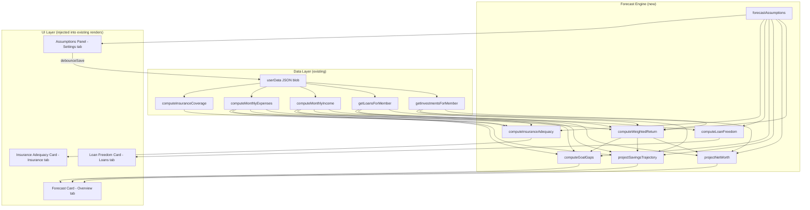

# Design Document: 15-Year Forecast + Suggestions

## Overview

This feature adds deterministic, formula-driven 15-year financial projections to FamLedgerAI, embedded within existing tabs (Overview, Loans, Insurance, Settings). All computation is client-side using data already present in `userData`. No new API endpoints or Supabase tables are introduced.

The feature consists of five projection modules and one configuration panel:

1. **Net Worth Projection Chart** — line chart on Overview tab showing year-by-year net worth
2. **Savings Trajectory** — togglable view on Overview tab showing income/expense/savings projections
3. **Goal Gap Analysis** — section on Overview tab comparing projected corpus against goal targets
4. **Loan Freedom Date** — card on Loans tab showing debt-free date with prepayment slider
5. **Insurance Adequacy Forecast** — card on Insurance tab showing coverage gaps at years 5/10/15
6. **Forecast Assumptions Panel** — editable settings in Settings tab (also accessible via ⚙️ button)

All modules share a single `ForecastEngine` computation layer that reads from `userData` and the configurable assumptions object at `userData.profile.forecastAssumptions`.

## Architecture



### Design Decisions

1. **Single computation module, not separate files**: Since the app is a single-file vanilla JS app (`index.html`), all forecast functions are added as top-level functions in the same `<script>` block. No module bundler or imports.

2. **No chart library dependency**: The net worth chart uses inline SVG `<polyline>` rendered directly in the DOM. This avoids adding Chart.js or similar dependencies to a zero-dependency app. Tooltips are CSS-positioned `<div>` elements shown on hover/tap.

3. **Inject into existing render functions**: Each tab's render function (`renderOverview`, `renderLoans`, `renderInsurance`, `renderSettings`) is extended to include forecast cards. No new tab or routing is needed.


4. **Assumptions stored in userData**: `userData.profile.forecastAssumptions` is persisted via the existing `debounceSave()` → Supabase pipeline. Defaults are applied when the object is missing.

5. **Per-member scoping via `currentProfile`**: All forecast computations respect the existing `currentProfile` selector. When `currentProfile === 'all'`, aggregate data is used.

6. **No memoization for forecast**: Forecast computations are triggered on render and on assumption change. Since the computation is O(15 × loans) at most, memoization is unnecessary.

## Components and Interfaces

### ForecastEngine Functions

```javascript
/**
 * Returns the forecast assumptions, falling back to defaults.
 * @returns {{ equityReturn: number, debtReturn: number, incomeGrowth: number,
 *             expenseInflation: number, medicalInflation: number }}
 */
function getForecastAssumptions()

/**
 * Computes the weighted annual return rate based on current investment mix.
 * weightedReturn = (equityReturn × equityAlloc) + (debtReturn × debtAlloc)
 * where equityAlloc = (MF + stocks value) / totalInvestments
 * @returns {number} e.g. 0.10 for 10%
 */
function computeWeightedReturn()

/**
 * Projects net worth for years 0..15.
 * netWorth[y] = investments[y] + liquidSavings - loanOutstanding[y]
 * investments[y] = (investments[y-1] + annualSavings[y]) * (1 + weightedReturn)
 * @returns {Array<{ year: number, investments: number, loanOutstanding: number,
 *                   liquidSavings: number, netWorth: number }>}
 */
function projectNetWorth()

/**
 * Projects income, expenses, EMI, savings, and cumulative corpus for years 0..15.
 * income[y] = baseIncome * (1 + incomeGrowth)^y
 * expenses[y] = baseExpenses * (1 + expenseInflation)^y
 * @returns {Array<{ year: number, income: number, expenses: number, emi: number,
 *                   savings: number, monthlySavings: number, corpus: number }>}
 */
function projectSavingsTrajectory()

/**
 * Amortizes a single loan month-by-month until outstanding reaches 0.
 * Uses standard amortization: interest = outstanding * monthlyRate,
 * principal = emi - interest.
 * @param {{ outstanding: number, emi: number, rate: number,
 *           tenureMonths?: number, paidMonths?: number }} loan
 * @returns {{ monthsRemaining: number,
 *             schedule: Array<{ month: number, outstanding: number, interestPaid: number }> }}
 */
function amortizeLoan(loan)

/**
 * Computes the debt-free date and per-loan payoff info.
 * Also computes the effect of extra monthly prepayment.
 * @param {number} [extraMonthly=0] Extra monthly payment spread across loans
 * @returns {{ debtFreeDate: { month: number, year: number },
 *             loans: Array<{ label: string, payoffMonth: number, payoffYear: number }>,
 *             totalInterest: number }}
 */
function computeLoanFreedom(extraMonthly)

/**
 * Maps goal labels to default targets and computes gaps.
 * goalGap = inflatedTarget - projectedCorpus
 * sipNeeded = PMT(FV=gap, r=monthlyWeightedReturn, n=monthsRemaining)
 * @returns {Array<{ goal: string, targetYear: number, targetAmount: number,
 *                   projectedCorpus: number, gap: number, sipNeeded: number,
 *                   status: 'green'|'yellow'|'red' }>}
 */
function computeGoalGaps()

/**
 * Computes recommended vs current insurance cover at years 5, 10, 15.
 * termRecommended = annualIncome * 12 * (1 + incomeGrowth)^year
 * healthRecommended = (10L + 2L/dependent) * (1 + medicalInflation)^year
 * @returns {{ term: Array<{ year: number, recommended: number, current: number, gap: number }>,
 *             health: Array<{ year: number, recommended: number, current: number, gap: number }>,
 *             dependentCount: number }}
 */
function computeInsuranceAdequacy()
```


### UI Rendering Functions

```javascript
/** Renders the Forecast Card (net worth chart + savings trajectory + goal gap)
 *  into the Overview tab, below existing KPI cards. Returns HTML string. */
function renderForecastCard()

/** Renders the Loan Freedom card at the top of the Loans tab. Returns HTML string. */
function renderLoanFreedomCard()

/** Renders the Insurance Adequacy Forecast card at the top of the Insurance tab. Returns HTML string. */
function renderInsuranceAdequacyCard()

/** Renders the Forecast Assumptions section in the Settings tab. Returns HTML string. */
function renderForecastAssumptions()
```

### Integration Points

- `renderOverview()`: Insert `renderForecastCard()` output after the KPI grid
- `renderLoans()`: Insert `renderLoanFreedomCard()` output before the loans table
- `renderInsurance()`: Insert `renderInsuranceAdequacyCard()` output before the insurance categories
- `renderSettings()`: Insert `renderForecastAssumptions()` output in the "self/all" view section

### Event Handlers

```javascript
/** Called when any assumption input changes. Updates userData, calls debounceSave(),
 *  invalidates computeCache, and re-renders all affected views. */
function onAssumptionChange(field, value)

/** Resets all assumptions to defaults and triggers re-render. */
function resetForecastDefaults()

/** Called when the prepayment slider changes on the Loan Freedom card.
 *  Recalculates and re-renders only the Loan Freedom card content. */
function onPrepaymentSliderChange(value)

/** Toggles between Net Worth chart and Savings Trajectory view within the Forecast Card. */
function toggleForecastView(view)
```

## Data Models

### Forecast Assumptions (persisted)

```javascript
// Stored at userData.profile.forecastAssumptions
// All values are percentages (e.g., 12 means 12%)
{
  equityReturn: 12,      // Long-term equity index return after expense ratio
  debtReturn: 7,         // FD/debt fund blended return
  incomeGrowth: 8,       // Annual salary increment rate
  expenseInflation: 6,   // CPI-based expense inflation
  medicalInflation: 10   // Healthcare cost inflation
}
```

### Default Assumptions (fallback)

```javascript
const FORECAST_DEFAULTS = {
  equityReturn: 12,
  debtReturn: 7,
  incomeGrowth: 8,
  expenseInflation: 6,
  medicalInflation: 10
};
```

### Goal Mapping Table

```javascript
// Maps goal labels from userData.profile.goals to target amounts and years
const GOAL_DEFAULTS = {
  'retirement':      { multiplier: 300, yearsFromAge: 60 },  // 300x monthly expenses at age 60
  'child-education': { amount: 5000000, yearsFromNow: 18 },  // 50L in 18 years
  'house':           { amount: 10000000, yearsFromNow: 5 },   // 1Cr in 5 years
  'car':             { amount: 1500000, yearsFromNow: 3 },    // 15L in 3 years
  'emergency':       { multiplier: 6, yearsFromNow: 1 },      // 6x monthly expenses in 1 year
  'travel':          { amount: 500000, yearsFromNow: 2 }       // 5L in 2 years
};
```


### Net Worth Projection Output

```javascript
// Array of 16 entries (year 0 through year 15)
[{
  year: 0,                 // 0 = current
  investments: number,     // Total investment value at year-end
  loanOutstanding: number, // Total remaining loan balance
  liquidSavings: number,   // Unchanged (not projected to grow)
  netWorth: number         // investments + liquidSavings - loanOutstanding
}]
```

### Savings Trajectory Output

```javascript
// Array of 16 entries (year 0 through year 15)
[{
  year: 0,
  income: number,          // Projected annual income
  expenses: number,        // Projected annual expenses
  emi: number,             // Projected annual EMI (0 after loan payoff)
  savings: number,         // income - expenses - emi
  monthlySavings: number,  // savings / 12
  corpus: number           // Cumulative investment corpus
}]
```

### Loan Freedom Output

```javascript
{
  debtFreeDate: { month: 3, year: 2031 },
  loans: [{
    label: 'Home Loan',
    payoffMonth: 3,
    payoffYear: 2031,
    totalInterest: 1200000,
    monthsRemaining: 72
  }],
  totalInterest: 1500000,
  // With prepayment:
  newDebtFreeDate: { month: 9, year: 2029 },
  interestSaved: 350000,
  monthsSaved: 18
}
```

### Goal Gap Output

```javascript
[{
  goal: 'retirement',
  targetYear: 2049,          // Calendar year
  yearsAway: 25,
  targetAmount: 30000000,    // Inflation-adjusted
  projectedCorpus: 22000000,
  gap: 8000000,              // Positive = shortfall, negative = surplus
  sipNeeded: 12500,          // Monthly SIP to close gap (0 if surplus)
  status: 'red'              // 'green' | 'yellow' | 'red'
}]
```

### Insurance Adequacy Output

```javascript
{
  term: [
    { year: 5,  recommended: 18000000, current: 10000000, gap: 8000000 },
    { year: 10, recommended: 26000000, current: 10000000, gap: 16000000 },
    { year: 15, recommended: 38000000, current: 10000000, gap: 28000000 }
  ],
  health: [
    { year: 5,  recommended: 2600000, current: 1000000, gap: 1600000 },
    { year: 10, recommended: 4200000, current: 1000000, gap: 3200000 },
    { year: 15, recommended: 6700000, current: 1000000, gap: 5700000 }
  ],
  dependentCount: 3
}
```


## Correctness Properties

*A property is a characteristic or behavior that should hold true across all valid executions of a system — essentially, a formal statement about what the system should do. Properties serve as the bridge between human-readable specifications and machine-verifiable correctness guarantees.*

### Property 1: Net Worth Identity

*For any* set of investment values, liquid savings amount, and loan outstanding amounts, and for each projected year 0..15, the net worth at that year must equal `investments[y] + liquidSavings - loanOutstanding[y]`.

**Validates: Requirements 1.2**

### Property 2: Weighted Return Formula

*For any* investment mix containing mutual funds, stocks, FDs, and PPF with non-negative values (where total investments > 0), and any equity return rate and debt return rate in [0, 30], the computed weighted return must equal `(equityReturn * equityAlloc) + (debtReturn * debtAlloc)` where `equityAlloc = (MF + stocks) / total` and `debtAlloc = (FD + PPF) / total`.

**Validates: Requirements 1.3**

### Property 3: Loan Amortization Correctness

*For any* loan with positive outstanding balance, positive EMI (where EMI > monthly interest), and interest rate in [0, 30]%, the amortization schedule must produce a monotonically non-increasing outstanding balance that eventually reaches zero, and the payoff month is the first month where outstanding <= 0.

**Validates: Requirements 1.4, 4.2**

### Property 4: Compound Growth Projections

*For any* base amount > 0 and annual growth rate in [0, 30]%, the projected value at year `y` must equal `base * (1 + rate/100)^y`. This applies to both income projections (using incomeGrowth) and expense projections (using expenseInflation).

**Validates: Requirements 2.2, 2.3**

### Property 5: Savings Formula

*For any* projected annual income, annual expenses, and annual EMI (all non-negative), the projected monthly savings must equal `(income - expenses - emi) / 12`.

**Validates: Requirements 2.4**

### Property 6: Corpus Compounding Recurrence

*For any* initial corpus >= 0, sequence of annual savings, and weighted return rate in [0, 30]%, the corpus at year `y` must equal `(corpus[y-1] + annualSavings[y]) * (1 + weightedReturn)`.

**Validates: Requirements 2.5**

### Property 7: Goal Mapping Produces Valid Outputs

*For any* known goal label from the supported set (retirement, child-education, house, car, emergency, travel), any user age in [18, 70], and any monthly income > 0, the goal mapping must produce a target amount > 0 and a target year that is in the future (or current year).

**Validates: Requirements 3.1**

### Property 8: Goal Gap Formula

*For any* target amount > 0, expense inflation rate in [0, 30]%, target year offset in [1, 40], and projected corpus >= 0, the goal gap must equal `targetAmount * (1 + inflationRate/100)^yearsAway - projectedCorpus`.

**Validates: Requirements 3.2**

### Property 9: Goal Color Coding

*For any* goal with a computed gap and target amount > 0: status is `green` when gap <= 0 (surplus), `yellow` when 0 < gap <= 0.20 * targetAmount, and `red` when gap > 0.20 * targetAmount.

**Validates: Requirements 3.4**

### Property 10: PMT Round-Trip

*For any* positive gap amount, monthly weighted return rate > 0, and months remaining > 0, the SIP amount computed by `PMT = FV * r / ((1+r)^n - 1)` when compounded monthly at rate `r` for `n` months must produce a future value within 1% of the original gap (allowing for floating-point tolerance).

**Validates: Requirements 3.5**

### Property 11: Goals Sorted by Gap, Max 5

*For any* list of goals with computed gaps, the displayed list must be sorted in descending order by gap size and contain at most 5 entries.

**Validates: Requirements 3.6**

### Property 12: Debt-Free Date is Maximum Payoff

*For any* set of active loans with computed payoff dates, the overall debt-free date must equal the latest (maximum) payoff date among all loans.

**Validates: Requirements 4.3**

### Property 13: Prepayment Monotonically Reduces Debt-Free Date

*For any* set of active loans and any two extra monthly payment amounts `a < b` (both >= 0), the debt-free date with prepayment `b` must be earlier than or equal to the debt-free date with prepayment `a`, and the interest saved with `b` must be greater than or equal to the interest saved with `a`.

**Validates: Requirements 4.6**

### Property 14: Term Cover Recommendation Formula

*For any* annual income > 0, income growth rate in [0, 30]%, and checkpoint year in {5, 10, 15}, the recommended term cover must equal `annualIncome * 12 * (1 + incomeGrowth/100)^year`.

**Validates: Requirements 5.2**

### Property 15: Health Cover Recommendation Formula

*For any* dependent count >= 0, medical inflation rate in [0, 30]%, and checkpoint year in {5, 10, 15}, the recommended health cover must equal `(1000000 + 200000 * dependentCount) * (1 + medicalInflation/100)^year`.

**Validates: Requirements 5.3**

### Property 16: Current Cover is Static Across Projection Years

*For any* insurance adequacy output, the "current cover" value for term insurance must be identical at years 5, 10, and 15, and the "current cover" value for health insurance must be identical at years 5, 10, and 15.

**Validates: Requirements 5.5**

### Property 17: Insurance Color Coding

*For any* recommended cover and current cover (both >= 0), the row is `green` when `current >= recommended` and `red` when `current < recommended`.

**Validates: Requirements 5.6**

### Property 18: Assumption Persistence Round-Trip

*For any* valid assumption field (equityReturn, debtReturn, incomeGrowth, expenseInflation, medicalInflation) and any value in [0, 30], after calling `onAssumptionChange(field, value)`, reading `userData.profile.forecastAssumptions[field]` must return the same value.

**Validates: Requirements 6.5**


## Error Handling

| Scenario | Handling |
|---|---|
| `userData.profile.forecastAssumptions` is missing | Fall back to `FORECAST_DEFAULTS` (12, 7, 8, 6, 10). Do not throw. |
| Total investments = 0 | Set `equityAlloc = 0.5`, `debtAlloc = 0.5` as balanced default for weighted return. |
| No loans exist for current profile | Loan Freedom card shows "No active loans — you're already debt-free!" message. |
| Loan EMI <= monthly interest (never pays off) | Cap amortization at 360 months. Display warning about insufficient EMI. |
| No goals in `userData.profile.goals` | Goal Gap section shows "No goals set. Add goals in Settings." |
| Goal label not in `GOAL_DEFAULTS` mapping | Skip unknown goals silently. |
| Goal target year exceeds 15-year horizon | Use year-15 projected corpus. Display note about target beyond forecast. |
| `computeMonthlyIncome()` returns 0 | Income projections show 0. Insurance term recommendation shows "Insufficient income data." |
| `computeInsuranceCoverage()` returns 0 for both covers | All insurance rows show red with full gap = recommended. |
| Assumption value negative or > 50 | Clamp to [0, 50] range before saving. Show inline validation. |
| `userData.profile.age` is missing | Default to 30 for goal year calculations. |
| `userData.profile.familyMembers` is empty | Default dependent count to 0 for health cover calculation. |

## Testing Strategy

### Property-Based Testing

Use **fast-check** (JavaScript property-based testing library) for all correctness properties. Each property test runs a minimum of 100 iterations with randomly generated inputs.

Each test must be tagged with a comment referencing the design property:
```
// Feature: fifteen-year-forecast, Property N: <property title>
```

Property tests validate the ForecastEngine functions in isolation (pure computation, no DOM):

| Property | Function Under Test | Generator Strategy |
|---|---|---|
| P1: Net Worth Identity | `projectNetWorth()` | Random investments [0, 1Cr], liquid [0, 50L], loans [0, 50L] |
| P2: Weighted Return | `computeWeightedReturn()` | Random MF/stocks/FD/PPF values [0, 50L] each |
| P3: Loan Amortization | `amortizeLoan()` | Random outstanding [1L, 1Cr], EMI [5K, 2L], rate [1, 20]% |
| P4: Compound Growth | Direct formula check | Random base [1K, 1Cr], rate [0, 30]%, year [0, 15] |
| P5: Savings Formula | `projectSavingsTrajectory()` | Random income/expenses/EMI [0, 50L] |
| P6: Corpus Compounding | `projectSavingsTrajectory()` | Random initial corpus [0, 1Cr], savings [0, 50L], rate [0, 30]% |
| P7: Goal Mapping | `computeGoalGaps()` | Random age [18, 70], income [10K, 10L], each goal label |
| P8: Goal Gap | `computeGoalGaps()` | Random target [1L, 10Cr], inflation [0, 30]%, corpus [0, 10Cr] |
| P9: Goal Color Coding | `computeGoalGaps()` | Random gap [-1Cr, 1Cr], target [1L, 10Cr] |
| P10: PMT Round-Trip | PMT formula function | Random FV [1L, 5Cr], rate [0.5, 2]% monthly, months [12, 360] |
| P11: Goals Sorted | `computeGoalGaps()` | Random list of 1-8 goals with random gaps |
| P12: Debt-Free Max | `computeLoanFreedom()` | Random set of 1-5 loans with varying tenures |
| P13: Prepayment Monotonic | `computeLoanFreedom()` | Random loans + two random extra amounts where a < b |
| P14: Term Cover | `computeInsuranceAdequacy()` | Random income [1L, 1Cr], growth [0, 30]% |
| P15: Health Cover | `computeInsuranceAdequacy()` | Random dependents [0, 6], inflation [0, 30]% |
| P16: Static Current Cover | `computeInsuranceAdequacy()` | Random current term/health cover values |
| P17: Insurance Color | `computeInsuranceAdequacy()` | Random recommended/current pairs |
| P18: Assumption Round-Trip | `onAssumptionChange()` | Random field name, random value [0, 30] |

### Unit Testing

Unit tests complement property tests by covering specific examples and edge cases:

- **Default assumptions fallback**: When `forecastAssumptions` is undefined, verify exact default values (12, 7, 8, 6, 10)
- **Reset to defaults**: After modifying assumptions, `resetForecastDefaults()` restores exact defaults
- **Zero investments**: Weighted return uses 50/50 default allocation
- **No loans**: Loan Freedom shows debt-free message, net worth has 0 loan outstanding for all years
- **EMI < monthly interest**: Amortization caps at 360 months with warning
- **Goal target beyond 15 years**: Uses year-15 corpus for comparison
- **Empty goals array**: Goal gap section returns empty array
- **Single loan payoff**: Verify exact payoff month for a known loan (e.g., 10L at 10% with 20K EMI)
- **Insurance with 0 dependents**: Health cover base is 10L only
- **Assumption clamping**: Values < 0 clamped to 0, values > 50 clamped to 50
