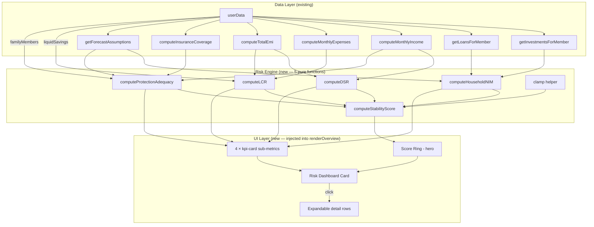

# Design Document: Financial Risk Layer (Phase 1)

## Overview

This feature adds a Phase-1 risk assessment dashboard to FamLedgerAI, computing five banking-style risk metrics client-side using existing `userData` and Forecast_Engine accessors. The five metrics are:

1. **Household NIM** — spread between weighted investment yield and weighted borrowing cost
2. **Debt Service Ratio (DSR)** — percentage of gross income consumed by EMIs
3. **Liquidity Coverage Ratio (LCR)** — liquid savings vs. 6-month expense benchmark
4. **Protection Adequacy** — insurance coverage vs. recommended benchmarks
5. **Financial Stability Score** — composite weighted score (0–100) combining all four sub-metrics

All computation is deterministic, pure-functional, and performed in vanilla JS within the existing `famledgerai/index.html` single-file architecture. No external libraries, no API calls, no database changes.

The UI renders as a single "Risk Dashboard" card on the Overview tab, positioned below the existing Forecast Card, using the app's existing `card`, `kpi-card`, `score-ring-svg`, `sh()`, `fl()`, and `$()` patterns.

## Architecture



### Design Decisions

1. **Five pure computation functions**: Each risk metric is a standalone function that takes no arguments and reads from existing accessors (`computeMonthlyIncome()`, `getInvestmentsForMember(currentProfile)`, etc.). This mirrors the existing pattern used by `computeHealthScore()`, `computeEmergencyRatio()`, and other Financial Engine functions.

2. **Memoization via `computeCache`**: All five risk functions use the existing `computeCache.get(key, fn)` pattern. The cache is already invalidated on profile switch, data edit, and assumption change via `debounceSave()` → `computeCache.invalidate()`. No new invalidation wiring needed.

3. **Inject into `renderOverview()`**: The Risk Dashboard HTML is appended inside `renderOverview()` after the existing Forecast Card section, before the Priority Actions / Health Indicators grid. This follows the same pattern used by the 15-year forecast feature.

4. **No new CSS classes**: The dashboard reuses existing `card`, `kpi-card`, `score-ring-svg`, `score-wrap`, `score-center`, `score-num`, `row-flex`, `row-label`, `row-value`, `alert-dot`, and RAG color variables (`--green`, `--yellow`, `--red`). Only minimal inline styles are added for the expandable detail rows.

5. **RAG classification as a shared helper**: A single `ragStatus(value, thresholds)` helper returns `{color, label}` to avoid duplicating threshold logic across metrics. Each metric passes its own threshold config.

6. **Expandable detail rows via event delegation**: Click handlers on sub-metric rows toggle a hidden `<div>` with formula, inputs, and plain-language explanation. Uses `onclick` inline handlers consistent with the existing codebase (no `addEventListener` pattern).

7. **`clamp` as a named utility**: `clamp(min, max, value)` is defined once and reused across all normalization formulas in `computeStabilityScore()`.

## Components and Interfaces

### Risk Engine Functions

All functions are top-level in the `<script>` block, following the existing Financial Engine pattern.

```javascript
// ========== RISK ENGINE ==========

/**
 * clamp(min, max, value) — bounds a value within [min, max]
 * Used by computeStabilityScore for normalization
 */
function clamp(min, max, value) {
    return Math.max(min, Math.min(max, value));
}

/**
 * computeHouseholdNIM() → { nim, weightedYield, weightedCost, rag }
 * 
 * Reads: getInvestmentsForMember(currentProfile), getLoansForMember(currentProfile),
 *        getForecastAssumptions()
 * 
 * Weighted_Yield = Σ(inv_i.value × returnRate_i) / Σ(inv_i.value)
 *   - Equity instruments (mutualFunds, stocks) use equityReturn
 *   - Debt instruments (fd, ppf) use debtReturn
 *   - If no investments → 0
 * 
 * Weighted_Cost = Σ(loan_i.outstanding × loan_i.rate) / Σ(loan_i.outstanding)
 *   - If no loans → 0
 * 
 * NIM = Weighted_Yield − Weighted_Cost (percentage)
 * RAG: green ≥ 2%, yellow ≥ 0% & < 2%, red < 0%
 */
function computeHouseholdNIM() { /* ... */ }

/**
 * computeDSR() → { dsr, totalEmi, monthlyIncome, rag }
 * 
 * Reads: computeTotalEmi(), computeMonthlyIncome()
 * 
 * DSR = (totalEmi / monthlyIncome) × 100
 *   - If income = 0 and EMIs exist → DSR = 100
 *   - If income = 0 and no EMIs → DSR = 0
 * RAG: green ≤ 35%, yellow > 35% & ≤ 50%, red > 50%
 */
function computeDSR() { /* ... */ }

/**
 * computeLCR() → { lcr, monthsCoverage, liquidSavings, monthlyExpenses, rag }
 * 
 * Reads: userData.liquidSavings, computeMonthlyExpenses(), computeTotalEmi()
 * 
 * LCR = liquidSavings / (monthlyExpenses × 6)
 * monthsCoverage = liquidSavings / (monthlyExpenses + totalEmi)
 *   - If expenses = 0 and liquid > 0 → LCR = 1.0
 *   - If expenses = 0 and liquid = 0 → LCR = 0
 * RAG: green ≥ 1.0, yellow ≥ 0.5 & < 1.0, red < 0.5
 */
function computeLCR() { /* ... */ }

/**
 * computeProtectionAdequacy() → { ratio, termAdequacy, healthAdequacy, 
 *                                  termCover, healthCover, termBenchmark,
 *                                  healthBenchmark, dependentCount, rag }
 * 
 * Reads: computeInsuranceCoverage(), computeMonthlyIncome(),
 *        getForecastAssumptions(), userData.profile.familyMembers
 * 
 * termAdequacy = termCover / (monthlyIncome × 12 × 12)
 *   - If income = 0 → termAdequacy = 1.0
 * healthBenchmark = (10,00,000 + 2,00,000 × dependentCount) × (1 + medicalInflation)^5
 * healthAdequacy = healthCover / healthBenchmark
 * ratio = (termAdequacy + healthAdequacy) / 2
 * RAG: green ≥ 0.8, yellow ≥ 0.5 & < 0.8, red < 0.5
 */
function computeProtectionAdequacy() { /* ... */ }

/**
 * computeStabilityScore() → { score, nimScore, dsrScore, lcrScore, protScore,
 *                              topRisk, suggestion, rag }
 * 
 * Reads: computeHouseholdNIM(), computeDSR(), computeLCR(), computeProtectionAdequacy()
 * 
 * Normalization (each to 0–100):
 *   nimScore  = clamp(0, 100, 50 + NIM × 25)
 *   dsrScore  = clamp(0, 100, 100 − DSR × 2)
 *   lcrScore  = clamp(0, 100, LCR × 100)
 *   protScore = clamp(0, 100, avgProtectionRatio × 100)
 * 
 * Stability_Score = round(DSR×0.30 + LCR×0.25 + NIM×0.20 + Protection×0.25)
 * topRisk = sub-metric with lowest normalized score
 * suggestion = actionable string based on topRisk
 * RAG: green 75–100, yellow 50–74, red 0–49
 */
function computeStabilityScore() { /* ... */ }
```

### Risk Dashboard UI

The dashboard is rendered by a `renderRiskDashboard()` function called from within `renderOverview()`.

```javascript
/**
 * renderRiskDashboard() → HTML string
 * 
 * Returns the complete Risk Dashboard card HTML.
 * Called inside renderOverview() and its output is concatenated
 * into the page-overview innerHTML.
 * 
 * Structure:
 *   <div class="card">                          ← Risk Dashboard container
 *     <div class="card-title">                  ← "📊 Financial Risk Dashboard"
 *     <div style="display:flex">                ← Hero row
 *       <div class="score-wrap">                ← Score ring (reuses score-ring-svg)
 *         <svg class="score-ring-svg">          ← Ring with RAG-colored stroke
 *         <div class="score-center">            ← Score number + label
 *       </div>
 *       <div>                                   ← Top risk + suggestion
 *     </div>
 *     <div class="grid-4">                      ← 4 × kpi-card sub-metrics
 *       <div class="kpi-card {rag}">            ← NIM
 *       <div class="kpi-card {rag}">            ← DSR
 *       <div class="kpi-card {rag}">            ← LCR
 *       <div class="kpi-card {rag}">            ← Protection
 *     </div>
 *     <div id="risk-detail-nim" hidden>         ← Expandable: NIM formula + explanation
 *     <div id="risk-detail-dsr" hidden>         ← Expandable: DSR formula + explanation
 *     <div id="risk-detail-lcr" hidden>         ← Expandable: LCR formula + explanation
 *     <div id="risk-detail-prot" hidden>        ← Expandable: Protection formula + explanation
 *   </div>
 */
function renderRiskDashboard() { /* ... */ }
```

### Integration with renderOverview()

```javascript
// Inside renderOverview(), after the Forecast Card section:
// ... existing forecast card HTML ...

// Risk Dashboard — injected below forecast card
const riskHtml = renderRiskDashboard();

// The riskHtml string is concatenated into the sh('page-overview', `...`) template
// positioned after the forecast card and before the grid-2 (Priority Actions / Health Indicators)
```

### Re-render Wiring

No new event wiring is needed. The existing mechanisms already trigger `renderOverview()`:

| Trigger | Mechanism | Path |
|---------|-----------|------|
| Profile switch | `$('profileSelect').addEventListener('change', ...)` → `renderCurrentPage()` → `renderOverview()` | Existing |
| Data edit | `debounceSave()` → `computeCache.invalidate()` → next `renderOverview()` call | Existing |
| Assumption change | `updateForecastAssumption()` → `debounceSave()` → `refreshForecastViews()` → `renderOverview()` | Existing |
| Page navigation | `renderCurrentPage()` → `renderOverview()` | Existing |

Since all Risk Engine functions use `computeCache`, they automatically pick up fresh data after any invalidation.

### Expandable Detail Row Toggle

```javascript
/**
 * toggleRiskDetail(metricId) — toggles visibility of the detail row
 * Called via onclick on kpi-card elements
 * metricId: 'nim' | 'dsr' | 'lcr' | 'prot'
 */
window.toggleRiskDetail = function(metricId) {
    const el = $('risk-detail-' + metricId);
    if (el) el.hidden = !el.hidden;
};
```

## Data Models

### Risk Engine Return Types

Each computation function returns a plain object. No new classes or prototypes.

```javascript
// computeHouseholdNIM() return shape
{
    nim: Number,           // e.g. 3.5 (percentage points)
    weightedYield: Number, // e.g. 10.2 (percentage)
    weightedCost: Number,  // e.g. 6.7 (percentage)
    rag: String            // 'green' | 'yellow' | 'red'
}

// computeDSR() return shape
{
    dsr: Number,           // e.g. 42.5 (percentage)
    totalEmi: Number,      // e.g. 35000 (₹)
    monthlyIncome: Number, // e.g. 82000 (₹)
    rag: String            // 'green' | 'yellow' | 'red'
}

// computeLCR() return shape
{
    lcr: Number,              // e.g. 0.75 (ratio)
    monthsCoverage: Number,   // e.g. 4.5 (months)
    liquidSavings: Number,    // e.g. 300000 (₹)
    monthlyExpenses: Number,  // e.g. 55000 (₹)
    rag: String               // 'green' | 'yellow' | 'red'
}

// computeProtectionAdequacy() return shape
{
    ratio: Number,            // e.g. 0.65 (average of term + health adequacy)
    termAdequacy: Number,     // e.g. 0.8
    healthAdequacy: Number,   // e.g. 0.5
    termCover: Number,        // e.g. 7500000 (₹)
    healthCover: Number,      // e.g. 1000000 (₹)
    termBenchmark: Number,    // e.g. 9360000 (₹) — 12× annual income
    healthBenchmark: Number,  // e.g. 2357948 (₹) — inflation-adjusted
    dependentCount: Number,   // e.g. 3
    rag: String               // 'green' | 'yellow' | 'red'
}

// computeStabilityScore() return shape
{
    score: Number,        // 0–100, integer
    nimScore: Number,     // 0–100, normalized NIM sub-score
    dsrScore: Number,     // 0–100, normalized DSR sub-score
    lcrScore: Number,     // 0–100, normalized LCR sub-score
    protScore: Number,    // 0–100, normalized Protection sub-score
    topRisk: String,      // 'dsr' | 'lcr' | 'nim' | 'protection'
    suggestion: String,   // actionable one-liner
    rag: String           // 'green' | 'yellow' | 'red'
}
```

### Existing Data Structures Referenced

```javascript
// userData.investments.byMember[memberId] (from getInvestmentsForMember)
{
    mutualFunds: [{ name, value, ... }],  // equity
    stocks: [{ name, value, ... }],       // equity
    fd: [{ name, value, ... }],           // debt
    ppf: [{ name, value, ... }]           // debt
}

// getLoansForMember(memberId) → Array
[{ label, outstanding, emi, rate, ... }]

// computeInsuranceCoverage() → { termCover: Number, healthCover: Number }

// getForecastAssumptions() → 
{ equityReturn: 12, debtReturn: 7, incomeGrowth: 8, expenseInflation: 6, medicalInflation: 10 }

// userData.profile.familyMembers → [{ id, name, role }]
// userData.liquidSavings → Number
```

### RAG Threshold Configuration

Thresholds are defined as constants within each computation function (not externalized) for simplicity and auditability:

| Metric | Green | Yellow | Red |
|--------|-------|--------|-----|
| NIM | ≥ 2% | ≥ 0% and < 2% | < 0% |
| DSR | ≤ 35% | > 35% and ≤ 50% | > 50% |
| LCR | ≥ 1.0 | ≥ 0.5 and < 1.0 | < 0.5 |
| Protection | ≥ 0.8 | ≥ 0.5 and < 0.8 | < 0.5 |
| Stability Score | 75–100 | 50–74 | 0–49 |

## Correctness Properties

*A property is a characteristic or behavior that should hold true across all valid executions of a system — essentially, a formal statement about what the system should do. Properties serve as the bridge between human-readable specifications and machine-verifiable correctness guarantees.*

### Property 1: NIM computation correctness

*For any* set of investments (each with a positive value and an equity/debt type) and any set of loans (each with a positive outstanding balance and interest rate), the computed NIM must equal the weighted average of investment return rates (using `equityReturn` for mutualFunds/stocks and `debtReturn` for fd/ppf) minus the weighted average of loan interest rates. When investments are empty, weighted yield must be 0. When loans are empty, weighted cost must be 0.

**Validates: Requirements 1.1, 1.3, 1.5**

### Property 2: DSR computation correctness

*For any* positive monthly income and non-negative total EMI, the computed DSR must equal `(totalEmi / monthlyIncome) × 100`. When income is zero and EMIs exist, DSR must be 100. When income is zero and no EMIs exist, DSR must be 0.

**Validates: Requirements 2.1, 2.2**

### Property 3: LCR and months-of-coverage computation correctness

*For any* non-negative liquid savings, non-negative monthly expenses, and non-negative total EMI, the computed LCR must equal `liquidSavings / (monthlyExpenses × 6)` and months of coverage must equal `liquidSavings / (monthlyExpenses + totalEmi)`. When expenses are zero and liquid savings are positive, LCR must be 1.0. When both are zero, LCR must be 0.

**Validates: Requirements 3.1, 3.2, 3.3**

### Property 4: Protection adequacy computation correctness

*For any* non-negative term cover, health cover, monthly income, dependent count (≥ 0), and medical inflation rate (0–100%), the computed protection adequacy must equal the average of `termCover / (monthlyIncome × 144)` and `healthCover / ((1000000 + 200000 × dependentCount) × (1 + medicalInflation/100)^5)`. When income is zero, term adequacy must be 1.0.

**Validates: Requirements 4.1, 4.2, 4.3, 4.4, 4.6**

### Property 5: RAG classification correctness

*For any* numeric metric value, the RAG classification must match the defined thresholds: NIM (green ≥ 2, yellow ≥ 0, red < 0), DSR (green ≤ 35, yellow ≤ 50, red > 50), LCR (green ≥ 1.0, yellow ≥ 0.5, red < 0.5), Protection (green ≥ 0.8, yellow ≥ 0.5, red < 0.5), Stability Score (green ≥ 75, yellow ≥ 50, red < 50).

**Validates: Requirements 1.6, 2.3, 3.4, 4.5, 5.4**

### Property 6: Clamp output bounds

*For any* min, max (where min ≤ max), and any numeric value, `clamp(min, max, value)` must return a result in the closed interval [min, max].

**Validates: Requirements 5.7**

### Property 7: Stability score normalization and weighted composition

*For any* NIM (percentage), DSR (percentage), LCR (ratio), and protection adequacy ratio, the normalized sub-scores must each be in [0, 100], and the composite stability score must equal `round(dsrScore × 0.30 + lcrScore × 0.25 + nimScore × 0.20 + protScore × 0.25)` where each sub-score uses the specified normalization formula. The result must be an integer in [0, 100].

**Validates: Requirements 5.1, 5.2, 5.3**

### Property 8: Top risk identification

*For any* four normalized sub-scores (nimScore, dsrScore, lcrScore, protScore), the identified top risk must correspond to the sub-metric with the strictly lowest score. When multiple sub-metrics tie for the lowest, any one of them is acceptable.

**Validates: Requirements 5.5**

### Property 9: Weighted composition round-trip

*For any* four normalized sub-scores in [0, 100], computing the stability score as `round(dsr×0.30 + lcr×0.25 + nim×0.20 + prot×0.25)` and then decomposing it back into `(score × weight_i)` for each component must produce values whose sum equals the original stability score (within rounding tolerance of ±1).

**Validates: Requirements 5.8**

### Property 10: Idempotence of risk computation

*For any* valid `userData` state, computing all five risk metrics and then recomputing them with the same unchanged input must produce identical results for every field in every return object.

**Validates: Requirements 7.2, 7.7**

### Property 11: Missing input resilience

*For any* `userData` state where one or more input fields (liquidSavings, income, investments, loans, insurance, familyMembers, forecastAssumptions) are undefined or missing, the Risk Engine must not throw an error and must produce numeric results for all five metrics, falling back to zero for missing values.

**Validates: Requirements 7.6**

## Error Handling

All error handling follows a defensive, fail-safe approach consistent with the existing Financial Engine pattern:

| Scenario | Handling | Fallback |
|----------|----------|----------|
| Missing `userData.liquidSavings` | `userData.liquidSavings \|\| 0` | 0 |
| Missing `userData.profile.familyMembers` | `userData.profile.familyMembers \|\| []` | Empty array → dependentCount = 0 |
| Missing `forecastAssumptions` fields | `getForecastAssumptions()` already merges with defaults | Default rates (equity 12%, debt 7%, medical 10%) |
| `computeMonthlyIncome()` returns 0 | DSR: 100 if EMIs exist, 0 otherwise. Protection: termAdequacy = 1.0 | Documented in each function |
| `computeMonthlyExpenses()` returns 0 | LCR: 1.0 if liquid > 0, 0 otherwise | Documented in function |
| Empty investment array | Weighted yield = 0 | NIM = −weightedCost |
| Empty loan array | Weighted cost = 0 | NIM = weightedYield |
| Division by zero | Guarded by checking denominator before division | Returns documented fallback |
| `undefined` or `NaN` in investment/loan values | `(value \|\| 0)` pattern on each field access | 0 |
| `computeCache` stale | Cache invalidated by existing `debounceSave()` mechanism | Fresh computation on next access |

No `try/catch` blocks are used. All edge cases are handled by explicit guards and the `|| 0` pattern, consistent with the existing codebase style.

## Testing Strategy

### Dual Testing Approach

Testing uses both unit tests and property-based tests for comprehensive coverage:

- **Property-based tests**: Verify the 11 correctness properties above using randomized inputs. Each property test runs a minimum of 100 iterations with generated data.
- **Unit tests**: Verify specific examples, edge cases (empty arrays, zero income, zero expenses), and the suggestion string mapping.

### Property-Based Testing Configuration

- **Library**: [fast-check](https://github.com/dubzzz/fast-check) — the standard PBT library for JavaScript
- **Minimum iterations**: 100 per property test
- **Test runner**: The project's existing test infrastructure (or a simple HTML test harness if none exists)
- **Tag format**: Each property test includes a comment referencing the design property:
  ```javascript
  // Feature: financial-risk-layer, Property 1: NIM computation correctness
  ```

### Test Structure

Since the app is a single-file vanilla JS architecture, the Risk Engine functions are testable by:
1. Extracting the pure computation functions into a testable scope
2. Mocking `userData`, `currentProfile`, and the accessor functions
3. Running fast-check properties against the mocked functions

### Unit Test Coverage

| Test | What it verifies |
|------|-----------------|
| NIM with known portfolio | Specific example: 2 MFs + 1 FD + 1 loan → expected NIM |
| DSR with zero income, no EMIs | Edge case: DSR = 0 |
| DSR with zero income, has EMIs | Edge case: DSR = 100 |
| LCR with zero expenses, positive savings | Edge case: LCR = 1.0 |
| LCR with zero expenses, zero savings | Edge case: LCR = 0 |
| Protection with zero income | Edge case: termAdequacy = 1.0 |
| Stability score suggestion mapping | Example: each of 4 top-risk values → non-empty suggestion |
| All metrics with completely empty userData | Edge case: no crashes, all numeric |

### Property Test Coverage

Each of the 11 correctness properties maps to exactly one property-based test:

| Property | Generator strategy |
|----------|-------------------|
| P1: NIM | Random arrays of investments (value ∈ [0, 1e8], type ∈ {equity, debt}) and loans (outstanding ∈ [0, 1e8], rate ∈ [0, 30]) |
| P2: DSR | Random income ∈ [0, 1e7], EMI ∈ [0, 1e6] |
| P3: LCR | Random liquidSavings ∈ [0, 1e8], expenses ∈ [0, 1e6], EMI ∈ [0, 1e6] |
| P4: Protection | Random termCover ∈ [0, 5e7], healthCover ∈ [0, 1e7], income ∈ [0, 1e7], dependents ∈ [0, 10], medInflation ∈ [0, 30] |
| P5: RAG | Random metric values across full numeric range for each metric type |
| P6: Clamp | Random min ∈ [-1e6, 1e6], max ∈ [min, min+1e6], value ∈ [-1e7, 1e7] |
| P7: Stability | Random NIM ∈ [-10, 20], DSR ∈ [0, 100], LCR ∈ [0, 3], protection ∈ [0, 2] |
| P8: Top risk | Random 4-tuple of scores ∈ [0, 100] |
| P9: Round-trip | Random 4-tuple of normalized scores ∈ [0, 100] |
| P10: Idempotence | Random userData blobs with varying field presence |
| P11: Missing input | Random userData with fields randomly set to undefined |
