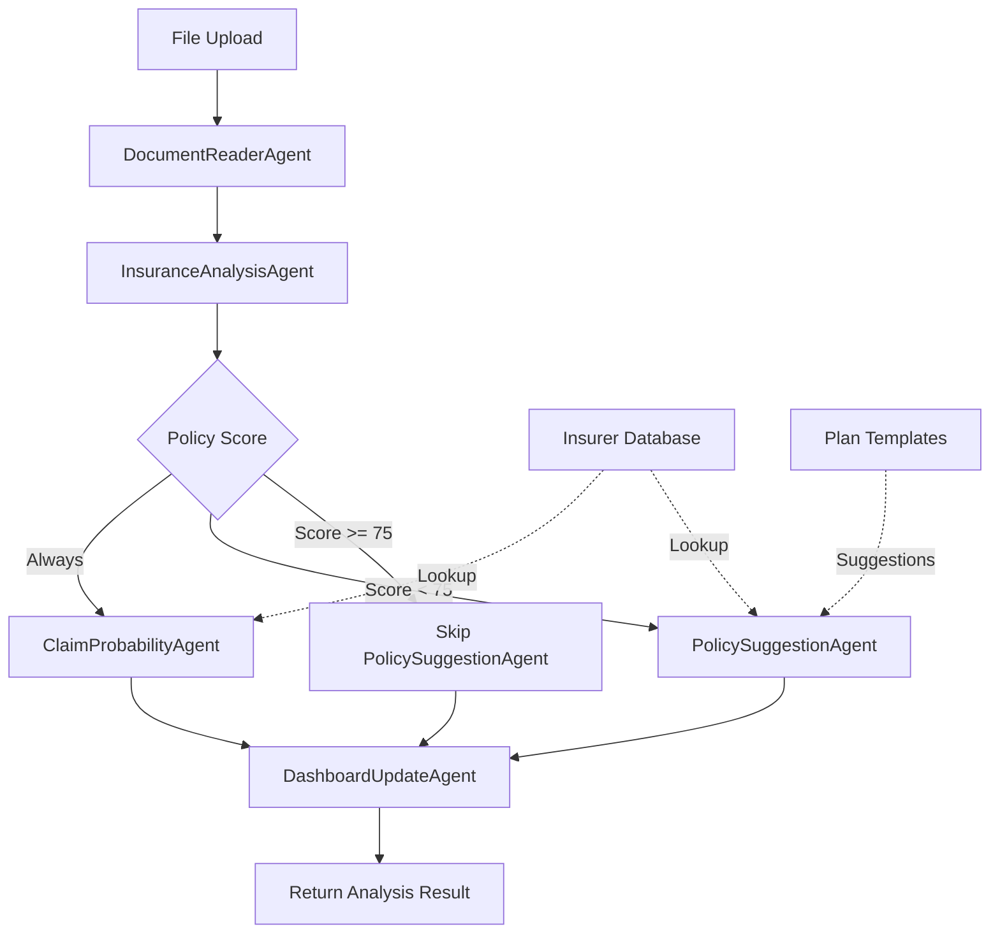

# Design Document: Insurance AI Comprehensive Upgrade

## Overview

This design specifies the comprehensive upgrade of the Insurance AI system to support analysis of 14+ major Indian insurers, claim probability prediction, and intelligent policy suggestions. The system expands from a 3-agent pipeline to a 5-agent pipeline, adds 3 new modal tabs, and provides actionable insights for policy improvement.

### System Goals

1. **Comprehensive Insurer Coverage**: Support all major Indian health insurance companies with detailed profiles
2. **Predictive Analysis**: Calculate claim settlement probability based on policy terms and insurer reliability
3. **Intelligent Recommendations**: Suggest better policies when current coverage scores below 75/100
4. **Enhanced User Experience**: Display analysis in intuitive tabbed interface with mobile responsiveness
5. **Backward Compatibility**: Maintain existing 3-agent functionality while adding new capabilities

### Key Features

- **Insurer Database**: Structured data for 14+ Indian insurers with CSR, network hospitals, strengths/weaknesses
- **Claim Probability Agent**: Calculates likelihood of successful claim settlement (0-100 score)
- **Policy Suggestion Agent**: Recommends 3 alternative policies when score < 75
- **3 New Modal Tabs**: Claim Analysis, Insurer Report Card, Better Plans (conditional)
- **Enhanced Loading UI**: Shows all 5 agents with progress indicators
- **Parallel Execution**: Optimized agent pipeline for sub-25-second analysis

### Technology Stack

- **Frontend**: React, TypeScript, Next.js 14
- **AI Model**: Claude Opus 4 (complex analysis), Claude Sonnet 4 (fast agents)
- **Data Storage**: TypeScript modules (insurer database), Supabase (user data)
- **Styling**: Inline styles with dark theme consistency

## Architecture

### System Architecture

```
┌─────────────────────────────────────────────────────────────────┐
│                     Insurance AI System                          │
│                                                                   │
│  ┌────────────────┐  ┌────────────────┐  ┌──────────────────┐  │
│  │  File Upload   │→ │  API Route     │→ │  Agent Pipeline  │  │
│  │  Component     │  │  /api/analyze  │  │  (5 Agents)      │  │
│  └────────────────┘  └────────────────┘  └──────────────────┘  │
│                                                    │              │
│                                                    ↓              │
│  ┌────────────────────────────────────────────────────────────┐ │
│  │              Agent Execution Pipeline                       │ │
│  │                                                              │ │
│  │  1. DocumentReaderAgent (Sequential)                        │ │
│  │     ↓                                                        │ │
│  │  2. InsuranceAnalysisAgent (Sequential)                     │ │
│  │     ↓                                                        │ │
│  │  ┌──────────────────────┬──────────────────────┐           │ │
│  │  │ 3. ClaimProbability  │ 4. PolicySuggestion  │ (Parallel)│ │
│  │  │    Agent             │    Agent (if < 75)   │           │ │
│  │  └──────────────────────┴──────────────────────┘           │ │
│  │     ↓                                                        │ │
│  │  5. DashboardUpdateAgent (Sequential)                       │ │
│  └────────────────────────────────────────────────────────────┘ │
│                                                    │              │
│                                                    ↓              │
│  ┌────────────────────────────────────────────────────────────┐ │
│  │              PolicyAnalysisModal                            │ │
│  │                                                              │ │
│  │  Tab 1: Policy Identity                                     │ │
│  │  Tab 2: Critical Checks                                     │ │
│  │  Tab 3: Benefits                                            │ │
│  │  Tab 4: Red Flags                                           │ │
│  │  Tab 5: AI Analysis                                         │ │
│  │  Tab 6: Claim Analysis (NEW)                               │ │
│  │  Tab 7: Insurer Report Card (NEW)                          │ │
│  │  Tab 8: Better Plans (NEW, conditional on score < 75)      │ │
│  └────────────────────────────────────────────────────────────┘ │
└─────────────────────────────────────────────────────────────────┘

┌─────────────────────────────────────────────────────────────────┐
│                     Data Layer                                   │
│                                                                   │
│  ┌────────────────┐  ┌────────────────┐  ┌──────────────────┐  │
│  │ Insurer        │  │ Plan Suggestion│  │ Benchmark        │  │
│  │ Database       │  │ Templates      │  │ Standards        │  │
│  └────────────────┘  └────────────────┘  └──────────────────┘  │
└─────────────────────────────────────────────────────────────────┘
```

### Agent Pipeline Flow



### Data Flow

1. **Upload Phase**: User uploads policy PDF/image → Base64 encoding → API route
2. **Extraction Phase**: DocumentReaderAgent extracts all policy data → JSON output
3. **Analysis Phase**: InsuranceAnalysisAgent scores policy → 100-point scale
4. **Parallel Processing Phase**:
   - ClaimProbabilityAgent: Calculates claim success probability
   - PolicySuggestionAgent: Generates alternatives (if score < 75)
5. **Dashboard Phase**: DashboardUpdateAgent creates summary cards
6. **Display Phase**: PolicyAnalysisModal renders all tabs with analysis results

## Components and Interfaces

### 1. Insurer Database Module

**Location**: `src/lib/data/insurerDatabase.ts`

**Purpose**: Centralized data store for Indian insurer profiles, benchmarks, and plan templates

**Interface**:

```typescript
// Core Types
export interface InsurerProfile {
  id: string;
  name: string;
  aliases: string[]; // For matching variations
  tier: 'Tier 1' | 'Tier 2';
  csr: number; // Claim Settlement Ratio (0-100)
  networkHospitals: number;
  avgProcessingDays: number;
  serviceRating: number; // 1-5 stars
  strengths: string[];
  weaknesses: string[];
  popularPlans: string[];
  commonRejectionReasons: string[];
  website: string;
}

export interface PolicyBenchmark {
  roomRent: {
    excellent: string; // "At Actuals"
    good: string; // "2% of SI"
    poor: string; // "1% of SI"
  };
  coPayment: {
    excellent: number; // 0
    acceptable: number; // 10
    poor: number; // 20
  };
  pedWaiting: {
    excellent: string; // "1 year"
    good: string; // "2 years"
    acceptable: string; // "3 years"
  };
  minCoverage: {
    individual: number; // 5L
    family: number; // 10L
    recommended: number; // 25L
  };
}

export interface PlanSuggestionTemplate {
  weaknessType: 'room_rent' | 'copayment' | 'ped_waiting' | 'low_coverage' | 'poor_csr';
  suggestedPlans: Array<{
    planName: string;
    insurer: string;
    keyImprovement: string;
    estimatedPremiumRange: string;
  }>;
}

// Functions
export function matchInsurer(providerName: string): InsurerProfile | null;
export function getDefaultProfile(): InsurerProfile;
export function getBenchmarks(): PolicyBenchmark;
export function getSuggestionTemplates(weaknessType: string): PlanSuggestionTemplate;
export function getTopInsurersByCSR(limit: number): InsurerProfile[];
```

**Data Structure**:

```typescript
const INSURERS: InsurerProfile[] = [
  {
    id: 'star-health',
    name: 'Star Health and Allied Insurance',
    aliases: ['Star Health', 'Star', 'Star Health Insurance'],
    tier: 'Tier 1',
    csr: 92.3,
    networkHospitals: 14000,
    avgProcessingDays: 7,
    serviceRating: 4.2,
    strengths: [
      'Largest health-only insurer in India',
      'Extensive network of 14,000+ hospitals',
      'Specialized health insurance focus',
      'Quick claim processing (7 days average)'
    ],
    weaknesses: [
      'Premium rates higher than competitors',
      'Room rent capping on some plans',
      'Limited international coverage'
    ],
    popularPlans: [
      'Star Comprehensive',
      'Star Family Health Optima',
      'Star Health Premier'
    ],
    commonRejectionReasons: [
      'Non-disclosure of pre-existing conditions',
      'Treatment during waiting period',
      'Room rent limit violations'
    ],
    website: 'https://www.starhealth.in'
  },
  // ... 13 more insurers
];
```

### 2. Claim Probability Agent

**Location**: `src/lib/ai-agents/agents/ClaimProbabilityAgent.ts`

**Purpose**: Calculate probability of successful claim settlement based on policy terms and insurer reliability

**Interface**:

```typescript
export interface ClaimProbabilityInput {
  policyData: any; // From InsuranceAnalysisAgent
  insurerProfile: InsurerProfile;
  analysisResult: any; // From InsuranceAnalysisAgent
}

export interface ClaimProbabilityOutput {
  overallProbability: number; // 0-100
  letterGrade: 'A' | 'B' | 'C' | 'D' | 'F';
  cashlessProbability: number; // 0-100
  reimbursementProbability: number; // 0-100
  topRejectionRisks: Array<{
    risk: string;
    likelihood: number; // 0-100
    financialImpact: string; // e.g., "₹50,000 - ₹2,00,000"
    prevention: string;
  }>;
  hiddenClauses: Array<{
    type: 'proportionate_deduction' | 'sub_limit' | 'copayment_trigger' | 'disease_exclusion' | 'aggregate_deductible';
    description: string;
    impact: string;
  }>;
  claimTips: string[];
  calculationBreakdown: {
    baseProbability: number; // From CSR
    roomRentPenalty: number;
    copaymentPenalty: number;
    pedWaitingPenalty: number;
    networkAccessPenalty: number;
    hiddenClausePenalty: number;
  };
}

export class ClaimProbabilityAgent {
  async execute(input: ClaimProbabilityInput): Promise<ClaimProbabilityOutput>;
  private calculateBaseProbability(csr: number): number;
  private assessRoomRentRisk(policyData: any): { penalty: number; risk: any | null };
  private assessCopaymentRisk(policyData: any): { penalty: number; risk: any | null };
  private assessPEDWaitingRisk(policyData: any): { penalty: number; risk: any | null };
  private assessNetworkAccessRisk(policyData: any, insurer: InsurerProfile): { penalty: number; risk: any | null };
  private detectHiddenClauses(policyData: any): any[];
  private generateClaimTips(policyData: any, risks: any[]): string[];
  private assignLetterGrade(probability: number): 'A' | 'B' | 'C' | 'D' | 'F';
}
```

**Calculation Formula**:

```
Base Probability = Insurer CSR (0-100)

Penalties:
- Room rent strict limits: -15 points
- Co-payment > 10%: -10 points
- PED waiting period active: -20 points
- Limited network access: -10 points
- Each hidden clause: -5 points

Final Probability = max(0, min(100, Base - Total Penalties))

Letter Grades:
A: 85-100 (Excellent)
B: 70-84 (Good)
C: 60-69 (Fair)
D: 50-59 (Poor)
F: 0-49 (High Risk)
```

### 3. Policy Suggestion Agent

**Location**: `src/lib/ai-agents/agents/PolicySuggestionAgent.ts`

**Purpose**: Recommend 3 better policies when current policy scores below 75

**Interface**:

```typescript
export interface PolicySuggestionInput {
  policyData: any;
  analysisResult: any;
  claimProbability: ClaimProbabilityOutput;
  currentScore: number;
}

export interface PolicySuggestionOutput {
  shouldSuggest: boolean; // true if score < 75
  switchUrgency: 'immediate' | 'at_renewal' | 'optional';
  urgencyReason: string;
  suggestions: Array<{
    rank: 1 | 2 | 3;
    planName: string;
    insurer: string;
    insurerCSR: number;
    estimatedPremium: string;
    keyImprovements: string[];
    compositeScore: number; // For ranking
  }>;
  portabilityGuidance: {
    pedContinuity: string;
    timingWindow: string;
    sumInsuredIncrease: string;
    medicalTests: string;
    processSteps: string[];
  };
  irDAIDisclaimer: string;
}

export class PolicySuggestionAgent {
  async execute(input: PolicySuggestionInput): Promise<PolicySuggestionOutput | null>;
  private determineUrgency(score: number, risks: any[]): { urgency: string; reason: string };
  private generateSuggestions(policyData: any, weaknesses: string[]): any[];
  private rankSuggestions(suggestions: any[], policyData: any): any[];
  private calculateCompositeScore(suggestion: any, policyData: any): number;
  private generatePortabilityGuidance(): any;
}
```

**Ranking Formula**:

```
Composite Score = (CSR × 0.30) + (Feature Improvement × 0.40) + (Premium Affordability × 0.30)

Where:
- CSR: Normalized insurer CSR (0-100)
- Feature Improvement: Score based on how many weaknesses are addressed (0-100)
- Premium Affordability: Score based on premium vs current (0-100)
  - Same premium: 100
  - 10% higher: 80
  - 20% higher: 60
  - 30% higher: 40
```

### 4. Updated API Route

**Location**: `src/app/api/analyze-insurance-policy/route.ts`

**Changes**:

```typescript
// Add after InsuranceAnalysisAgent
const analysisResult = { /* existing result */ };
const overallScore = analysisResult.analysis.overallScore;

// Agent 3: ClaimProbabilityAgent (always runs)
const insurerProfile = matchInsurer(analysisResult.policyData.provider);
const claimProbResult = await claimProbabilityAgent.execute({
  policyData: analysisResult.policyData,
  insurerProfile,
  analysisResult
});

// Agent 4: PolicySuggestionAgent (conditional)
let policySuggestionResult = null;
if (overallScore < 75) {
  policySuggestionResult = await policySuggestionAgent.execute({
    policyData: analysisResult.policyData,
    analysisResult,
    claimProbability: claimProbResult,
    currentScore: overallScore
  });
}

// Agent 5: DashboardUpdateAgent (existing)
// ... existing code

// Return updated response
return NextResponse.json({
  ...analysisResult,
  claimProbability: claimProbResult,
  policySuggestions: policySuggestionResult,
  agentsRun: [
    'DocumentReaderAgent',
    'InsuranceAnalysisAgent',
    'ClaimProbabilityAgent',
    ...(policySuggestionResult ? ['PolicySuggestionAgent'] : []),
    'DashboardUpdateAgent'
  ]
});
```

### 5. Updated Modal Component

**Location**: `src/components/insurance/PolicyAnalysisModal.tsx`

**New Tabs**:

```typescript
// Tab state management
const [activeTab, setActiveTab] = useState(0);
const tabs = [
  'Policy Identity',
  'Critical Checks',
  'Benefits',
  'Red Flags',
  'AI Analysis',
  'Claim Analysis', // NEW
  'Insurer Report Card', // NEW
  ...(analysis.policySuggestions ? ['Better Plans'] : []) // NEW, conditional
];

// New tab components
function ClaimAnalysisTab({ claimProbability }: { claimProbability: ClaimProbabilityOutput }) {
  return (
    <div>
      {/* Overall probability with color-coded circle */}
      {/* Cashless vs Reimbursement breakdown bars */}
      {/* Top rejection risks as warning cards */}
      {/* Hidden clauses with explanations */}
      {/* Claim tips as actionable cards */}
      {/* Letter grade display */}
    </div>
  );
}

function InsurerReportCardTab({ insurerProfile }: { insurerProfile: InsurerProfile }) {
  return (
    <div>
      {/* Insurer metrics: CSR, network hospitals, processing days */}
      {/* Strengths as green cards */}
      {/* Weaknesses as yellow cards */}
      {/* Comparison to top 3 insurers */}
      {/* Industry context explanations */}
      {/* Tier classification badge */}
    </div>
  );
}

function BetterPlansTab({ suggestions }: { suggestions: PolicySuggestionOutput }) {
  return (
    <div>
      {/* IRDAI disclaimer banner */}
      {/* Switch urgency banner with color coding */}
      {/* Portability guidance card */}
      {/* 3 policy suggestions ranked */}
      {/* Step-by-step switching instructions */}
    </div>
  );
}
```

### 6. Loading UI Component

**Location**: `src/components/insurance/AnalysisLoadingUI.tsx` (new file)

**Purpose**: Show 5 agent pills with progress indicators

**Interface**:

```typescript
export interface AnalysisLoadingUIProps {
  currentAgent: string | null;
  completedAgents: string[];
}

export function AnalysisLoadingUI({ currentAgent, completedAgents }: AnalysisLoadingUIProps) {
  const agents = [
    { name: 'DocumentReaderAgent', label: 'Reading Document', icon: '📄' },
    { name: 'InsuranceAnalysisAgent', label: 'Analyzing Policy', icon: '🔍' },
    { name: 'ClaimProbabilityAgent', label: 'Calculating Claims', icon: '📊' },
    { name: 'PolicySuggestionAgent', label: 'Finding Better Plans', icon: '💡' },
    { name: 'DashboardUpdateAgent', label: 'Updating Dashboard', icon: '📈' }
  ];
  
  return (
    <div>
      {/* Estimated time: 15-25 seconds */}
      {/* 5 agent pills with status indicators */}
      {/* Animated progress for current agent */}
    </div>
  );
}
```

## Data Models

### Insurer Profile Schema

```typescript
interface InsurerProfile {
  id: string; // kebab-case identifier
  name: string; // Official company name
  aliases: string[]; // Common name variations
  tier: 'Tier 1' | 'Tier 2'; // Market classification
  csr: number; // 0-100, Claim Settlement Ratio
  networkHospitals: number; // Count of cashless hospitals
  avgProcessingDays: number; // Average claim processing time
  serviceRating: number; // 1-5 stars
  strengths: string[]; // 3-5 key strengths
  weaknesses: string[]; // 3-5 key weaknesses
  popularPlans: string[]; // 3-5 popular plan names
  commonRejectionReasons: string[]; // Top rejection reasons
  website: string; // Official website URL
}
```

### Claim Probability Result Schema

```typescript
interface ClaimProbabilityOutput {
  overallProbability: number; // 0-100
  letterGrade: 'A' | 'B' | 'C' | 'D' | 'F';
  cashlessProbability: number; // 0-100
  reimbursementProbability: number; // 0-100
  topRejectionRisks: RejectionRisk[];
  hiddenClauses: HiddenClause[];
  claimTips: string[];
  calculationBreakdown: {
    baseProbability: number;
    roomRentPenalty: number;
    copaymentPenalty: number;
    pedWaitingPenalty: number;
    networkAccessPenalty: number;
    hiddenClausePenalty: number;
  };
}

interface RejectionRisk {
  risk: string; // Description of the risk
  likelihood: number; // 0-100 percentage
  financialImpact: string; // e.g., "₹50,000 - ₹2,00,000"
  prevention: string; // How to avoid this risk
}

interface HiddenClause {
  type: 'proportionate_deduction' | 'sub_limit' | 'copayment_trigger' | 'disease_exclusion' | 'aggregate_deductible';
  description: string; // Plain language explanation
  impact: string; // Financial or coverage impact
}
```

### Policy Suggestion Result Schema

```typescript
interface PolicySuggestionOutput {
  shouldSuggest: boolean; // true if score < 75
  switchUrgency: 'immediate' | 'at_renewal' | 'optional';
  urgencyReason: string;
  suggestions: PolicySuggestion[];
  portabilityGuidance: PortabilityGuidance;
  irDAIDisclaimer: string;
}

interface PolicySuggestion {
  rank: 1 | 2 | 3;
  planName: string;
  insurer: string;
  insurerCSR: number;
  estimatedPremium: string; // e.g., "₹15,000 - ₹18,000"
  keyImprovements: string[]; // 3-5 improvements over current
  compositeScore: number; // For ranking (0-100)
}

interface PortabilityGuidance {
  pedContinuity: string; // Explanation of PED waiting period transfer
  timingWindow: string; // 45-day window before renewal
  sumInsuredIncrease: string; // Rules for increasing coverage
  medicalTests: string; // When tests are required
  processSteps: string[]; // Step-by-step instructions
}
```

### API Response Schema

```typescript
interface AnalysisAPIResponse {
  // Existing fields
  policyData: any;
  analysis: any;
  rawExtracted: any;
  dashboardData: any;
  detectedType: string;
  analysisTimestamp: string;
  
  // New fields
  claimProbability: ClaimProbabilityOutput;
  policySuggestions: PolicySuggestionOutput | null; // null if score >= 75
  insurerProfile: InsurerProfile;
  agentsRun: string[]; // Now includes 5 agents
  
  // Error handling
  errors?: {
    claimProbability?: string;
    policySuggestions?: string;
  };
}
```

### Insurer Database Content

The database will include these 14 insurers with complete profiles:

1. **Star Health and Allied Insurance** (Tier 1, CSR: 92.3%)
2. **HDFC Ergo Health Insurance** (Tier 1, CSR: 96.5%)
3. **ICICI Lombard General Insurance** (Tier 1, CSR: 97.8%)
4. **Care Health Insurance** (Tier 1, CSR: 94.2%)
5. **Niva Bupa Health Insurance** (Tier 1, CSR: 95.7%)
6. **Aditya Birla Health Insurance** (Tier 1, CSR: 93.8%)
7. **Bajaj Allianz General Insurance** (Tier 1, CSR: 96.1%)
8. **Digit Insurance** (Tier 1, CSR: 95.3%)
9. **Manipal Cigna Health Insurance** (Tier 1, CSR: 94.6%)
10. **Max Bupa Health Insurance** (Tier 1, CSR: 93.2%)
11. **Reliance Health Insurance** (Tier 2, CSR: 89.4%)
12. **SBI General Insurance** (Tier 2, CSR: 91.7%)
13. **New India Assurance** (Tier 2, CSR: 88.9%)
14. **Oriental Insurance** (Tier 2, CSR: 87.5%)

Each profile includes:
- Accurate CSR from FY 2023-24 IRDAI data
- Network hospital counts
- Average processing days
- 3-5 strengths and weaknesses
- 3-5 popular plan names
- Common rejection reasons


## Correctness Properties

*A property is a characteristic or behavior that should hold true across all valid executions of a system—essentially, a formal statement about what the system should do. Properties serve as the bridge between human-readable specifications and machine-verifiable correctness guarantees.*

### Property Reflection

After analyzing all acceptance criteria, I identified several areas of redundancy:

1. **Data validation properties**: Multiple criteria check that insurer profiles contain required fields (1.2, 16.2-16.7, 20.3). These can be combined into a single comprehensive property.

2. **Claim probability calculation**: Multiple criteria specify individual penalties (17.2-17.6). These can be combined into a single property that validates the complete calculation formula.

3. **Conditional execution**: Multiple criteria check score-based execution (3.1, 3.2, 4.5, 4.6, 7.1, 7.2). These can be combined into properties about conditional agent execution and response structure.

4. **Output structure validation**: Many criteria check that outputs contain required fields (2.2, 2.4, 2.6, 3.4, 3.5, 3.8, 4.4, 4.7). These can be grouped by agent output type.

5. **UI rendering properties**: Many criteria check that UI elements are displayed (5.3-5.8, 6.2-6.4, 7.5-7.7). These can be combined into properties about complete tab rendering.

6. **Error handling**: Multiple criteria check graceful degradation (13.1-13.5). These can be combined into a single property about partial failure resilience.

### Property 1: Insurer Profile Completeness

*For any* insurer profile in the database, it must contain all required fields: id, name, aliases array, tier (Tier 1 or Tier 2), CSR (0-100), networkHospitals (integer), avgProcessingDays (integer), serviceRating (1-5), strengths array (≥3), weaknesses array (≥3), popularPlans array (≥3), commonRejectionReasons array, and website URL.

**Validates: Requirements 1.2, 16.2, 16.3, 16.4, 16.5, 16.6, 16.7, 20.3**

### Property 2: Insurer Matching Consistency

*For any* insurer with aliases, querying the database by any alias or the official name should return the same insurer profile object.

**Validates: Requirements 1.3, 1.4, 9.3**

### Property 3: Case-Insensitive Matching

*For any* insurer name string, querying with different casing variations (uppercase, lowercase, mixed case) should return the same insurer profile.

**Validates: Requirements 9.2**

### Property 4: Fallback Profile for Unknown Insurers

*For any* provider name that does not match any insurer in the database, the matching function should return a default profile with conservative estimates and log the unmatched name.

**Validates: Requirements 9.4, 9.5**

### Property 5: Claim Probability Range Validation

*For any* valid policy data and insurer profile, the calculated overall claim probability must be a number between 0 and 100 (inclusive).

**Validates: Requirements 2.1, 17.7, 20.1**

### Property 6: Claim Probability Calculation Formula

*For any* policy with known characteristics (CSR, room rent limits, co-payment, PED waiting, network access, hidden clauses), the claim probability should equal: max(0, min(100, CSR - roomRentPenalty - copaymentPenalty - pedPenalty - networkPenalty - hiddenClausePenalty)), where penalties are: strict room rent = 15, copayment > 10% = 10, active PED = 20, limited network = 10, each hidden clause = 5.

**Validates: Requirements 17.1, 17.2, 17.3, 17.4, 17.5, 17.6, 17.7**

### Property 7: Claim Probability Output Structure

*For any* valid claim probability calculation, the output must contain: overallProbability (0-100), letterGrade (A/B/C/D/F), cashlessProbability (0-100), reimbursementProbability (0-100), topRejectionRisks array (≤3 items with risk, likelihood, financialImpact, prevention), hiddenClauses array, claimTips array (3-5 items), and calculationBreakdown object.

**Validates: Requirements 2.2, 2.4, 2.6**

### Property 8: Letter Grade Assignment

*For any* claim probability score, the assigned letter grade must match these thresholds: A for 85-100, B for 70-84, C for 60-69, D for 50-59, F for 0-49.

**Validates: Requirements 2.7**

### Property 9: High Risk Flagging

*For any* claim probability below 60%, the policy must be flagged as high rejection risk.

**Validates: Requirements 2.8**

### Property 10: Hidden Clause Detection

*For any* policy with proportionate deduction clauses, sub-limits, co-payment triggers, disease-specific exclusions, or aggregate deductibles in the policy data, the Claim Probability Agent must detect and include them in the hiddenClauses array with type, description, and impact.

**Validates: Requirements 2.5, 19.1, 19.2, 19.3, 19.4, 19.5, 19.6**

### Property 11: Risk Prevention Tips

*For any* identified rejection risk, the Claim Probability Agent must provide a specific prevention tip and estimate the financial impact.

**Validates: Requirements 10.6, 10.7**

### Property 12: Conditional Policy Suggestion Execution

*For any* policy with overall score less than 75, the Policy Suggestion Agent must execute and return suggestions; for any policy with score 75 or greater, the agent must not execute or return null.

**Validates: Requirements 3.1, 3.2**

### Property 13: Policy Suggestion Count

*For any* policy requiring suggestions (score < 75), exactly 3 alternative policy suggestions must be returned, ranked by composite score.

**Validates: Requirements 3.3, 18.5**

### Property 14: Policy Suggestion Structure

*For any* policy suggestion, it must contain: rank (1/2/3), planName, insurer, insurerCSR, estimatedPremium, keyImprovements array, and compositeScore.

**Validates: Requirements 3.4**

### Property 15: Composite Score Calculation

*For any* policy suggestion, the composite score must equal: (insurerCSR × 0.30) + (featureImprovementScore × 0.40) + (premiumAffordabilityScore × 0.30), where all component scores are normalized to 0-100.

**Validates: Requirements 18.1, 18.2, 18.3, 18.4**

### Property 16: Urgency Classification

*For any* policy suggestion output, the switchUrgency must be one of: 'immediate', 'at_renewal', or 'optional', and when urgency is 'immediate', the urgencyReason must explain critical risks.

**Validates: Requirements 3.6, 3.7**

### Property 17: Portability Guidance Completeness

*For any* policy suggestion output, the portabilityGuidance must contain: pedContinuity explanation, timingWindow explanation, sumInsuredIncrease explanation, medicalTests explanation, and processSteps array.

**Validates: Requirements 3.5, 3.8**

### Property 18: Agent Pipeline Execution Order

*For any* insurance policy analysis, agents must execute in this order: DocumentReaderAgent, InsuranceAnalysisAgent, then ClaimProbabilityAgent and PolicySuggestionAgent (parallel), then DashboardUpdateAgent, and the agentsRun array must reflect this sequence.

**Validates: Requirements 4.1, 4.7**

### Property 19: Conditional Response Structure

*For any* analysis with policy score < 75, the API response must include both claimProbability and policySuggestions fields; for any analysis with score ≥ 75, the response must include claimProbability but policySuggestions must be null or omitted.

**Validates: Requirements 4.4, 4.5, 4.6**

### Property 20: Partial Failure Resilience

*For any* agent failure during the pipeline, the system must: (1) not fail the entire pipeline, (2) return partial results from successful agents, (3) log the error with agent name and details, (4) display a user-friendly error message in the corresponding tab, and (5) omit the failed agent's data from the response.

**Validates: Requirements 13.1, 13.2, 13.3, 13.4, 13.5**

### Property 21: Insurer Profile Caching

*For any* sequence of lookups for the same insurer name within a single analysis session, only the first lookup should query the database, and subsequent lookups should return the cached profile.

**Validates: Requirements 14.4**

### Property 22: Responsive Layout Adaptation

*For any* viewport width less than 768px, the Analysis Modal must: stack claim probability breakdown bars vertically, display policy suggestions as single column cards, adjust font sizes for readability, and maintain touch targets of at least 44×44 pixels.

**Validates: Requirements 12.1, 12.2, 12.3, 12.4**

### Property 23: Color-Coded Probability Display

*For any* claim probability value, the UI color coding must be: green for ≥80%, yellow for 60-79%, red for <60%.

**Validates: Requirements 5.2**

### Property 24: Urgency Banner Color Coding

*For any* switch urgency level, the UI color coding must be: red for 'immediate', yellow for 'at_renewal', green for 'optional'.

**Validates: Requirements 7.3**

### Property 25: Conditional Better Plans Tab

*For any* policy with score < 75, the Analysis Modal must display the "Better Plans" tab as the 8th tab; for any policy with score ≥ 75, the tab must not be displayed.

**Validates: Requirements 7.1, 7.2**

### Property 26: Data Validation with Fallbacks

*For any* validation failure (invalid claim probability range, missing suggestion fields, invalid letter grade), the system must log the validation error and use fallback values to prevent display errors.

**Validates: Requirements 20.1, 20.2, 20.4, 20.5**

## Error Handling

### Error Handling Strategy

The system implements a multi-layered error handling approach to ensure graceful degradation and useful partial results:

#### 1. Agent-Level Error Handling

Each agent wraps its execution in try-catch blocks:

```typescript
async execute(input: any): Promise<AgentOutput> {
  try {
    // Agent logic
    return { success: true, data: result };
  } catch (error) {
    console.error(`[${this.name}] Error:`, error);
    return {
      success: false,
      error: error.message,
      confidence: 0
    };
  }
}
```

#### 2. Pipeline-Level Error Handling

The API route handles agent failures gracefully:

```typescript
// Agent 3: ClaimProbabilityAgent
let claimProbResult = null;
try {
  claimProbResult = await claimProbabilityAgent.execute(input);
} catch (error) {
  console.error('[ClaimProbabilityAgent] Failed:', error);
  errors.claimProbability = 'Unable to calculate claim probability';
}

// Agent 4: PolicySuggestionAgent (conditional)
let policySuggestionResult = null;
if (overallScore < 75) {
  try {
    policySuggestionResult = await policySuggestionAgent.execute(input);
  } catch (error) {
    console.error('[PolicySuggestionAgent] Failed:', error);
    errors.policySuggestions = 'Unable to generate policy suggestions';
  }
}

// Return partial results
return NextResponse.json({
  ...analysisResult,
  claimProbability: claimProbResult,
  policySuggestions: policySuggestionResult,
  errors: Object.keys(errors).length > 0 ? errors : undefined
});
```

#### 3. UI-Level Error Handling

Modal tabs display user-friendly error messages:

```typescript
function ClaimAnalysisTab({ claimProbability, error }: Props) {
  if (error) {
    return (
      <div className="error-state">
        <div className="error-icon">⚠️</div>
        <div className="error-title">Unable to Calculate Claim Probability</div>
        <div className="error-message">
          We encountered an issue analyzing your claim probability. 
          Other analysis results are still available in other tabs.
        </div>
      </div>
    );
  }
  
  // Normal rendering
}
```

#### 4. Data Validation Error Handling

Validation functions use fallback values:

```typescript
function validateClaimProbability(probability: number): number {
  if (typeof probability !== 'number' || isNaN(probability)) {
    console.error('[Validation] Invalid claim probability:', probability);
    return 50; // Conservative fallback
  }
  return Math.max(0, Math.min(100, probability));
}

function validateLetterGrade(grade: string): string {
  const validGrades = ['A', 'B', 'C', 'D', 'F'];
  if (!validGrades.includes(grade)) {
    console.error('[Validation] Invalid letter grade:', grade);
    return 'C'; // Neutral fallback
  }
  return grade;
}
```

### Error Categories and Responses

| Error Category | Handling Strategy | User Impact |
|----------------|-------------------|-------------|
| Document parsing failure | Return 422 with suggestion to retry with better quality | Analysis cannot proceed |
| Agent execution timeout | Return partial results, log timeout | Partial analysis available |
| Insurer matching failure | Use default profile with conservative estimates | Analysis continues with generic data |
| Claim probability calculation error | Omit claim analysis tab, show error message | Other tabs still functional |
| Policy suggestion generation error | Omit better plans tab, show error message | Other tabs still functional |
| Data validation failure | Use fallback values, log validation error | Display continues with safe defaults |
| API rate limit | Return 429 with retry-after header | User asked to retry later |
| Network error | Return 500 with generic error message | User asked to retry |

### Logging Strategy

All errors are logged with structured data:

```typescript
console.error('[ComponentName] Error description', {
  errorType: 'AgentExecutionError',
  agentName: 'ClaimProbabilityAgent',
  input: sanitizedInput,
  error: error.message,
  stack: error.stack,
  timestamp: new Date().toISOString()
});
```

### Retry Logic

For transient failures (network, API rate limits), implement exponential backoff:

```typescript
async function executeWithRetry(
  fn: () => Promise<any>,
  maxRetries: number = 3,
  baseDelay: number = 1000
): Promise<any> {
  for (let attempt = 0; attempt < maxRetries; attempt++) {
    try {
      return await fn();
    } catch (error) {
      if (attempt === maxRetries - 1) throw error;
      
      const delay = baseDelay * Math.pow(2, attempt);
      console.log(`Retry attempt ${attempt + 1} after ${delay}ms`);
      await new Promise(resolve => setTimeout(resolve, delay));
    }
  }
}
```

## Testing Strategy

### Dual Testing Approach

This feature requires both unit tests and property-based tests for comprehensive coverage:

- **Unit tests**: Verify specific examples, edge cases, error conditions, and integration points
- **Property tests**: Verify universal properties across all inputs using randomized testing

Both approaches are complementary and necessary. Unit tests catch concrete bugs in specific scenarios, while property tests verify general correctness across the input space.

### Property-Based Testing Configuration

**Library Selection**: Use `fast-check` for TypeScript/JavaScript property-based testing

**Configuration**:
- Minimum 100 iterations per property test (due to randomization)
- Each property test must reference its design document property
- Tag format: `// Feature: insurance-ai-comprehensive-upgrade, Property {number}: {property_text}`

**Example Property Test**:

```typescript
import fc from 'fast-check';

// Feature: insurance-ai-comprehensive-upgrade, Property 5: Claim Probability Range Validation
describe('ClaimProbabilityAgent', () => {
  it('should always return probability between 0 and 100', () => {
    fc.assert(
      fc.property(
        fc.record({
          csr: fc.integer({ min: 0, max: 100 }),
          roomRentLimit: fc.boolean(),
          copayment: fc.integer({ min: 0, max: 30 }),
          pedActive: fc.boolean(),
          networkLimited: fc.boolean(),
          hiddenClauseCount: fc.integer({ min: 0, max: 5 })
        }),
        (policyData) => {
          const agent = new ClaimProbabilityAgent();
          const result = agent.calculateProbability(policyData);
          
          expect(result.overallProbability).toBeGreaterThanOrEqual(0);
          expect(result.overallProbability).toBeLessThanOrEqual(100);
        }
      ),
      { numRuns: 100 }
    );
  });
});
```

### Unit Testing Strategy

**Focus Areas**:
1. Specific examples demonstrating correct behavior
2. Edge cases (empty data, boundary values, extreme inputs)
3. Error conditions (invalid inputs, missing data, API failures)
4. Integration points between components

**Example Unit Tests**:

```typescript
describe('InsurerDatabase', () => {
  it('should contain exactly 14 insurers', () => {
    const insurers = getAllInsurers();
    expect(insurers).toHaveLength(14);
  });
  
  it('should match "Star Health" to Star Health and Allied Insurance', () => {
    const profile = matchInsurer('Star Health');
    expect(profile?.name).toBe('Star Health and Allied Insurance');
  });
  
  it('should return default profile for unknown insurer', () => {
    const profile = matchInsurer('Unknown Insurance Co');
    expect(profile?.id).toBe('default');
    expect(profile?.tier).toBe('Tier 2');
  });
});

describe('ClaimProbabilityAgent', () => {
  it('should assign grade A for probability 90', () => {
    const grade = assignLetterGrade(90);
    expect(grade).toBe('A');
  });
  
  it('should flag high risk for probability 55', () => {
    const result = { overallProbability: 55 };
    expect(isHighRisk(result)).toBe(true);
  });
  
  it('should detect proportionate deduction in room rent terms', () => {
    const policyData = {
      roomRentCapping: {
        limitValue: '1% of SI with proportionate deduction'
      }
    };
    const clauses = detectHiddenClauses(policyData);
    expect(clauses).toContainEqual(
      expect.objectContaining({ type: 'proportionate_deduction' })
    );
  });
});

describe('PolicySuggestionAgent', () => {
  it('should not execute for policy score 80', async () => {
    const input = { currentScore: 80, policyData: {} };
    const result = await agent.execute(input);
    expect(result).toBeNull();
  });
  
  it('should return exactly 3 suggestions for score 65', async () => {
    const input = { currentScore: 65, policyData: mockPolicy };
    const result = await agent.execute(input);
    expect(result?.suggestions).toHaveLength(3);
  });
  
  it('should rank suggestions by composite score', async () => {
    const input = { currentScore: 60, policyData: mockPolicy };
    const result = await agent.execute(input);
    expect(result?.suggestions[0].rank).toBe(1);
    expect(result?.suggestions[0].compositeScore).toBeGreaterThanOrEqual(
      result?.suggestions[1].compositeScore
    );
  });
});
```

### Integration Testing

Test the complete agent pipeline:

```typescript
describe('Insurance Analysis Pipeline', () => {
  it('should execute all 5 agents for valid policy', async () => {
    const response = await POST('/api/analyze-insurance-policy', {
      fileBase64: mockPolicyPDF,
      fileType: 'application/pdf'
    });
    
    expect(response.agentsRun).toEqual([
      'DocumentReaderAgent',
      'InsuranceAnalysisAgent',
      'ClaimProbabilityAgent',
      'PolicySuggestionAgent',
      'DashboardUpdateAgent'
    ]);
  });
  
  it('should skip PolicySuggestionAgent for score 80', async () => {
    const response = await POST('/api/analyze-insurance-policy', {
      fileBase64: mockHighScorePolicyPDF,
      fileType: 'application/pdf'
    });
    
    expect(response.analysis.overallScore).toBeGreaterThanOrEqual(75);
    expect(response.policySuggestions).toBeNull();
    expect(response.agentsRun).not.toContain('PolicySuggestionAgent');
  });
  
  it('should return partial results if ClaimProbabilityAgent fails', async () => {
    // Mock agent failure
    jest.spyOn(ClaimProbabilityAgent.prototype, 'execute')
      .mockRejectedValue(new Error('Agent failed'));
    
    const response = await POST('/api/analyze-insurance-policy', {
      fileBase64: mockPolicyPDF,
      fileType: 'application/pdf'
    });
    
    expect(response.analysis).toBeDefined();
    expect(response.claimProbability).toBeNull();
    expect(response.errors?.claimProbability).toBeDefined();
  });
});
```

### UI Component Testing

Test modal tabs and responsive behavior:

```typescript
describe('PolicyAnalysisModal', () => {
  it('should display 8 tabs for policy with score 65', () => {
    const analysis = { analysis: { overallScore: 65 }, policySuggestions: {} };
    render(<PolicyAnalysisModal analysis={analysis} onClose={jest.fn()} />);
    
    expect(screen.getByText('Claim Analysis')).toBeInTheDocument();
    expect(screen.getByText('Insurer Report Card')).toBeInTheDocument();
    expect(screen.getByText('Better Plans')).toBeInTheDocument();
  });
  
  it('should display 7 tabs for policy with score 80', () => {
    const analysis = { analysis: { overallScore: 80 }, policySuggestions: null };
    render(<PolicyAnalysisModal analysis={analysis} onClose={jest.fn()} />);
    
    expect(screen.getByText('Claim Analysis')).toBeInTheDocument();
    expect(screen.getByText('Insurer Report Card')).toBeInTheDocument();
    expect(screen.queryByText('Better Plans')).not.toBeInTheDocument();
  });
  
  it('should apply green color for probability 85', () => {
    const claimProbability = { overallProbability: 85 };
    render(<ClaimAnalysisTab claimProbability={claimProbability} />);
    
    const probabilityDisplay = screen.getByTestId('probability-display');
    expect(probabilityDisplay).toHaveStyle({ color: '#5BE6C4' });
  });
});
```

### Performance Testing

Verify analysis completes within time constraints:

```typescript
describe('Performance', () => {
  it('should complete analysis within 25 seconds', async () => {
    const startTime = Date.now();
    
    await POST('/api/analyze-insurance-policy', {
      fileBase64: mockPolicyPDF,
      fileType: 'application/pdf'
    });
    
    const duration = Date.now() - startTime;
    expect(duration).toBeLessThan(25000);
  }, 30000);
});
```

### Test Coverage Goals

- **Unit test coverage**: 80% minimum for business logic
- **Property test coverage**: All 26 correctness properties implemented
- **Integration test coverage**: All agent pipeline scenarios
- **UI test coverage**: All modal tabs and responsive breakpoints
- **Error handling coverage**: All error categories tested

### Continuous Testing

- Run unit tests on every commit
- Run property tests (100 iterations) on every PR
- Run integration tests before deployment
- Run performance tests weekly
- Monitor production errors and add regression tests

