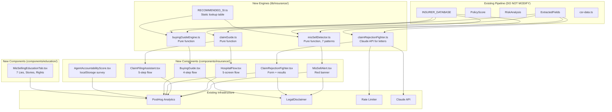
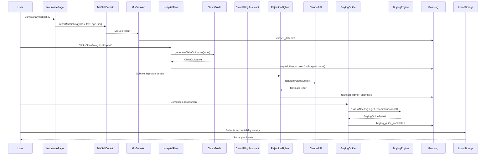

# Design Document: Insurance Guardian System

## Overview

The Insurance Guardian System adds three protective sub-systems to FamLedgerAI's existing insurance analysis pipeline, covering the full insurance lifecycle: before buying (Buying Guidance), after buying (Agent Mis-Selling Detector), and at the hospital (Claim Guidance System). The system is implemented as a set of pure-function engines in `lib/insurance/` and React components in `components/insurance/` and `components/education/`, integrating with the existing `ExtractedFields`, `PolicyScore`, `RiskAnalysis` types, the `INSURER_DATABASE` from `lib/data/insurerDatabase.ts`, PostHog analytics, Claude API via `@anthropic-ai/sdk`, and the dark theme (`#0D1120` bg, `#FF9933` orange, `#5BE6C4` green, `#E85D75` red).

### Key Design Decisions

1. **Pure functions for all engines**: `misSellDetector`, `claimGuide`, `buyingGuideEngine` are pure functions with no side effects, no API calls, no database queries. Only `claimRejectionFighter` calls Claude API for letter generation.
2. **No new npm packages**: All functionality uses existing dependencies (React, recharts v3.8.0, `@anthropic-ai/sdk`, posthog-js).
3. **No database schema changes**: Agent Accountability Score uses localStorage only. All other data flows through existing `ExtractedFields` and `INSURER_DATABASE`.
4. **No modification of existing files**: New modules import from existing types but never modify `types.ts`, `risk-detection-engine.ts`, `scoring-engine.ts`, `coverage-gap-analyzer.ts`, `report-generator.ts`, `pdf/` folder, or API routes.
5. **Amendment-driven design**: All 12 user amendments are incorporated as first-class constraints (co-payment flag for ALL members 60+, static pre-auth timeline, no network hospital API, 8th rejection category, exact PED list of 10, feature match scoring formula, Hospital Flow button in 3 places, unknown insurer handling, late claim filing warning, exact age brackets, hospital name never in PostHog, additional do-not-modify files).

### Constraints

- Dark theme: `#0D1120` background, `#FF9933` orange accent, `#5BE6C4` green, `#E85D75` red
- Fonts: Playfair Display (headings), DM Sans (body)
- All premium/coverage figures labeled as "indicative"
- All mis-selling flags labeled as "potential concern", never "fraud"
- All claim amounts labeled as "estimates — actual settlement may vary"
- IRDAI regulations referenced as of FY2024-25
- Hospital name NEVER sent in PostHog events (Amendment 11)

## Architecture



### Data Flow

1. **Mis-Selling Detection**: `ExtractedFields` + policy text + policyholder age + city tier + other policies → `misSellDetector()` → `MisSellResult` → `MisSellAlert` component
2. **Hospital Flow**: User selections → `claimGuide()` with `ExtractedFields` + hospital type + admission type + condition → `ClaimGuidance` → `HospitalFlow` Screen 5
3. **Claim Filing**: User inputs + `ExtractedFields` → `ClaimFilingAssistant` component (client-side calculations)
4. **Rejection Fighter**: Rejection details + `ExtractedFields` → `claimRejectionFighter()` → Claude API (server-side for letter) → `ClaimRejectionFighter` component
5. **Buying Guide**: Assessment answers → `buyingGuideEngine()` with `INSURER_DATABASE` + `RECOMMENDED_SI` → recommendations → `BuyingGuide` component

## Components and Interfaces

### Engine Modules

#### 1. `lib/insurance/RECOMMENDED_SI.ts`

Static lookup table of recommended minimum sum insured amounts by city tier and age bracket.

```typescript
export type CityTier = 'tier1' | 'tier2' | 'tier3';
export type AgeBracket = '18-35' | '36-45' | '46-55' | '56+';

export const RECOMMENDED_SI: Record<CityTier, Record<AgeBracket, number>> = {
  tier1: { '18-35': 1000000, '36-45': 2500000, '46-55': 5000000, '56+': 7500000 },
  tier2: { '18-35': 750000,  '36-45': 1500000, '46-55': 3000000, '56+': 5000000 },
  tier3: { '18-35': 500000,  '36-45': 1000000, '46-55': 2000000, '56+': 3500000 },
};

export function getAgeBracket(age: number): AgeBracket;
export function getRecommendedSI(cityTier: CityTier, age: number): number;
```

#### 2. `lib/insurance/misSellDetector.ts`

Pure function detecting 7 mis-selling patterns. No API calls, no database queries.

```typescript
export type MisSellPattern =
  | 'ulip_endowment_as_health'
  | 'insufficient_sum_insured'
  | 'group_only_cover'
  | 'room_rent_capping_hidden'
  | 'copayment_hidden_non_senior'
  | 'low_csr_insurer'
  | 'critical_illness_as_health';

export type ConfidenceLevel = 'confirmed' | 'likely' | 'possible';
export type MisSellRiskLevel = 'none' | 'low' | 'medium' | 'high';

export interface MisSellFlag {
  pattern: MisSellPattern;
  confidence: ConfidenceLevel;
  agentClaim: string;
  reality: string;
  financialDamage: string;
  userRights: string;
  actionSteps: string[]; // minimum 2 steps
}

export interface MisSellResult {
  flags: MisSellFlag[];
  flagCount: number;
  riskLevel: MisSellRiskLevel;
}

export interface MisSellDetectorInput {
  extractedFields: ExtractedFields;
  policyText: string;
  policyholderAge: number;
  cityTier: CityTier;
  otherPolicies?: ExtractedFields[];
  memberDetails?: MemberDetail[];  // Amendment 1: for ALL members 60+ check
}

export function detectMisSelling(input: MisSellDetectorInput): MisSellResult;
```

**Amendment 1 (Co-payment)**: The co-payment pattern checks if ALL members in `memberDetails` are 60+. Only if ALL members are 60+ does it skip the flag. If any member is under 60, the flag is raised.

**Amendment 8 (Unknown insurer)**: If the insurer is not found in `INSURER_DATABASE`, the low CSR check is skipped and a note is added to the result.

**Pattern detection logic**:
- Pattern 1 (ULIP/Endowment): Check `policyType` or keyword scan in `policyText`. Calculate lost opportunity cost using 12% CAGR benchmark.
- Pattern 2 (Insufficient SI): Compare `sumInsured` against `RECOMMENDED_SI[cityTier][ageBracket]`. Project gap at 14% medical inflation over 5 years.
- Pattern 3 (Group-only): Check `policyType === 'group'` and `otherPolicies` has no individual health policy.
- Pattern 4 (Room rent): Check `roomRentLimit.type !== 'unlimited'`. Confidence "confirmed" if limit < 1% of SI per day.
- Pattern 5 (Co-payment): Check `coPaymentPercentage > 0` AND NOT all members 60+. Confidence "confirmed" if ≥ 20%, "likely" if 1-19%.
- Pattern 6 (Low CSR): Lookup insurer in `INSURER_DATABASE`. Flag if CSR < 90% ("likely"), escalate to "confirmed" if < 80%. Skip if insurer not found.
- Pattern 7 (CI as health): Check `policyType === 'critical_illness'` or keyword scan, AND no comprehensive health policy in `otherPolicies`.

All flags labeled as "potential concern" per Requirement 8.5.

#### 3. `lib/insurance/claimGuide.ts`

Pure function generating personalized hospitalization guidance.

```typescript
export interface ClaimGuideInput {
  extractedFields: ExtractedFields;
  hospitalType: 'network' | 'non-network';
  admissionType: 'planned' | 'emergency';
  condition: string;
  insurerProfile?: InsurerProfile; // from INSURER_DATABASE
}

export interface ClaimGuidance {
  intimationDeadlineHours: number;
  insurerTollFree: string;
  intimationMethod: string; // 'app, email, phone'
  documentChecklist: DocumentItem[];
  claimProcessSteps: string[];
  preAuthTimeline: string; // Amendment 2: static text, no real-time
  pedWarning: PEDWarning | null;
  roomEntitlement: string;
  watchOutItems: WatchOutItem[];
}

export interface DocumentItem {
  name: string;
  required: boolean;
  notes?: string;
}

export interface PEDWarning {
  condition: string;
  matchedPED: string;
  waitingPeriodDays: number;
  remainingDays: number;
  message: string;
}

export interface WatchOutItem {
  type: 'copayment' | 'sublimit' | 'non_payable' | 'room_rent';
  description: string;
  impact: string;
}

export function generateClaimGuidance(input: ClaimGuideInput): ClaimGuidance;
```

**Amendment 2**: Pre-auth timeline is static text (e.g., "Typically 2-4 hours for planned, 4-6 hours for emergency"). No real-time tracking.

**Amendment 3**: No network hospital API check. The component shows the insurer's network hospital URL and asks the user to confirm network status.

**Amendment 5 (Exact PED list)**: The PED check uses a fixed list of 10 conditions:
1. Diabetes Mellitus
2. Hypertension
3. Heart Disease / Cardiac conditions
4. Asthma / COPD
5. Thyroid disorders
6. Kidney disease / Renal conditions
7. Liver disease / Hepatitis
8. Cancer (any type)
9. Stroke / Cerebrovascular disease
10. HIV/AIDS

#### 4. `lib/insurance/claimRejectionFighter.ts`

Analyzes claim rejections and generates template appeal letters via Claude API.

```typescript
export type RejectionCategory =
  | 'ped_not_covered'
  | 'non_disclosure'
  | 'not_medically_necessary'
  | 'non_network_hospital'
  | 'late_claim_filing'
  | 'exclusion_clause'
  | 'sub_limit_exceeded'
  | 'partial_settlement_sub_limit'; // Amendment 4: 8th category

export type ValidityAssessment = 'valid' | 'questionable' | 'likely_invalid';

export interface RejectionAnalysis {
  category: RejectionCategory;
  validity: ValidityAssessment;
  groundsToFight: string[];
  escalationPath: EscalationStep[];
  templateLetter: string | null; // null until Claude generates it
  disclaimer: string;
}

export interface EscalationStep {
  step: number;
  name: string;
  contact: string;
  timelineDays: number;
  description: string;
}

export interface RejectionFighterInput {
  rejectionReason: string;
  rejectionCategory?: RejectionCategory;
  extractedFields: ExtractedFields;
  claimAmount: number;
  hospitalName: string;
  rejectionLetterText?: string;
}

// Pure analysis (no API call)
export function analyzeRejection(input: RejectionFighterInput): Omit<RejectionAnalysis, 'templateLetter'>;

// Server-side: generates letter via Claude API
export async function generateAppealLetter(
  analysis: Omit<RejectionAnalysis, 'templateLetter'>,
  input: RejectionFighterInput
): Promise<string>;
```

**Amendment 4**: The 8th rejection category `partial_settlement_sub_limit` handles cases where the insurer partially settles a claim by applying sub-limits, paying less than the full claim amount.

**Amendment 9**: The `analyzeRejection` function checks for late claim filing first and issues a warning before proceeding with the full eligibility analysis.

**Escalation Path** (4 steps per Requirement 13.4):
1. Insurer internal grievance cell — 15-day response timeline
2. IRDAI IGMS portal (igms.irda.gov.in) — 30-day response timeline
3. Insurance Ombudsman — 90-day timeline
4. Consumer court — final recourse

#### 5. `lib/insurance/buyingGuideEngine.ts`

Pure function for needs assessment and plan recommendations.

```typescript
export interface NeedsAssessment {
  currentCoverage: 'none' | 'employer_only' | 'individual';
  primaryMemberAge: number;
  preExistingDiseases: string[];
  cityOfResidence: string;
  cityTier: CityTier;
  monthlyBudget: number;
  familyMemberCount: number;
}

export interface NeedsProfile {
  recommendedSI: number;
  mustHaveFeatures: FeatureItem[];
  redFlagsToAvoid: FeatureItem[];
  estimatedPremiumRange: { min: number; max: number };
}

export interface FeatureItem {
  name: string;
  explanation: string;
}

export interface PlanRecommendation {
  insurerName: string;
  planName: string;
  sumInsuredOptions: number[];
  keyFeatures: string[];
  csrRatio: number;
  networkHospitalCount: number;
  indicativePremiumRange: { min: number; max: number };
  featureMatchScore: number; // 0-12, Amendment 6
  overallScore: number; // weighted composite
}

export interface BuyingGuideResult {
  needsProfile: NeedsProfile;
  recommendations: PlanRecommendation[]; // max 3
  questionsToAsk: QuestionItem[];
}

export interface QuestionItem {
  question: string;
  whyItMatters: string;
  expectedGoodAnswer: string;
}

export function assessNeeds(input: NeedsAssessment): NeedsProfile;
export function getRecommendations(
  profile: NeedsProfile,
  insurerDatabase: InsurerProfile[]
): PlanRecommendation[];
export function getQuestionsToAsk(): QuestionItem[];
```

**Amendment 6 (Feature match scoring)**:
- Feature match score: max 12 points
  - Room rent at actuals (no cap): 3 pts
  - Restore/refill benefit present: 3 pts
  - Zero co-payment: 2 pts
  - PED waiting period ≤ 2 years: 2 pts
  - No sub-limits on common procedures: 1 pt
  - Air ambulance covered: 1 pt
- Ranking weights: CSR 40% + Feature Match (featureScore/12 × 40%) + Premium Fit 20%
- `overallScore = (normalizedCSR * 0.4) + (featureMatchScore/12 * 0.4) + (premiumFit * 0.2)`

**Amendment 8 (Unknown insurer)**: If an insurer is not in the database, skip CSR check and show generic recommendations.

**Amendment 10 (Age brackets)**: Uses exact brackets: 18-35, 36-45, 46-55, 56+.

### UI Components

#### 6. `components/insurance/MisSellAlert.tsx`

Red banner rendered above regular policy analysis when mis-selling flags are detected.

- Props: `{ result: MisSellResult }`
- Renders nothing if `result.flagCount === 0`
- Red `#E85D75` banner background
- Each flag shows: pattern name, confidence badge (red=confirmed, orange #FF9933=likely, muted=possible), agent claim vs reality two-column layout, financial damage, user rights, expandable action steps
- Includes IRDAI complaint info: IGMS portal URL, toll-free 155255, email igms@irdai.gov.in
- Includes `<LegalDisclaimer type="insurance" />`
- PostHog event: `missell_detected` with `{ flagCount, highestConfidence }` — no PII

#### 7. `components/insurance/HospitalFlow.tsx`

5-screen guided flow for hospitalization preparation.

- Props: `{ policies?: ExtractedFields[], onComplete?: () => void }`
- **Amendment 7**: Works without saved policies — user can manually enter policy details. Button appears in 3 places: insurance page header, policy card actions, and a floating emergency button.
- Screen 1: Select Policy (or enter manually)
- Screen 2: Planned or Emergency (emergency shows toll-free prominently)
- Screen 3: Hospital Name — **Amendment 3**: No API check. Shows insurer's network hospital URL. User confirms network/non-network status. Color: green `#5BE6C4` for network, red `#E85D75` for non-network.
- Screen 4: Condition — checks against PED list (Amendment 5: exact 10 conditions). Shows PED coverage status.
- Screen 5: Personalized Checklist — full `ClaimGuidance` output with intimation deadline, document checklist with checkboxes, room entitlement, **Amendment 2**: static pre-auth timeline text, watch-out items, phone numbers.
- "I'm Going to Hospital" button: `#E85D75` red background, min 48px height, high contrast, large touch target.
- PostHog event at each screen: `hospital_flow_screen` with `{ screen, hospitalType, admissionType }` — **Amendment 11**: hospital name NEVER included.

#### 8. `components/insurance/ClaimFilingAssistant.tsx`

5-step reimbursement claim filing flow.

- Props: `{ extractedFields: ExtractedFields, insurerProfile?: InsurerProfile }`
- **Amendment 9**: Shows late claim filing warning BEFORE eligibility check on Step 1.
- Step 1: Eligibility Check — checks waiting periods, coverage dates, exclusions. Late filing warning first.
- Step 2: Document Checklist Generator — insurer-specific checklist from `InsurerProfile`.
- Step 3: Claim Amount Calculator — applies deductions: co-payment, room rent proportionate deduction, sub-limit caps, non-payable items estimate, deductible. Each line item shown. All amounts labeled "estimates — actual settlement may vary".
- Step 4: Submission Guide — method (online/email/physical), address, timelines (15-30 days from discharge).
- Step 5: Claim Tracking Reminder — follow up after 30 days, grievance cell contact.
- PostHog event per step: `claim_filing_step` with `{ step, completionStatus }`.

#### 9. `components/insurance/ClaimRejectionFighter.tsx`

Input form + analysis results display.

- Props: `{ policies?: ExtractedFields[] }`
- Form: policy selection, rejection reason (free text or dropdown of 8 categories including Amendment 4), rejection letter text, claim amount, hospital name.
- Results: rejection category, validity badge (green `#5BE6C4` = likely_invalid, orange `#FF9933` = questionable, red `#E85D75` = valid), grounds to fight, escalation path as visual timeline, template letter in copyable textarea with "Copy to Clipboard" button.
- Includes `<LegalDisclaimer type="insurance" />`
- PostHog event: `rejection_fighter_submitted` with `{ rejectionCategory, validity }` — **Amendment 11**: hospital name NEVER included.

#### 10. `components/insurance/BuyingGuide.tsx`

4-step guided buying flow.

- Props: `{ insurerDatabase: InsurerProfile[] }`
- Step 1: Needs Assessment — 6 questions (coverage status, age, PEDs, city, budget, family size). **Amendment 10**: age brackets 18-35, 36-45, 46-55, 56+.
- Step 2: Recommended Profile — recommended SI, must-have features, red flags, estimated premium range.
- Step 3: Top 3 Recommendations — ranked by **Amendment 6** formula (CSR 40% + Feature 40% + Premium 20%). Each shows insurer name, plan, SI options, features, CSR, network hospitals, indicative premium. All premiums labeled "indicative — get actual quotes".
- Step 4: Questions to Ask Agent — 10+ questions with why-it-matters and expected good answer. "Print Checklist" button using `window.print()` with print CSS.
- Includes `<LegalDisclaimer type="insurance" />`
- PostHog event: `buying_guide_completed` with `{ cityTier, ageBracket, budgetRange }` — no PII.

#### 11. `components/insurance/AgentAccountabilityScore.tsx`

localStorage-only survey + social proof display.

- Props: `{ policyId: string }`
- Survey: purchase channel (agent/online/bank/employer), agent explained room rent (yes/no/na), co-payment (yes/no/na), waiting periods (yes/no/na), exclusions (yes/no/na).
- Storage: localStorage keyed by SHA-256 hash of policyId. No PII stored. No server transmission.
- Social proof display: % where agents didn't explain room rent, % didn't explain co-payment, total surveys on device.
- Never names specific agents or companies.
- PostHog event: `accountability_survey_submitted` with `{ purchaseChannel }` only — no individual responses.

#### 12. `components/education/MisSellingEducationTab.tsx`

New sub-tab "Mis-Selling Guide" in Education Center.

- Props: `{ activeTab: string }`
- Sections: "7 Lies Insurance Agents Tell" (agent claim, reality, how to verify), "Real Claim Rejection Stories" (5 illustrative scenarios), "IRDAI Rights" (free-look period, portability, grievance, claim timelines), "Downloadable Claim Checklist" (printable via `window.print()`).
- Matches existing education tab visual style (dark theme, same Section/Callout patterns as `TaxSavingEducationTab`).
- IRDAI references accurate as of FY2024-25.
- PostHog event: `misselling_education_viewed` with `{ section }`.


## Data Models

### New Types (defined in new engine files, NOT in existing types.ts)

```typescript
// ── RECOMMENDED_SI.ts ──
export type CityTier = 'tier1' | 'tier2' | 'tier3';
export type AgeBracket = '18-35' | '36-45' | '46-55' | '56+';

// ── misSellDetector.ts ──
export type MisSellPattern =
  | 'ulip_endowment_as_health'
  | 'insufficient_sum_insured'
  | 'group_only_cover'
  | 'room_rent_capping_hidden'
  | 'copayment_hidden_non_senior'
  | 'low_csr_insurer'
  | 'critical_illness_as_health';

export type ConfidenceLevel = 'confirmed' | 'likely' | 'possible';
export type MisSellRiskLevel = 'none' | 'low' | 'medium' | 'high';

export interface MisSellFlag {
  pattern: MisSellPattern;
  confidence: ConfidenceLevel;
  agentClaim: string;
  reality: string;
  financialDamage: string;
  userRights: string;
  actionSteps: string[]; // min 2
}

export interface MisSellResult {
  flags: MisSellFlag[];
  flagCount: number;
  riskLevel: MisSellRiskLevel;
}

// ── claimRejectionFighter.ts ──
export type RejectionCategory =
  | 'ped_not_covered'
  | 'non_disclosure'
  | 'not_medically_necessary'
  | 'non_network_hospital'
  | 'late_claim_filing'
  | 'exclusion_clause'
  | 'sub_limit_exceeded'
  | 'partial_settlement_sub_limit'; // Amendment 4

export type ValidityAssessment = 'valid' | 'questionable' | 'likely_invalid';

export interface RejectionAnalysis {
  category: RejectionCategory;
  validity: ValidityAssessment;
  groundsToFight: string[];
  escalationPath: EscalationStep[];
  templateLetter: string | null;
  disclaimer: string;
}

export interface EscalationStep {
  step: number;
  name: string;
  contact: string;
  timelineDays: number;
  description: string;
}

// ── buyingGuideEngine.ts ──
export interface NeedsAssessment {
  currentCoverage: 'none' | 'employer_only' | 'individual';
  primaryMemberAge: number;
  preExistingDiseases: string[];
  cityOfResidence: string;
  cityTier: CityTier;
  monthlyBudget: number;
  familyMemberCount: number;
}

export interface NeedsProfile {
  recommendedSI: number;
  mustHaveFeatures: FeatureItem[];
  redFlagsToAvoid: FeatureItem[];
  estimatedPremiumRange: { min: number; max: number };
}

export interface PlanRecommendation {
  insurerName: string;
  planName: string;
  sumInsuredOptions: number[];
  keyFeatures: string[];
  csrRatio: number;
  networkHospitalCount: number;
  indicativePremiumRange: { min: number; max: number };
  featureMatchScore: number; // 0-12
  overallScore: number;
}

// ── claimGuide.ts ──
export interface ClaimGuidance {
  intimationDeadlineHours: number;
  insurerTollFree: string;
  intimationMethod: string;
  documentChecklist: DocumentItem[];
  claimProcessSteps: string[];
  preAuthTimeline: string; // static text
  pedWarning: PEDWarning | null;
  roomEntitlement: string;
  watchOutItems: WatchOutItem[];
}

// ── AgentAccountabilityScore localStorage schema ──
// Key: `agent_accountability_${sha256(policyId)}`
// Value:
export interface AccountabilitySurvey {
  purchaseChannel: 'agent' | 'online' | 'bank' | 'employer';
  agentExplainedRoomRent: 'yes' | 'no' | 'na';
  agentExplainedCoPay: 'yes' | 'no' | 'na';
  agentExplainedWaitingPeriods: 'yes' | 'no' | 'na';
  agentExplainedExclusions: 'yes' | 'no' | 'na';
  timestamp: number;
}
```

### Existing Types Consumed (NOT modified)

- `ExtractedFields` from `lib/insurance/types.ts` — policy fields including `sumInsured`, `coPaymentPercentage`, `roomRentLimit`, `policyType`, `memberDetails`, etc.
- `InsurerProfile` from `lib/data/insurerDatabase.ts` — insurer profiles with `claimSettlementRatio`, `networkHospitals`, `popularPlans`, etc.
- `PolicyScore`, `RiskAnalysis` from `lib/insurance/types.ts` — consumed by components for display context.

### Data Flow Diagram




## Correctness Properties

*A property is a characteristic or behavior that should hold true across all valid executions of a system — essentially, a formal statement about what the system should do. Properties serve as the bridge between human-readable specifications and machine-verifiable correctness guarantees.*

### Property 1: ULIP/Endowment detection triggers on matching policy type or keywords

*For any* `ExtractedFields` where `policyType` is "ULIP" or "endowment", or *for any* policy text containing ULIP/endowment keywords, calling `detectMisSelling` should return a `MisSellResult` containing at least one flag with `pattern === 'ulip_endowment_as_health'`.

**Validates: Requirements 1.1**

### Property 2: Insufficient sum insured detection with correct confidence

*For any* `ExtractedFields` with a non-null `sumInsured`, valid `cityTier`, and valid `policyholderAge`, if `sumInsured < RECOMMENDED_SI[cityTier][getAgeBracket(age)]`, then `detectMisSelling` should return a flag with `pattern === 'insufficient_sum_insured'` and `confidence === 'confirmed'`. Conversely, if `sumInsured >= RECOMMENDED_SI[cityTier][getAgeBracket(age)]`, no such flag should be present.

**Validates: Requirements 2.1, 2.2**

### Property 3: Insufficient SI financial damage includes inflation projection

*For any* `MisSellFlag` with `pattern === 'insufficient_sum_insured'`, the `financialDamage` field should contain the coverage gap amount (recommended minus actual) and a 5-year projection at 14% medical inflation that equals `gap * (1.14^5)`.

**Validates: Requirements 2.3**

### Property 4: Group-only coverage detection

*For any* `ExtractedFields` with `policyType === 'group'` and an `otherPolicies` array containing no individual health policy, `detectMisSelling` should return a flag with `pattern === 'group_only_cover'` and `confidence === 'confirmed'`. Conversely, if `otherPolicies` contains at least one individual health policy, no such flag should be present.

**Validates: Requirements 3.1**

### Property 5: Room rent capping detection with threshold-based confidence

*For any* `ExtractedFields` with `roomRentLimit.type` equal to "percentage" or "fixed", `detectMisSelling` should return a flag with `pattern === 'room_rent_capping_hidden'`. If the daily room rent limit is below 1% of `sumInsured`, the confidence should be "confirmed"; otherwise "likely".

**Validates: Requirements 4.1, 4.2**

### Property 6: Co-payment detection respects all-members-60+ rule

*For any* `ExtractedFields` with `coPaymentPercentage > 0`: if NOT all members in `memberDetails` are age 60+, a flag with `pattern === 'copayment_hidden_non_senior'` should be present. If `coPaymentPercentage >= 20`, confidence should be "confirmed"; if 1-19, confidence should be "likely". If ALL members are 60+, no co-payment flag should be present.

**Validates: Requirements 5.1, 5.2, 5.3, 5.4**

### Property 7: Low CSR detection with escalation threshold

*For any* insurer found in `INSURER_DATABASE` with `claimSettlementRatio < 90`, `detectMisSelling` should return a flag with `pattern === 'low_csr_insurer'`. If CSR < 80, confidence should be "confirmed"; if 80-89, confidence should be "likely". If the insurer is not found in the database, no low CSR flag should be present.

**Validates: Requirements 6.1, 6.2**

### Property 8: Critical illness as health insurance detection

*For any* `ExtractedFields` with `policyType === 'critical_illness'` (or CI keywords in policy text) and an `otherPolicies` array containing no comprehensive health policy, `detectMisSelling` should return a flag with `pattern === 'critical_illness_as_health'`.

**Validates: Requirements 7.1**

### Property 9: MisSellFlag structural completeness

*For any* `MisSellFlag` in a `MisSellResult`, the flag must have: a valid `pattern` (one of 7 defined patterns), a valid `confidence` (confirmed/likely/possible), non-empty `agentClaim`, non-empty `reality`, non-empty `financialDamage`, non-empty `userRights`, and `actionSteps` with at least 2 items. The `agentClaim` and `reality` must contain pattern-specific content.

**Validates: Requirements 1.3, 1.4, 3.2, 3.3, 4.3, 4.4, 5.5, 6.3, 6.4, 7.2, 7.3, 8.1, 8.2**

### Property 10: MisSellResult labeling constraint

*For any* `MisSellResult`, no text field in any `MisSellFlag` (agentClaim, reality, financialDamage, userRights, actionSteps) should contain the word "fraud" or "confirmed fraud". All flags should use "potential concern" language.

**Validates: Requirements 8.5, 21.7, 21.8**

### Property 11: MisSellResult risk level consistency

*For any* `MisSellResult`, the `riskLevel` should be consistent with `flagCount`: "none" when flagCount is 0, and escalating through "low", "medium", "high" as flagCount and confidence levels increase. The `flagCount` must equal `flags.length`.

**Validates: Requirements 8.1**

### Property 12: MisSellAlert conditional rendering

*For any* `MisSellResult` with `flagCount > 0`, the `MisSellAlert` component should render a visible banner. *For any* `MisSellResult` with `flagCount === 0`, the component should render nothing (null).

**Validates: Requirements 9.1, 9.5**

### Property 13: ClaimGuidance output completeness

*For any* valid `ClaimGuideInput`, `generateClaimGuidance` should return a `ClaimGuidance` with: `intimationDeadlineHours > 0`, non-empty `insurerTollFree`, non-empty `intimationMethod`, non-empty `documentChecklist`, non-empty `claimProcessSteps`, non-empty `preAuthTimeline`, non-empty `roomEntitlement`. If the policy has co-payment, sub-limits, or non-payable items, `watchOutItems` should reflect those.

**Validates: Requirements 10.1, 10.2, 10.3, 10.7, 10.8**

### Property 14: ClaimGuidance network vs non-network path

*For any* `ClaimGuideInput` with `hospitalType === 'network'`, the `claimProcessSteps` should describe the cashless claim process and `preAuthTimeline` should contain pre-authorization timing. *For any* input with `hospitalType === 'non-network'`, the `claimProcessSteps` should describe the reimbursement process and mention original documents.

**Validates: Requirements 10.4, 10.5**

### Property 15: PED warning when condition matches and waiting period not elapsed

*For any* `ClaimGuideInput` where the `condition` matches one of the 10 defined PED conditions and the policy's PED waiting period has not elapsed (based on `policyStartDate` and `preExistingDiseaseWaitingPeriod`), the `pedWarning` field should be non-null with the matched PED name and remaining waiting period in days. If the condition does not match or the waiting period has elapsed, `pedWarning` should be null.

**Validates: Requirements 10.6**

### Property 16: Claim eligibility check correctness

*For any* claim details and `ExtractedFields`, the eligibility check in `ClaimFilingAssistant` should return "not eligible" with a reason when: the claim date is within the initial waiting period, the condition is a PED with unexpired waiting period, or the condition is in the exclusions list. Otherwise it should return "eligible".

**Validates: Requirements 12.2**

### Property 17: Claim amount calculator deduction correctness

*For any* total hospital bill amount and `ExtractedFields` with known co-payment percentage, room rent limit, sub-limits, and deductible, the estimated reimbursement should equal: `billAmount - coPayDeduction - roomRentProportionateDeduction - subLimitCap - nonPayableEstimate - deductible`, where each deduction is correctly calculated from the policy terms. The result should never be negative (floor at 0).

**Validates: Requirements 12.4**

### Property 18: Claim amount estimates labeling

*For any* calculated amount output by the `ClaimFilingAssistant`, the display text should contain the phrase "estimates" or "actual settlement may vary".

**Validates: Requirements 12.5, 21.9**

### Property 19: Rejection analysis handles all 8 categories

*For any* of the 8 defined `RejectionCategory` values, `analyzeRejection` should return a valid `RejectionAnalysis` with a matching `category`, a valid `validity` assessment, and a non-empty `disclaimer`.

**Validates: Requirements 13.1, 13.2**

### Property 20: Rejection analysis provides grounds for questionable/likely_invalid

*For any* `RejectionAnalysis` where `validity` is "questionable" or "likely_invalid", the `groundsToFight` array should be non-empty and at least one ground should reference an IRDAI regulation or policyholder right.

**Validates: Requirements 13.3**

### Property 21: Escalation path structure

*For any* `RejectionAnalysis`, the `escalationPath` should contain exactly 4 steps in order: insurer grievance cell (15 days), IRDAI IGMS (30 days), Insurance Ombudsman (90 days), Consumer court. Each step should have non-empty `name`, `contact`, `description`, and positive `timelineDays`.

**Validates: Requirements 13.4**

### Property 22: Rejection fighter disclaimers

*For any* `RejectionAnalysis`, the `disclaimer` field should be non-empty and contain language indicating the analysis is "informational" and "cannot guarantee outcomes". Template letters should note they are "starting points".

**Validates: Requirements 13.6, 13.7, 21.10**

### Property 23: Needs assessment produces valid profile

*For any* valid `NeedsAssessment` input (valid age, valid city tier, positive budget, positive family count), `assessNeeds` should return a `NeedsProfile` with: `recommendedSI` matching `RECOMMENDED_SI[cityTier][ageBracket]`, non-empty `mustHaveFeatures`, non-empty `redFlagsToAvoid`, and `estimatedPremiumRange` where `min <= max` and both are positive.

**Validates: Requirements 15.3**

### Property 24: Recommendation ranking follows weighted formula

*For any* `NeedsProfile` and `InsurerProfile[]` database, `getRecommendations` should return at most 3 `PlanRecommendation` objects sorted in descending order by `overallScore`, where `overallScore = (normalizedCSR * 0.4) + (featureMatchScore/12 * 0.4) + (premiumFit * 0.2)`. The `featureMatchScore` should be between 0 and 12.

**Validates: Requirements 16.2**

### Property 25: Recommendation completeness

*For any* `PlanRecommendation`, all fields should be present: non-empty `insurerName`, non-empty `planName`, non-empty `sumInsuredOptions`, non-empty `keyFeatures`, `csrRatio` between 0 and 100, positive `networkHospitalCount`, and `indicativePremiumRange` where `min <= max`.

**Validates: Requirements 16.3**

### Property 26: Buying guide indicative labeling

*For any* premium or coverage figure displayed by the `BuyingGuide`, the display text should contain "indicative" or "get actual quotes".

**Validates: Requirements 16.4, 21.11**

### Property 27: Questions to ask completeness

*For any* question returned by `getQuestionsToAsk`, it should have non-empty `question`, non-empty `whyItMatters`, and non-empty `expectedGoodAnswer`. The total count should be at least 10.

**Validates: Requirements 17.1, 17.2**

### Property 28: Accountability survey localStorage round-trip

*For any* `AccountabilitySurvey` submitted with a `policyId`, storing it in localStorage and then reading it back using the same policyId hash should produce an identical survey object.

**Validates: Requirements 18.2, 21.12**

### Property 29: Social proof statistics correctness

*For any* set of `AccountabilitySurvey` objects stored in localStorage, the social proof percentages should correctly reflect: (count where agentExplainedRoomRent === 'no') / (count where agentExplainedRoomRent !== 'na') * 100, and similarly for co-payment. The total survey count should match the number of stored surveys.

**Validates: Requirements 18.3**

### Property 30: Graceful handling of missing/null input fields

*For any* engine function (`detectMisSelling`, `generateClaimGuidance`, `analyzeRejection`, `assessNeeds`), when called with `ExtractedFields` containing null values for optional fields, the function should not throw an error. It should skip the affected analysis and include a note about the omission in the output.

**Validates: Requirements 21.5**

### Property 31: PostHog events never contain hospital name

*For any* PostHog event sent by `HospitalFlow` or `ClaimRejectionFighter`, the event properties object should not contain a key or value that includes the hospital name entered by the user.

**Validates: Requirements 11.8, 20.1, 20.2**

### Property 32: Age bracket mapping correctness

*For any* age between 18 and 120, `getAgeBracket(age)` should return: "18-35" for ages 18-35, "36-45" for ages 36-45, "46-55" for ages 46-55, and "56+" for ages 56 and above.

**Validates: Requirements 2.4**

### Property 33: ULIP lost opportunity cost calculation

*For any* premium amount `P` and tenure `T` years, the lost opportunity cost in a ULIP flag should equal `P * ((1.12^T) - 1)` (12% CAGR benchmark compound growth on the premium).

**Validates: Requirements 1.2**


## Error Handling

### Engine Error Handling

All engine functions follow a defensive pattern: never throw on bad input, always return a valid result structure.

1. **Null/missing fields in ExtractedFields**: Each engine checks for null fields before using them. If a field needed for a specific pattern is null, that pattern is skipped and a note is added to the result (e.g., "Sum insured not available — insufficient SI check skipped").

2. **Unknown insurer (Amendment 8)**: If the insurer name from `ExtractedFields` does not match any entry in `INSURER_DATABASE`, the low CSR check is skipped. The `claimGuide` uses generic defaults for toll-free number and intimation method. The `buyingGuideEngine` shows generic recommendations.

3. **Invalid age/city tier**: If age is outside expected range or city tier is not provided, the `RECOMMENDED_SI` lookup defaults to the most conservative bracket (56+, tier1) and adds a note.

4. **Claude API failure in Rejection Fighter**: If the Claude API call for letter generation fails (network error, rate limit, API key issue), the `templateLetter` field is set to null and the UI shows a message: "Unable to generate template letter at this time. Please try again later." The analysis result (category, validity, grounds, escalation) is still returned since it's computed locally.

5. **Rate limiting**: The rejection fighter's letter generation endpoint uses the existing `checkRateLimit` from `lib/security/rateLimit.ts` with a per-user sliding window. If rate limited, the user sees a friendly message with retry timing.

6. **localStorage errors**: The `AgentAccountabilityScore` wraps all localStorage operations in try/catch. If localStorage is full or unavailable (private browsing), the survey is silently not saved and the social proof section shows "No data available on this device."

7. **Empty policy list**: The `HospitalFlow` works without saved policies (Amendment 7). If no policies are available, Screen 1 shows a manual entry form instead of a policy selector.

### UI Error Handling

1. **Component error boundaries**: Each major component (`HospitalFlow`, `ClaimFilingAssistant`, `ClaimRejectionFighter`, `BuyingGuide`) should be wrapped in React error boundaries that show a fallback UI rather than crashing the page.

2. **Loading states**: All async operations (Claude API call in rejection fighter) show loading spinners with the existing `LoadingSpinner` component.

3. **PostHog failures**: All PostHog `track()` calls are fire-and-forget (the existing `track` function already wraps in try/catch). PostHog failures never affect user experience.

## Testing Strategy

### Dual Testing Approach

The Insurance Guardian System uses both unit tests and property-based tests for comprehensive coverage.

**Property-based testing library**: `fast-check` (already available in the project's test dependencies via the existing test setup).

Note: If `fast-check` is not already installed, use the built-in `Math.random`-based approach with manual generators since no new npm packages are allowed. However, the property test structure and assertions remain the same.

### Unit Tests

Unit tests cover specific examples, edge cases, and integration points:

- **MisSell Detector**: Test each of the 7 patterns with specific ExtractedFields examples. Test the "no flags" case. Test with all-null optional fields.
- **Claim Guide**: Test network vs non-network paths with specific inputs. Test PED matching against the exact 10 conditions. Test emergency vs planned defaults.
- **Rejection Fighter**: Test each of the 8 rejection categories with specific inputs. Test the escalation path structure. Test the late filing warning (Amendment 9).
- **Buying Guide**: Test needs assessment with specific inputs. Test recommendation ranking with known insurer data. Test the feature match scoring formula with known values.
- **RECOMMENDED_SI**: Test all 12 entries (3 tiers × 4 brackets). Test age bracket boundaries (35→36, 45→46, 55→56).
- **UI Components**: Test conditional rendering (MisSellAlert renders/doesn't render). Test form validation. Test localStorage round-trip for AccountabilityScore.

### Property-Based Tests

Each property test runs a minimum of 100 iterations with randomly generated inputs. Each test is tagged with a comment referencing the design property.

```
// Feature: insurance-guardian-system, Property 1: ULIP/Endowment detection triggers on matching policy type or keywords
// Feature: insurance-guardian-system, Property 2: Insufficient sum insured detection with correct confidence
// ... etc.
```

**Generator strategy**:
- `ExtractedFields` generator: produces random valid ExtractedFields with nullable fields, random sumInsured (100000-5000000), random coPaymentPercentage (0-50), random roomRentLimit types, random policyTypes.
- `MemberDetail` generator: produces random members with ages 1-100.
- `CityTier` generator: uniform random from tier1/tier2/tier3.
- `Age` generator: uniform random 18-80.
- `NeedsAssessment` generator: random valid assessment inputs.
- `RejectionCategory` generator: uniform random from 8 categories.
- `InsurerProfile` generator: random profiles with CSR 50-100, network hospitals 1000-15000.

**Key property tests**:

1. **Properties 1-8 (MisSell detection patterns)**: Generate random ExtractedFields, run `detectMisSelling`, verify correct flags are present/absent based on input conditions.
2. **Property 9 (Structural completeness)**: For any MisSellResult with flags, verify all fields are populated.
3. **Property 10 (Labeling)**: For any MisSellResult, verify no "fraud" text appears.
4. **Property 13-15 (Claim guidance)**: Generate random ClaimGuideInput, verify output completeness and correct path selection.
5. **Property 16-17 (Claim filing)**: Generate random bill amounts and policy terms, verify deduction calculations.
6. **Property 19-22 (Rejection fighter)**: Generate random rejection inputs, verify analysis structure.
7. **Property 23-25 (Buying guide)**: Generate random NeedsAssessment, verify profile and ranking.
8. **Property 28-29 (Accountability)**: Generate random surveys, verify localStorage round-trip and statistics.
9. **Property 30 (Graceful null handling)**: Generate ExtractedFields with random null fields, verify no throws.
10. **Property 32 (Age brackets)**: Generate random ages, verify correct bracket assignment.
11. **Property 33 (ULIP calculation)**: Generate random premium/tenure, verify compound interest formula.

### Test Configuration

- Minimum 100 iterations per property test
- Each property test tagged with: `Feature: insurance-guardian-system, Property {N}: {title}`
- Tests located in `__tests__/insurance/` directory alongside the engine files
- UI component tests use React Testing Library
- No mocking of pure engine functions — test them directly
- Claude API calls in rejection fighter are mocked in tests

