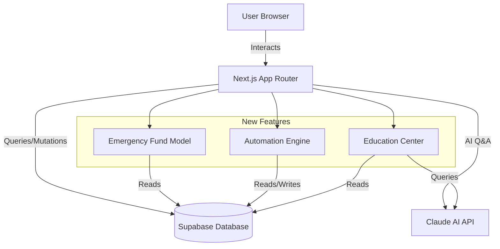

# Design Document: Launch Critical Features

## Overview

This design document specifies the implementation of three launch-critical features for FamLedgerAI:

1. **Emergency Fund Model**: Tracks and displays emergency fund status with integration into the Financial Health Score system
2. **Automation Workflows**: Background automation engine that monitors financial health and generates intelligent alerts
3. **Health Insurance Education Center**: Educational resource hub with AI-powered Q&A for insurance literacy

All features are purely additive and designed to integrate seamlessly with the existing production system without breaking changes.

### Design Principles

- **Zero Breaking Changes**: All modifications maintain backward compatibility
- **Existing Patterns**: Follow established conventions for hooks, components, and API routes
- **Performance First**: Fire-and-forget automation, optimistic updates, efficient queries
- **User Experience**: Calm, educational tone; no alarming language; premium dark design
- **Type Safety**: Full TypeScript coverage with strict mode compliance

### Technology Stack

- **Framework**: Next.js 14 App Router
- **Database**: Supabase with Row Level Security (RLS)
- **AI**: Claude Sonnet 4 (claude-sonnet-4-20250514)
- **State Management**: React hooks (no new Zustand stores)
- **Styling**: Tailwind CSS with existing design system
- **Type System**: TypeScript strict mode

## Architecture

### System Context



### High-Level Architecture

The system follows a layered architecture:

**Presentation Layer**
- React components in `/components`
- Pages in `/app/(dashboard)`
- Existing design system (Playfair Display, DM Sans, teal/orange/red colors)

**Business Logic Layer**
- Calculators in `/lib/calculators` (emergency fund logic)
- Automation rules in `/lib/automation` (7 rule functions)
- AI agents in `/lib/ai` (education Q&A)

**Data Access Layer**
- React hooks in `/hooks` (data fetching patterns)
- Supabase client in `/lib/supabase`
- API routes in `/app/api`

**Data Storage Layer**
- Supabase PostgreSQL with RLS
- Existing tables: income, expenses, investments, goals, loans, insurance, alerts
- New tables: automation_jobs, notifications, insurance_glossary, govt_scheme_guidelines

### Integration Points

**Emergency Fund Model**
- Integrates with: `familyHealthScore.ts` (Pillar 1 calculation)
- Reads from: Existing financial data (income, expenses, investments)
- Displays on: Overview page (new EmergencyFundCard component)

**Automation Workflows**
- Triggers from: Overview page load (fire-and-forget)
- Reads from: All financial data tables
- Writes to: alerts, notifications, automation_jobs tables
- Displays on: New /alerts page with AlertsPanel component

**Health Insurance Education Center**
- Standalone feature with minimal integration
- New page: /education with 5 tabs
- New API: /api/insurance-education (Claude AI)
- Navigation: Add link to Sidebar under TOOLS group

## Components and Interfaces

### Feature 1: Emergency Fund Model

#### 1.1 Emergency Fund Calculator

**Location**: `/lib/calculators/emergencyFund.ts`

**Purpose**: Calculate emergency fund status, target, and recommendations

**Interface**:
```typescript
export interface EmergencyFundInput {
  liquidSavings: number;        // FD + savings account balance
  monthlyExpenses: number;       // Average monthly expenses
  employmentType: 'salaried' | 'self-employed';
}

export interface EmergencyFundResult {
  current: number;               // Current emergency fund amount
  target: number;                // Target amount (6 or 9 months)
  monthsCovered: number;         // Current / monthly expenses
  progressPercentage: number;    // (current / target) * 100
  status: 'excellent' | 'good' | 'warning' | 'critical';
  color: string;                 // #5BE6C4, #FF9933, or #FF6B6B
  insight: string;               // One-line status message
  action: string;                // Recommended next action
}

export function calculateEmergencyFund(input: EmergencyFundInput): EmergencyFundResult
```

**Logic**:
- Target = 6 months expenses (salaried) or 9 months (self-employed)
- Months covered = liquidSavings / monthlyExpenses
- Status: excellent (≥6), good (4-6), warning (3-4), critical (<3)
- Color: teal (≥6), orange (3-6), red (<3)

#### 1.2 EmergencyFundCard Component

**Location**: `/components/overview/EmergencyFundCard.tsx`

**Purpose**: Display emergency fund status on Overview page

**Props**:
```typescript
interface EmergencyFundCardProps {
  // No props - fetches data internally using hooks
}
```

**Behavior**:
- Fetches liquid savings from useInvestments hook (FD + savings)
- Fetches monthly expenses from useExpenses hook
- Fetches employment type from user profile
- Calls calculateEmergencyFund() for status
- Displays current amount, target, months covered, progress bar
- Shows next action recommendation
- Uses existing SummaryCard styling pattern

#### 1.3 Financial Health Score Integration

**Location**: `/lib/calculators/familyHealthScore.ts` (modify existing)

**Changes**:
- Update Pillar 1 calculation to use employment-aware logic
- Salaried: 6 months = 20 pts, 4 months = 16 pts, 3 months = 12 pts
- Self-employed: 9 months = 20 pts, 6 months = 16 pts, 4 months = 12 pts
- Update insight and action messages to reference employment type
- Maintain backward compatibility (existing logic as fallback)

**Modified Interface**:
```typescript
export interface HealthScoreInput {
  // ... existing fields ...
  employmentType?: 'salaried' | 'self-employed'; // NEW - optional for backward compat
}
```

### Feature 2: Automation Workflows

#### 2.1 Database Schema

**New Table: automation_jobs**
```sql
CREATE TABLE automation_jobs (
  id UUID PRIMARY KEY DEFAULT uuid_generate_v4(),
  user_id UUID NOT NULL REFERENCES auth.users(id) ON DELETE CASCADE,
  rule_name TEXT NOT NULL,
  last_run_at TIMESTAMPTZ NOT NULL DEFAULT NOW(),
  next_run_at TIMESTAMPTZ,
  status TEXT NOT NULL CHECK (status IN ('success', 'failed', 'running')),
  result_summary JSONB,
  created_at TIMESTAMPTZ NOT NULL DEFAULT NOW(),
  updated_at TIMESTAMPTZ NOT NULL DEFAULT NOW()
);

CREATE INDEX idx_automation_jobs_user_id ON automation_jobs(user_id);
CREATE INDEX idx_automation_jobs_next_run ON automation_jobs(next_run_at);

-- RLS Policies
ALTER TABLE automation_jobs ENABLE ROW LEVEL SECURITY;

CREATE POLICY "Users can view own automation jobs"
  ON automation_jobs FOR SELECT
  USING (auth.uid() = user_id);

CREATE POLICY "Service role can manage automation jobs"
  ON automation_jobs FOR ALL
  USING (auth.role() = 'service_role');
```

**New Table: notifications**
```sql
CREATE TABLE notifications (
  id UUID PRIMARY KEY DEFAULT uuid_generate_v4(),
  user_id UUID NOT NULL REFERENCES auth.users(id) ON DELETE CASCADE,
  type TEXT NOT NULL CHECK (type IN ('alert', 'insight', 'reminder', 'achievement')),
  title TEXT NOT NULL,
  message TEXT NOT NULL,
  severity TEXT NOT NULL CHECK (severity IN ('info', 'warning', 'critical')),
  is_read BOOLEAN NOT NULL DEFAULT FALSE,
  metadata JSONB,
  created_at TIMESTAMPTZ NOT NULL DEFAULT NOW()
);

CREATE INDEX idx_notifications_user_id ON notifications(user_id);
CREATE INDEX idx_notifications_created_at ON notifications(created_at DESC);
CREATE INDEX idx_notifications_is_read ON notifications(is_read);

-- RLS Policies
ALTER TABLE notifications ENABLE ROW LEVEL SECURITY;

CREATE POLICY "Users can view own notifications"
  ON notifications FOR SELECT
  USING (auth.uid() = user_id);

CREATE POLICY "Users can update own notifications"
  ON notifications FOR UPDATE
  USING (auth.uid() = user_id);

CREATE POLICY "Service role can manage notifications"
  ON notifications FOR ALL
  USING (auth.role() = 'service_role');
```

**Update Existing Table: alerts**
```sql
-- Add columns to support automation
ALTER TABLE alerts ADD COLUMN IF NOT EXISTS automation_rule TEXT;
ALTER TABLE alerts ADD COLUMN IF NOT EXISTS is_dismissed BOOLEAN DEFAULT FALSE;
ALTER TABLE alerts ADD COLUMN IF NOT EXISTS dismissed_at TIMESTAMPTZ;

CREATE INDEX IF NOT EXISTS idx_alerts_automation_rule ON alerts(automation_rule);
```

#### 2.2 Automation Engine

**Location**: `/lib/automation/engine.ts`

**Purpose**: Core automation engine that runs financial health checks

**Interface**:
```typescript
export interface AutomationRule {
  name: string;
  description: string;
  check: (context: AutomationContext) => Promise<AutomationResult>;
}

export interface AutomationContext {
  userId: string;
  income: Income[];
  expenses: Expense[];
  investments: Investment[];
  goals: Goal[];
  loans: Loan[];
  insurance: Insurance[];
  alerts: Alert[];
}

export interface AutomationResult {
  triggered: boolean;
  severity: 'info' | 'warning' | 'critical';
  title: string;
  message: string;
  metadata?: Record<string, any>;
}

export async function runAutomation(userId: string): Promise<AutomationSummary>
```

**Behavior**:
- Fetch all financial data for user
- Run all 7 automation rules
- Create alerts/notifications for triggered rules
- Update automation_jobs table
- Return summary of execution
- Idempotent: check for existing alerts before creating duplicates

#### 2.3 Automation Rules

**Location**: `/lib/automation/rules/`

Each rule is a separate file implementing the AutomationRule interface:

**1. highEMIRatio.ts**
- Trigger: Monthly EMI > 40% of income
- Severity: warning
- Message: "Your EMI is {X}% of income. Target below 30% for healthy finances."

**2. lowSavingsRate.ts**
- Trigger: Monthly investments < 10% of income
- Severity: warning
- Message: "You're investing {X}% of income. Increase SIP by ₹{Y} to reach 20%."

**3. insuranceRenewal.ts**
- Trigger: Active policy expires within 30 days
- Severity: warning
- Message: "{Policy name} expires on {date}. Renew now to avoid coverage gap."

**4. noEmergencyFund.ts**
- Trigger: Emergency fund < 3 months expenses
- Severity: warning
- Message: "Emergency fund covers {X} months. Save ₹{Y}/month to reach 6-month target."

**5. noHealthInsurance.ts**
- Trigger: No active health insurance
- Severity: critical
- Message: "No health insurance found. Get ₹{X}L family floater to protect against medical costs."

**6. goalFallingBehind.ts**
- Trigger: Active goal with zero monthly SIP
- Severity: warning
- Message: "{Goal name} has no funding. Start ₹{X}/month SIP to reach target on time."

**7. overspending.ts**
- Trigger: Current month expenses > income
- Severity: warning
- Message: "Spending ₹{X} more than income this month. Review budget and cut discretionary expenses."

#### 2.4 Automation API Route

**Location**: `/app/api/automation/run/route.ts`

**Purpose**: API endpoint to trigger automation

**Request**:
```typescript
POST /api/automation/run
Body: { userId: string }
```

**Response**:
```typescript
{
  success: boolean;
  rulesExecuted: number;
  alertsCreated: number;
  notificationsCreated: number;
  summary: {
    ruleName: string;
    triggered: boolean;
    severity: string;
  }[];
}
```

**Behavior**:
- Authenticate request (service role or user's own ID)
- Check last run time (skip if < 1 hour ago)
- Call runAutomation(userId)
- Return execution summary
- Handle errors gracefully (log but don't throw)

#### 2.5 AlertsPanel Component

**Location**: `/components/alerts/AlertsPanel.tsx`

**Purpose**: Display all alerts grouped by severity

**Props**:
```typescript
interface AlertsPanelProps {
  // No props - fetches data internally
}
```

**Behavior**:
- Fetches alerts and notifications using useAlerts hook
- Groups by severity: critical (red), warning (orange), info (teal)
- Displays title, message, timestamp for each alert
- "Mark as Read" button per alert
- Filter dropdown: All, Critical, Warnings, Info
- Empty state when no alerts
- Uses existing card styling

#### 2.6 Alerts Page

**Location**: `/app/(dashboard)/alerts/page.tsx`

**Purpose**: Dedicated page for managing alerts

**Layout**:
- Page header with unread count
- "Mark All as Read" button
- AlertsPanel component
- Matches existing dashboard layout

#### 2.7 Overview Page Integration

**Location**: `/app/(dashboard)/overview/page.tsx` (modify existing)

**Changes**:
- Add fire-and-forget automation trigger on page load
- Check localStorage for last run time
- If > 1 hour, call /api/automation/run asynchronously
- No loading states, no error messages to user
- Silent background execution

**Implementation**:
```typescript
useEffect(() => {
  const lastRun = localStorage.getItem('automation_last_run');
  const now = Date.now();
  
  if (!lastRun || now - parseInt(lastRun) > 3600000) {
    // Fire and forget - don't await
    fetch('/api/automation/run', {
      method: 'POST',
      body: JSON.stringify({ userId: user.id })
    }).catch(() => {
      // Silent failure - log to console only
      console.error('Automation failed');
    });
    
    localStorage.setItem('automation_last_run', now.toString());
  }
}, [user]);
```

### Feature 3: Health Insurance Education Center

#### 3.1 Database Schema

**New Table: insurance_glossary**
```sql
CREATE TABLE insurance_glossary (
  id UUID PRIMARY KEY DEFAULT uuid_generate_v4(),
  term TEXT NOT NULL UNIQUE,
  definition TEXT NOT NULL,
  example TEXT NOT NULL,
  category TEXT NOT NULL CHECK (category IN ('basics', 'coverage', 'claims', 'financial')),
  created_at TIMESTAMPTZ NOT NULL DEFAULT NOW()
);

CREATE INDEX idx_insurance_glossary_category ON insurance_glossary(category);
CREATE INDEX idx_insurance_glossary_term ON insurance_glossary(term);

-- RLS Policies
ALTER TABLE insurance_glossary ENABLE ROW LEVEL SECURITY;

CREATE POLICY "Anyone can read glossary"
  ON insurance_glossary FOR SELECT
  USING (true);
```

**Seed Data** (15 terms):
- Sum Insured, Co-payment, Room Rent Limit, Sub-limits, Waiting Period
- Pre-existing Disease (PED), Cashless vs Reimbursement, Network Hospital
- Claim Settlement Ratio (CSR), No Claim Bonus (NCB), Portability
- Restoration Benefit, Day Care Procedures, Pre-hospitalization, Post-hospitalization

**New Table: govt_scheme_guidelines**
```sql
CREATE TABLE govt_scheme_guidelines (
  id UUID PRIMARY KEY DEFAULT uuid_generate_v4(),
  scheme_name TEXT NOT NULL UNIQUE,
  description TEXT NOT NULL,
  eligibility TEXT NOT NULL,
  coverage TEXT NOT NULL,
  how_to_apply TEXT NOT NULL,
  official_link TEXT NOT NULL,
  created_at TIMESTAMPTZ NOT NULL DEFAULT NOW()
);

-- RLS Policies
ALTER TABLE govt_scheme_guidelines ENABLE ROW LEVEL SECURITY;

CREATE POLICY "Anyone can read govt schemes"
  ON govt_scheme_guidelines FOR SELECT
  USING (true);
```

**Seed Data** (4 schemes):
- PM-JAY (Ayushman Bharat)
- CGHS (Central Government Health Scheme)
- ESI (Employee State Insurance)
- State-specific schemes (example: Delhi Aam Aadmi Bima Yojana)

#### 3.2 Insurance Education API

**Location**: `/app/api/insurance-education/route.ts`

**Purpose**: AI-powered Q&A for insurance questions

**Request**:
```typescript
POST /api/insurance-education
Body: { question: string }
```

**Response**:
```typescript
{
  answer: string;
  disclaimer: string;
  sources: string[];
}
```

**Behavior**:
- Rate limit: 10 requests/hour/user (use Upstash Redis or in-memory cache)
- Fetch glossary and govt schemes as context
- Build prompt with context + user question
- Call Claude API (claude-sonnet-4-20250514)
- Append IRDAI disclaimer to response
- Return answer in simple, educational language
- No specific policy recommendations

**Prompt Template**:
```
You are an insurance education assistant for Indian families. Answer questions about health insurance using simple language.

Context - Insurance Glossary:
{glossary_terms}

Context - Government Schemes:
{govt_schemes}

User Question: {question}

Provide a clear, educational answer. Do not recommend specific policies or insurers. Focus on concepts and general guidance.
```

#### 3.3 Education Center Page

**Location**: `/app/(dashboard)/education/page.tsx`

**Purpose**: Main education center with 5 tabs

**Layout**:
- Page header: "Health Insurance Education Center" (Playfair Display)
- Tab navigation: Basics | Claims Guide | Govt Schemes | Glossary | Ask AI
- Tab content area
- Premium dark design (#060A14 background, dot grid overlay)
- Teal accent color (#5BE6C4) for highlights

**Tabs**:
1. **Basics Tab**: Static educational content about insurance fundamentals
2. **Claims Guide Tab**: Step-by-step instructions for filing claims
3. **Govt Schemes Tab**: Display govt_scheme_guidelines data
4. **Glossary Tab**: Searchable insurance_glossary data
5. **Ask AI Tab**: Chat interface for AI Q&A

#### 3.4 Basics Tab Component

**Location**: `/components/education/BasicsTab.tsx`

**Content Sections**:
1. What is Health Insurance?
2. Why You Need It
3. Types of Policies (Individual, Family Floater, Senior Citizen)
4. How Premiums Work
5. What is Covered
6. What is NOT Covered

**Design**:
- Accordion or card-based layout
- Visual examples and analogies
- Teal highlights for key concepts
- Avoid jargon or define inline

#### 3.5 Claims Guide Tab Component

**Location**: `/components/education/ClaimsGuideTab.tsx`

**Content Sections**:
1. Cashless Claims (step-by-step)
2. Reimbursement Claims (step-by-step)
3. Required Documents Checklist
4. Common Rejection Reasons
5. Timeline Expectations

**Design**:
- Numbered steps with visual indicators
- Checklist format for documents
- Warning callouts for rejection reasons
- Orange accent for important notes

#### 3.6 Government Schemes Tab Component

**Location**: `/components/education/GovtSchemesTab.tsx`

**Purpose**: Display government health insurance schemes

**Behavior**:
- Fetch from govt_scheme_guidelines table
- Display as cards with scheme name, description, eligibility
- "How to Apply" section with official link
- Highlight eligibility criteria prominently
- Filter by eligibility (if applicable)

#### 3.7 Glossary Tab Component

**Location**: `/components/education/GlossaryTab.tsx`

**Purpose**: Searchable insurance terms dictionary

**Behavior**:
- Fetch from insurance_glossary table
- Search input with real-time filtering
- Group by category (Basics, Coverage, Claims, Financial)
- Alphabetical sorting within categories
- Display term, definition, example
- Highlight search matches

#### 3.8 Ask AI Tab Component

**Location**: `/components/education/AskAITab.tsx`

**Purpose**: Chat interface for AI-powered Q&A

**Behavior**:
- Text input for questions
- "Ask" button to submit
- Display conversation history (session only, not persisted)
- Loading state while waiting for response
- Display IRDAI disclaimer with every response
- Rate limit message when limit reached
- Example questions to get started
- Teal accent for AI responses

**Example Questions**:
- "What is the difference between cashless and reimbursement?"
- "How much health insurance do I need for a family of 4?"
- "What is a pre-existing disease waiting period?"

#### 3.9 Sidebar Navigation Update

**Location**: `/components/layout/Sidebar.tsx` (modify existing)

**Changes**:
- Add "Education Center" link under TOOLS group
- Icon: 📚 emoji
- Route: /education
- Highlight when active
- Follow existing sidebar styling

## Data Models

### Emergency Fund

**Source**: Calculated from existing data (no new tables)

```typescript
interface EmergencyFundData {
  liquidSavings: number;        // From investments table (FD + savings)
  monthlyExpenses: number;       // From expenses table (average)
  employmentType: 'salaried' | 'self-employed'; // From user profile
}
```

### Automation

**New Tables**:

```typescript
interface AutomationJob {
  id: string;
  user_id: string;
  rule_name: string;
  last_run_at: string;
  next_run_at: string | null;
  status: 'success' | 'failed' | 'running';
  result_summary: Record<string, any> | null;
  created_at: string;
  updated_at: string;
}

interface Notification {
  id: string;
  user_id: string;
  type: 'alert' | 'insight' | 'reminder' | 'achievement';
  title: string;
  message: string;
  severity: 'info' | 'warning' | 'critical';
  is_read: boolean;
  metadata: Record<string, any> | null;
  created_at: string;
}
```

**Updated Table**:

```typescript
interface Alert {
  // ... existing fields ...
  automation_rule?: string;      // NEW
  is_dismissed?: boolean;        // NEW
  dismissed_at?: string;         // NEW
}
```

### Education Center

**New Tables**:

```typescript
interface InsuranceGlossaryTerm {
  id: string;
  term: string;
  definition: string;
  example: string;
  category: 'basics' | 'coverage' | 'claims' | 'financial';
  created_at: string;
}

interface GovtSchemeGuideline {
  id: string;
  scheme_name: string;
  description: string;
  eligibility: string;
  coverage: string;
  how_to_apply: string;
  official_link: string;
  created_at: string;
}
```


## Correctness Properties

A property is a characteristic or behavior that should hold true across all valid executions of a system—essentially, a formal statement about what the system should do. Properties serve as the bridge between human-readable specifications and machine-verifiable correctness guarantees.

### Property Reflection

After analyzing all 28 requirements with 140+ acceptance criteria, I identified testable properties and performed redundancy elimination:

**Redundancies Identified**:
- Properties 3.2 and 3.3 (INR formatting) can be combined into one property about currency formatting
- Properties 7.5, 8.5, 9.5, 10.5, 11.5, 12.5, 13.5 (idempotency for each rule) can be combined into one comprehensive idempotency property for the entire automation engine
- Properties 4.1, 4.2, 4.3 (priority levels) can be combined into one property about priority classification
- Properties 18.4, 18.5, 18.6, 18.7 (specific glossary terms) are examples, not properties - consolidated into one example test
- Properties 19.3, 19.4, 19.5 (specific govt schemes) are examples, not properties - consolidated into one example test
- Properties 24.2 and 24.3 (display completeness) can be combined into one property
- Properties 25.3 and 25.4 (display and grouping) can be combined into one property

**Final Property Count**: 35 unique properties after consolidation

### Emergency Fund Properties

### Property 1: Emergency Fund Calculation Correctness

*For any* valid liquid savings amount and monthly expenses, the emergency fund calculator should correctly compute months covered as liquidSavings / monthlyExpenses.

**Validates: Requirements 1.2, 2.3**

### Property 2: Salaried Target Calculation

*For any* salaried user with valid monthly expenses, the emergency fund target should equal exactly 6 times the monthly expenses.

**Validates: Requirements 2.1**

### Property 3: Self-Employed Target Calculation

*For any* self-employed user with valid monthly expenses, the emergency fund target should equal exactly 9 times the monthly expenses.

**Validates: Requirements 2.2**

### Property 4: Status Color Classification

*For any* months covered value, the status color should be teal (#5BE6C4) for ≥6 months, orange (#FF9933) for 3-6 months, and red (#FF6B6B) for <3 months.

**Validates: Requirements 2.4**

### Property 5: Progress Percentage Calculation

*For any* current amount and target amount where target > 0, the progress percentage should equal (current / target) × 100.

**Validates: Requirements 2.5**

### Property 6: Currency Formatting

*For any* numeric amount, when formatted as INR currency, the result should contain the rupee symbol (₹) and proper thousand separators.

**Validates: Requirements 3.2, 3.3**

### Property 7: Decimal Precision for Months

*For any* months covered value, when displayed, it should be formatted to exactly one decimal place.

**Validates: Requirements 3.4**

### Property 8: Priority Classification

*For any* emergency fund state, the next action priority should be critical when <3 months, medium when 3-6 months, and none when ≥6 months.

**Validates: Requirements 4.1, 4.2, 4.3**

### Property 9: Savings Recommendation Calculation

*For any* current emergency fund amount and target amount, the recommended monthly savings should equal (target - current) / 6.

**Validates: Requirements 4.4**

### Property 10: Maximum Points for Adequate Fund

*For any* emergency fund ≥6 months of expenses, the Financial Health System should award maximum points (20) for the emergency fund component.

**Validates: Requirements 5.2**

### Property 11: Proportional Points for Partial Fund

*For any* emergency fund between 3-6 months of expenses, the Financial Health System should award points proportional to months covered, scaled between 12 and 20 points.

**Validates: Requirements 5.3**

### Property 12: Minimal Points for Insufficient Fund

*For any* emergency fund <3 months of expenses, the Financial Health System should award minimal points (0-12) for the emergency fund component.

**Validates: Requirements 5.4**

### Automation Engine Properties

### Property 13: High EMI Ratio Detection

*For any* user with monthly EMI exceeding 40% of monthly income, the automation engine should generate a warning alert with the current EMI ratio percentage.

**Validates: Requirements 7.1, 7.2**

### Property 14: Low Savings Rate Detection

*For any* user with monthly investments less than 10% of monthly income, the automation engine should generate a warning alert with the current savings rate percentage.

**Validates: Requirements 8.1, 8.2**

### Property 15: SIP Recommendation Calculation

*For any* user with savings rate below 20%, the recommended SIP increase should equal (income × 0.20) - currentInvestments.

**Validates: Requirements 8.3**

### Property 16: Insurance Renewal Detection

*For any* active insurance policy with expiry date within 30 days from today, the automation engine should generate a warning alert containing the policy name and expiry date.

**Validates: Requirements 9.1, 9.2, 9.4**

### Property 17: Low Emergency Fund Detection

*For any* user with emergency fund covering less than 3 months of expenses, the automation engine should generate a warning alert with current months covered and recommended monthly savings.

**Validates: Requirements 10.1, 10.2, 10.3**

### Property 18: No Health Insurance Detection

*For any* user with zero active health insurance policies, the automation engine should generate a critical alert with recommended coverage amount based on family size.

**Validates: Requirements 11.1, 11.3**

### Property 19: Unfunded Goal Detection

*For any* active goal with zero monthly SIP amount, the automation engine should generate a warning alert with goal name, target amount, and recommended monthly SIP.

**Validates: Requirements 12.1, 12.2, 12.3**

### Property 20: Overspending Detection

*For any* month where expenses exceed income, the automation engine should generate a warning alert with income, expenses, and deficit amount.

**Validates: Requirements 13.1, 13.2, 13.3**

### Property 21: Automation Engine Idempotency

*For any* user financial state, running the automation engine multiple times without state changes should not create duplicate alerts for the same condition.

**Validates: Requirements 7.5, 8.5, 9.5, 10.5, 11.5, 12.5, 13.5, 14.8**

### Property 22: Automation Rate Limiting

*For any* user, if automation was run less than 1 hour ago, triggering automation again should skip execution and not create new alerts.

**Validates: Requirements 15.4**

### Property 23: Alert Grouping by Severity

*For any* set of alerts with different severity levels, the AlertsPanel should group them correctly into critical (red), warning (orange), and info (teal) categories.

**Validates: Requirements 16.2**

### Property 24: Alert Filtering

*For any* set of alerts with different types, applying a filter should return only alerts matching that type.

**Validates: Requirements 16.5**

### Property 25: Unread Count Calculation

*For any* set of alerts, the unread count should equal the number of alerts where is_read = false.

**Validates: Requirements 17.3**

### Education Center Properties

### Property 26: Glossary Completeness

*For any* term in the insurance_glossary table, it should have non-empty definition and example fields.

**Validates: Requirements 18.8**

### Property 27: Government Scheme Link Completeness

*For any* scheme in the govt_scheme_guidelines table, it should have a non-empty official_link field.

**Validates: Requirements 19.7**

### Property 28: IRDAI Disclaimer Inclusion

*For any* question submitted to the AI Q&A system, the response should contain the IRDAI disclaimer text.

**Validates: Requirements 20.5**

### Property 29: AI Rate Limiting

*For any* user, making more than 10 requests to /api/insurance-education within 1 hour should result in a rate limit error.

**Validates: Requirements 20.6**

### Property 30: AI Error Handling

*For any* invalid request to /api/insurance-education (missing question, empty question), the API should return an appropriate HTTP error status (400 or 422).

**Validates: Requirements 20.9**

### Property 31: Government Schemes Display Completeness

*For any* scheme displayed in the Govt Schemes Tab, it should show scheme name, description, eligibility, coverage, and how to apply.

**Validates: Requirements 24.1, 24.2, 24.3**

### Property 32: Glossary Display Completeness

*For any* term displayed in the Glossary Tab, it should show term name, definition, example, and be grouped by its category.

**Validates: Requirements 25.1, 25.3, 25.4**

### Property 33: Glossary Search Filtering

*For any* search query in the Glossary Tab, the displayed terms should only include those whose term name contains the search query (case-insensitive).

**Validates: Requirements 25.2**

### Property 34: Glossary Alphabetical Sorting

*For any* category in the Glossary Tab, terms within that category should be sorted alphabetically by term name.

**Validates: Requirements 25.5**

### Property 35: API Error Handling

*For any* automation API error (database failure, invalid user_id), the endpoint should return an appropriate HTTP error status and not crash.

**Validates: Requirements 14.7**

## Error Handling

### Emergency Fund Module

**Data Validation**:
- Validate liquidSavings ≥ 0
- Validate monthlyExpenses > 0 (prevent division by zero)
- Validate employmentType is 'salaried' or 'self-employed'
- Default to 'salaried' if employmentType is missing (backward compatibility)

**Error States**:
- Missing data: Display "Add income and expenses to see emergency fund status"
- Zero expenses: Display "Add monthly expenses to calculate emergency fund"
- Calculation errors: Log to console, display generic error message

**Graceful Degradation**:
- If emergency fund calculation fails, Financial Health Score should still calculate other pillars
- EmergencyFundCard should show error state without breaking Overview page

### Automation Engine

**Rule Execution Errors**:
- Wrap each rule in try-catch
- Log rule failures to automation_jobs table with status='failed'
- Continue executing remaining rules if one fails
- Return partial results with error summary

**Database Errors**:
- Retry failed database operations once with exponential backoff
- If retry fails, log error and continue
- Don't throw errors to user (silent failure for background automation)

**Idempotency Checks**:
- Before creating alert, check if identical alert exists (same rule, same user, created within 24 hours)
- Use database transaction to prevent race conditions
- If duplicate detected, update existing alert timestamp instead of creating new one

**Rate Limiting**:
- Check automation_jobs table for last_run_at timestamp
- If < 1 hour ago, return early with status='skipped'
- Use localStorage on client side as additional check

### Education Center

**AI API Errors**:
- Timeout after 30 seconds
- Retry once on network errors
- Display user-friendly error: "Unable to get answer. Please try again."
- Log full error details to server console

**Rate Limiting**:
- Use Upstash Redis for distributed rate limiting
- Fallback to in-memory cache if Redis unavailable
- Return 429 status with clear message: "Rate limit exceeded. Try again in X minutes."
- Display remaining requests in UI

**Database Errors**:
- If glossary/schemes fail to load, display error state in tab
- Provide retry button
- Don't block other tabs from working

**Search Errors**:
- Handle empty search results gracefully
- Display "No terms found matching '{query}'"
- Suggest clearing search or browsing by category

## Testing Strategy

### Dual Testing Approach

This project requires both unit tests and property-based tests for comprehensive coverage:

**Unit Tests**: Verify specific examples, edge cases, and error conditions
- Specific calculation examples (e.g., 6 months expenses for salaried)
- Edge cases (zero values, boundary conditions)
- Error handling paths
- Component rendering with specific props
- API endpoint responses for known inputs

**Property Tests**: Verify universal properties across all inputs
- Calculation correctness for any valid input
- Idempotency guarantees
- Classification rules (status colors, priorities)
- Sorting and filtering logic
- Rate limiting behavior

Both approaches are complementary and necessary. Unit tests catch concrete bugs with specific inputs, while property tests verify general correctness across the input space.

### Property-Based Testing Configuration

**Library Selection**:
- **JavaScript/TypeScript**: Use `fast-check` library
- Install: `npm install --save-dev fast-check @types/fast-check`
- Minimum 100 iterations per property test (due to randomization)

**Test Organization**:
- Property tests in `__tests__/properties/` directory
- Unit tests in `__tests__/unit/` directory
- Integration tests in `__tests__/integration/` directory

**Tagging Convention**:
Each property test must include a comment referencing the design property:
```typescript
// Feature: launch-critical-features, Property 1: Emergency Fund Calculation Correctness
test('emergency fund months covered calculation', () => {
  fc.assert(
    fc.property(
      fc.float({ min: 0, max: 10000000 }), // liquidSavings
      fc.float({ min: 1, max: 1000000 }),  // monthlyExpenses
      (liquidSavings, monthlyExpenses) => {
        const result = calculateEmergencyFund({
          liquidSavings,
          monthlyExpenses,
          employmentType: 'salaried'
        });
        expect(result.monthsCovered).toBeCloseTo(liquidSavings / monthlyExpenses, 2);
      }
    ),
    { numRuns: 100 }
  );
});
```

### Test Coverage Requirements

**Emergency Fund Module**:
- Unit tests: 5 tests for specific scenarios
- Property tests: 12 properties (Properties 1-12)
- Integration tests: 2 tests (Overview page integration, Financial Health Score integration)

**Automation Engine**:
- Unit tests: 15 tests (7 rules × 2 scenarios + error handling)
- Property tests: 13 properties (Properties 13-25)
- Integration tests: 3 tests (API endpoint, Overview page trigger, AlertsPanel display)

**Education Center**:
- Unit tests: 10 tests (tab rendering, search, display)
- Property tests: 10 properties (Properties 26-35)
- Integration tests: 2 tests (AI API, database queries)

### Testing Tools

**Unit Testing**:
- Jest for test runner
- React Testing Library for component tests
- MSW (Mock Service Worker) for API mocking

**Property Testing**:
- fast-check for property-based testing
- Custom generators for domain objects (Income, Expense, Goal, etc.)

**Integration Testing**:
- Playwright or Cypress for E2E tests
- Supabase local instance for database tests

**Performance Testing**:
- Lighthouse for page load performance
- Artillery for API load testing (automation endpoint)

### Critical Test Scenarios

**Emergency Fund**:
1. Zero liquid savings → 0 months covered
2. Exactly 6 months for salaried → excellent status, teal color
3. Exactly 3 months → warning status, orange color
4. Self-employed with 6 months → good status (not excellent, needs 9)
5. Division by zero protection (monthlyExpenses = 0)

**Automation Engine**:
1. No alerts exist → all rules trigger
2. Alerts exist → idempotency prevents duplicates
3. Multiple rules trigger simultaneously → all alerts created
4. One rule fails → other rules still execute
5. Rate limiting → second run within 1 hour skipped

**Education Center**:
1. AI rate limit → 11th request returns 429
2. Empty search → no results message
3. All glossary terms have examples → property test
4. IRDAI disclaimer in every AI response → property test
5. Invalid question → 400 error

### Continuous Integration

**Pre-commit Hooks**:
- Run TypeScript compiler (tsc --noEmit)
- Run ESLint
- Run Prettier
- Run unit tests

**CI Pipeline** (GitHub Actions):
1. Install dependencies
2. Run TypeScript compiler
3. Run all unit tests
4. Run all property tests (100 iterations each)
5. Run integration tests
6. Generate coverage report (target: 80% coverage)
7. Run E2E tests on staging environment

**Deployment Gates**:
- All tests must pass
- TypeScript compilation must succeed with 0 errors
- No ESLint errors (warnings allowed)
- Coverage must be ≥80%

