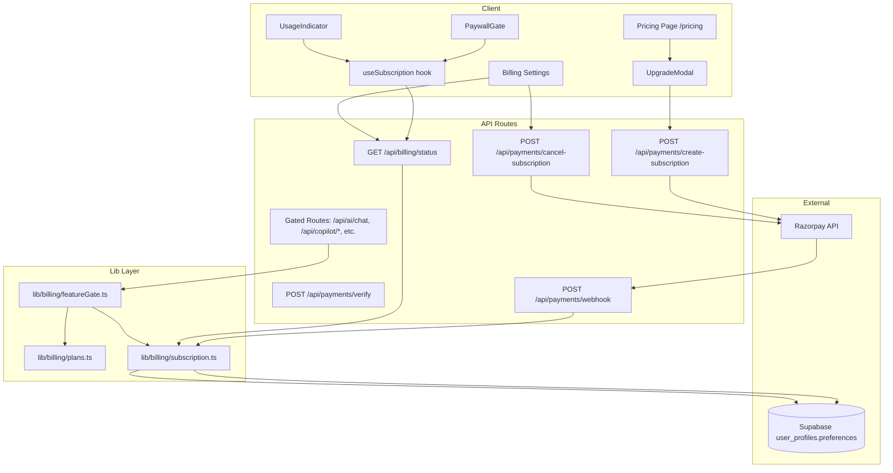
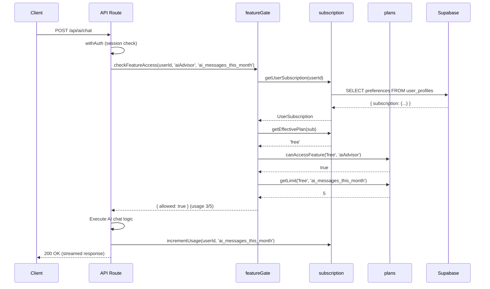
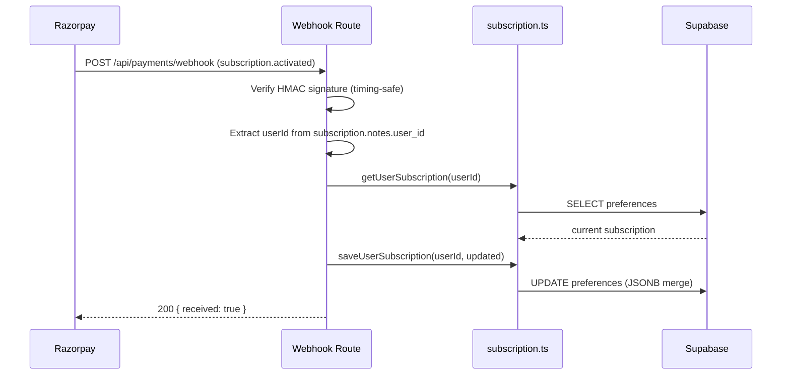

# Monetization & Paywall System — Design

## Overview

This design implements a complete monetization system for FamLedgerAI with three subscription tiers (Free, Pro, NRI Premium) using Razorpay subscriptions. The system stores all subscription state in the existing `user_profiles.preferences` JSONB column, requiring zero database schema changes.

The architecture follows a layered approach:
1. **Data layer** — centralized plan config + subscription state in JSONB
2. **Gate layer** — server-side `checkFeatureAccess()` for API routes, client-side `<PaywallGate>` for UI
3. **Payment layer** — Razorpay subscription lifecycle (create → activate → charge → cancel)
4. **UI layer** — pricing page, upgrade modal, usage indicators, billing settings

All new API routes follow the existing security pattern: `withErrorHandler(withAuth(withValidation(schema, handler)))`.

## Architecture



### Request Flow — Feature Gate Check



### Webhook Flow — Subscription Lifecycle



## Components and Interfaces

### 1. `lib/billing/plans.ts` — Plan Configuration (Requirement 1)

```typescript
// Feature flags — 13 boolean gates
export type PlanFeature =
  | 'aiAdvisor' | 'aiCopilot' | 'insurancePDFAnalysis'
  | 'monteCarlo' | 'zerodhaKiteSync' | 'nriReturnPlanner'
  | 'exportToPDF' | 'familySharing' | 'budgetAlerts'
  | 'goalTracking' | 'loanTracker' | 'dailyBriefing'
  | 'prioritySupport';

// Usage metrics — 3 counters
export type UsageMetric =
  | 'ai_messages_this_month'
  | 'insurance_analyses_this_month'
  | 'ai_copilot_runs_this_month';

export type PlanId = 'free' | 'pro' | 'nri_premium';
export type BillingCycle = 'monthly' | 'annual';

export interface PlanConfig {
  id: PlanId;
  name: string;
  description: string;
  monthlyPrice: number;        // INR
  annualPrice: number;         // INR total/year
  annualMonthlyEquivalent: number; // INR per month when annual
  annualSavingPercent: number;
  features: Record<PlanFeature, boolean>;
  limits: Record<UsageMetric, number | 'unlimited'>;
  razorpayPlanIds: { monthly: string; annual: string };
  badge?: string;
  color: string;
}

export const PLANS: Record<PlanId, PlanConfig> = { /* ... */ };

export function getPlan(planId: PlanId): PlanConfig;
export function canAccessFeature(planId: PlanId, feature: PlanFeature): boolean;
export function getLimit(planId: PlanId, metric: UsageMetric): number | 'unlimited';
export function getMinimumPlanForFeature(feature: PlanFeature): PlanId;
```

### 2. `lib/billing/subscription.ts` — Subscription State (Requirement 2)

```typescript
export type SubscriptionStatus = 'active' | 'cancelled' | 'past_due' | 'expired' | 'trial';

export interface UsageCounters {
  ai_messages_this_month: number;
  insurance_analyses_this_month: number;
  ai_copilot_runs_this_month: number;
  usage_reset_date: string; // ISO date — first of current month
}

export interface UserSubscription {
  plan_id: PlanId;
  status: SubscriptionStatus;
  billing_cycle: BillingCycle | null;
  current_period_start: string | null;  // ISO datetime
  current_period_end: string | null;    // ISO datetime
  razorpay_subscription_id: string | null;
  razorpay_customer_id: string | null;
  cancelled_at: string | null;
  usage: UsageCounters;
}

export function getDefaultSubscription(): UserSubscription;
export function getUserSubscription(userId: string, supabase: any): Promise<UserSubscription>;
export function saveUserSubscription(userId: string, sub: UserSubscription, supabase: any): Promise<void>;
export function incrementUsage(userId: string, metric: UsageMetric, supabase: any): Promise<void>;
export function isSubscriptionActive(sub: UserSubscription): boolean;
export function getEffectivePlan(sub: UserSubscription): PlanId;
```

**Key behaviors:**
- `getUserSubscription` reads `preferences.subscription` from `user_profiles`, returns `getDefaultSubscription()` if missing
- Auto-resets usage counters: if `usage_reset_date` is before the 1st of the current month, zero all counters and update `usage_reset_date`
- `saveUserSubscription` uses Supabase's JSONB merge: reads current `preferences`, sets `preferences.subscription`, writes back — preserving other JSONB keys (e.g., `kite_connected_at`)
- `incrementUsage` reads subscription, increments the counter, saves back (single read-modify-write)
- `isSubscriptionActive`: free plan → always true; paid plans → `status === 'active' && current_period_end > now`; cancelled → true if `current_period_end > now`
- `getEffectivePlan`: returns `'free'` if subscription inactive, otherwise `plan_id`

### 3. `lib/billing/featureGate.ts` — Feature Gate (Requirement 3)

```typescript
export type GateReason = 'locked' | 'limit_reached' | 'subscription_expired';

export interface GateResult {
  allowed: boolean;
  reason?: GateReason;
  currentUsage?: number;
  limit?: number | 'unlimited';
  upgradeRequired?: PlanId;
  message?: string;
}

export async function checkFeatureAccess(
  userId: string,
  feature: PlanFeature,
  usageMetric: UsageMetric | null,
  supabase: any
): Promise<GateResult>;
```

**Algorithm:**
1. `getUserSubscription(userId, supabase)` → sub
2. `getEffectivePlan(sub)` → effectivePlan
3. `canAccessFeature(effectivePlan, feature)` → if false: return `{ allowed: false, reason: 'locked', upgradeRequired: getMinimumPlanForFeature(feature), message: '...' }`
4. If `usageMetric` is provided: `getLimit(effectivePlan, usageMetric)` → limit. If limit !== 'unlimited' and `sub.usage[usageMetric] >= limit`: return `{ allowed: false, reason: 'limit_reached', currentUsage, limit, message: '...' }`
5. Return `{ allowed: true, currentUsage, limit }`

### 4. API Routes

#### `POST /api/payments/create-subscription` (Requirement 4)

```typescript
// Zod schema
const createSubscriptionSchema = z.object({
  planId: z.enum(['pro', 'nri_premium']),
  billingCycle: z.enum(['monthly', 'annual']),
});

// Handler: withErrorHandler(withAuth(withValidation(schema, handler)))
// 1. Get user subscription → reuse razorpay_customer_id or create new customer
// 2. Look up razorpay plan ID from env vars via PLANS[planId].razorpayPlanIds[billingCycle]
// 3. razorpay.subscriptions.create({ plan_id, customer_id, total_count, notes: { user_id, plan_id } })
// 4. Return { subscriptionId, customerId, razorpayKeyId, amount, currency, planName, billingCycle }
```

#### `POST /api/payments/cancel-subscription` (Requirement 6)

```typescript
// Handler: withErrorHandler(withAuth(async handler))
// 1. getUserSubscription → check razorpay_subscription_id exists and status is active
// 2. razorpay.subscriptions.cancel(id, { cancel_at_cycle_end: true })
// 3. Update subscription: status = 'cancelled', cancelled_at = now
// 4. Return { message, accessUntil: current_period_end }
```

#### `GET /api/billing/status` (Requirement 7)

```typescript
// Handler: withErrorHandler(withAuth(async handler))
// 1. getUserSubscription(userId)
// 2. getPlan(effectivePlan) → strip razorpayPlanIds
// 3. Calculate daysRemaining from current_period_end
// 4. Calculate usagePercents: for each metric, null if unlimited, else (current/limit)*100
// 5. Return { subscription, plan, daysRemaining, usagePercents }
```

#### Webhook Extensions (Requirement 5)

The existing `POST /api/payments/webhook` route is extended with a switch on `event.event`:

| Event | Action |
|-------|--------|
| `subscription.activated` | Set `status: 'active'`, `plan_id` from notes, `current_period_end` from `next_billing_at` |
| `subscription.charged` | Extend `current_period_end` by billing cycle duration, `status: 'active'` |
| `subscription.cancelled` | Set `status: 'cancelled'`, `cancelled_at: now`, keep plan active until period end |
| `subscription.completed` | Set `status: 'expired'`, plan remains until period end then effectively free |
| `subscription.halted` | Set `status: 'past_due'` |

### 5. Client Components

#### `useSubscription` Hook (Requirement 11)

```typescript
// src/hooks/useSubscription.ts
interface UseSubscriptionReturn {
  plan: PlanConfig | null;
  subscription: UserSubscription | null;
  canAccess: (feature: PlanFeature) => boolean;
  getUsage: (metric: UsageMetric) => { current: number; limit: number | 'unlimited'; percent: number | null };
  isLoading: boolean;
  refresh: () => void;
}

export function useSubscription(): UseSubscriptionReturn;
// Fetches GET /api/billing/status with 5-minute SWR-style cache
// canAccess checks plan.features[feature]
// getUsage returns current/limit/percent from cached data
```

#### `PaywallGate` Component (Requirement 11)

```typescript
interface PaywallGateProps {
  feature: PlanFeature;
  requiredPlan?: PlanId;
  children: React.ReactNode;
  fallback?: React.ReactNode;
}
// If canAccess(feature) → render children
// Else → render lock overlay with feature name, required plan, "Upgrade to unlock" button → UpgradeModal
```

#### `UsageIndicator` Component (Requirement 12)

```typescript
interface UsageIndicatorProps {
  metric: UsageMetric;
  current: number;
  limit: number | 'unlimited';
}
// If unlimited → render nothing
// If limited → progress bar with "[current]/[limit] used this month"
// >80% → orange, at limit → red + "Upgrade for more →"
```

#### `UpgradeModal` (Requirement 10) — Refactored

The existing `UpgradeModal.tsx` is refactored to:
- Accept `feature?` and `requiredPlan?` props for contextual upgrade prompts
- Add monthly/annual billing toggle with savings callout
- Call `/api/payments/create-subscription` instead of `/api/payments/create-order`
- Open Razorpay checkout with `subscription_id` instead of `order_id`
- Show "Secured by Razorpay. Cancel anytime." footer

#### Pricing Page (Requirement 9)

Public page at `/pricing` with:
- Three-column card grid (Free, Pro, NRI Premium)
- Monthly/Annual toggle showing per-month equivalent + savings badge
- Feature comparison table (13 rows)
- FAQ accordion (4 questions)
- CTA routing: Free → `/register`, paid → UpgradeModal or `/register` if unauthenticated

## Data Models

### Subscription State in `user_profiles.preferences` JSONB

The subscription is stored as a nested object within the existing `preferences` JSONB column:

```json
{
  "kite_connected_at": "2024-01-15T10:00:00Z",
  "email_preferences": { "weekly_summary": true },
  "subscription": {
    "plan_id": "pro",
    "status": "active",
    "billing_cycle": "monthly",
    "current_period_start": "2024-06-01T00:00:00Z",
    "current_period_end": "2024-07-01T00:00:00Z",
    "razorpay_subscription_id": "sub_abc123",
    "razorpay_customer_id": "cust_xyz789",
    "cancelled_at": null,
    "usage": {
      "ai_messages_this_month": 3,
      "insurance_analyses_this_month": 0,
      "ai_copilot_runs_this_month": 0,
      "usage_reset_date": "2024-06-01"
    }
  }
}
```

### JSONB Merge Strategy

To avoid overwriting other preferences keys:

```typescript
// Read current preferences
const { data } = await supabase
  .from('user_profiles')
  .select('preferences')
  .eq('auth_uid', userId)
  .single();

const currentPrefs = data?.preferences ?? {};

// Merge subscription into preferences
await supabase
  .from('user_profiles')
  .update({
    preferences: { ...currentPrefs, subscription: updatedSubscription }
  })
  .eq('auth_uid', userId);
```

### Plan Configuration Data

| Field | Free | Pro | NRI Premium |
|-------|------|-----|-------------|
| Monthly Price | ₹0 | ₹299 | ₹499 |
| Annual Price | ₹0 | ₹2,499/yr | ₹3,999/yr |
| Annual Monthly Eq. | ₹0 | ₹208/mo | ₹333/mo |
| Annual Saving | 0% | 30% | 33% |
| AI Advisor | 5/mo | unlimited | unlimited |
| AI Copilot | 0 | 30/mo | unlimited |
| Insurance PDF | 1/mo | unlimited | unlimited |
| Monte Carlo | ✗ | ✓ | ✓ |
| Kite Sync | ✗ | ✓ | ✓ |
| NRI Return Planner | ✗ | ✗ | ✓ |
| Export PDF | ✗ | ✓ | ✓ |
| Family Sharing | ✓ | ✓ | ✓ |
| Budget Alerts | ✓ | ✓ | ✓ |
| Goal Tracking | ✓ | ✓ | ✓ |
| Loan Tracker | ✓ | ✓ | ✓ |
| Daily Briefing | ✗ | ✓ | ✓ |
| Priority Support | ✗ | ✗ | ✓ |

### Usage Limits

| Metric | Free | Pro | NRI Premium |
|--------|------|-----|-------------|
| `ai_messages_this_month` | 5 | unlimited | unlimited |
| `insurance_analyses_this_month` | 1 | unlimited | unlimited |
| `ai_copilot_runs_this_month` | 0 | 30 | unlimited |


## Correctness Properties

*A property is a characteristic or behavior that should hold true across all valid executions of a system — essentially, a formal statement about what the system should do. Properties serve as the bridge between human-readable specifications and machine-verifiable correctness guarantees.*

### Property 1: Plan lookup consistency

*For any* valid `PlanId` and any `PlanFeature` or `UsageMetric`, `getPlan(planId).features[feature]` must equal `canAccessFeature(planId, feature)`, and `getPlan(planId).limits[metric]` must equal `getLimit(planId, metric)`.

**Validates: Requirements 1.3, 1.4, 1.5**

### Property 2: Plan config completeness

*For any* plan in the `PLANS` record, the plan must have exactly 13 boolean feature flags, exactly 3 usage metric limits, and all required fields (`id`, `name`, `description`, `monthlyPrice`, `annualPrice`, `annualMonthlyEquivalent`, `annualSavingPercent`, `color`, `razorpayPlanIds` with `monthly` and `annual`).

**Validates: Requirements 1.2**

### Property 3: Subscription default fallback

*For any* userId where `preferences.subscription` is `null` or `undefined`, `getUserSubscription(userId, supabase)` must return a subscription equal to `getDefaultSubscription()` — which has `plan_id: 'free'`, `status: 'active'`, and all usage counters at 0.

**Validates: Requirements 2.3**

### Property 4: Usage counter monthly reset

*For any* `UserSubscription` where `usage.usage_reset_date` is before the first day of the current month, calling `getUserSubscription` must return a subscription with all three usage counters reset to 0 and `usage_reset_date` set to the first of the current month.

**Validates: Requirements 2.4**

### Property 5: Preferences JSONB merge preservation

*For any* existing `preferences` object containing arbitrary keys (e.g., `kite_connected_at`, `email_preferences`), calling `saveUserSubscription` must preserve all non-subscription keys unchanged while updating only the `subscription` key.

**Validates: Requirements 2.5**

### Property 6: Usage increment invariant

*For any* `UserSubscription` and any `UsageMetric`, calling `incrementUsage(userId, metric)` must result in `subscription.usage[metric]` being exactly 1 greater than before the call, with all other usage counters unchanged.

**Validates: Requirements 2.6**

### Property 7: Subscription active calculation

*For any* `UserSubscription`: if `plan_id` is `'free'`, `isSubscriptionActive` must return `true`; if `plan_id` is paid and `status` is `'active'` with `current_period_end` in the future, must return `true`; if `plan_id` is paid and `status` is `'cancelled'` with `current_period_end` in the future, must return `true`; otherwise must return `false`.

**Validates: Requirements 2.7**

### Property 8: Effective plan resolution

*For any* `UserSubscription`, `getEffectivePlan(sub)` must return `'free'` when `isSubscriptionActive(sub)` is `false`, and must return `sub.plan_id` when `isSubscriptionActive(sub)` is `true`.

**Validates: Requirements 2.8**

### Property 9: Feature gate result correctness

*For any* userId, feature, and optional usageMetric: if `canAccessFeature(effectivePlan, feature)` is `false`, then `checkFeatureAccess` must return `{ allowed: false, reason: 'locked', upgradeRequired }` where `upgradeRequired` is `'nri_premium'` for NRI-only features and `'pro'` for all others. If the feature is accessible but `usage >= limit`, must return `{ allowed: false, reason: 'limit_reached' }` with correct `currentUsage` and `limit`. If accessible and under limit, must return `{ allowed: true }`.

**Validates: Requirements 3.1, 3.2, 3.3, 3.5**

### Property 10: Subscription creation input validation

*For any* input to `create-subscription`, if `planId` is not `'pro'` or `'nri_premium'`, or `billingCycle` is not `'monthly'` or `'annual'`, the request must be rejected with a validation error. Valid combinations must be accepted.

**Validates: Requirements 4.1, 4.2**

### Property 11: Price to paise conversion

*For any* plan and billing cycle, the amount returned by `create-subscription` must equal the plan's price (monthly or annual) multiplied by 100.

**Validates: Requirements 4.6**

### Property 12: Webhook event state transitions

*For any* Razorpay subscription webhook event with a valid `notes.user_id`: `subscription.activated` must set `status: 'active'` and `plan_id` from notes; `subscription.charged` must extend `current_period_end` and set `status: 'active'`; `subscription.cancelled` must set `status: 'cancelled'` and `cancelled_at` to current time; `subscription.completed` must set `status: 'expired'`; `subscription.halted` must set `status: 'past_due'`.

**Validates: Requirements 5.1, 5.2, 5.3, 5.4, 5.5, 5.6**

### Property 13: Billing status usage percent calculation

*For any* subscription and plan, `usagePercents` for each metric must be `null` when the plan limit is `'unlimited'`, and must equal `Math.round((currentUsage / limit) * 100)` clamped to 0–100 when the limit is a number.

**Validates: Requirements 7.2, 7.3**

### Property 14: PaywallGate conditional rendering

*For any* feature and user subscription state, `PaywallGate` must render its `children` when `canAccess(feature)` returns `true`, and must render the locked fallback UI (with upgrade button targeting the minimum required plan) when `canAccess(feature)` returns `false`.

**Validates: Requirements 11.2, 11.3**

### Property 15: UsageIndicator conditional rendering

*For any* `UsageIndicator` with `limit` set to `'unlimited'`, the component must render nothing. For any numeric `limit`, it must render a progress bar. When `current / limit > 0.8`, the color must be orange. When `current >= limit`, the color must be red and an "Upgrade for more" link must be present.

**Validates: Requirements 12.2, 12.3, 12.4**

## Error Handling

### API Error Responses

All API routes use the existing `apiError()` utility for consistent error formatting:

| Scenario | HTTP Status | Error Code | Extra Fields |
|----------|-------------|------------|--------------|
| No auth session | 401 | `UNAUTHORIZED` | — |
| Feature locked by plan | 402 | `RATE_LIMITED` | `upgradeRequired`, `currentUsage`, `limit` |
| Usage limit reached | 402 | `RATE_LIMITED` | `upgradeRequired`, `currentUsage`, `limit` |
| Invalid input (Zod) | 400 | `VALIDATION_ERROR` | Zod error messages |
| No active subscription to cancel | 404 | `NOT_FOUND` | — |
| Invalid webhook signature | 400 | `FORBIDDEN` | — |
| Razorpay API failure | 500 | `INTERNAL_ERROR` | — (safe message, no stack trace) |
| Missing env vars | 503 | `SERVICE_UNAVAILABLE` | — |

### Client-Side Error Handling

- `useSubscription` hook: returns `isLoading: true` during fetch, falls back to free plan defaults on error
- `UpgradeModal`: shows toast on payment failure, does not expose Razorpay error details to user
- `PaywallGate`: shows locked state (not error state) when subscription fetch fails — safe default
- Network errors on `/api/billing/status`: cached data used if available, otherwise assume free plan

### Webhook Resilience

- Webhook returns `200 { received: true }` even for unknown event types (Razorpay retries on non-2xx)
- Missing `notes.user_id` in webhook payload: log warning, skip processing, return 200
- Supabase write failure in webhook: log error, return 200 (Razorpay will retry, and next charge event will correct state)

### JSONB Merge Safety

- `saveUserSubscription` always reads current preferences before writing to prevent overwriting other keys
- If `preferences` column is `null`, initializes with `{ subscription: ... }`
- Race condition mitigation: usage increments use read-modify-write within a single request context; for high-concurrency scenarios, the existing `increment_ai_credits` RPC pattern can be extended

## Testing Strategy

### Property-Based Testing

**Library:** `fast-check` (already available in the Node.js ecosystem, works with Vitest)

**Configuration:**
- Minimum 100 iterations per property test
- Each test tagged with: `Feature: monetization-paywall-system, Property {N}: {title}`
- Tests located in `tests/billing/` directory

**Properties to implement as PBT:**

| Property | Test File | Generator Strategy |
|----------|-----------|-------------------|
| P1: Plan lookup consistency | `plans.property.test.ts` | Generate random PlanId × PlanFeature × UsageMetric |
| P2: Plan config completeness | `plans.property.test.ts` | Iterate all plans, check structure |
| P3: Subscription default fallback | `subscription.property.test.ts` | Generate random userIds with null preferences |
| P4: Usage counter monthly reset | `subscription.property.test.ts` | Generate subscriptions with past reset dates |
| P5: Preferences JSONB merge | `subscription.property.test.ts` | Generate random preferences objects, save subscription, verify other keys preserved |
| P6: Usage increment invariant | `subscription.property.test.ts` | Generate random subscriptions and metrics, increment, verify +1 |
| P7: Subscription active calculation | `subscription.property.test.ts` | Generate subscriptions with various plan_id/status/date combinations |
| P8: Effective plan resolution | `subscription.property.test.ts` | Generate subscriptions, verify effective plan matches active status |
| P9: Feature gate correctness | `featureGate.property.test.ts` | Generate random plan/feature/usage combinations, verify gate result |
| P10: Subscription creation validation | `createSubscription.property.test.ts` | Generate random strings for planId/billingCycle, verify validation |
| P11: Price to paise conversion | `createSubscription.property.test.ts` | Generate valid plan/cycle combos, verify amount = price × 100 |
| P12: Webhook state transitions | `webhook.property.test.ts` | Generate webhook payloads for each event type, verify state changes |
| P13: Usage percent calculation | `billingStatus.property.test.ts` | Generate random usage/limit combos, verify percent calculation |
| P14: PaywallGate rendering | `paywallGate.property.test.ts` | Generate feature/access combos, verify render output |
| P15: UsageIndicator rendering | `usageIndicator.property.test.ts` | Generate random current/limit values, verify color and content rules |

### Unit Testing

Unit tests complement property tests for specific examples and edge cases:

- **Plan config examples:** Verify exact Free/Pro/NRI Premium values (prices, limits, features) from Requirements 1.6, 1.7, 1.8
- **Default subscription example:** Verify exact shape of `getDefaultSubscription()` (Requirement 2.2)
- **Cancel without subscription:** Verify 404 response (Requirement 6.2)
- **Webhook unknown event:** Verify 200 response with no state change
- **Edge cases:** Usage at exactly the limit boundary, subscription expiring at exact current time, empty preferences column

### Integration Testing

- Razorpay subscription creation with mocked Razorpay SDK
- Full webhook flow: signature verification → event processing → state update
- Feature gate on actual API routes with mocked Supabase
- UpgradeModal → create-subscription → Razorpay checkout flow (E2E)
