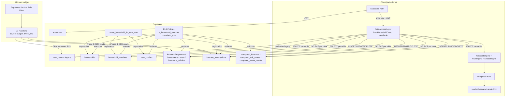
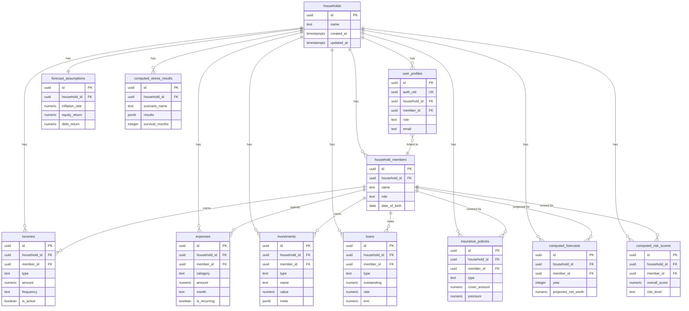
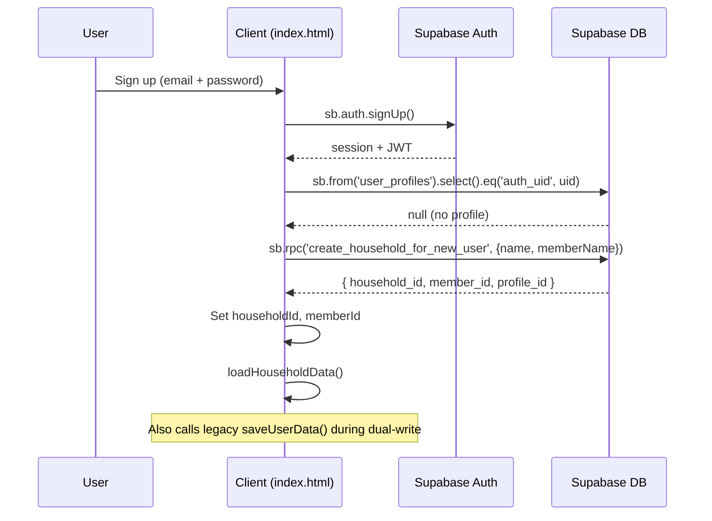
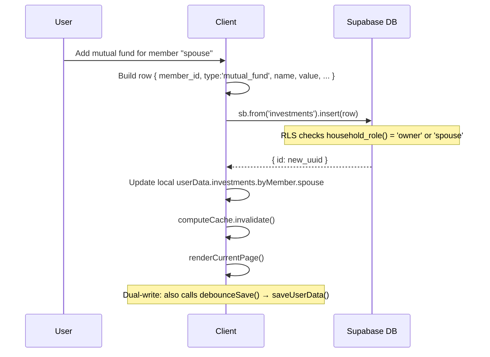

# Design Document: Normalized Supabase Schema (Phase 1.6)

## Overview

This feature migrates FamLedgerAI from a single `user_data` table (one JSON blob per email) to 12 normalized, household-scoped Postgres tables with Row-Level Security (RLS). The migration preserves the existing single-file vanilla JS architecture (`index.html`) and the server-side API (`api/[...catchall].js`) while introducing a thin data access layer (DAL) that replaces `loadUserData(email)` / `saveUserData(email)` with per-table Supabase queries.

The migration follows a three-phase rollout:

1. **DDL Phase**: Run the SQL migration to create all 12 tables, RLS policies, indexes, and helper functions alongside the existing `user_data` table.
2. **Dual-Write Phase**: The client writes to both `user_data` (legacy) and normalized tables simultaneously. Reads still come from `user_data`. A backfill script populates normalized tables for existing users.
3. **Cutover Phase**: Flip reads to normalized tables, stop writing to `user_data`, verify, then archive `user_data`.

The existing `user_data` table remains intact and functional throughout. Zero downtime is maintained by keeping the legacy read path active until cutover.

## Architecture



### Entity Relationship Diagram



### Design Decisions

1. **Household as the root scope**: Every financial table has `household_id` as the partition key. This maps directly to the existing `user_data` row-per-email model but supports multi-user households (spouse login, future family sharing).

2. **RLS via helper functions, not inline subqueries**: `is_household_member(hid)` and `household_role(hid)` are `SECURITY DEFINER` functions that query `user_profiles`. This keeps policies DRY and avoids the Postgres RLS infinite-recursion trap (user_profiles referencing itself).

3. **Bootstrap function for chicken-and-egg**: `create_household_for_new_user()` is `SECURITY DEFINER` because a new user has no `user_profiles` row yet (needed for RLS), but needs to create one. The function atomically creates household → member → profile → default assumptions.

4. **Client-side anon key for reads, service role for AI handlers**: The client uses the anon key (subject to RLS) for all CRUD. The API catchall continues using `SUPABASE_SERVICE_ROLE_KEY` for AI handlers that need cross-user data access. During dual-write, the API reads from `user_data`; after cutover, it reads from normalized tables.

5. **Dual-write with legacy fallback**: During migration, `saveTable()` writes to normalized tables AND calls the legacy `saveUserData()` to keep `user_data` in sync. This allows instant rollback by simply reverting the client code.

6. **Per-member attribution preserved**: The existing `byMember` pattern (expenses, investments, loans, insurance) maps directly to `member_id` FK in each normalized table. The DAL reconstructs the `byMember` shape for backward compatibility with existing engine functions.

7. **Computed tables as cache, not source of truth**: `computed_forecasts`, `computed_risk_scores`, and `computed_stress_results` are write-behind caches. Engines still run client-side; results are persisted for the Overview page to load without re-running engines.

## Components and Interfaces

### Data Access Layer (DAL)

The DAL is a set of functions added to the `<script>` block in `index.html`, replacing the monolithic `loadUserData` / `saveUserData` pair. During dual-write, both paths are active.

```javascript
// ========== DATA ACCESS LAYER (DAL) ==========

// State: household context (set after login/bootstrap)
let householdId = null;
let memberId = null;     // current user's member_id
let memberMap = {};       // { memberId: { name, role } } — loaded once

/**
 * bootstrapHousehold(householdName, memberName)
 * Called once during first login (no user_profiles row exists).
 * Calls the SECURITY DEFINER function create_household_for_new_user().
 * Returns { household_id, member_id, profile_id }.
 */
async function bootstrapHousehold(householdName, memberName) { /* ... */ }

/**
 * loadHouseholdContext()
 * Called on every login after auth. Loads user_profiles for current auth.uid(),
 * sets householdId, memberId, memberMap.
 * If no profile exists → triggers bootstrapHousehold().
 */
async function loadHouseholdContext() { /* ... */ }

/**
 * loadHouseholdData()
 * Replaces loadUserData(email). Loads all tables for the current household
 * in parallel and reconstructs the userData shape for backward compatibility.
 * 
 * Queries (all filtered by household_id, RLS-enforced):
 *   - household_members → memberMap + userData.profile.familyMembers
 *   - incomes → userData.income (aggregated)
 *   - expenses → userData.expenses.byMonth.byMember
 *   - investments → userData.investments.byMember
 *   - loans → userData.loans.byMember
 *   - insurance_policies → userData.insurance.byMember
 *   - forecast_assumptions → userData.profile.forecastAssumptions
 *   - computed_forecasts (optional, for cache warm)
 *   - computed_risk_scores (optional)
 *   - computed_stress_results (optional)
 */
async function loadHouseholdData() { /* ... */ }

/**
 * saveTable(tableName, rows, options)
 * Generic upsert for a single normalized table.
 * Automatically sets household_id on each row.
 * During dual-write phase, also calls legacy saveUserData().
 * 
 * tableName: 'incomes' | 'expenses' | 'investments' | 'loans' | 'insurance_policies' | ...
 * rows: Array of row objects (without household_id — injected by DAL)
 * options: { memberId?, upsertKey? }
 */
async function saveTable(tableName, rows, options = {}) { /* ... */ }

/**
 * deleteRow(tableName, rowId)
 * Deletes a single row by UUID. RLS enforces household scope.
 */
async function deleteRow(tableName, rowId) { /* ... */ }

/**
 * saveComputedResults(type, data)
 * Persists engine output to computed_forecasts / computed_risk_scores / computed_stress_results.
 * Called after engine runs, not on every edit.
 * type: 'forecasts' | 'risk_scores' | 'stress_results'
 */
async function saveComputedResults(type, data) { /* ... */ }
```

### Registration Flow Changes



### CRUD Flow (Example: Add Investment)



### API Layer Changes (catchall.js)

During dual-write, the API continues reading from `user_data` via service role key. After cutover:

```javascript
// Current pattern (unchanged during dual-write):
const { data } = await supabase.from('user_data').select('*').eq('email', email).maybeSingle();

// Post-cutover pattern for AI handlers that need user financial data:
async function loadNormalizedUserData(authUid) {
    // 1. Get user_profiles → household_id
    const { data: profile } = await supabase
        .from('user_profiles').select('*').eq('auth_uid', authUid).single();
    const hhId = profile.household_id;

    // 2. Parallel fetch all financial tables
    const [incomes, expenses, investments, loans, insurance] = await Promise.all([
        supabase.from('incomes').select('*').eq('household_id', hhId),
        supabase.from('expenses').select('*').eq('household_id', hhId),
        supabase.from('investments').select('*').eq('household_id', hhId),
        supabase.from('loans').select('*').eq('household_id', hhId),
        supabase.from('insurance_policies').select('*').eq('household_id', hhId),
    ]);

    // 3. Reconstruct userData-compatible shape for AI prompt context
    return reconstructUserData(profile, incomes.data, expenses.data,
        investments.data, loans.data, insurance.data);
}
```

The `resolveUserId()` helper is updated to also check `user_profiles` by email:

```javascript
async function resolveUserId(userIdOrEmail) {
    // ... existing UUID check ...
    // Try normalized table first
    const { data: profile } = await supabase
        .from('user_profiles').select('id, auth_uid')
        .eq('email', userIdOrEmail).maybeSingle();
    if (profile) return profile.auth_uid;
    // Fallback to legacy user_data
    const { data } = await supabase.from('user_data').select('id')
        .eq('email', userIdOrEmail).maybeSingle();
    return data?.id || null;
}
```

### Migration Strategy

#### Phase 1: DDL (Day 1)

1. Back up `user_data`: `CREATE TABLE user_data_backup AS SELECT * FROM user_data;`
2. Run `NORMALIZED_SCHEMA_MIGRATION.sql` in Supabase SQL Editor
3. Verify with the verification queries at the bottom of the migration file
4. No client changes yet — app continues using `user_data` exclusively

#### Phase 2: Dual-Write + Backfill (Days 2–5)

1. Deploy client code with DAL functions
2. New registrations go through `create_household_for_new_user()` AND legacy `saveUserData()`
3. Existing user edits write to both normalized tables and `user_data`
4. Run backfill script (server-side, using service role key):

```javascript
// Backfill pseudocode — runs once per existing user_data row
async function backfillUser(row) {
    const email = row.email;
    const profile = row.profile || {};
    const authUid = profile._authUid;
    if (!authUid) { console.warn('Skip: no _authUid for', email); return; }

    // 1. Create household
    const { data: hh } = await supabase.from('households')
        .insert({ name: profile.name + "'s Family" }).select().single();

    // 2. Create household_members from familyMembers
    const members = profile.familyMembers || [{ id: 'self', name: profile.name, role: 'self' }];
    const memberRows = members.map(m => ({
        household_id: hh.id, name: m.name, role: m.role || 'other'
    }));
    const { data: insertedMembers } = await supabase
        .from('household_members').insert(memberRows).select();
    const memberIdMap = {}; // old id → new UUID
    members.forEach((m, i) => { memberIdMap[m.id] = insertedMembers[i].id; });

    // 3. Create user_profile
    await supabase.from('user_profiles').insert({
        auth_uid: authUid, household_id: hh.id,
        member_id: memberIdMap['self'], role: 'owner', email
    });

    // 4. Insert financial data per member
    // ... incomes, expenses, investments, loans, insurance_policies
    // Maps byMember keys to memberIdMap UUIDs

    // 5. Insert forecast_assumptions from profile.forecastAssumptions
    // 6. Optionally insert computed_* from last engine run
}
```

#### Phase 3: Cutover (Days 6–7)

1. Switch `loadHouseholdData()` to be the primary read path (remove `loadUserData` calls)
2. Stop dual-write to `user_data`
3. Monitor for 24–48 hours
4. Archive: `ALTER TABLE user_data RENAME TO user_data_archived;`

#### Rollback

At any point during Phase 2–3:
- Revert client code to use `loadUserData` / `saveUserData` exclusively
- `user_data` is always up-to-date during dual-write
- Normalized tables can be dropped without data loss: `DROP TABLE ... CASCADE` in reverse dependency order

## Data Models

### Mapping: Legacy userData → Normalized Tables

| Legacy `userData` field | Normalized table | Key mapping |
|------------------------|-----------------|-------------|
| `profile.name`, `profile.age`, `profile.email` | `user_profiles` + `household_members` | `auth_uid` → `user_profiles.auth_uid`, member fields → `household_members` |
| `profile.familyMembers[]` | `household_members` | `{id, name, role}` → `{id, name, role}` with UUID PK |
| `profile.forecastAssumptions` | `forecast_assumptions` | Flat columns instead of nested JSON |
| `income.husband`, `income.wife`, `income.rental` | `incomes` | One row per income source per member |
| `expenses.byMonth[month].byMember[memberId][]` | `expenses` | One row per expense, `month` column = 'YYYY-MM' |
| `investments.byMember[memberId].mutualFunds[]` | `investments` | `type = 'mutual_fund'`, one row per fund |
| `investments.byMember[memberId].stocks[]` | `investments` | `type = 'stock'`, one row per stock |
| `investments.byMember[memberId].fd[]` | `investments` | `type = 'fd'`, one row per FD |
| `investments.byMember[memberId].ppf[]` | `investments` | `type = 'ppf'`, one row per PPF |
| `loans.byMember[memberId][]` | `loans` | One row per loan |
| `insurance.byMember[memberId].term[]` | `insurance_policies` | `type = 'term'`, one row per policy |
| `insurance.byMember[memberId].health[]` | `insurance_policies` | `type = 'health'`, one row per policy |
| `liquidSavings` | `user_profiles.meta` or `incomes` (type='savings') | Design choice: store as income row with `type='liquid_savings'` |
| `termCover` | Derived: `SUM(cover_amount) FROM insurance_policies WHERE type='term'` | No longer stored separately |
| `schemes[]` | Not migrated in Phase 1.6 | Remains in `user_data` until Phase 2 |
| `bankAccounts[]` | Not migrated in Phase 1.6 | Remains in `user_data` until Phase 2 |

### Backward-Compatible userData Reconstruction

The DAL reconstructs the legacy `userData` shape from normalized rows so that all existing engine functions (`computeMonthlyIncome()`, `computeMonthlyExpenses()`, `getInvestmentsForMember()`, `getLoansForMember()`, etc.) continue working without modification:

```javascript
function reconstructUserData(profile, members, incomes, expenses,
                              investments, loans, insurance, assumptions) {
    // Build memberMap: uuid → { name, role, legacyId }
    const memberMap = {};
    members.forEach(m => {
        memberMap[m.id] = m;
        // Map back to legacy IDs for engine compatibility
        m.legacyId = m.role === 'self' ? 'self' :
                     m.role === 'spouse' ? 'spouse' :
                     'kid-' + m.name.toLowerCase();
    });

    // Reconstruct investments.byMember
    const investByMember = {};
    investments.forEach(inv => {
        const legacyId = memberMap[inv.member_id]?.legacyId || 'self';
        if (!investByMember[legacyId]) {
            investByMember[legacyId] = { mutualFunds:[], stocks:[], fd:[], ppf:[] };
        }
        const bucket = inv.type === 'mutual_fund' ? 'mutualFunds' :
                       inv.type === 'stock' ? 'stocks' :
                       inv.type === 'fd' ? 'fd' : 'ppf';
        investByMember[legacyId][bucket].push({
            id: inv.id, name: inv.name, value: inv.value,
            units: inv.units, nav: inv.nav, rate: inv.rate,
            purchaseDate: inv.purchase_date, maturityDate: inv.maturity_date,
            sipAmount: inv.sip_amount, ...inv.meta
        });
    });

    // Similar reconstruction for loans, insurance, expenses...
    return {
        profile: {
            ...profile,
            familyMembers: members.map(m => ({
                id: m.legacyId, name: m.name, role: m.role,
                _normalizedId: m.id  // preserve UUID for writes
            })),
            forecastAssumptions: assumptions ? {
                incomeGrowth: assumptions.salary_growth * 100,
                expenseInflation: assumptions.expense_growth * 100,
                equityReturn: assumptions.equity_return * 100,
                debtReturn: assumptions.debt_return * 100,
                medicalInflation: (assumptions.meta?.medicalInflation || 10),
                retirementAge: assumptions.retirement_age,
                lifeExpectancy: assumptions.life_expectancy
            } : {}
        },
        income: reconstructIncome(incomes, memberMap),
        expenses: reconstructExpenses(expenses, memberMap),
        investments: { byMember: investByMember },
        loans: reconstructLoans(loans, memberMap),
        insurance: reconstructInsurance(insurance, memberMap),
        schemes: [],       // not migrated yet
        bankAccounts: [],  // not migrated yet
        liquidSavings: extractLiquidSavings(incomes),
        termCover: insurance.filter(p => p.type === 'term')
                           .reduce((s, p) => s + (p.cover_amount || 0), 0)
    };
}
```

### RLS Policy Matrix

| Table | SELECT | INSERT | UPDATE | DELETE |
|-------|--------|--------|--------|--------|
| `households` | `is_household_member(id)` | `auth.uid() IS NOT NULL` | `household_role(id) = 'owner'` | `household_role(id) = 'owner'` |
| `household_members` | `is_household_member(household_id)` | `household_role IN ('owner','spouse')` | `household_role IN ('owner','spouse')` | `household_role IN ('owner','spouse')` |
| `user_profiles` | `auth_uid = auth.uid() OR is_household_member(household_id)` | `auth_uid = auth.uid()` | `auth_uid = auth.uid()` | `auth_uid = auth.uid()` |
| Financial tables* | `is_household_member(household_id)` | `household_role IN ('owner','spouse')` | `household_role IN ('owner','spouse')` | `household_role IN ('owner','spouse')` |
| `forecast_assumptions` | `is_household_member(household_id)` | `household_role IN ('owner','spouse')` | `household_role IN ('owner','spouse')` | — |
| Computed tables** | `is_household_member(household_id)` | `household_role IN ('owner','spouse')` | `household_role IN ('owner','spouse')` | `household_role IN ('owner','spouse')` |

\* incomes, expenses, investments, loans, insurance_policies
\** computed_forecasts, computed_risk_scores, computed_stress_results

### Index Strategy

| Index | Table | Columns | Query Pattern |
|-------|-------|---------|---------------|
| `idx_hm_household` | `household_members` | `(household_id)` | Load all family members |
| `idx_up_household` | `user_profiles` | `(household_id)` | RLS helper lookups |
| `idx_incomes_hh_member` | `incomes` | `(household_id, member_id)` | Per-member income aggregation |
| `idx_expenses_hh_member` | `expenses` | `(household_id, member_id)` | Per-member expense aggregation |
| `idx_expenses_hh_month` | `expenses` | `(household_id, month)` | Monthly budget tracking |
| `idx_investments_hh_member` | `investments` | `(household_id, member_id)` | Portfolio per member |
| `idx_investments_hh_type` | `investments` | `(household_id, type)` | Asset type breakdown |
| `idx_loans_hh_member` | `loans` | `(household_id, member_id)` | Debt per member |
| `idx_ip_hh_member` | `insurance_policies` | `(household_id, member_id)` | Coverage per member |
| `idx_cf_hh_year` | `computed_forecasts` | `(household_id, year)` | 15-year forecast series |
| `idx_crs_household` | `computed_risk_scores` | `(household_id)` | Latest risk snapshot |
| `idx_csr_household` | `computed_stress_results` | `(household_id)` | Latest stress results |

## Correctness Properties

*A property is a characteristic or behavior that should hold true across all valid executions of a system — essentially, a formal statement about what the system should do. Properties serve as the bridge between human-readable specifications and machine-verifiable correctness guarantees.*

### Property 1: Household-scoped SELECT isolation

*For any* authenticated user and *for any* table in {households, household_members, incomes, expenses, investments, loans, insurance_policies, forecast_assumptions, computed_forecasts, computed_risk_scores, computed_stress_results}, a SELECT query via the anon key should return rows only where the user has a `user_profiles` row linking them to the same `household_id`. Rows belonging to other households must never be returned.

**Validates: Requirements 1.3, 2.3, 4.3, 5.4, 6.4, 7.3, 8.3, 9.2, 10.4, 11.3, 12.3**

### Property 2: Owner/spouse write access

*For any* authenticated user with role 'owner' or 'spouse' in a household, and *for any* table in {household_members, incomes, expenses, investments, loans, insurance_policies, forecast_assumptions, computed_forecasts, computed_risk_scores, computed_stress_results}, INSERT, UPDATE, and DELETE operations on rows within that household should succeed (not be denied by RLS).

**Validates: Requirements 1.4, 2.4, 4.4, 5.5, 6.5, 7.4, 8.4, 9.3, 10.5, 11.4, 12.4**

### Property 3: Dependent write denial

*For any* authenticated user with role 'dependent' in a household, and *for any* table in {households, household_members, incomes, expenses, investments, loans, insurance_policies, forecast_assumptions}, INSERT, UPDATE, and DELETE operations should be denied by RLS, returning zero affected rows or an RLS error.

**Validates: Requirements 1.5, 2.5, 4.5, 5.6, 6.6, 7.5, 8.5, 9.4**

### Property 4: User profile self-access

*For any* authenticated user, a SELECT on `user_profiles` should return their own row (where `auth_uid = auth.uid()`) plus any rows belonging to the same household. An UPDATE on `user_profiles` should succeed only for the row where `auth_uid = auth.uid()` and fail for any other row, even within the same household.

**Validates: Requirements 3.4, 3.5**

### Property 5: RLS helper function correctness

*For any* authenticated user and *for any* household UUID, `is_household_member(hid)` should return TRUE if and only if a `user_profiles` row exists with `auth_uid = auth.uid()` and `household_id = hid`. Similarly, `household_role(hid)` should return the `role` value from that `user_profiles` row, or NULL if no such row exists.

**Validates: Requirements 13.1, 13.2**

### Property 6: Bootstrap atomicity

*For any* authenticated user who has no existing `user_profiles` row, calling `create_household_for_new_user(household_name, member_name)` should atomically create exactly one row in each of `households`, `household_members`, `user_profiles`, and `forecast_assumptions`, all linked by the same `household_id`. If the user already has a `user_profiles` row, the function should raise an exception and create nothing.

**Validates: Requirements 1.1, 2.1, 3.1, 9.1 (bootstrap path)**

### Property 7: Backfill round-trip

*For any* valid `user_data` row containing profile, income, expenses (byMonth/byMember), investments (byMember), loans (byMember), and insurance (byMember), running the backfill script to insert normalized rows and then running `reconstructUserData()` to rebuild the legacy shape should produce a `userData` object that is equivalent to the original (same member names, same financial amounts, same number of records per category).

**Validates: Requirements 14.3**

### Property 8: Unique constraint enforcement

*For any* household and member, inserting two `computed_forecasts` rows with the same `(household_id, member_id, year)` tuple should fail with a unique constraint violation. Similarly, *for any* two `user_profiles` rows with the same `auth_uid`, the second insert should fail.

**Validates: Requirements 3.3, 10.3**

## Error Handling

| Scenario | Handling | Fallback |
|----------|----------|----------|
| No `user_profiles` row on login | `loadHouseholdContext()` detects null → triggers `bootstrapHousehold()` | New household created automatically |
| `create_household_for_new_user` called twice | Function checks `EXISTS(user_profiles WHERE auth_uid)` → raises exception | Client catches error, proceeds with existing household |
| RLS denies write (dependent user) | Supabase returns `{ error: { code: '42501' } }` | Client shows "You don't have permission to edit this" toast |
| Network failure during `saveTable()` | Supabase client returns error | Client retries via `debounceSave()` timer; `user_data` dual-write serves as backup |
| Backfill encounters `user_data` row without `_authUid` | Backfill script logs warning and skips row | Row remains in `user_data` only; user gets bootstrapped on next login |
| Duplicate `computed_forecasts` insert (same household+member+year) | Unique constraint violation | Use `upsert` with `onConflict: 'household_id,member_id,year'` |
| Missing `household_id` on financial row insert | FK constraint violation | DAL always injects `householdId` from context; if null, operation is skipped with console.error |
| `user_data` and normalized tables diverge during dual-write | Normalized tables are source of truth after cutover | During dual-write, `user_data` is always written; after cutover, `user_data` is read-only archive |
| Member deleted while financial rows reference them | `ON DELETE CASCADE` on `member_id` FK | All financial rows for that member are automatically deleted |
| Household deleted | `ON DELETE CASCADE` propagates to all child tables | All household data removed atomically |

## Testing Strategy

### Dual Testing Approach

Testing uses both unit tests and property-based tests:

- **Property-based tests**: Verify the 8 correctness properties above using randomized inputs. Each property test runs a minimum of 100 iterations.
- **Unit tests**: Verify specific DDL structure (table existence, column types, index existence, RLS enabled), specific backfill examples, and edge cases.

### Property-Based Testing Configuration

- **Library**: [fast-check](https://github.com/dubzzz/fast-check) for JavaScript-based tests (DAL reconstruction, backfill round-trip). For RLS policy tests, use a Supabase test harness with `@supabase/supabase-js` creating clients with different JWT claims.
- **Minimum iterations**: 100 per property test
- **Tag format**: Each property test includes a comment referencing the design property:
  ```javascript
  // Feature: normalized-supabase-schema, Property 1: Household-scoped SELECT isolation
  ```
- **Each correctness property is implemented by a single property-based test.**

### Test Structure

RLS properties (P1–P5) require a live Supabase instance (or local Supabase via Docker) with test users of different roles. The test harness:
1. Creates a test household with owner, spouse, and dependent users
2. Inserts test data across all tables
3. For each property, creates a Supabase client authenticated as the relevant user role
4. Verifies SELECT/INSERT/UPDATE/DELETE behavior matches the property

DAL properties (P6–P8) can be tested with fast-check generators:
- P6: Generate random household names and member names, call bootstrap, verify 4 rows created
- P7: Generate random `userData` blobs with varying numbers of members, investments, loans, etc., run backfill + reconstruct, compare
- P8: Generate random (household_id, member_id, year) tuples, insert twice, verify constraint error

### Unit Test Coverage

| Test | What it verifies |
|------|-----------------|
| All 12 tables exist in `information_schema.tables` | DDL correctness (Req 1.1–12.1) |
| RLS enabled on all 12 tables via `pg_tables.rowsecurity` | RLS activation (Req 1.2) |
| All expected indexes exist via `pg_indexes` | Index strategy (Req 15.1–15.4) |
| Index comments exist via `pg_description` | Documentation (Req 15.5) |
| `households.name` is NOT NULL | Column constraint |
| `investments.type` CHECK constraint rejects invalid values | CHECK constraint |
| `computed_forecasts` UNIQUE on (household_id, member_id, year) | Dedup constraint |
| `user_profiles.auth_uid` UNIQUE constraint | One profile per auth user |
| Bootstrap with valid inputs → 4 rows created | Happy path (Req 14.3) |
| Bootstrap with existing profile → exception raised | Abuse prevention |
| Backfill of a known `user_data` row → correct normalized rows | Specific example |
| `reconstructUserData` with empty arrays → no crash | Edge case |
| `reconstructUserData` with single member, no investments → correct shape | Edge case |
| Dual-write: saveTable + saveUserData both succeed | Integration (Req 14.6) |

### Property Test Coverage

| Property | Generator strategy |
|----------|-------------------|
| P1: Household SELECT isolation | Random household pairs (A, B), random table from the 11 RLS-enabled tables, user in household A → verify zero rows from household B |
| P2: Owner/spouse write access | Random role ∈ {'owner','spouse'}, random table, random valid row → verify insert/update/delete succeed |
| P3: Dependent write denial | Random table from restricted set, random valid row, authenticated as dependent → verify operation denied |
| P4: User profile self-access | Random household with 2+ users, each user queries user_profiles → verify own row + household rows visible, update only own row |
| P5: Helper function correctness | Random (auth_uid, household_id) pairs, some matching user_profiles rows, some not → verify is_household_member and household_role return correct values |
| P6: Bootstrap atomicity | Random household/member name strings (non-empty, up to 100 chars) → verify exactly 4 rows created with correct FKs |
| P7: Backfill round-trip | Random userData blobs: 1–5 members, 0–10 investments per member (type ∈ valid set), 0–20 expenses, 0–5 loans, 0–5 insurance policies → backfill then reconstruct → compare |
| P8: Unique constraint enforcement | Random (household_id, member_id, year) tuples → insert twice → verify second insert fails; random auth_uid → insert two user_profiles → verify second fails |
