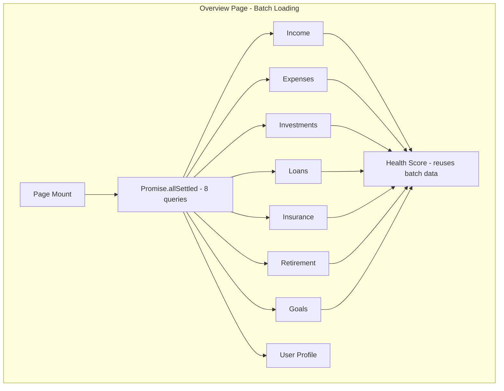
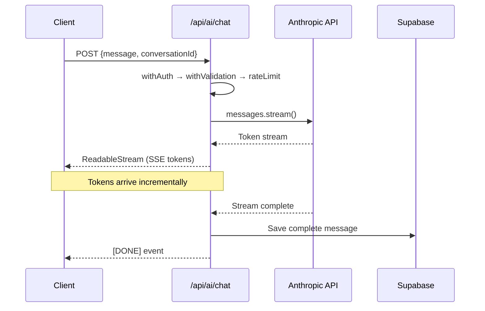

# Design Document: Security & Performance Hardening

## Overview

This design hardens the FamLedgerAI financial dashboard from a development-grade app to production-ready by addressing two pillars: **security** (authentication guards, rate limiting, input validation, RLS, webhook verification, secret exposure prevention) and **performance** (parallel queries, streaming AI responses, XIRR caching, progressive/skeleton loading).

All changes are additive — existing route logic is wrapped with shared utilities rather than rewritten. No new npm packages are introduced; we leverage existing dependencies (`@upstash/ratelimit`, `@supabase/ssr`, `zod`, `crypto`, `@anthropic-ai/sdk`).

### Key Design Decisions

1. **Shared `withAuth` wrapper** over per-route auth duplication — a single higher-order function extracts the session and user ID, returning 401 on failure.
2. **Middleware-level security headers + route protection** — the existing `src/middleware.ts` is extended (not replaced) to cover all `/(dashboard)/` and `/api/` paths, plus inject security headers on every response.
3. **Tiered rate limiting** — AI routes get per-user limits via Upstash Redis; all routes get per-IP limits. The `/api/ai/chat` route fails closed when Redis is down; others fail open.
4. **Zod schemas at the API boundary** — a `withValidation` wrapper applies Zod parsing before the route handler runs. File upload routes get separate validators.
5. **Single `Promise.allSettled` batch** on the overview page — replaces multiple `useEffect` hooks and eliminates duplicate health-score queries.
6. **Anthropic SDK streaming** — replaces the current `fetch` call with `client.messages.stream()` returning a `ReadableStream` to the client.
7. **Module-level `Map` cache for XIRR** — keyed by a hash of cash flows, invalidated on investment mutations or Kite sync.
8. **Two-phase insurance upload** — fast text extraction returns basic fields immediately; AI analysis runs async and pushes results via Supabase realtime (already subscribed on the overview page).

## Architecture

```mermaid
graph TD
    subgraph "Request Flow"
        Client[Browser / Webhook Caller]
        MW[Next.js Middleware]
        AG[Auth Guard - withAuth]
        RL[Rate Limiter]
        IV[Input Validator - withValidation]
        RH[Route Handler]
    end

    Client -->|Request| MW
    MW -->|Security Headers + Route Check| AG
    AG -->|Session Verified| RL
    RL -->|Under Limit| IV
    IV -->|Valid Input| RH

    MW -->|Unauthenticated Dashboard| LoginRedirect[/login?returnTo=/]
    MW -->|Unauthenticated API| Return401[401 JSON]
    AG -->|No Session| Return401
    RL -->|Over Limit| Return429[429 JSON]
    IV -->|Invalid| Return400[400 JSON]

    subgraph "Excluded from Auth"
        AuthRoutes[/api/auth/*]
        WebhookRoute[/api/payments/webhook]
        PublicPages[/login, /register, /pricing, etc.]
    end

    subgraph "Excluded from IP Rate Limit"
        KiteCallback[/api/kite/callback]
        WebhookRoute2[/api/payments/webhook]
    end
```





## Components and Interfaces

### 1. Auth Guard (`src/lib/security/authGuard.ts`)

```typescript
import { createClient } from '@/lib/supabase/server';
import { NextRequest, NextResponse } from 'next/server';

type AuthenticatedHandler = (
  req: NextRequest,
  context: { userId: string; supabase: SupabaseClient }
) => Promise<NextResponse>;

export function withAuth(handler: AuthenticatedHandler) {
  return async (req: NextRequest) => {
    const supabase = await createClient();
    const { data: { session } } = await supabase.auth.getSession();
    if (!session) {
      return NextResponse.json(
        { error: 'Unauthorized', code: 'UNAUTHORIZED' },
        { status: 401 }
      );
    }
    return handler(req, { userId: session.user.id, supabase });
  };
}
```

### 2. Enhanced Middleware (`src/middleware.ts`)

Extends the existing middleware to:
- Cover all `/(dashboard)/` paths (not just `/dashboard`)
- Return 401 JSON for unauthenticated `/api/` requests (excluding `/api/auth/` and `/api/payments/webhook/`)
- Set `returnTo` query param on login redirects
- Inject security headers on every response
- Skip HSTS on localhost/preview deployments

### 3. Enhanced Rate Limiter (`src/lib/security/rateLimit.ts`)

```typescript
// New exports added to existing file

type RateLimitConfig = {
  maxRequests: number;
  windowSeconds: number;
  failClosed?: boolean; // default false
};

const AI_ROUTE_LIMITS: Record<string, RateLimitConfig> = {
  '/api/ai/chat': { maxRequests: 20, windowSeconds: 60, failClosed: true },
  '/api/analyze-insurance-policy': { maxRequests: 5, windowSeconds: 60 },
  // all other AI routes: { maxRequests: 10, windowSeconds: 60 }
};

export async function checkAIRateLimit(
  userId: string, routePath: string
): Promise<{ success: boolean; retryAfter?: number }>;

export async function checkIPRateLimit(
  ip: string
): Promise<{ success: boolean; retryAfter?: number }>;
```

### 4. Input Validator (`src/lib/security/inputValidator.ts`)

```typescript
import { z, ZodSchema } from 'zod';

// Shared string sanitizer
function sanitize(str: string): string {
  return str.trim().replace(/\0/g, '');
}

// Reusable string schemas with length limits
export const chatMessageSchema = z.string().max(500).transform(sanitize);
export const nameSchema = z.string().max(200).transform(sanitize);
export const descriptionSchema = z.string().max(5000).transform(sanitize);

// HOF wrapper
export function withValidation<T>(schema: ZodSchema<T>, handler: Handler) {
  return async (req: NextRequest, ctx: AuthContext) => {
    const contentLength = parseInt(req.headers.get('content-length') || '0');
    if (contentLength > 1_048_576) { // 1MB
      return NextResponse.json(
        { error: 'Request body too large', code: 'VALIDATION_ERROR' },
        { status: 400 }
      );
    }
    const body = await req.json();
    const result = schema.safeParse(body);
    if (!result.success) {
      return NextResponse.json(
        { error: result.error.issues.map(i => i.message).join(', '), code: 'VALIDATION_ERROR' },
        { status: 400 }
      );
    }
    return handler(req, { ...ctx, body: result.data });
  };
}

// File validation
export const pdfFileSchema = z.object({
  type: z.literal('application/pdf'),
  size: z.number().max(10 * 1024 * 1024), // 10MB
  name: z.string().regex(/^[a-zA-Z0-9_-]+\.pdf$/),
});

export const csvFileSchema = z.object({
  type: z.enum(['text/csv', 'application/vnd.ms-excel']),
  size: z.number().max(5 * 1024 * 1024), // 5MB
});
```

### 5. Standardized Error Response (`src/lib/security/apiError.ts`)

```typescript
export type ErrorCode =
  | 'UNAUTHORIZED' | 'FORBIDDEN' | 'RATE_LIMITED'
  | 'VALIDATION_ERROR' | 'NOT_FOUND' | 'INTERNAL_ERROR'
  | 'SERVICE_UNAVAILABLE';

export function apiError(
  message: string, code: ErrorCode, status: number, extra?: Record<string, unknown>
): NextResponse {
  return NextResponse.json({ error: message, code, ...extra }, { status });
}

// Catch-all wrapper for route handlers
export function withErrorHandler(handler: Function) {
  return async (...args: any[]) => {
    try {
      return await handler(...args);
    } catch (err) {
      console.error('[API Error]', err);
      return apiError('Internal server error', 'INTERNAL_ERROR', 500);
    }
  };
}
```

### 6. Overview Batch Query Hook (`src/hooks/useOverviewData.ts`)

```typescript
type OverviewData = {
  income: Income[];
  expenses: Expense[];
  investments: Investment[];
  goals: Goal[];
  loans: Loan[];
  policies: InsurancePolicy[];
  retirementPlan: RetirementPlan | null;
  userProfile: UserProfile | null;
};

type WidgetStatus = 'loading' | 'success' | 'error';

type UseOverviewResult = {
  data: Partial<OverviewData>;
  status: Record<keyof OverviewData, WidgetStatus>;
  isTimedOut: boolean;
  retry: () => void;
};

export function useOverviewData(): UseOverviewResult;
```

Internally uses a single `Promise.allSettled` call. Each settled result maps to its widget status independently. Health score computation reuses the batch data — no separate queries.

### 7. AI Chat Streaming (`src/app/api/ai/chat/route.ts`)

Refactored to use the Anthropic SDK streaming API:

```typescript
import Anthropic from '@anthropic-ai/sdk';

const anthropic = new Anthropic(); // uses ANTHROPIC_API_KEY env var

// Inside the POST handler (after auth + validation + rate limit):
const stream = anthropic.messages.stream({
  model: 'claude-sonnet-4-20250514',
  max_tokens: 1000,
  system: systemPrompt,
  messages: validatedMessages.slice(-10),
});

// Return as ReadableStream
return new Response(stream.toReadableStream(), {
  headers: { 'Content-Type': 'text/event-stream' },
});

// After stream completes, save to DB via stream.finalMessage()
```

### 8. XIRR Cache (`src/lib/finance/xirrCache.ts`)

```typescript
const cache = new Map<string, number>();

export function getCachedXirr(cashFlows: CashFlow[]): number | null {
  const key = hashCashFlows(cashFlows);
  return cache.get(key) ?? null;
}

export function setCachedXirr(cashFlows: CashFlow[], result: number): void {
  const key = hashCashFlows(cashFlows);
  cache.set(key, result);
}

export function invalidateXirrCache(): void {
  cache.clear();
}

function hashCashFlows(flows: CashFlow[]): string {
  // Deterministic JSON string → simple hash
  const str = JSON.stringify(
    flows.map(f => ({ a: f.amount, d: f.date.getTime() }))
      .sort((a, b) => a.d - b.d)
  );
  let hash = 0;
  for (let i = 0; i < str.length; i++) {
    hash = ((hash << 5) - hash + str.charCodeAt(i)) | 0;
  }
  return hash.toString(36);
}
```

### 9. Insurance Progressive Loader

The existing `PipelineOrchestratorService` already has staged execution. The design adds:
- A new API endpoint or modification to the existing upload flow that returns basic extracted fields (insurer, policy number, sum insured, premium) immediately after the text extraction stage
- The full AI analysis continues asynchronously
- Client receives updates via the existing Supabase realtime subscription on `insurance_analysis`

### 10. Webhook Signature Verification (`src/app/api/payments/webhook/route.ts`)

The existing implementation already does HMAC-SHA256 verification. Enhancements:
- Add `RAZORPAY_WEBHOOK_SECRET` presence check at request time (return 503 if missing)
- Use timing-safe comparison (`crypto.timingSafeEqual`) instead of `!==`
- Return standardized error format with `code: 'FORBIDDEN'`
- Add to `.env.example`

## Data Models

### Error Response Format

All API routes return errors in this shape:

```typescript
type ApiErrorResponse = {
  error: string;
  code: ErrorCode;
  retryAfter?: number; // only for RATE_LIMITED
};
```

### Rate Limit Configuration

```typescript
type RateLimitTier = {
  route: string;
  maxRequests: number;
  windowSeconds: number;
  failClosed: boolean;
  identifier: 'userId' | 'ip';
};
```

### Overview Batch Query Result

```typescript
type BatchQueryResult = {
  [K in keyof OverviewData]: PromiseSettledResult<OverviewData[K]>;
};
```

### XIRR Cache Entry

```typescript
// Module-level Map<string, number>
// Key: hash of sorted cash flows
// Value: XIRR rate as decimal
```

### RLS Policies (19 tables)

Each table gets a policy following this pattern:

```sql
-- For tables with user_id column
CREATE POLICY "Users can only access own data"
ON public.<table_name>
FOR ALL
USING (user_id = auth.uid());

-- For user_profiles (uses id, not user_id)
CREATE POLICY "Users can only access own profile"
ON public.user_profiles
FOR ALL
USING (id = auth.uid());

-- For ai_messages (ownership through ai_conversations)
CREATE POLICY "Users can only access own messages"
ON public.ai_messages
FOR ALL
USING (
  EXISTS (
    SELECT 1 FROM ai_conversations
    WHERE ai_conversations.id = ai_messages.conversation_id
    AND ai_conversations.user_id = auth.uid()
  )
);
```

### Security Headers

```typescript
const SECURITY_HEADERS: Record<string, string> = {
  'X-Content-Type-Options': 'nosniff',
  'X-Frame-Options': 'DENY',
  'Referrer-Policy': 'strict-origin-when-cross-origin',
  'X-XSS-Protection': '1; mode=block',
  'Permissions-Policy': 'camera=(), microphone=(), geolocation=()',
};

// HSTS only on production
const HSTS_HEADER = 'max-age=31536000; includeSubDomains';
```


## Correctness Properties

*A property is a characteristic or behavior that should hold true across all valid executions of a system — essentially, a formal statement about what the system should do. Properties serve as the bridge between human-readable specifications and machine-verifiable correctness guarantees.*

### Property 1: Unauthenticated requests are rejected

*For any* API route path (excluding `/api/auth/*` and `/api/payments/webhook/`) and *for any* request without a valid Supabase session, the `withAuth` wrapper shall return HTTP 401 with `{ "error": "Unauthorized", "code": "UNAUTHORIZED" }` and the inner handler shall not be invoked.

**Validates: Requirements 1.1, 1.3**

### Property 2: Authenticated requests receive correct user context

*For any* API route wrapped with `withAuth` and *for any* request with a valid Supabase session, the inner handler shall be invoked with a context object containing the `userId` matching `session.user.id` and a valid Supabase client.

**Validates: Requirements 1.2, 1.4**

### Property 3: Dashboard paths redirect to login with returnTo

*For any* path matching `/(dashboard)/*` and *for any* unauthenticated request, the middleware shall respond with a redirect to `/login?returnTo=<original_path>` (HTTP 307) rather than returning a JSON error.

**Validates: Requirements 2.1, 2.4**

### Property 4: API paths return 401 JSON without redirect

*For any* path matching `/api/*` (excluding `/api/auth/*` and `/api/payments/webhook/`) and *for any* unauthenticated request, the middleware shall return HTTP 401 with a JSON body — not a redirect.

**Validates: Requirements 2.2**

### Property 5: Security headers present on all responses

*For any* response produced by the middleware, the response headers shall include `X-Content-Type-Options: nosniff`, `X-Frame-Options: DENY`, `Referrer-Policy: strict-origin-when-cross-origin`, `X-XSS-Protection: 1; mode=block`, and `Permissions-Policy: camera=(), microphone=(), geolocation=()`. Additionally, when the hostname is the production domain (not localhost or preview), `Strict-Transport-Security: max-age=31536000; includeSubDomains` shall also be present.

**Validates: Requirements 3.1, 3.2, 3.3, 3.4, 3.5, 3.6, 3.7**

### Property 6: AI route rate limit enforcement

*For any* AI route and *for any* user who has exceeded the configured request limit within the sliding window, the rate limiter shall return HTTP 429 with a JSON body containing `{ "error": "Rate limit exceeded", "code": "RATE_LIMITED", "retryAfter": <number> }` where `retryAfter` is a positive integer.

**Validates: Requirements 4.1, 4.2, 12.4**

### Property 7: AI rate limit Redis failure behavior

*For any* AI route, when the Upstash Redis service is unavailable: if the route is `/api/ai/chat`, the rate limiter shall return HTTP 503 (fail-closed); for all other AI routes, the rate limiter shall allow the request through (fail-open) and log the failure.

**Validates: Requirements 4.4**

### Property 8: IP-based rate limit enforcement

*For any* API route (excluding `/api/kite/callback` and `/api/payments/webhook/`) and *for any* IP address that has exceeded 100 requests within a 60-second window, the rate limiter shall return HTTP 429 with a `Retry-After` header.

**Validates: Requirements 5.1, 5.2, 5.5**

### Property 9: IP extraction from headers

*For any* request with an `x-forwarded-for` header, the rate limiter shall use the first IP in that header as the client identifier. *For any* request without `x-forwarded-for`, it shall fall back to the connection IP.

**Validates: Requirements 5.3**

### Property 10: Independent rate limit composition

*For any* request, the IP-based rate limit and the per-user rate limit shall be evaluated independently — a request must pass both checks to proceed. If either limit is exceeded, the request shall be rejected with 429.

**Validates: Requirements 5.4**

### Property 11: Invalid input rejection

*For any* request body that fails Zod schema validation (wrong types, missing required fields), or *for any* string field exceeding its maximum length (500 chars for chat messages, 200 for names, 5000 for descriptions), or *for any* request body exceeding 1MB, the `withValidation` wrapper shall return HTTP 400 with `{ "error": "<validation details>", "code": "VALIDATION_ERROR" }`.

**Validates: Requirements 6.2, 6.4, 6.5**

### Property 12: String sanitization

*For any* string input containing leading/trailing whitespace or null bytes (`\0`), after passing through the sanitizer, the output shall have no leading/trailing whitespace and no null bytes, while preserving all other characters.

**Validates: Requirements 6.3**

### Property 13: File upload validation

*For any* file uploaded to an insurance PDF route with a MIME type other than `application/pdf`, or size exceeding 10MB, or a filename containing path separators (`../`, `/`, `\`) or characters outside `[a-zA-Z0-9_-]`, validation shall reject with HTTP 400. *For any* file uploaded to the CSV import route with a MIME type other than `text/csv` or `application/vnd.ms-excel`, or size exceeding 5MB, validation shall reject with HTTP 400.

**Validates: Requirements 6.6**

### Property 14: Overview partial failure resilience

*For any* subset of the 8 overview batch queries that fail (where at least 50% succeed), the overview page shall render real data for successful widgets and an inline error state for failed widgets — never a full-page error or blank content area.

**Validates: Requirements 7.5**

### Property 15: Streamed AI message persistence

*For any* successfully streamed AI chat response, the complete concatenated message text shall be saved to the `ai_messages` table with the correct `conversation_id` and `user_id`, and querying that conversation shall return the saved message.

**Validates: Requirements 8.5**

### Property 16: Conversation history truncation

*For any* conversation with N messages where N > 10, the AI chat route shall send only the last 10 messages to the Anthropic API, regardless of the total conversation length.

**Validates: Requirements 8.7**

### Property 17: XIRR cache round-trip

*For any* valid set of cash flows, computing XIRR and then requesting XIRR for the same cash flows shall return the cached result without re-running Newton-Raphson. The cached result shall be numerically identical to the original computation.

**Validates: Requirements 10.1, 10.2**

### Property 18: Standardized error response format

*For any* error thrown within a route handler wrapped with `withErrorHandler`, the response shall match the shape `{ "error": string, "code": ErrorCode }` with an appropriate HTTP status code. The response body shall never contain stack traces, SQL error messages, or internal file paths.

**Validates: Requirements 12.1, 12.2, 12.3**

### Property 19: Webhook HMAC-SHA256 verification

*For any* raw request body and *for any* `RAZORPAY_WEBHOOK_SECRET`, the webhook route shall compute `HMAC-SHA256(rawBody, secret)` and compare it to the `X-Razorpay-Signature` header using timing-safe comparison. If and only if they match, the request shall be processed.

**Validates: Requirements 14.1, 14.2**

### Property 20: Invalid webhook signature rejection

*For any* request to `/api/payments/webhook` where the `X-Razorpay-Signature` header is absent or does not match the computed HMAC, the route shall return HTTP 400 with `{ "error": "Invalid signature", "code": "FORBIDDEN" }` and shall not execute any payment processing logic.

**Validates: Requirements 14.3**

### Property 21: ai_messages RLS through conversation ownership

*For any* user attempting to access `ai_messages`, the RLS policy shall only return messages belonging to conversations owned by that user. Specifically, a message is accessible if and only if `EXISTS (SELECT 1 FROM ai_conversations WHERE ai_conversations.id = ai_messages.conversation_id AND ai_conversations.user_id = auth.uid())`.

**Validates: Requirements 13.3**

## Error Handling

### Rate Limiter Failures

| Scenario | Route | Behavior |
|---|---|---|
| Redis unavailable | `/api/ai/chat` | Fail-closed: return 503 `SERVICE_UNAVAILABLE` |
| Redis unavailable | Other AI routes | Fail-open: allow request, log warning |
| Redis unavailable | IP rate limit | Fail-open: allow request, log warning |
| Rate limit exceeded | Any | Return 429 with `retryAfter` seconds |

### Input Validation Failures

- Zod parse failure → 400 `VALIDATION_ERROR` with human-readable field errors
- Body too large (>1MB) → 400 `VALIDATION_ERROR`
- File type/size/name invalid → 400 `VALIDATION_ERROR`

### Auth Failures

- No session → 401 `UNAUTHORIZED`
- Expired/malformed token → 401 `UNAUTHORIZED`
- Valid session but wrong resource → empty result (RLS) or 403 `FORBIDDEN`

### Streaming Errors

- Anthropic API error during stream → send `{"error": "..."}` SSE event, close stream
- Network interruption → client-side retry with exponential backoff
- Stream completes but DB save fails → log error, do not retry (message was delivered to user)

### Overview Batch Query Failures

- Individual query failure → show error state for that widget only
- ≥50% queries fail → show partial data for successes, error for failures
- All queries fail or timeout >5s → show skeleton loaders + retry button

### Webhook Failures

- Missing `RAZORPAY_WEBHOOK_SECRET` env var → 503 on every request
- Invalid/missing signature → 400, no processing
- Valid signature but processing error → 500, Razorpay will retry

## Testing Strategy

### Property-Based Testing

Library: **fast-check** (already available in the Node.js ecosystem, no new package needed — use `fc` from `fast-check`)

Each correctness property maps to a single property-based test with minimum 100 iterations. Tests are tagged with:
```
Feature: security-performance-hardening, Property {N}: {title}
```

Key property tests:

1. **Auth guard properties (1-2)**: Generate random route paths and session states. Verify 401/pass-through behavior.
2. **Middleware properties (3-5)**: Generate random paths and verify redirect/401/header behavior.
3. **Rate limit properties (6-10)**: Mock Redis, generate random user IDs and IPs, verify limit enforcement and response format.
4. **Input validation properties (11-13)**: Generate random strings of varying lengths, random file metadata. Verify rejection/acceptance.
5. **XIRR cache property (17)**: Generate random valid cash flow arrays, verify cache hit returns identical result.
6. **Error format property (18)**: Generate random errors, verify response shape never contains stack traces.
7. **Webhook HMAC property (19-20)**: Generate random bodies and secrets, verify HMAC computation and rejection.
8. **String sanitization property (12)**: Generate random strings with whitespace and null bytes, verify sanitization.

### Unit Testing

Unit tests cover specific examples, edge cases, and integration points:

- Specific public routes are accessible without auth (2.3)
- Rate limit config values match requirements (4.5, 4.6, 4.7)
- Kite callback and webhook excluded from IP rate limit (5.5)
- HSTS header absent on localhost (3.7)
- Overview timeout shows retry button (7.6)
- Streaming response has correct Content-Type header (8.1, 8.3)
- Anthropic error during stream sends error event (8.4)
- Insurance progressive loader retains basic fields on AI failure (9.4)
- XIRR cache invalidation on investment mutation (10.3)
- Error code enum matches HTTP status mapping (12.5)
- RLS enabled on all 19 tables (13.2)
- Webhook returns 503 when env var missing (14.5)

### Test File Organization

```
tests/
  security/
    authGuard.property.test.ts
    rateLimit.property.test.ts
    inputValidator.property.test.ts
    webhookSignature.property.test.ts
    errorFormat.property.test.ts
    middleware.test.ts
  performance/
    xirrCache.property.test.ts
    overviewBatch.test.ts
    aiChatStreaming.test.ts
```
