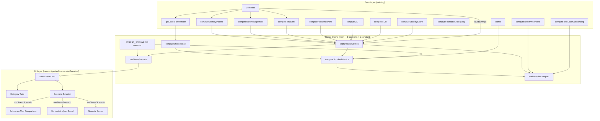

# Design Document: Household Stress Testing Layer (Phase 1.5)

## Overview

This feature adds a deterministic what-if stress testing layer on top of the existing Risk_Engine and Forecast_Engine in FamLedgerAI. The Stress_Engine defines 9 predefined scenarios across 4 categories (Income Shock, Expense Shock, Rate Shock, Combined Shock), applies mathematical adjustments to base financial inputs, recomputes all risk metrics (DSR, LCR, NIM, Stability Score) with shocked values, and runs household survival analysis — all without modifying `userData`.

The computation pipeline is: `captureBaseMetrics()` → `computeShockedMetrics(scenario, base)` → `evaluateShockImpact(base, shocked, scenario)`, orchestrated by `runStressScenario(scenarioId)`. The UI renders as a single "Stress Test" card on the Overview tab below the Risk Dashboard, showing before-vs-after comparisons and severity-coded warnings.

All computation is client-side, fully deterministic, vanilla JS, no external libraries, no API calls, no database changes. Follows the existing single-file architecture in `famledgerai/index.html`.

## Architecture



### Design Decisions

1. **STRESS_SCENARIOS as a frozen constant**: The catalog is defined as `Object.freeze()` at module initialization. Each entry contains scenario ID, category, display name, parameter overrides, and description. This ensures immutability and prevents accidental mutation.

2. **captureBaseMetrics() reads existing accessors**: Calls `computeMonthlyIncome()`, `computeMonthlyExpenses()`, `computeTotalEmi()`, `computeHouseholdNIM()`, `computeDSR()`, `computeLCR()`, `computeStabilityScore()`, and reads `userData.liquidSavings`. Returns a plain snapshot object. No `userData` mutation.

3. **computeShockedEMI() uses the standard EMI formula**: For rate shock scenarios, iterates over all loans from `getLoansForMember(currentProfile)`, applies the rate bump, and recalculates EMI using `P × r × (1+r)^n / ((1+r)^n − 1)`. When rateBump is 0 or undefined, returns the original `computeTotalEmi()` value.

4. **computeShockedMetrics() applies formulas inline**: Rather than calling the existing Risk_Engine functions (which read from `userData` and `computeCache`), this function applies the same formulas to shocked input values. This avoids any need to temporarily mutate `userData` or bypass the cache.

5. **evaluateShockImpact() computes deltas and survival indicators**: Deltas are simple arithmetic differences. Survival analysis computes months of liquidity, DSR breach flag, stability breach flag, net worth sign, and severity classification. All thresholds are hardcoded constants matching the requirements.

6. **runStressScenario() is the single orchestrator**: Looks up scenario, calls the pipeline functions in order, assembles the complete result object. Returns an error object for invalid scenario IDs instead of throwing.

7. **UI follows existing patterns**: The Stress Test card uses `card` CSS class, `kpi-card` for metric display, `badge` classes for severity, `fl()` for currency formatting, `sh()` for DOM updates, `$()` for element lookups. Category selection uses tab buttons matching the Forecast Card tab pattern.

8. **No new cache entries**: Stress computations are not cached via `computeCache` because they depend on the selected scenario (a UI state variable), not just `userData`. The base metrics are captured fresh each time via the existing cached Risk_Engine functions.

9. **Re-render via existing wiring**: The stress card re-renders when `renderOverview()` is called, which already happens on profile switch, data edit, and assumption change. The currently selected scenario is stored in a module-level variable (`stressActiveScenario`).

## Components and Interfaces

### STRESS_SCENARIOS Constant

```javascript
// ========== STRESS ENGINE ==========

/**
 * STRESS_SCENARIOS — immutable catalog of 9 predefined stress scenarios
 * across 4 categories: Income Shock, Expense Shock, Rate Shock, Combined Shock.
 *
 * Each entry: { id, category, label, description, incomeFactor?, expenseFactor?,
 *               rateBump?, liquidHit? }
 *
 * Parameters are optional — only defined when the scenario applies that shock type.
 */
const STRESS_SCENARIOS = Object.freeze({
    'income-10':      { id: 'income-10',      category: 'Income Shock',   label: '10% Income Loss',
                        incomeFactor: 0.90,
                        description: 'Salary cut or reduced business income by 10%' },
    'income-20':      { id: 'income-20',      category: 'Income Shock',   label: '20% Income Loss',
                        incomeFactor: 0.80,
                        description: 'Major income disruption — 20% reduction' },
    'expense-10':     { id: 'expense-10',     category: 'Expense Shock',  label: '10% Expense Rise',
                        expenseFactor: 1.10,
                        description: 'Moderate inflation or lifestyle creep — expenses up 10%' },
    'expense-20':     { id: 'expense-20',     category: 'Expense Shock',  label: '20% Expense Rise',
                        expenseFactor: 1.20,
                        description: 'Significant cost increase — expenses up 20%' },
    'expense-med':    { id: 'expense-med',    category: 'Expense Shock',  label: 'Medical Emergency',
                        expenseFactor: 1.50, liquidHit: 'sixMonthExpenses',
                        description: 'Medical emergency — 50% expense spike + 6-month savings drain' },
    'rate-100':       { id: 'rate-100',       category: 'Rate Shock',     label: '+1% Rate Hike',
                        rateBump: 1,
                        description: 'RBI rate hike — all loan rates increase by 1 percentage point' },
    'rate-200':       { id: 'rate-200',       category: 'Rate Shock',     label: '+2% Rate Hike',
                        rateBump: 2,
                        description: 'Aggressive tightening — all loan rates increase by 2 percentage points' },
    'combined-mild':  { id: 'combined-mild',  category: 'Combined Shock', label: 'Mild Combined',
                        incomeFactor: 0.90, rateBump: 1,
                        description: '10% income loss + 1% rate hike — mild recession scenario' },
    'combined-severe':{ id: 'combined-severe',category: 'Combined Shock', label: 'Severe Combined',
                        incomeFactor: 0.80, rateBump: 2,
                        description: '20% income loss + 2% rate hike — severe recession scenario' }
});
```

### captureBaseMetrics()

```javascript
/**
 * captureBaseMetrics() → BaseMetrics object
 *
 * Snapshots the current unshocked risk state using existing accessors.
 * All missing/undefined values default to zero.
 * Does NOT modify userData.
 */
function captureBaseMetrics() {
    const nimData = computeHouseholdNIM();
    const dsrData = computeDSR();
    const lcrData = computeLCR();
    const stabilityData = computeStabilityScore();
    const protData = computeProtectionAdequacy();

    return {
        monthlyIncome:   computeMonthlyIncome()  || 0,
        monthlyExpenses: computeMonthlyExpenses() || 0,
        totalEmi:        computeTotalEmi()        || 0,
        liquidSavings:   (userData.liquidSavings)  || 0,
        dsr:             dsrData.dsr              || 0,
        lcr:             lcrData.lcr              || 0,
        nim:             nimData,                        // full object { nim, weightedYield, weightedCost, rag }
        stabilityScore:  stabilityData.score      || 0,
        protScore:       stabilityData.protScore  || 0,  // needed for recomputing stability
        protData:        protData,                       // full protection adequacy data
        totalInvestments:    computeTotalInvestments()    || 0,
        totalLoanOutstanding: computeTotalLoanOutstanding() || 0
    };
}
```

### computeShockedEMI(rateBump)

```javascript
/**
 * computeShockedEMI(rateBump) → Number (total monthly EMI with bumped rates)
 *
 * For each active loan, recalculates EMI using:
 *   EMI = P × r × (1+r)^n / ((1+r)^n − 1)
 * where P = loan.outstanding, r = (loan.rate + rateBump) / 12 / 100, n = loan.remainingTenure × 12
 *
 * When rateBump is 0 or undefined → returns computeTotalEmi()
 * When loan.outstanding is 0 → contributes 0 EMI
 * Does NOT modify any loan data in userData.
 */
function computeShockedEMI(rateBump) {
    if (!rateBump) return computeTotalEmi() || 0;

    const loans = getLoansForMember(currentProfile);
    let totalShockedEmi = 0;

    for (const loan of loans) {
        const P = loan.outstanding || 0;
        if (P === 0) continue; // zero outstanding → zero EMI contribution

        const annualRate = (loan.rate || 0) + rateBump;
        const r = annualRate / 12 / 100;  // monthly rate
        const n = (loan.remainingTenure || 0) * 12; // remaining months

        if (n === 0 || r === 0) {
            // No tenure remaining or zero rate → use original EMI
            totalShockedEmi += (loan.emi || 0);
            continue;
        }

        // Standard EMI formula: P × r × (1+r)^n / ((1+r)^n − 1)
        const compoundFactor = Math.pow(1 + r, n);
        const emi = P * r * compoundFactor / (compoundFactor - 1);
        totalShockedEmi += emi;
    }

    return totalShockedEmi;
}
```


### computeShockedMetrics(scenario, base)

```javascript
/**
 * computeShockedMetrics(scenario, base) → ShockedMetrics object
 *
 * Applies scenario parameter overrides to base metrics and recomputes
 * DSR, LCR, NIM, and Stability_Score using the same formulas as the Risk_Engine.
 *
 * Does NOT modify userData or call any function that modifies userData.
 * All formulas are applied inline to shocked input values.
 */
function computeShockedMetrics(scenario, base) {
    // Apply income shock: base.monthlyIncome × incomeFactor (default: no change)
    const shockedIncome = base.monthlyIncome * (scenario.incomeFactor || 1);

    // Apply expense shock: base.monthlyExpenses × expenseFactor (default: no change)
    const shockedExpenses = base.monthlyExpenses * (scenario.expenseFactor || 1);

    // Apply rate shock: recalculate EMI with bumped rates (default: no change)
    const shockedEmi = scenario.rateBump
        ? computeShockedEMI(scenario.rateBump)
        : base.totalEmi;

    // Apply liquid hit: deduct from savings, clamp to 0 minimum
    let shockedLiquidSavings = base.liquidSavings;
    if (scenario.liquidHit === 'sixMonthExpenses') {
        shockedLiquidSavings = Math.max(0, base.liquidSavings - (base.monthlyExpenses * 6));
    } else if (typeof scenario.liquidHit === 'number') {
        shockedLiquidSavings = Math.max(0, base.liquidSavings - scenario.liquidHit);
    }

    // Recompute DSR: (shockedEmi / shockedIncome) × 100
    // Same zero-income guard as computeDSR()
    let shockedDsr;
    if (shockedIncome === 0) {
        shockedDsr = shockedEmi > 0 ? 100 : 0;
    } else {
        shockedDsr = (shockedEmi / shockedIncome) * 100;
    }

    // Recompute LCR: shockedLiquidSavings / (shockedExpenses × 6)
    // Same zero-expense guard as computeLCR()
    let shockedLcr;
    const sixMonthExp = shockedExpenses * 6;
    if (sixMonthExp === 0) {
        shockedLcr = shockedLiquidSavings > 0 ? 1.0 : 0;
    } else {
        shockedLcr = shockedLiquidSavings / sixMonthExp;
    }

    // Recompute NIM: for rate shocks, weightedCost increases by rateBump
    // NIM = weightedYield − (weightedCost + rateBump)
    let shockedNimValue;
    if (scenario.rateBump) {
        shockedNimValue = (base.nim.weightedYield || 0) - ((base.nim.weightedCost || 0) + scenario.rateBump);
    } else {
        shockedNimValue = base.nim.nim || 0;
    }

    // Recompute Stability Score using same normalization + weights as computeStabilityScore()
    const nimScore  = clamp(0, 100, 50 + shockedNimValue * 25);
    const dsrScore  = clamp(0, 100, 100 - shockedDsr * 2);
    const lcrScore  = clamp(0, 100, shockedLcr * 100);
    const protScore = base.protScore || 0; // protection unchanged by stress scenarios

    const shockedStabilityScore = Math.round(
        dsrScore * 0.30 + lcrScore * 0.25 + nimScore * 0.20 + protScore * 0.25
    );

    return {
        monthlyIncome:   shockedIncome,
        monthlyExpenses: shockedExpenses,
        totalEmi:        shockedEmi,
        liquidSavings:   shockedLiquidSavings,
        dsr:             shockedDsr,
        lcr:             shockedLcr,
        nim:             shockedNimValue,
        stabilityScore:  shockedStabilityScore,
        nimScore, dsrScore, lcrScore, protScore
    };
}
```

### evaluateShockImpact(base, shocked, scenario)

```javascript
/**
 * evaluateShockImpact(base, shocked, scenario) → ImpactResult object
 *
 * Computes deltas between base and shocked metrics, runs survival analysis,
 * and classifies severity.
 *
 * Deltas:
 *   stabilityDelta = base.stabilityScore − shocked.stabilityScore (positive = worsened)
 *   dsrDelta       = shocked.dsr − base.dsr (positive = worsened)
 *   lcrDelta       = base.lcr − shocked.lcr (positive = worsened)
 *   nimDelta       = base.nim.nim − shocked.nim (positive = worsened)
 *
 * Survival Analysis:
 *   monthsLiquidity = shockedLiquidSavings / monthlyDeficit (capped at 999 if no deficit)
 *   dsrBreach       = shocked.dsr > 50
 *   stabilityBreach = shocked.stabilityScore < 50
 *   netWorthNegative = (shocked.income − shocked.expenses − shocked.emi) × 12
 *                      + totalInvestments − totalLoanOutstanding < 0
 *
 * Severity:
 *   critical   = shocked.stabilityScore < 50 OR shocked.dsr > 50
 *   warning    = monthsLiquidity < 6
 *   manageable = otherwise
 */
function evaluateShockImpact(base, shocked, scenario) {
    // Compute deltas
    const stabilityDelta = base.stabilityScore - shocked.stabilityScore;
    const dsrDelta       = shocked.dsr - base.dsr;
    const lcrDelta       = base.lcr - shocked.lcr;
    const nimDelta       = (base.nim.nim || 0) - shocked.nim;

    // Survival analysis: months of liquidity
    const monthlyDeficit = shocked.monthlyExpenses + shocked.totalEmi - shocked.monthlyIncome;
    let monthsLiquidity;
    if (monthlyDeficit <= 0) {
        monthsLiquidity = 999; // no deficit → unlimited (capped)
    } else {
        monthsLiquidity = shocked.liquidSavings / monthlyDeficit;
    }

    // Breach flags
    const dsrBreach       = shocked.dsr > 50;
    const stabilityBreach = shocked.stabilityScore < 50;

    // Net worth in year 1: annual net cash flow + investments − loans
    const annualNetCashFlow = (shocked.monthlyIncome - shocked.monthlyExpenses - shocked.totalEmi) * 12;
    const netWorthYear1     = annualNetCashFlow + (base.totalInvestments || 0) - (base.totalLoanOutstanding || 0);
    const netWorthNegative  = netWorthYear1 < 0;

    // Severity classification
    let severity;
    if (shocked.stabilityScore < 50 || shocked.dsr > 50) {
        severity = 'critical';
    } else if (monthsLiquidity < 6) {
        severity = 'warning';
    } else {
        severity = 'manageable';
    }

    return {
        stabilityDelta, dsrDelta, lcrDelta, nimDelta,
        monthsLiquidity: Math.min(monthsLiquidity, 999),
        dsrBreach, stabilityBreach, netWorthNegative, netWorthYear1,
        severity
    };
}
```

### runStressScenario(scenarioId)

```javascript
/**
 * runStressScenario(scenarioId) → StressResult object
 *
 * Orchestrates the full stress test pipeline:
 * 1. Look up scenario from STRESS_SCENARIOS
 * 2. captureBaseMetrics()
 * 3. computeShockedMetrics(scenario, base)
 * 4. evaluateShockImpact(base, shocked, scenario)
 * 5. Assemble and return complete result
 *
 * Returns error object for invalid scenario IDs (no exception thrown).
 * Does NOT modify userData, make API calls, or access the database.
 */
function runStressScenario(scenarioId) {
    const scenario = STRESS_SCENARIOS[scenarioId];
    if (!scenario) {
        return { error: true, message: `Unknown scenario: ${scenarioId}` };
    }

    const base    = captureBaseMetrics();
    const shocked = computeShockedMetrics(scenario, base);
    const impact  = evaluateShockImpact(base, shocked, scenario);

    return {
        scenarioId:   scenario.id,
        scenarioLabel: scenario.label,
        category:     scenario.category,
        description:  scenario.description,
        base,
        shocked,
        impact
    };
}
```

### renderStressTestCard()

```javascript
/**
 * renderStressTestCard() → HTML string
 *
 * Returns the complete Stress Test card HTML.
 * Called inside renderOverview() — output is concatenated into the page-overview template,
 * positioned below the Risk Dashboard card.
 *
 * Structure:
 *   <div class="card">
 *     <div class="card-title">🧪 Stress Test</div>
 *     <div>Category tabs (Income | Expense | Rate | Combined)</div>
 *     <div>Scenario selector buttons within selected category</div>
 *     <div id="stress-results">
 *       Before-vs-After comparison (4 × kpi-card: Stability, DSR, LCR, NIM)
 *       Severity banner (red/yellow/green)
 *       Survival analysis panel
 *     </div>
 *   </div>
 *
 * Uses: sh(), fl(), $(), badge(), card, kpi-card CSS classes
 * Module-level state: stressActiveCategory, stressActiveScenario
 */
let stressActiveCategory = 'Income Shock';
let stressActiveScenario = 'income-10';

function renderStressTestCard() { /* ... returns HTML string ... */ }

/**
 * switchStressCategory(category) — switches the active category tab
 * and selects the first scenario in that category.
 */
function switchStressCategory(category) { /* ... */ }

/**
 * selectStressScenario(scenarioId) — runs the selected scenario
 * and re-renders the results section.
 */
function selectStressScenario(scenarioId) { /* ... */ }
```

### Integration with renderOverview()

The stress card is injected into `renderOverview()` immediately after the Risk Dashboard:

```javascript
// Inside renderOverview(), in the sh('page-overview', `...`) template:

// ... existing content ...

<!-- Risk Dashboard Section -->
${renderRiskDashboard()}

<!-- Stress Test Section (new) -->
${renderStressTestCard()}

<!-- AI Financial Dashboard Section -->
<div id="ai-dashboard-section">...</div>
```

### Re-render Wiring

No new event wiring needed. Existing mechanisms already trigger `renderOverview()`:

| Trigger | Mechanism | Path |
|---------|-----------|------|
| Profile switch | `profileSelect` change → `renderCurrentPage()` → `renderOverview()` | Existing |
| Data edit | `debounceSave()` → `computeCache.invalidate()` → next `renderOverview()` | Existing |
| Assumption change | `updateForecastAssumption()` → `debounceSave()` → `renderOverview()` | Existing |
| Scenario selection | `selectStressScenario()` → re-renders stress results section only via `sh()` | New (lightweight) |
| Category switch | `switchStressCategory()` → re-renders stress card scenarios + results via `sh()` | New (lightweight) |

## Data Models

### STRESS_SCENARIOS Entry Shape

```javascript
{
    id: String,              // e.g. 'income-10'
    category: String,        // 'Income Shock' | 'Expense Shock' | 'Rate Shock' | 'Combined Shock'
    label: String,           // e.g. '10% Income Loss'
    description: String,     // human-readable explanation
    incomeFactor?: Number,   // multiplier on base income (e.g. 0.90)
    expenseFactor?: Number,  // multiplier on base expenses (e.g. 1.20)
    rateBump?: Number,       // percentage points added to loan rates (e.g. 1, 2)
    liquidHit?: String|Number // 'sixMonthExpenses' or a numeric amount
}
```

### BaseMetrics Shape (returned by captureBaseMetrics)

```javascript
{
    monthlyIncome: Number,        // from computeMonthlyIncome()
    monthlyExpenses: Number,      // from computeMonthlyExpenses()
    totalEmi: Number,             // from computeTotalEmi()
    liquidSavings: Number,        // from userData.liquidSavings
    dsr: Number,                  // from computeDSR().dsr
    lcr: Number,                  // from computeLCR().lcr
    nim: {                        // from computeHouseholdNIM()
        nim: Number,
        weightedYield: Number,
        weightedCost: Number,
        rag: String
    },
    stabilityScore: Number,       // from computeStabilityScore().score
    protScore: Number,            // normalized protection sub-score (0–100)
    protData: Object,             // full computeProtectionAdequacy() result
    totalInvestments: Number,     // from computeTotalInvestments()
    totalLoanOutstanding: Number  // from computeTotalLoanOutstanding()
}
```

### ShockedMetrics Shape (returned by computeShockedMetrics)

```javascript
{
    monthlyIncome: Number,     // shocked income
    monthlyExpenses: Number,   // shocked expenses
    totalEmi: Number,          // shocked EMI (recalculated for rate bumps)
    liquidSavings: Number,     // shocked liquid savings (after liquidHit)
    dsr: Number,               // recomputed DSR with shocked values
    lcr: Number,               // recomputed LCR with shocked values
    nim: Number,               // recomputed NIM value (scalar, not object)
    stabilityScore: Number,    // recomputed composite stability score
    nimScore: Number,          // normalized NIM sub-score (0–100)
    dsrScore: Number,          // normalized DSR sub-score (0–100)
    lcrScore: Number,          // normalized LCR sub-score (0–100)
    protScore: Number          // unchanged protection sub-score (0–100)
}
```

### ImpactResult Shape (returned by evaluateShockImpact)

```javascript
{
    stabilityDelta: Number,    // base.stabilityScore − shocked.stabilityScore (positive = worse)
    dsrDelta: Number,          // shocked.dsr − base.dsr (positive = worse)
    lcrDelta: Number,          // base.lcr − shocked.lcr (positive = worse)
    nimDelta: Number,          // base.nim.nim − shocked.nim (positive = worse)
    monthsLiquidity: Number,   // months savings last under shock (capped at 999)
    dsrBreach: Boolean,        // true if shocked DSR > 50%
    stabilityBreach: Boolean,  // true if shocked stability < 50
    netWorthNegative: Boolean, // true if year-1 net worth < 0
    netWorthYear1: Number,     // actual year-1 net worth value
    severity: String           // 'critical' | 'warning' | 'manageable'
}
```

### StressResult Shape (returned by runStressScenario)

```javascript
{
    scenarioId: String,
    scenarioLabel: String,
    category: String,
    description: String,
    base: BaseMetrics,
    shocked: ShockedMetrics,
    impact: ImpactResult
}

// Error case:
{
    error: true,
    message: String
}
```

### Existing Data Structures Referenced

```javascript
// Loan shape (from getLoansForMember)
{ label, outstanding, emi, rate, remainingTenure, ... }

// userData.liquidSavings → Number
// currentProfile → String ('all' | member ID)
```


## Correctness Properties

*A property is a characteristic or behavior that should hold true across all valid executions of a system — essentially, a formal statement about what the system should do. Properties serve as the bridge between human-readable specifications and machine-verifiable correctness guarantees.*

### Property 1: Scenario catalog structural completeness

*For any* entry in STRESS_SCENARIOS, the entry must contain the fields: `id`, `category`, `label`, and `description`. The `category` must be one of the 4 defined categories. The `id` must match the key used to look it up. At least one parameter override (`incomeFactor`, `expenseFactor`, `rateBump`, or `liquidHit`) must be defined.

**Validates: Requirements 1.6**

### Property 2: Scenario catalog immutability

*For any* mutation attempt on STRESS_SCENARIOS (adding, deleting, or modifying a property at any depth), the catalog must remain unchanged after the attempt. `Object.isFrozen(STRESS_SCENARIOS)` must return true.

**Validates: Requirements 1.7**

### Property 3: Factor application correctness

*For any* base metrics object with non-negative `monthlyIncome`, `monthlyExpenses`, and `liquidSavings`, and *for any* scenario with optional `incomeFactor` ∈ (0, 1], `expenseFactor` ≥ 1, and `liquidHit` ≥ 0: the shocked income must equal `base.monthlyIncome × (incomeFactor || 1)`, the shocked expenses must equal `base.monthlyExpenses × (expenseFactor || 1)`, and the shocked liquid savings must equal `max(0, base.liquidSavings − liquidHit)` when liquidHit is defined, or `base.liquidSavings` otherwise.

**Validates: Requirements 4.2, 4.3, 4.5**

### Property 4: Shocked EMI formula correctness

*For any* set of loans (each with `outstanding` ≥ 0, `rate` ≥ 0, `remainingTenure` > 0) and *for any* `rateBump` > 0, the total shocked EMI must equal the sum of individually computed EMIs using the formula `P × r × (1+r)^n / ((1+r)^n − 1)` where `r = (loan.rate + rateBump) / 1200` and `n = loan.remainingTenure × 12`. Loans with zero outstanding must contribute zero.

**Validates: Requirements 3.1, 3.2**

### Property 5: Shocked ratio metrics follow Risk_Engine formulas

*For any* non-negative shocked income, expenses, EMI, liquid savings, and NIM components: the shocked DSR must equal `(shockedEmi / shockedIncome) × 100` (with DSR = 100 when income is 0 and EMI > 0, DSR = 0 when both are 0), the shocked LCR must equal `shockedLiquidSavings / (shockedExpenses × 6)` (with LCR = 1.0 when expenses are 0 and savings > 0, LCR = 0 when both are 0), and the shocked NIM must equal `weightedYield − (weightedCost + rateBump)` when rateBump is defined, or `base.nim` otherwise.

**Validates: Requirements 4.6, 4.7, 4.9**

### Property 6: Shocked stability score recomputation

*For any* shocked DSR ∈ [0, 100], LCR ≥ 0, NIM value, and protection sub-score ∈ [0, 100], the shocked stability score must equal `round(dsrScore × 0.30 + lcrScore × 0.25 + nimScore × 0.20 + protScore × 0.25)` where `nimScore = clamp(0, 100, 50 + nim × 25)`, `dsrScore = clamp(0, 100, 100 − dsr × 2)`, `lcrScore = clamp(0, 100, lcr × 100)`. The result must be an integer in [0, 100].

**Validates: Requirements 4.10**

### Property 7: Delta computation correctness

*For any* base metrics and shocked metrics with numeric stability scores, DSR, LCR, and NIM values: `stabilityDelta` must equal `base.stabilityScore − shocked.stabilityScore`, `dsrDelta` must equal `shocked.dsr − base.dsr`, `lcrDelta` must equal `base.lcr − shocked.lcr`, and `nimDelta` must equal `base.nim − shocked.nim`.

**Validates: Requirements 5.2, 5.3, 5.4, 5.5, 5.11**

### Property 8: Survival analysis and severity classification

*For any* shocked metrics with non-negative income, expenses, EMI, liquid savings, and stability score: months of liquidity must equal `shockedLiquidSavings / (shockedExpenses + shockedEmi − shockedIncome)` when the deficit is positive, or 999 when there is no deficit. DSR breach must be true iff `shocked.dsr > 50`. Stability breach must be true iff `shocked.stabilityScore < 50`. Severity must be `critical` when `shocked.stabilityScore < 50 OR shocked.dsr > 50`, `warning` when `monthsLiquidity < 6`, and `manageable` otherwise.

**Validates: Requirements 5.6, 5.7, 5.8, 5.10**

### Property 9: Non-mutation of userData

*For any* valid scenario ID and *for any* `userData` state, running `runStressScenario(scenarioId)` must leave `userData` deeply equal to its state before the call. No field in `userData` may be added, removed, or modified.

**Validates: Requirements 2.4, 3.5, 4.11, 6.5, 8.3**

### Property 10: Idempotence and determinism

*For any* valid scenario ID and *for any* `userData` state, calling `runStressScenario(scenarioId)` twice in succession with the same `userData` must produce deeply equal result objects. Every numeric field, string field, and boolean field must be identical across both calls.

**Validates: Requirements 4.12, 6.6, 8.2, 8.9**

### Property 11: Missing input resilience

*For any* `userData` state where one or more of `liquidSavings`, `income`, `loans`, `investments`, or `profile.familyMembers` are `undefined`, `null`, or missing, running `runStressScenario` for any valid scenario must not throw an error and must produce numeric (non-NaN, non-undefined) values for all metric fields in the result.

**Validates: Requirements 2.5, 8.8**

### Property 12: Formula consistency with Risk_Engine (model-based)

*For any* `userData` state with no shock applied (identity scenario: incomeFactor = 1, no expenseFactor, no rateBump, no liquidHit), the shocked metrics must produce DSR, LCR, NIM, and Stability Score values equal to the base metrics captured from the existing Risk_Engine functions (within floating-point tolerance of ±0.01).

**Validates: Requirements 8.7**

### Property 13: Invalid scenario error handling

*For any* string that is not a key in STRESS_SCENARIOS, `runStressScenario(invalidId)` must return an object with `error: true` and a non-empty `message` string, without throwing an exception.

**Validates: Requirements 6.4**

## Error Handling

All error handling follows a defensive, fail-safe approach consistent with the existing Financial Engine and Risk Engine patterns:

| Scenario | Handling | Fallback |
|----------|----------|----------|
| Invalid scenario ID | `runStressScenario` returns `{ error: true, message }` | No exception thrown |
| Missing `userData.liquidSavings` | `(userData.liquidSavings) \|\| 0` | 0 |
| Missing `userData.income` fields | `computeMonthlyIncome()` already handles with `\|\| 0` | 0 |
| Missing `userData.loans` | `getLoansForMember()` returns `[]` | Empty array → 0 EMI |
| `computeMonthlyIncome()` returns 0 | DSR: 100 if EMI > 0, 0 otherwise | Documented in formula |
| `computeMonthlyExpenses()` returns 0 | LCR: 1.0 if savings > 0, 0 otherwise | Documented in formula |
| Loan with zero outstanding | `computeShockedEMI` skips it (contributes 0) | 0 EMI for that loan |
| Loan with zero remaining tenure | Uses original `loan.emi` value | Original EMI |
| Loan with zero rate + rateBump | Uses original `loan.emi` value | Original EMI |
| `liquidHit` exceeds `liquidSavings` | `Math.max(0, ...)` clamps to 0 | 0 savings |
| Monthly deficit is 0 or negative | `monthsLiquidity` capped at 999 | "Unlimited" liquidity |
| NIM components undefined | `(base.nim.weightedYield \|\| 0)` pattern | 0 |
| `computeCache` stale | Cache invalidated by existing `debounceSave()` mechanism | Fresh computation |
| Division by zero in any formula | Explicit guards check denominator before division | Documented fallback per formula |

No `try/catch` blocks are used. All edge cases are handled by explicit guards and the `|| 0` pattern, consistent with the existing codebase style.

## Testing Strategy

### Dual Testing Approach

Testing uses both unit tests and property-based tests for comprehensive coverage:

- **Property-based tests**: Verify the 13 correctness properties above using randomized inputs. Each property test runs a minimum of 100 iterations with generated data.
- **Unit tests**: Verify specific examples (catalog values, known scenario outcomes), edge cases (zero income, zero loans, empty userData), and UI rendering structure.

### Property-Based Testing Configuration

- **Library**: [fast-check](https://github.com/dubzzz/fast-check) — the standard PBT library for JavaScript
- **Minimum iterations**: 100 per property test
- **Test runner**: The project's existing test infrastructure (or a simple HTML test harness if none exists)
- **Tag format**: Each property test includes a comment referencing the design property:
  ```javascript
  // Feature: stress-testing-layer, Property 1: Scenario catalog structural completeness
  ```
- **Each correctness property is implemented by exactly ONE property-based test**

### Test Structure

Since the app is a single-file vanilla JS architecture, the Stress Engine functions are testable by:
1. Extracting the pure computation functions into a testable scope
2. Mocking `userData`, `currentProfile`, and the existing accessor functions (`computeMonthlyIncome`, `computeMonthlyExpenses`, `computeTotalEmi`, `getLoansForMember`, `computeHouseholdNIM`, `computeDSR`, `computeLCR`, `computeStabilityScore`, `computeProtectionAdequacy`, `computeTotalInvestments`, `computeTotalLoanOutstanding`, `clamp`)
3. Running fast-check properties against the mocked functions

### Unit Test Coverage

| Test | What it verifies |
|------|-----------------|
| STRESS_SCENARIOS has 9 entries | Catalog completeness (Req 1.1) |
| STRESS_SCENARIOS has 4 categories | Category coverage (Req 1.1) |
| income-10 has incomeFactor 0.90 | Specific constant (Req 1.2) |
| income-20 has incomeFactor 0.80 | Specific constant (Req 1.2) |
| expense-med has expenseFactor 1.50 and liquidHit | Specific constant (Req 1.3) |
| rate-100 has rateBump 1 | Specific constant (Req 1.4) |
| combined-severe has incomeFactor 0.80 and rateBump 2 | Specific constant (Req 1.5) |
| computeShockedEMI(0) returns original EMI | Edge case (Req 3.3) |
| computeShockedEMI with zero-outstanding loan | Edge case (Req 3.4) |
| Known scenario: income-10 with specific userData | Integration example |
| Known scenario: rate-200 with specific loans | Integration example |
| Known scenario: expense-med with specific savings | Integration example |
| runStressScenario('invalid') returns error | Error handling (Req 6.4) |
| captureBaseMetrics with empty userData | Edge case (Req 2.5) |
| Severity = critical when stability < 50 | Specific example (Req 5.10) |
| Severity = warning when months < 6 | Specific example (Req 5.10) |
| Severity = manageable when all thresholds pass | Specific example (Req 5.10) |

### Property Test Coverage

Each of the 13 correctness properties maps to exactly one property-based test:

| Property | Generator strategy |
|----------|-------------------|
| P1: Catalog structure | Iterate all entries in STRESS_SCENARIOS, check required fields |
| P2: Catalog immutability | Attempt random mutations (set, delete, add) on frozen object |
| P3: Factor application | Random base metrics (income ∈ [0, 1e7], expenses ∈ [0, 1e6], savings ∈ [0, 1e8]) × random factors (incomeFactor ∈ [0.5, 1], expenseFactor ∈ [1, 2], liquidHit ∈ [0, 1e7]) |
| P4: Shocked EMI | Random loan arrays (outstanding ∈ [0, 1e8], rate ∈ [1, 20], tenure ∈ [1, 30]) × random rateBump ∈ [0.5, 5] |
| P5: Shocked ratios | Random shocked values (income ∈ [0, 1e7], expenses ∈ [0, 1e6], emi ∈ [0, 1e6], savings ∈ [0, 1e8], NIM components ∈ [-5, 15]) |
| P6: Stability recomputation | Random sub-metrics (DSR ∈ [0, 100], LCR ∈ [0, 3], NIM ∈ [-10, 20], protScore ∈ [0, 100]) |
| P7: Delta computation | Random base/shocked metric pairs with numeric values |
| P8: Survival + severity | Random shocked metrics covering all severity regions |
| P9: Non-mutation | Random userData blobs × random valid scenario IDs, deep-compare before/after |
| P10: Idempotence | Random userData × random valid scenario IDs, compare two consecutive runs |
| P11: Missing inputs | Random userData with fields randomly set to undefined/null × all 9 scenarios |
| P12: Formula consistency | Random userData with identity scenario (no shocks), compare shocked vs base |
| P13: Invalid scenario | Random strings not in STRESS_SCENARIOS keys |
